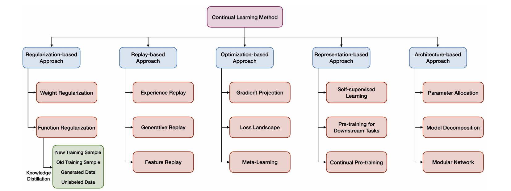
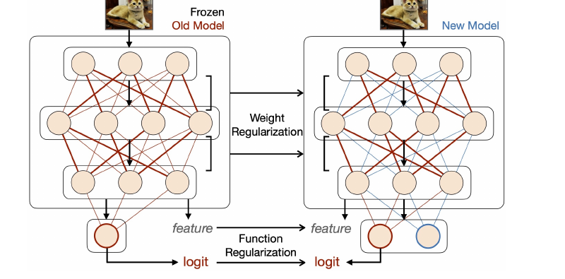
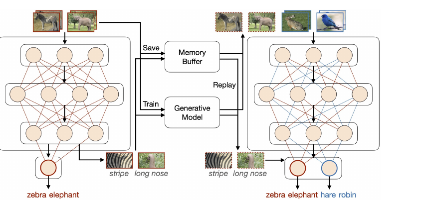

# A Comprehensive Survey of Continual Learning: Theory, Method and Application

> **AI는 새로운 지식을 배우면서 과거의 지식을 어떻게 잊지 않을 수 있을까?**  
> Liyuan Wang, Xingxing Zhang, Hang Su, Jun Zhu의 서베이 논문을 바탕으로 지속학습의 개념, 평가 지표, 정규화 기반 접근법, 리플레이 기반 접근법을 정리했다.

---

## 1. 지속학습은 왜 필요한가

일반적인 머신러닝은 학습 데이터가 한꺼번에 주어진다는 정적인 상황을 가정한다. 반면 실제 환경에서는 새로운 데이터, 새로운 클래스, 새로운 업무와 새로운 환경이 시간의 흐름에 따라 계속 들어온다.

예를 들어 모델이 다음과 같은 순서로 학습한다고 생각해 보자.

> 고양이·개 분류 학습 → 자동차·오토바이 분류 학습 → 새·비행기 분류 학습

이때 모델은 새로운 내용을 잘 배우면서도 이전에 배운 고양이와 개를 계속 구분할 수 있어야 한다. 그러나 신경망은 새로운 작업을 학습하면 기존 작업의 성능이 급격히 떨어지는 경우가 많다. 이를 **파국적 망각(Catastrophic Forgetting)**이라고 한다.

따라서 지속학습의 핵심 질문은 다음과 같다.

> **AI가 과거의 지식을 잊지 않으면서 새로운 지식을 계속 배울 수 있는가?**

이 논문은 지속학습을 단순히 ‘망각을 줄이는 기술’로만 보지 않는다. 좋은 지속학습 시스템은 다음 세 가지 목표를 함께 만족해야 한다.

- **기억 안정성(Stability)**: 이전에 학습한 지식을 유지하는 능력
- **학습 가소성(Plasticity)**: 새로운 지식을 빠르고 정확하게 배우는 능력
- **일반화와 자원 효율성**: 과업 안팎의 분포 차이에 대응하면서 저장공간과 계산량을 통제하는 능력

안정성만 지나치게 강조하면 새 과업을 배우지 못하고, 가소성만 강조하면 과거 지식을 잊어버린다. 결국 지속학습은 안정성과 가소성 중 하나를 선택하는 문제가 아니라, **둘 사이의 균형을 어떻게 설계할 것인가**에 관한 문제다.

과거의 모든 데이터를 보관한 뒤 매번 처음부터 공동학습하면 망각을 상당 부분 피할 수 있다. 하지만 저장공간과 계산비용이 크게 늘고 개인정보 문제도 발생한다. 지속학습은 가능한 한 새로운 데이터만 학습하는 수준에 가까운 효율적인 업데이트를 지향한다.

---

## 2. 논문이 정리한 지속학습 방법의 전체 지도

논문은 대표적인 지속학습 방법을 다섯 계열로 분류한다.



*그림 1. 논문 Figure 3을 잘라낸 지속학습 방법론 분류. 정규화, 리플레이, 최적화, 표현학습, 아키텍처 기반 접근법으로 구성된다.*

1. **정규화 기반 접근법**: 과거 지식에 중요한 파라미터나 모델의 출력을 크게 바꾸지 않는다.
2. **리플레이 기반 접근법**: 과거 데이터 분포를 원본 샘플, 생성 샘플 또는 특징의 형태로 다시 학습한다.
3. **최적화 기반 접근법**: 새로운 학습의 gradient가 과거 과업을 훼손하지 않도록 업데이트 방향을 조절한다.
4. **표현학습 기반 접근법**: 사전학습과 자기지도학습 등을 활용해 분포 변화에 강한 표현을 만든다.
5. **아키텍처 기반 접근법**: 과업별 파라미터나 모듈을 분리하여 과업 간 간섭을 줄인다.

이 다섯 접근법은 완전히 독립되어 있지 않다. 예를 들어 정규화와 리플레이는 모두 궁극적으로 gradient의 방향에 영향을 주며, 리플레이는 지식증류나 가중치 정규화와 함께 사용될 수 있다.

이 글에서는 지금까지의 논의 범위에 맞춰 **평가 지표**, **정규화 기반 접근법**, **리플레이 기반 접근법**을 중심으로 살펴본다.

---

## 3. 지속학습의 설정과 평가 지표

### 1) 논문이 구분한 대표적인 학습 시나리오

이 논문은 데이터가 들어오는 방식, 클래스 공간의 관계, 과업 ID의 제공 여부에 따라 지속학습 환경을 구분한다.

> **표 1은 논문의 실제 Table 1을 블로그에 맞게 축약한 것이다.** 이 논문은 서베이 논문이므로 저자들이 제안한 단일 모델의 정량 실험 결과표는 없다. 따라서 존재하지 않는 성능 수치를 만들지 않고, 논문이 실제로 제공하는 시나리오 비교표를 재구성했다.

| 시나리오 | 핵심 조건 | 테스트 시 과업 ID | 직관적 의미 |
|---|---|---|---|
| IIL | 하나의 과업 데이터가 여러 배치로 순차 도착 | 불필요 | 같은 문제의 새 사례가 계속 들어옴 |
| DIL | 라벨 공간은 같고 입력 분포가 달라짐 | 불필요 | 같은 분류 문제지만 환경·도메인이 바뀜 |
| TIL | 과업별 라벨 공간이 분리됨 | 제공 | 현재 어떤 과업인지 알고 평가 |
| CIL | 과업별 라벨 공간이 분리됨 | 미제공 | 지금까지 배운 모든 클래스를 한꺼번에 구분 |
| TFCL | 과업 경계나 ID가 명확히 주어지지 않음 | 제한적·선택적 | 과업 구분 없이 연속 스트림을 학습 |
| OCL | 각 데이터가 한 번만 또는 매우 작은 배치로 도착 | 제한적·선택적 | 되돌아갈 수 없는 온라인 학습 |
| BBCL | 과업 경계가 흐리고 라벨 공간이 일부 겹침 | 미제공 | 현실처럼 과업 전환이 명확하지 않음 |
| CPT | 사전학습 데이터가 순차적으로 도착 | 불필요 | 지속적으로 사전학습하며 하위 과업 전이를 개선 |

특히 **Class-Incremental Learning(CIL)**은 실제 환경에 가깝지만 어렵다. 모델은 테스트 시점에 “이 입력은 Task 1에서 왔다”는 정보를 받지 못하고, 지금까지 배운 모든 클래스를 동시에 구분해야 하기 때문이다.

### 2) 모든 평가식의 출발점: \(a_{k,j}\)

논문의 평가 지표는 다음 기호를 중심으로 구성된다.

$$
a_{k,j}
$$

이는 **\(k\)번째 과업까지 학습한 모델을 \(j\)번째 과업의 테스트 데이터로 평가한 성능**을 뜻한다.

예를 들어 다음처럼 세 과업을 순서대로 학습했다고 하자.

- Task 1: 고양이와 개 분류
- Task 2: 자동차와 오토바이 분류
- Task 3: 사과와 배 분류

설명을 위해 다음과 같은 성능 행렬을 가정할 수 있다.

| 학습 시점 | Task 1 평가 | Task 2 평가 | Task 3 평가 |
|---|---:|---:|---:|
| Task 1 학습 후 | \(a_{1,1}=0.90\) | - | - |
| Task 2 학습 후 | \(a_{2,1}=0.82\) | \(a_{2,2}=0.88\) | - |
| Task 3 학습 후 | \(a_{3,1}=0.75\) | \(a_{3,2}=0.80\) | \(a_{3,3}=0.86\) |

이 표의 수치는 논문 실험값이 아니라 평가식을 이해하기 위한 설명용 예시다. 행은 **어디까지 학습했는가**, 열은 **어떤 과업으로 시험했는가**를 나타낸다.

### 3) 전체 성능: AA와 AIA

현재 모델이 지금까지 배운 모든 과업에서 평균적으로 얼마나 잘하는지는 **Average Accuracy(AA)**로 측정한다.

$$
AA_k=\frac{1}{k}\sum_{j=1}^{k}a_{k,j}
$$

Task 3까지 학습한 예에서는 다음과 같다.

$$
AA_3
=\frac{0.75+0.80+0.86}{3}
\approx0.803
$$

즉, 현재 모델은 지금까지 배운 세 과업에서 평균 약 80.3%의 정확도를 보인다. AA는 **현재 시점의 종합 성적표**다.

학습 과정 전체의 성능까지 보고 싶다면 **Average Incremental Accuracy(AIA)**를 사용한다.

$$
AIA_k=\frac{1}{k}\sum_{i=1}^{k}AA_i
$$

예시에서

$$
AA_1=0.90,\qquad
AA_2=\frac{0.82+0.88}{2}=0.85,\qquad
AA_3\approx0.803
$$

이므로,

$$
AIA_3
=\frac{0.90+0.85+0.803}{3}
\approx0.851
$$

AA가 현재 성적표라면 AIA는 **지금까지의 누적 평균 성적**에 가깝다.

### 4) 기억 안정성: FM과 BWT

과거 과업을 얼마나 잊었는지는 **Forgetting Measure(FM)**로 측정할 수 있다. 먼저 과업 \(j\)의 망각량은 과거 최고 성능과 현재 성능의 차이다.

$$
f_{j,k}
=
\max_{i\in\{1,\ldots,k-1\}}
(a_{i,j}-a_{k,j})
$$

그리고 이전 과업들의 망각량을 평균 낸다.

$$
FM_k
=
\frac{1}{k-1}
\sum_{j=1}^{k-1}f_{j,k}
$$

예시에서 Task 1은 \(0.90-0.75=0.15\), Task 2는 \(0.88-0.80=0.08\)만큼 하락했다.

$$
FM_3=\frac{0.15+0.08}{2}=0.115
$$

과거 과업에서 평균 11.5%포인트의 망각이 발생한 것이다. **FM은 낮을수록 좋다.**

**Backward Transfer(BWT)**는 새로운 과업 학습이 과거 과업에 준 영향을 측정한다.

$$
BWT_k
=
\frac{1}{k-1}
\sum_{j=1}^{k-1}
(a_{k,j}-a_{j,j})
$$

- \(BWT<0\): 과거 성능이 하락함
- \(BWT=0\): 과거 성능이 유지됨
- \(BWT>0\): 새 과업을 배우면서 과거 성능도 향상됨

예시에서는

$$
BWT_3
=
\frac{(0.75-0.90)+(0.80-0.88)}{2}
=-0.115
$$

이다. FM은 과거의 **최고 성능**을 기준으로 하고, BWT는 각 과업을 **처음 학습한 직후의 성능**을 기준으로 한다는 차이가 있다.

### 5) 학습 가소성: IM과 FWT

과거 지식을 보존하는 데만 집중하면 새 과업을 제대로 배우지 못할 수 있다. 이를 평가하는 지표가 **Intransience Measure(IM)**다.

$$
IM_k=a_k^*-a_{k,k}
$$

- \(a_k^*\): Task 1부터 Task \(k\)까지의 데이터를 함께 사용해 공동학습한 기준 모델의 Task \(k\) 성능
- \(a_{k,k}\): 지속학습 모델이 Task \(k\)를 배운 직후의 성능

공동학습 모델이 Task 3에서 0.91, 지속학습 모델이 0.86이라면,

$$
IM_3=0.91-0.86=0.05
$$

이다. 공동학습보다 새 과업을 5%포인트 덜 배웠다는 의미다. **IM은 낮을수록 좋다.**

**Forward Transfer(FWT)**는 과거 학습 경험이 새 과업 학습에 얼마나 도움을 주었는지를 평가한다.

$$
FWT_k
=
\frac{1}{k-1}
\sum_{j=2}^{k}
(a_{j,j}-\tilde a_j)
$$

여기서 \(\tilde a_j\)는 무작위로 초기화한 모델을 Task \(j\)만으로 따로 학습했을 때의 성능이다.

- \(FWT>0\): 과거 지식이 새 과업에 도움을 줌
- \(FWT=0\): 특별한 영향이 없음
- \(FWT<0\): 과거 지식이 새 과업 학습을 방해함

### 6) 평가 지표 한눈에 보기

| 영역 | 지표 | 핵심 질문 | 좋은 방향 |
|---|---|---|---|
| 전체 성능 | \(AA_k\) | 현재 모든 과업을 평균적으로 잘하는가? | 높을수록 좋음 |
| 전체 성능 | \(AIA_k\) | 학습 과정 전체에서 꾸준히 잘했는가? | 높을수록 좋음 |
| 기억 안정성 | \(FM_k\) | 과거 최고 성능에서 얼마나 떨어졌는가? | 낮을수록 좋음 |
| 기억 안정성 | \(BWT_k\) | 새 학습이 과거 과업에 어떤 영향을 주었는가? | 높을수록 좋음 |
| 학습 가소성 | \(IM_k\) | 공동학습보다 새 과업을 얼마나 못 배웠는가? | 낮을수록 좋음 |
| 학습 가소성 | \(FWT_k\) | 과거 지식이 새 과업에 도움이 되었는가? | 높을수록 좋음 |

이 수식들은 분류 정확도를 예로 제시한 것이다. 객체 탐지에서는 AP, 의미론적 분할에서는 IoU, 이미지 생성에서는 FID, 강화학습에서는 정규화된 보상 등으로 기본 성능값을 바꾸어 적용할 수 있다.

---

## 4. 정규화 기반 접근법

정규화 기반 접근법은 새로운 과업을 학습할 때 손실함수에 **과거 지식을 보존하기 위한 제약항**을 추가한다.

$$
\min_{\theta}
\left[
\mathcal{L}_{\text{new}}(\theta)
+
\lambda\mathcal{R}_{\text{old}}(\theta)
\right]
$$

- \(\mathcal{L}_{\text{new}}\): 새로운 과업을 잘 배우기 위한 손실
- \(\mathcal{R}_{\text{old}}\): 과거 지식을 잊지 않도록 하는 정규화항
- \(\lambda\): 과거 지식 보존 강도

즉, **새로운 과업은 학습하되 과거 과업에 중요했던 모델의 부분은 지나치게 바꾸지 않는다.**



*그림 2. 논문 Figure 4. 가중치 정규화는 과거 모델의 파라미터를, 함수 정규화는 과거 모델의 특징과 출력 행동을 보존한다.*

### 1) 가중치 정규화

신경망의 모든 파라미터가 과거 과업에서 똑같이 중요한 것은 아니다. 과거 과업에 매우 중요한 가중치가 크게 바뀌면 기존 분류 능력이 훼손되지만, 거의 사용되지 않은 가중치는 새 과업을 위해 상대적으로 자유롭게 변경할 수 있다.

따라서 파라미터마다 중요도 \(F_i\)를 계산하고, 중요한 파라미터일수록 변경에 더 큰 벌점을 준다.

$$
\mathcal{R}_{\text{old}}(\theta)
=
\sum_i F_i(\theta_i-\theta_i^*)^2
$$

- \(\theta_i^*\): 이전 과업 학습 직후의 파라미터
- \(\theta_i\): 현재 학습 중인 파라미터
- \(F_i\): 이전 과업에서 해당 파라미터의 중요도

대표적인 방법이 **EWC(Elastic Weight Consolidation)**다.

$$
\mathcal{L}_{\mathrm{EWC}}(\theta)
=
\mathcal{L}_{\text{new}}(\theta)
+
\frac{\lambda}{2}
\sum_i
F_i(\theta_i-\theta_i^*)^2
$$

EWC는 보통 Fisher Information Matrix의 대각성분으로 중요도를 근사한다.

$$
F_i
\approx
\mathbb{E}_{(x,y)}
\left[
\left(
\frac{\partial\log p(y\mid x,\theta)}
{\partial\theta_i}
\right)^2
\right]
$$

직관적으로는 **특정 파라미터를 조금 바꿨을 때 모델의 예측 확률이 크게 변한다면 그 파라미터는 중요하다**고 판단하는 것이다.

논문은 EWC 외에도 다음 방법을 소개한다.

- **SI**: 학습 경로 전체에서 각 파라미터가 손실 감소에 얼마나 기여했는지 측정
- **MAS**: 파라미터 변화에 대한 모델 출력의 민감도를 이용
- **RWalk**: SI와 EWC의 정규화항을 결합

이 방법들은 서로 다른 동기에서 출발했지만 Fisher 정보의 근사로 해석될 수 있다.

가중치 정규화의 장점은 과거 원본 데이터를 저장하지 않고도 구현할 수 있다는 점이다. 반면 \(\lambda\)가 너무 크면 과거 지식은 잘 유지하지만 새 과업을 배우지 못한다.

$$
\lambda\uparrow
\quad\Rightarrow\quad
\text{안정성 증가, 가소성 감소}
$$

또한 EWC의 대각 Fisher 근사는 파라미터 사이의 상관관계를 무시한다. 여러 과업의 중요도와 기준 파라미터를 각각 저장하면 과업 수에 따라 메모리도 증가한다.

### 2) 함수 정규화

가중치 정규화가 과거 모델의 **파라미터**를 따라가게 한다면, 함수 정규화는 과거 모델의 **출력이나 중간 특징**을 따라가게 한다.

$$
f_{\theta_{\text{new}}}(x)
\approx
f_{\theta_{\text{old}}}(x)
$$

즉, **파라미터가 바뀌는 것은 허용하지만 과거 모델이 하던 행동은 유지하라**는 방식이다.

대표적인 방법이 **LwF(Learning without Forgetting)**이며, 이전 모델을 teacher, 현재 모델을 student로 두고 지식증류를 사용한다.

$$
\mathcal{L}
=
\mathcal{L}_{\text{new}}
+
\alpha\mathcal{L}_{\text{KD}}
$$

$$
\mathcal{L}_{\text{KD}}
=
T^2D_{\mathrm{KL}}
\left(
\operatorname{softmax}\left(\frac{z_{\text{old}}}{T}\right)
\middle\|
\operatorname{softmax}\left(\frac{z_{\text{new}}}{T}\right)
\right)
$$

- \(z_{\text{old}}\): 과거 모델의 logits
- \(z_{\text{new}}\): 현재 모델의 logits
- \(T\): temperature
- \(\alpha\): 증류 손실 가중치

이상적인 방법은 과거 데이터에 대해 teacher와 student의 출력을 맞추는 것이다. 하지만 지속학습에서는 과거 데이터에 접근하지 못할 수 있다. 그래서 새로운 과업 데이터, 소량의 과거 데이터, 외부 비라벨 데이터, 생성 데이터 등을 대신 사용한다.

문제는 새로운 과업 데이터가 과거 데이터 분포와 크게 다르면, 과거 모델의 출력이 유용한 teacher signal이 되지 못할 수 있다는 점이다. 함수 정규화는 파라미터 변화에 유연하지만, **어떤 입력으로 과거 행동을 보존할 것인가**가 성능을 좌우한다.

### 3) EWC의 핵심 PyTorch 구현

다음은 논문의 수식을 코드로 옮길 때 가장 핵심적인 부분이다. 전체 실험 프레임워크가 아니라 원리를 보여 주기 위한 구현 스케치다.

```python
import torch


def ewc_penalty(model, old_params, fisher):
    penalty = torch.zeros((), device=next(model.parameters()).device)

    for name, param in model.named_parameters():
        if name not in fisher:
            continue

        penalty += (
            fisher[name]
            * (param - old_params[name]).pow(2)
        ).sum()

    return penalty


# 새 과업 분류 손실 + 과거 중요 파라미터 보존 손실
loss = task_loss + 0.5 * ewc_lambda * ewc_penalty(
    model=model,
    old_params=old_params,
    fisher=fisher,
)
```

코드에서 중요한 것은 `old_params`가 이전 과업 학습 직후의 파라미터이고, `fisher`가 각 파라미터의 중요도라는 점이다.

---

## 5. 리플레이 기반 접근법

리플레이 기반 접근법은 새로운 과업을 학습할 때 **과거 데이터 분포를 다시 보여 주거나 복원하여 파국적 망각을 줄이는 방법**이다.

정규화 기반 접근법이 “과거 모델의 중요한 부분을 크게 바꾸지 말자”는 방식이라면, 리플레이는 다음과 같은 방식이다.

> **새로운 데이터만 학습하지 말고, 과거 데이터에 해당하는 정보도 함께 다시 학습하자.**

논문은 리플레이의 대상을 기준으로 세 종류로 나눈다.

1. **경험 리플레이(Experience Replay)**: 과거 원본 데이터 일부를 저장해 다시 학습
2. **생성 리플레이(Generative Replay)**: 생성모델로 과거와 유사한 데이터를 만들어 다시 학습
3. **특징 리플레이(Feature Replay)**: 원본 대신 중간 특징이나 특징 분포를 저장·복원



*그림 3. 논문 Figure 5. 과거 샘플을 메모리 버퍼에 저장하거나 생성모델로 복원해 현재 데이터와 함께 학습하는 리플레이의 기본 구조.*

### 1) 리플레이의 기본 손실

현재 과업 데이터를 \(D_t\), 과거 데이터에서 보존하거나 복원한 리플레이 데이터를 \(M\)이라고 하자.

$$
\mathcal{L}_{\text{total}}
=
\mathcal{L}_{\text{current}}(D_t)
+
\lambda_{\text{rep}}
\mathcal{L}_{\text{replay}}(M)
$$

현재 데이터가 자동차·오토바이이고 과거 데이터가 고양이·개라면, 하나의 학습 미니배치는 다음과 같이 구성된다.

> 자동차·오토바이 데이터 + 고양이·개 리플레이 데이터

모델은 새 과업의 손실을 줄이면서도 과거 과업의 손실이 지나치게 증가하지 않는 방향으로 업데이트된다.

### 2) 경험 리플레이: 무엇을 저장할 것인가

경험 리플레이는 과거 학습 데이터 일부를 작은 **메모리 버퍼**에 저장한다.

$$
M_t=\{(x_i,y_i)\}_{i=1}^{m}
$$

전체 데이터가 10만 개인데 버퍼가 2,000개라면, 어떤 2,000개를 남길지가 중요하다. 논문은 경험 리플레이의 핵심 과제를 다음 두 가지로 정리한다.

1. 버퍼를 어떻게 구성할 것인가
2. 버퍼의 데이터를 어떻게 활용할 것인가

대표적인 버퍼 구성 방식은 다음과 같다.

- **Reservoir Sampling**: 지금까지 들어온 모든 샘플이 버퍼에 남을 확률을 동일하게 유지
- **Ring Buffer**: 클래스별로 동일한 수의 샘플을 저장
- **Mean-of-Feature**: 각 클래스의 특징 평균에 가까운 대표 샘플을 선택
- **Gradient 기반 선택**: 서로 다른 gradient 방향을 대표하거나 학습 간섭을 잘 보여 주는 샘플을 선택

Mean-of-Feature에서 클래스 \(c\)의 특징 평균은 다음과 같다.

$$
\mu_c
=
\frac{1}{N_c}
\sum_{i:y_i=c}f_\theta(x_i)
$$

그리고 \(\|f_\theta(x_i)-\mu_c\|\)가 작은 샘플을 전형적인 사례로 저장할 수 있다.

저장공간을 줄이기 위해 데이터를 압축하거나 증강할 수도 있다. 원본 외에 클래스 통계량, attention map, feature prototype, 저장 당시 logits 같은 저비용 보조정보를 함께 저장하기도 한다.

### 3) 경험 리플레이: 저장한 데이터를 어떻게 활용할 것인가

가장 단순한 방법은 현재 데이터와 과거 데이터를 섞어 같은 분류 손실로 학습하는 것이다. 발전된 방법은 과거 데이터의 gradient와 출력 정보를 특별하게 활용한다.

#### GEM과 A-GEM

현재 데이터의 gradient를 \(g\), 과거 과업 \(j\)의 메모리 gradient를 \(g_j\)라고 하자.

$$
g=\nabla_\theta\mathcal{L}(D_t),
\qquad
g_j=\nabla_\theta\mathcal{L}(M_j)
$$

GEM은 과거 손실을 증가시키지 않도록 다음 조건을 요구한다.

$$
g^\top g_j\ge0
$$

내적이 음수이면 현재 업데이트와 과거 과업의 gradient가 충돌한다. GEM은 현재 gradient를 과거 과업을 훼손하지 않는 방향으로 투영한다.

A-GEM은 과거 과업마다 별도의 제약을 계산하지 않고 전체 메모리에서 하나의 기준 gradient를 만든다. 현재 gradient와 기준 gradient가 충돌할 때 다음처럼 투영할 수 있다.

$$
\tilde g
=
g-
\frac{g^\top g_{\mathrm{ref}}}
{g_{\mathrm{ref}}^\top g_{\mathrm{ref}}}
g_{\mathrm{ref}}
$$

GEM보다 계산은 간단하지만 개별 과업을 세밀하게 보호하는 능력은 약해질 수 있다.

#### MIR와 MER

- **MIR**는 현재 업데이트로 가장 많이 잊힐 가능성이 있는 메모리 샘플을 우선 리플레이한다.
- **MER**는 메타러닝을 이용해 현재 데이터와 과거 데이터의 gradient가 서로 도움이 되는 방향으로 정렬되도록 한다.

MIR의 간섭 점수는 개념적으로 다음처럼 표현할 수 있다.

$$
s_i
=
\mathcal{L}(x_i,y_i;\theta')
-
\mathcal{L}(x_i,y_i;\theta)
$$

현재 데이터로 가상 업데이트한 파라미터 \(\theta'\)에서 손실이 크게 증가하는 과거 샘플일수록 망각 위험이 크므로 먼저 재생한다.

#### DER와 DER++

DER는 과거 데이터와 함께 그 당시 모델의 logits를 저장한다.

$$
M=\{(x_i,y_i,z_i^{\text{old}})\}
$$

현재 모델의 logits가 저장된 과거 logits와 비슷하도록 다음 손실을 사용한다.

$$
\mathcal{L}_{\text{logit}}
=
\|z_i^{\text{new}}-z_i^{\text{old}}\|_2^2
$$

DER++는 여기에 과거 샘플의 정답 라벨에 대한 분류 손실도 추가한다.

$$
\mathcal{L}_{\text{DER++}}
=
\mathcal{L}_{\text{current}}
+
\alpha\|z^{\text{new}}-z^{\text{old}}\|_2^2
+
\beta\mathcal{L}_{\text{CE}}(x_{\text{old}},y_{\text{old}})
$$

과거의 정답뿐 아니라 과거 모델이 클래스들을 어떤 관계로 보았는지까지 보존한다는 점이 핵심이다.

### 4) 경험 리플레이의 장점과 한계

경험 리플레이는 과거 데이터 분포를 직접적으로 근사하므로 일반적으로 강한 기준선이 된다. 지식증류, gradient projection, 정규화, 메타러닝과도 쉽게 결합할 수 있다.

그러나 다음 문제가 있다.

- 버퍼가 너무 작으면 과거 분포를 충분히 대표하지 못한다.
- 과거 원본 데이터 저장이 개인정보나 정책상 금지될 수 있다.
- 저장된 소수 샘플에 과적합할 수 있다.
- 새 과업 데이터가 많고 과거 데이터가 적으면 클래스 불균형과 출력층 편향이 발생한다.

따라서 LUCIR, BiC, WA, PODNet 등은 특징 방향, 출력층 편향, 표현 이동을 별도로 보정한다.

### 5) 생성 리플레이

생성 리플레이는 과거 원본 데이터를 저장하지 않고 생성모델이 과거와 유사한 데이터를 만들게 한다.

$$
\hat p_{\text{old}}(x,y)
\approx
p_{\text{old}}(x,y)
$$

과거 생성모델에서 샘플을 뽑아 현재 실제 데이터와 함께 학습한다.

$$
\widetilde D_{\text{old}}
\sim
G_{\text{old}},
\qquad
D_t\cup\widetilde D_{\text{old}}
$$

장점은 원본 데이터 저장 부담을 줄일 수 있다는 점이다. 하지만 분류 모델뿐 아니라 **생성모델 자체도 파국적 망각을 겪는다.** 생성 품질이 낮으면 과거 분포를 잘못 복원하며, 생성모델을 계속 유지하는 데 상당한 연산 자원이 필요하다.

논문은 DGR을 초기 프레임워크로 소개하고, MeRGAN처럼 동일한 noise에서 과거와 현재 생성모델의 출력을 맞추는 방법도 설명한다.

- GAN 계열: 세밀한 이미지를 만들 수 있지만 학습 불안정과 라벨 불일치 문제가 있음
- VAE·Autoencoder 계열: 라벨 제어는 비교적 쉽지만 생성 결과가 흐릿할 수 있음

### 6) 특징 리플레이

특징 리플레이는 원본 데이터 \(x\) 대신 신경망 중간층의 특징 \(z\)를 저장한다.

$$
f_\theta(x)=h_\phi(g_\psi(x)),
\qquad
z=g_\psi(x)
$$

- \(g_\psi\): feature extractor
- \(h_\phi\): classifier
- \(z\): 중간 특징

메모리는 다음과 같이 구성할 수 있다.

$$
M_z=\{(z_i,y_i)\}
$$

또는 개별 특징 대신 클래스 prototype이나 평균·공분산 같은 통계량을 저장할 수 있다.

$$
\mu_c
=
\frac{1}{N_c}
\sum_{i:y_i=c}z_i,
\qquad
z_c\sim\mathcal{N}(\mu_c,\Sigma_c)
$$

원본보다 특징 벡터가 작다면 저장 효율성이 좋아지고, 원본 데이터를 직접 보존하지 않아 개인정보 위험도 일부 낮아진다.

하지만 feature extractor가 계속 업데이트되면 같은 입력도 다른 특징을 만든다.

$$
g_{\psi_2}(x)
\neq
g_{\psi_1}(x)
$$

과거에 저장한 특징이 현재 특징공간과 맞지 않게 되는 **Representation Shift**가 특징 리플레이의 핵심 난점이다.

이를 해결하기 위해 특징 증류, 클래스 통계량 보정, 표현 이동 추정, 초기 feature extractor 고정, 강한 사전학습 모델 활용 등의 전략을 사용한다.

### 7) 가장 단순한 경험 리플레이 코드

다음은 현재 미니배치와 메모리 미니배치를 합쳐 학습하는 가장 기본적인 구조다.

```python
import torch
import torch.nn.functional as F


def replay_step(model, optimizer, current_batch, memory_batch=None):
    current_x, current_y = current_batch

    if memory_batch is not None:
        memory_x, memory_y = memory_batch
        x = torch.cat([current_x, memory_x], dim=0)
        y = torch.cat([current_y, memory_y], dim=0)
    else:
        x, y = current_x, current_y

    optimizer.zero_grad(set_to_none=True)
    logits = model(x)
    loss = F.cross_entropy(logits, y)
    loss.backward()
    optimizer.step()

    return loss.item()
```

이 코드는 단순하지만 중요한 기준선이다. 이후에 logits 저장, 지식증류, gradient projection, 샘플 우선순위 선택을 추가하면 DER++, GEM, MIR 계열의 아이디어로 확장할 수 있다.

---

## 6. 정규화와 리플레이는 어떻게 다른가

| 구분 | 정규화 기반 접근법 | 리플레이 기반 접근법 |
|---|---|---|
| 핵심 아이디어 | 파라미터나 출력의 변화를 제한 | 과거 데이터 분포를 다시 학습 |
| 보존하는 정보 | 가중치, 중요도, teacher 출력 | 원본 샘플, 생성 샘플, 특징, logits |
| 대표 방법 | EWC, SI, MAS, LwF | ER, GEM, A-GEM, DER++, DGR |
| 장점 | 원본 데이터 저장 부담이 작음 | 과거 분포에 대한 학습 신호가 직접적이고 강함 |
| 주요 한계 | 새 과업 학습을 지나치게 제한할 수 있음 | 저장공간, 개인정보, 생성 비용, 표본 편향 |

두 접근법은 경쟁 관계라기보다 결합 가능한 구성요소에 가깝다.

예를 들어 과거 샘플을 리플레이하면서 teacher 모델의 logits를 증류할 수 있고, 리플레이 손실과 EWC penalty를 동시에 사용할 수도 있다. 실제 지속학습 시스템에서는 하나의 범주만 고집하기보다 데이터 저장 가능 여부, 계산 자원, 과업 경계의 존재, 개인정보 제약을 고려해 여러 전략을 조합한다.

---

## 7. 이 논문에서 읽어야 할 핵심 메시지

이 서베이 논문의 가장 중요한 메시지는 파국적 망각을 단순히 ‘0으로 만드는 것’이 지속학습의 최종 목표가 아니라는 점이다.

과거 지식을 완벽하게 고정하면 새 지식을 배우지 못한다. 반대로 새 과업에 완전히 적응하면 과거를 잊는다. 따라서 좋은 지속학습 모델은 다음을 함께 봐야 한다.

1. 지금까지 배운 과업을 전반적으로 잘 수행하는가
2. 과거 지식을 얼마나 유지하는가
3. 새로운 과업을 충분히 배울 수 있는가
4. 과거 지식이 새 과업에 긍정적으로 전이되는가
5. 저장공간과 계산량, 개인정보 제약을 감당할 수 있는가

정규화 기반 접근법은 모델의 중요한 파라미터나 행동을 보호한다. 리플레이 기반 접근법은 과거 데이터 분포를 다시 보여 준다. 하나는 **모델을 붙잡는 방식**, 다른 하나는 **과거를 다시 경험하게 하는 방식**으로 이해할 수 있다.

그리고 실제로는 이 둘을 함께 사용하는 경우가 많다. 지속학습의 성능은 특정 알고리즘 이름 하나보다도, 안정성과 가소성 사이의 균형을 어떤 데이터와 어떤 제약으로 구현했는지에 의해 결정된다.

이 글에서 다룬 내용은 논문의 전체 다섯 방법론 중 앞부분에 해당한다. 논문은 이어서 최적화 기반 접근법, 표현학습 기반 접근법, 아키텍처 기반 접근법과 시각·생성·강화학습·자연어 처리 응용까지 확장한다.

---

## 8. 참고문헌과 출처 안내

- Liyuan Wang, Xingxing Zhang, Hang Su, Jun Zhu, **“A Comprehensive Survey of Continual Learning: Theory, Method and Application,”** arXiv:2302.00487v3, 2024.
- 본문의 방법론 분류 그림은 논문 Figure 3, 정규화 그림은 Figure 4, 리플레이 그림은 Figure 5를 각각 잘라 사용했다.
- 시나리오 표는 논문 Table 1의 내용을 블로그 형식에 맞게 축약했다.
- 평가 지표의 숫자 예시는 수식을 쉽게 설명하기 위해 구성한 예시이며 논문이 보고한 실험값이 아니다.
- 코드 예시는 논문의 수식을 PyTorch 학습 구조로 옮긴 구현 스케치이며 논문 저자의 공식 코드가 아니다.
