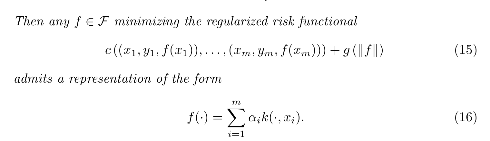
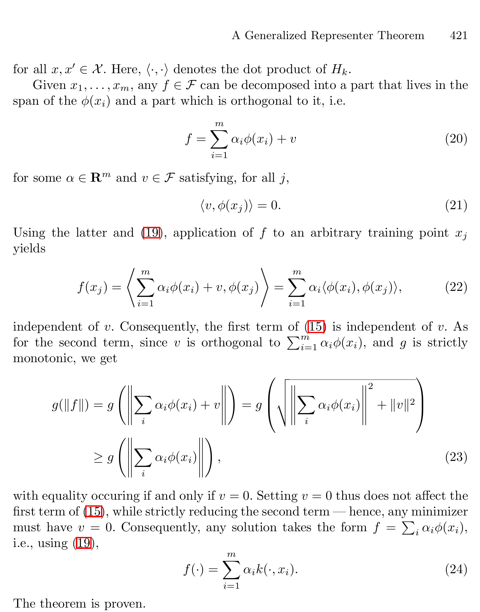
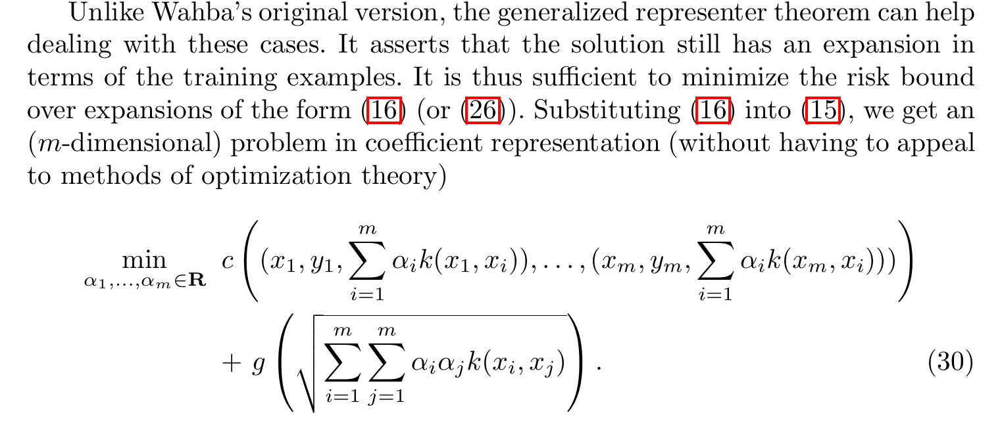

# 무한차원 함수 최적화를 유한차원 문제로 바꾸는 Representer Theorem

> Bernhard Schölkopf, Ralf Herbrich, Alex J. Smola, *A Generalized Representer Theorem*, COLT/EuroCOLT 2001

커널 방법을 처음 접하면 한 가지 의문이 생긴다. 커널이 정의하는 특징 공간은 무한차원일 수도 있는데, 그 안에서 어떻게 최적의 함수를 실제 컴퓨터로 찾을 수 있을까?

*A Generalized Representer Theorem*은 이 질문에 매우 강력한 답을 준다.

> 무한히 많은 함수 중에서 최적의 함수를 찾는 문제라도, 답은 훈련 데이터 개수만큼의 계수만으로 표현할 수 있다.

조금 더 정확히 말하면, 커널이 정해져 있고 목적함수가 훈련점에서의 함수값과 RKHS 노름에 대한 증가하는 규제항으로 이루어져 있다면 최적해는 반드시 훈련 데이터에 놓인 커널 함수들의 선형결합으로 나타낼 수 있다.

이 글에서는 논문의 핵심 정리만 옮기는 데 그치지 않고, 커널이 왜 유사도로 해석되는지, 커널 트릭과 representer theorem은 무엇이 다른지, 이 결과가 신경망을 사용하는 것과는 어떻게 다른지까지 차례로 살펴본다.

## 1. 이 논문은 무엇을 일반화했는가

Representer theorem 자체는 이 논문에서 처음 등장한 정리가 아니다. 고전적인 형태는 Kimeldorf와 Wahba의 1971년 연구로 거슬러 올라간다. 당시 정리는 주로 제곱 손실과 이차 규제를 사용하는 spline 및 RKHS 문제를 다뤘다.

$$
\frac{1}{m}\sum_{i=1}^{m}\bigl(y_i-f(x_i)\bigr)^2
+\lambda\lVert f\rVert_{\mathcal H}^{2}
$$

Schölkopf, Herbrich, Smola의 2001년 논문은 이 고전적 결과를 머신러닝에서 훨씬 폭넓게 사용할 수 있는 형태로 확장한다. 제곱 손실이 아닌 임의의 비용함수, 서로 다른 훈련점의 손실이 결합된 비용함수, hard constraint, 그리고 이차식이 아닌 더 일반적인 규제함수까지 포괄한다.

따라서 이 논문의 기여는 새로운 분류기 하나를 제안한 것이 아니다. 다양한 커널 알고리즘이 왜 동일한 유한차원 표현을 갖는지를 설명하는 통합 원리를 제시한 것이다.

## 2. 커널은 두 데이터의 관계를 계산한다

### 1) 유사도로서의 커널

커널 함수는 흔히 두 데이터 사이의 유사도를 계산하는 함수로 이해할 수 있다. 두 입력 (x,z)를 넣으면 하나의 실숫값을 반환한다.

$$
k(x,z)\in\mathbb R
$$

다만 두 데이터를 결합해서 새로운 데이터를 만든다기보다는, 두 데이터의 관계를 하나의 숫자로 요약한다고 보는 편이 정확하다.

커널의 핵심적인 해석은 어떤 특징 공간에서의 내적이다.

$$
\boxed{k(x,z)=\langle\phi(x),\phi(z)\rangle}
$$

여기서 (phi(x))는 원래 데이터 (x)를 새로운 특징 공간으로 변환한 결과다. 이 내적은 두 특징 벡터가 얼마나 같은 방향을 향하는지를 나타내므로 유사도로 해석할 수 있다. 다만 커널값이 반드시 (0)과 (1) 사이이거나 항상 양수여야 하는 것은 아니다.

대표적인 예는 다음과 같다.

- 선형 커널: $k(x,z)=x^\top z$
- 다항식 커널: $(x,z)=(x^\top z+c)^d$
- RBF 커널: $k(x,z)=\exp(-\lVert x-z\rVert^2/(2\sigma^2))$

RBF 커널은 두 점이 가까우면 (1)에 가까워지고 멀어지면 (0)에 가까워진다는 점에서 일상적인 유사도 개념과 특히 잘 맞는다.

### 2) 커널 트릭

원칙적으로는 각 데이터를 특징 공간으로 변환한 다음 두 변환 결과의 내적을 계산해야 한다.

$$
x\longmapsto\phi(x),\qquad
z\longmapsto\phi(z),\qquad
\langle\phi(x),\phi(z)\rangle
$$

그런데 커널 함수가 이 내적을 직접 계산해 준다면 (phi(x))와 (phi(z))를 실제로 만들 필요가 없다.

$$
\boxed{
\text{명시적 특징 변환 후 내적}
\quad\longrightarrow\quad
\text{원래 공간에서 }k(x,z)\text{를 직접 계산}
}
$$

이것이 커널 트릭이다. 특히 RBF 커널에 대응하는 특징 공간은 무한차원이지만, 커널값 자체는 원래 공간에서 쉽게 계산할 수 있다.

커널 트릭과 representer theorem의 역할은 서로 다르다.

- 커널 트릭은 고차원 또는 무한차원 특징 공간의 내적을 효율적으로 계산하게 해준다.
- Representer theorem은 그 공간에서 찾는 최적함수를 훈련점의 커널 함수들로 표현할 수 있게 해준다.

두 결과가 결합되면서 무한차원일 수 있는 함수 최적화 문제를 유한한 커널 행렬 계산으로 바꿀 수 있다.

## 3. 논문이 다루는 최적화 문제

훈련 데이터가 다음과 같이 주어졌다고 하자.

$$
(x_1,y_1),\ldots,(x_m,y_m)
$$

논문은 커널 (k)가 정의하는 RKHS에서 다음 목적함수를 최소화하는 문제를 생각한다.

$$
\boxed{
J(f)=
c\bigl((x_1,y_1,f(x_1)),\ldots,(x_m,y_m,f(x_m))\bigr)
+g(\lVert f\rVert_{\mathcal H})
}
$$

각 항의 의미는 다음과 같다.

- (c)는 훈련 데이터에서의 예측을 평가하는 비용함수다.
- $lVert f\rVert_{\mathcal H}$는 RKHS에서 측정한 함수의 복잡도다.
- (g)는 함수의 복잡도가 커질수록 더 큰 값을 주는 엄격히 증가하는 함수다.

첫 번째 항은 데이터를 얼마나 잘 맞추는지를 측정하고, 두 번째 항은 함수가 지나치게 복잡해지는 것을 막는다. 문제는 (mathcal H)가 무한차원일 수 있다는 점이다. 언뜻 보면 무한히 많은 자유도를 가진 함수 전체를 직접 탐색해야 할 것 같다.

여기서 “무한차원 함수 (f)”라고 말하기보다는 “(f)가 속한 함수 공간 (mathcal H)가 무한차원”이라고 표현하는 것이 정확하다.

## 4. Generalized Representer Theorem

### 1) 정리의 결론

논문의 Theorem 1은 다음을 보장한다.

> $k$가 실수값 positive definite kernel이고 $g$가 엄격히 증가한다면, 위 목적함수를 최소화하는 모든 함수는 훈련점에 놓인 커널 함수들의 선형결합으로 표현된다.

$$
\boxed{
f^*(\cdot)=\sum_{i=1}^{m}\alpha_i k(\cdot,x_i)
}
$$

*그림 1. 논문의 식 (15)–(16). 일반적인 정규화 위험함수의 최적해가 훈련점 커널의 선형결합으로 표현된다는 핵심 결론이다.*

새로운 입력 $x$에서의 예측값은 다음과 같다.

$$
f^*(x)
=\alpha_1k(x,x_1)+\cdots+\alpha_mk(x,x_m)
$$

따라서 새로운 데이터와 각 훈련 데이터 사이의 커널값을 계산한 다음, 학습된 중요도 $alpha_i$로 가중합한다고 이해할 수 있다.

원래의 최적화 대상은 함수 (f)였지만, 이제는 유한한 계수 벡터만 찾으면 된다.

$$
\text{함수 }f
\quad\longrightarrow\quad
\alpha=(\alpha_1,\ldots,\alpha_m)
$$

중요한 점은 이것이 단순한 근사가 아니라는 것이다. 정리의 조건 아래에서는 RKHS 전체에서 찾은 최적해가 실제로 이 유한차원 부분공간 안에 존재한다.

### 2) 정리가 요구하는 조건

논문의 일반화는 상당히 넓다.

- 비용함수 (c)는 제곱 손실일 필요가 없다.
- 여러 훈련점의 손실을 서로 결합해도 된다.
- (c)가 $+\infty$를 갖도록 하여 hard constraint를 표현할 수 있다.
- 규제함수는 $lambda\lVert f\rVert^2$일 필요가 없다.
- (g)는 볼록일 필요가 없고, 표현 정리 자체에는 엄격한 증가성만 필요하다.

그러나 정리는 최소화 해의 존재를 증명하지 않는다. 최소화 해가 존재한다고 할 때 그 해의 형태를 알려준다. 또한 표현 정리가 성립하는 것과 최적화 문제가 볼록하여 쉽게 풀리는 것은 별개의 문제다.

## 5. 증명의 핵심: 훈련값은 바꾸지 않고 규제만 키우는 성분

이 정리의 증명은 짧지만 매우 직관적이다. 임의의 함수 $f\in\mathcal H$를 두 부분으로 분해한다.

$$
\boxed{
f=
\underbrace{\sum_{i=1}^{m}\alpha_i\phi(x_i)}_{f_{\parallel}}
+\underbrace{v}_{f_{\perp}}
}
$$

여기서 (f_{\parallel})은 훈련점의 특징 벡터들이 만드는 공간에 속하고, (v)는 그 공간 전체에 수직이다.

$$
\langle v,\phi(x_j)\rangle=0,
\qquad j=1,\ldots,m
$$

RKHS의 재생 성질은 다음과 같다.

$$
f(x_j)=\langle f,\phi(x_j)\rangle
$$

따라서 (v)는 어느 훈련점에서도 함수값을 바꾸지 않는다.

$$
f(x_j)
=\sum_{i=1}^{m}\alpha_i
\langle\phi(x_i),\phi(x_j)\rangle
=\sum_{i=1}^{m}\alpha_i k(x_i,x_j)
$$

즉 (v)를 제거해도 목적함수의 데이터 비용 (c)는 변하지 않는다.

반면 (v)는 함수의 노름을 증가시킨다. 직교 분해이므로 피타고라스 정리에 의해

$$
\lVert f\rVert_{\mathcal H}^2
=\left\lVert\sum_i\alpha_i\phi(x_i)\right\rVert_{\mathcal H}^2
+\lVert v\rVert_{\mathcal H}^2
$$

가 성립한다. (g)가 엄격히 증가하므로 (v\neq0)이면 예측 오차는 그대로인데 규제값만 더 커진다. 따라서 최적해에서는 반드시 (v=0)이어야 한다.

*그림 2. 논문의 식 (20)–(24). 훈련점 span에 수직인 성분 (v)는 훈련 예측에는 영향을 주지 않지만 규제항을 증가시키므로 최적해에서 사라진다.*

결국 최적해는 다음 공간에 속한다.

$$f^*\in\operatorname{span}\{k(\cdot,x_1),\ldots,k(\cdot,x_m)\}$$

직관적으로 말하면, 훈련 데이터를 맞추는 데 아무 도움도 주지 않으면서 함수의 복잡도만 증가시키는 방향은 최적해에 남아 있을 이유가 없다.

## 6. 무한차원 문제는 어떻게 유한차원 문제가 되는가

훈련 데이터 전체의 커널값을 모은 Gram matrix를 정의하자.

$$K_{ij}=k(x_i,x_j)$$

Representer theorem의 표현을 사용하면 훈련점 전체에서의 예측은

$$\begin{bmatrix}f(x_1)\\\vdots\\f(x_m)\end{bmatrix}=K\alpha$$

가 된다. RKHS 노름도 계수와 커널 행렬만으로 계산할 수 있다.

$$\lVert f\rVert_{\mathcal H}^2=\sum_{i=1}^{m}\sum_{j=1}^{m}\alpha_i\alpha_j (x_i,x_j)=\alpha^\top K\alpha$$

따라서 원래 문제는 다음 (m)차원 최적화 문제로 바뀐다.

$$\boxed{\min_{\alpha\in\mathbb R^m}c\bigl((x_1,y_1,(K\alpha)_1),\ldots,(x_m,y_m,(K\alpha)_m)\bigr)+g\left(\sqrt{\alpha^\top K\alpha}\right)}$$

*그림 3. 논문의 식 (30). 함수 공간에서의 문제를 훈련 데이터 수와 같은 (m)개의 계수에 대한 최적화로 바꾼다.*

전체 흐름을 한 줄로 정리하면 다음과 같다.

$$
\boxed{
\text{함수 공간에서 }f\text{ 찾기}
\Rightarrow
\text{커널 행렬 }K\text{ 계산}
\Rightarrow
\alpha\text{ 찾기}
\Rightarrow
f(x)=\sum_i\alpha_i k(x,x_i)
}
$$

예를 들어 kernel ridge regression에서는 제곱 손실과 이차 규제를 사용하며, 일반적인 정규화 표기 아래 계수는

$$
\alpha=(K+\lambda I)^{-1}y
$$

로 구할 수 있다. 무한차원 함수 공간에서의 최적화가 행렬을 이용하는 선형대수 문제로 바뀐 것이다.

## 7. 논문이 포괄하는 알고리즘

이 논문은 실험 성능을 보고하는 논문이 아니라 이론 논문이므로 정량적인 결과표는 없다. 대신 Examples 1–5를 통해 하나의 정리가 여러 알고리즘을 어떻게 포괄하는지 보여준다. 이를 정리하면 다음과 같다.

| 논문의 예             | 비용 또는 제약                       | 규제·해석                                | Representer theorem이 주는 결론 |
| ----------------- | ------------------------------ | ------------------------------------ | -------------------------- |
| SV regression     | ε-insensitive loss             | $g(\lVert f\rVert)=\lVert f\rVert^2$ | SV expansion으로 표현 가능       |
| SV classification | hinge loss                     | 이차 RKHS 규제와 비정규화 절편 (b)              | SVM 분류함수를 커널 전개로 표현        |
| 실제 위험 상한 최소화      | 일반화 오차 상한에서 유도한 비표준 (g)        | 고전적 이차 규제를 넘어선 규제                    | 여전히 훈련점 커널 전개로 환원          |
| Bayesian MAP      | (c)는 음의 로그우도                   | (g)는 함수에 대한 음의 로그 사전분포               | MAP 함수가 유한 커널 전개를 가짐       |
| Kernel PCA        | 단위 경험적 분산을 hard constraint로 표현 | 비지도학습이며 (y_i)가 필요 없음                 | 특징 추출 함수도 훈련점 span에 존재     |

이 표에서 중요한 것은 서로 다른 알고리즘이 모두 같은 형태의 답을 갖는다는 점이다. 목적함수가 논문의 조건에 들어가기만 하면 결과는 항상

$$
f^*(\cdot)=\sum_i\alpha_i k(\cdot,x_i)
$$

로 귀결된다.

## 8. 절편과 사전 지식을 포함하는 준모수적 확장

논문의 Theorem 2는 커널 부분 외에 미리 정한 함수들을 포함하는 경우도 다룬다.

$$\tilde f=f+h,\qquad h\in\operatorname{span}\{\psi_1,\ldots,\psi_M\}$$

이 경우 최적해는 다음 형태를 갖는다.

$$\boxed{\tilde f(\cdot)=\sum_{i=1}^{m}\alpha_i k(x_i,\cdot)+\sum_{p=1}^{M}\beta_p\psi_p(\cdot)}$$

SVM에서 규제하지 않는 절편 (b)를 추가하는 것이 가장 익숙한 예다. 특정 기준 함수 (f_0)와의 차이를 줄이는

$$\frac12\lVert f-f_0\rVert_{\mathcal H}^2$$

형태의 biased regularization도 비슷한 방식으로 처리할 수 있다. 단순히 함수의 크기를 작게 만드는 것이 아니라, 이미 알고 있는 기준 함수 주변에서 해를 찾고 싶을 때 유용한 관점이다.

## 9. 신경망과 비교하면 무엇이 다른가

무한차원일 수 있는 함수 공간의 함수를 신경망으로 근사할 수도 있다. 그러나 신경망을 사용하는 것과 representer theorem을 적용하는 것은 같은 문제의 두 계산법이라기보다 서로 다른 모델을 선택하는 일이다.

신경망은 함수를 다음처럼 매개변수화한다.

$$f_\theta(x)=\operatorname{NN}(x;\theta)$$

그리고 네트워크의 가중치 (	heta)와 내부 특징 표현을 함께 학습한다. 반면 커널 방법은

$$f_\alpha(x)=\sum_{i=1}^{m}\alpha_i k(x,x_i)$$

로 매개변수화하고 훈련 데이터별 계수 $alpha_i$를 학습한다.

| 고전적 커널 방법              | 신경망                    |
| ---------------------- | ---------------------- |
| 특징 표현이 선택한 커널에 의해 고정됨  | 특징 표현을 데이터로부터 학습함      |
| 훈련점별 계수 $alpha_i$를 학습  | 네트워크 가중치 $\theta$를 학습  |
| 목적함수가 볼록한 경우가 많음       | 일반적으로 비볼록 최적화          |
| 적은 데이터에서도 강한 경우가 많음    | 많은 데이터와 복잡한 패턴에서 특히 강함 |
| 표현·예측 비용이 훈련 데이터 수에 의존 | 비용이 주로 모델 파라미터 수에 의존   |

Representer theorem의 결과는 근사에 불과한 것이 아니다. 선택한 커널과 RKHS가 정해진 문제에서는 그 공간의 최적해를 훈련 데이터 기반 커널들의 선형결합으로 정확히 표현한다.

하지만 그 커널이 실제 문제에 좋은지는 별도의 문제다. 잘못된 커널을 선택하면 제한된 함수 공간 안에서 최적해를 정확히 구하더라도 실제 분류 성능은 좋지 않을 수 있다.

> Representer theorem은 정해진 운동장에서 가장 좋은 해를 찾는 법을 알려주지만, 그 운동장이 문제에 적절한지는 보장하지 않는다.

고전적 커널 방법에서 두 데이터를 어떤 관점으로 비교할지는 커널이 미리 결정한다. 반면 신경망은 이미지의 모서리, 질감, 부분, 전체 형태처럼 문제 해결에 필요한 특징을 데이터로부터 계층적으로 학습할 수 있다. 복잡한 시각·언어 문제에서 신경망이 더 강력할 수 있는 이유다.

물론 커널 자체를 전혀 학습할 수 없는 것은 아니다. RBF의 폭 (sigma) 같은 하이퍼파라미터를 조정하거나, 여러 커널의 가중치를 학습하거나, 신경망과 커널을 결합할 수 있다.

$$k_\theta(x,z)=k_0\bigl(\phi_\theta(x),\phi_\theta(z)\bigr)$$

이런 deep kernel에서는 신경망 $phi_\theta$가 특징 표현을 학습하고, $k_0$가 그 특징 사이의 커널값을 계산한다.

## 10. 정리를 해석할 때 주의할 점

### 1) “최적해”는 선택한 문제 안에서의 최적해다

Representer theorem은 선택한 커널이 정의하는 함수 공간 안에서 주어진 정규화 목적함수의 최적해가 어떤 형태인지 보장한다. 다음을 보장하는 것은 아니다.

- 그 커널이 실제 문제에 적합하다는 것
- 테스트 데이터에서도 가장 좋은 성능을 낸다는 것
- 현실에 존재하는 진짜 분류 규칙을 찾아낸다는 것
- 최소화 해가 항상 존재하거나 유일하다는 것

### 2) 표현 가능성과 최적화 가능성은 다르다

$g$가 엄격히 증가하면 모든 최적해가 커널 전개 형태를 갖는다. 하지만 $c$와 $g$가 비볼록이면 유한차원으로 바꾼 뒤에도 지역 최솟값 문제가 남을 수 있다. 논문은 $c$와 $g$가 볼록하면 변환된 문제도 볼록 최적화 기법으로 다룰 수 있다고 설명한다.

### 3) 엄격한 증가성에는 이유가 있다

$g$가 단순히 감소하지 않는 함수이고 엄격히 증가하지 않는다면, 수직 성분 $v$를 추가해도 규제값이 같을 수 있다. 이 경우 모든 최적해가 커널 전개 형태라고 할 수는 없다. 다만 커널 전개 형태를 갖는 최적해가 적어도 하나 존재한다는 결론은 유지된다.

## 11. 마무리

이 논문의 핵심은 무한차원을 직접 다루는 특별한 계산 기술이 아니다. 최적해에서 불필요한 방향을 제거할 수 있다는 기하학적 사실이다.

훈련점의 특징 벡터들이 만드는 공간에 수직인 성분은 훈련 예측을 전혀 바꾸지 않는다. 하지만 함수의 노름은 증가시킨다. 따라서 규제를 포함한 최적해에는 그런 성분이 남을 이유가 없다. 이 간단한 관찰이 무한차원 함수 최적화를 최대 (m)차원의 계수 최적화로 바꾼다.

각 요소의 역할을 구분하면 전체 그림이 명확해진다.

$$
\begin{aligned}
\text{커널} &:\quad \text{특징 공간과 유사도의 기준을 결정한다.}\\
\text{커널 트릭} &:\quad \text{그 공간의 내적을 명시적 매핑 없이 계산한다.}\\
\text{Representer theorem} &:\quad \text{최적해를 훈련점 커널의 유한 선형결합으로 제한한다.}\\
\text{최적화 알고리즘} &:\quad \alpha_1,\ldots,\alpha_m\text{을 실제로 계산한다.}
\end{aligned}
$$

결국 *A Generalized Representer Theorem*의 메시지는 다음 한 문장으로 압축된다.

> 목적함수가 훈련점에서의 함수값과 증가하는 RKHS 노름 규제로 구성된다면, 특징 공간이 무한차원이더라도 최적해는 훈련 데이터가 만드는 유한차원 부분공간 안에 있다.

---

## 12. 참고 문헌

Bernhard Schölkopf, Ralf Herbrich, and Alex J. Smola. “A Generalized Representer Theorem.” *Computational Learning Theory*, Lecture Notes in Computer Science 2111, pp. 416–426, 2001.
