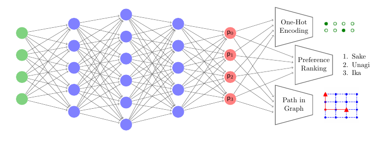
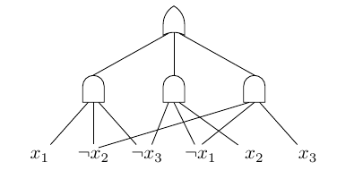
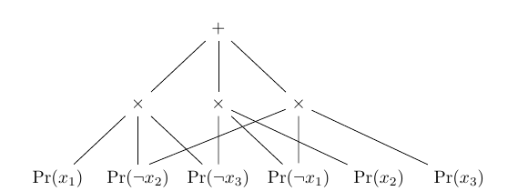
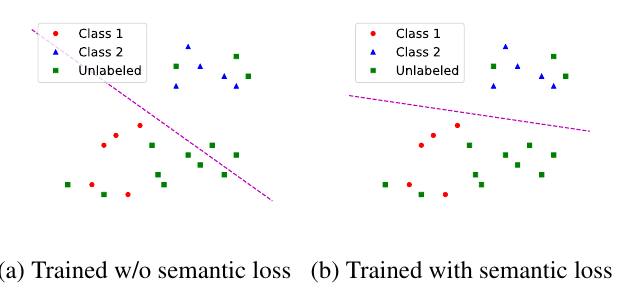

# 신경망에 논리를 붙이는 법: A Semantic Loss Function for Deep Learning with Symbolic Knowledge 읽기

> Xu, Zhang, Friedman, Liang, Van den Broeck. *ICML 2018.*

이 글은 이 논문을 처음부터 끝까지 훑는 요약이 아니라, "가장 단순한 예에서 출발해 하나씩 질문을 던지며" 논문을 이해해 나간 기록이다. exactly-one 제약의 숫자 계산에서 시작해서, 소프트맥스와 과잉 확신, 명제적 지식으로서의 논리 제약, knowledge compilation, 논리추론과의 관계, 준지도학습, 그리고 논문의 진짜 목적인 복잡한 구조적 제약 실험까지, 실제로 궁금했던 순서를 따라간다.

---

## 1. 왜 이 논문인가 — 딥러닝과 기호적 지식의 간극

딥러닝은 데이터로부터 함수를 배우는 데 강하지만, 우리가 이미 **알고 있는 지식**을 넣기가 까다롭다. 예를 들어 "출력은 정확히 한 클래스여야 한다", "이 간선들은 하나의 유효한 경로를 이뤄야 한다", "이 순서는 유효한 순열이어야 한다" 같은 제약은 명백한 배경지식이지만, 신경망은 이런 걸 스스로 알지 못한다.

문제의 핵심은 **미분 가능성**이다. 신경망은 gradient로 학습하므로 손실 함수가 미분 가능해야 한다. 그런데 SAT solver 같은 기호적 추론기를 파이프라인에 그냥 끼워 넣으면 미분 가능성이 깨진다. 그래서 기존의 많은 접근(퍼지 논리, t-norm 완화 등)은 논리 연산을 미분 가능한 산술식으로 바꿔서 우회했다. 하지만 이 과정에서 **논리 문장의 정확한 의미(semantics)가 사라지고, 학습 목표가 문장의 문법(syntax)에 의존하게 되는** 부작용이 생긴다. 같은 뜻의 논리식도 어떻게 쓰느냐에 따라 손실이 달라지는 것이다.

이 논문은 다르게 접근한다. **몇 가지 직관적인 공리(axiom)에서 출발해, 논리 제약과 신경망 출력 사이의 "의미적 거리"를 재는 손실 함수를 유도**한다. 이것이 semantic loss다. 이 함수는 제약의 의미를 정확히 담고, 문법과는 무관하다.

*그림 1. 신경망의 출력 벡터 p가 다양한 제약에 대한 semantic loss로 흘러 들어간다. 왼쪽은 one-hot 인코딩(분류), 가운데는 선호도의 전순위(ranking), 오른쪽은 그래프에서의 경로(path) 제약이다. 이 세 가지가 뒤에서 다룰 실험의 세 축이다.*

---

## 2. Semantic Loss란 무엇인가 — 정의와 유도

### 1) 정의

Boolean 변수 $\mathbf{X} = \{X_1, \dots, X_n\}$에 대한 논리 제약 $\alpha$와, 같은 변수들에 대한 신경망 출력 확률 벡터 $\mathbf{p}$가 주어졌을 때, semantic loss는 다음과 같이 정의된다.

$$L^s(\alpha, \mathbf{p}) \propto -\log \sum_{\mathbf{x} \models \alpha} \; \prod_{i: \mathbf{x} \models X_i} p_i \prod_{i: \mathbf{x} \models \neg X_i} (1 - p_i)$$

말로 풀면 이렇다. 각 $p_i$를 "변수 $X_i$가 참일 확률"로 보고, 그 확률에 따라 값을 독립적으로 샘플링한다고 하자. 그러면 안쪽의 곱은 하나의 특정 상태(world) $\mathbf{x}$가 나올 확률이고, 바깥의 합은 **$\alpha$를 만족하는 모든 world의 확률을 더한 값** $P(\alpha)$이다. semantic loss는 그 만족 확률의 음의 로그, 즉 "제약을 만족하는 결과를 얻는 것에 대한 놀라움(self-information)"이다. 출력이 제약을 잘 지킬수록 $P(\alpha)$가 1에 가까워지고 손실은 0으로 간다.

### 2) 공리에서의 유일성

이 함수의 매력은 임의로 정한 정의가 아니라는 데 있다. 논문은 다음과 같은 직관적 공리들을 만족하는 함수가 (상수배를 제외하면) **유일하게** semantic loss임을 증명한다.

- **단조성(Monotonicity):** 제약이 더 빡빡해지면($\alpha \models \beta$) 손실은 줄어들 수 없다. 요구사항을 강하게 할수록 만족하기 어려워지므로 당연하다.
- **만족(Satisfaction):** 출력이 제약을 정확히 만족하면($\mathbf{x} \models \alpha$) 손실은 0이다.
- **라벨-리터럴 대응(Label-Literal Correspondence):** 단일 리터럴에 대한 semantic loss는 cross-entropy와 비례한다. 즉 $L^s(X, p) \propto -\log(p)$. 지도학습의 라벨이 semantic loss의 특수한 경우로 자연스럽게 포함된다.
- **미분 가능성(Differentiability):** 각 확률에 대해 연속이고 미분 가능하다.

이 공리적 유도가 이 논문을 퍼지 논리 완화 같은 임시방편과 구별 짓는 지점이다. semantic loss는 "논리 제약의 의미"를 원리적으로 담는 유일한 손실이다.

---

## 3. 가장 단순한 예: exactly-one 제약과 확률 벡터 p

정의만으로는 감이 안 오니 숫자를 넣어 보자. 3-클래스 분류라면 출력이 딱 하나만 참이어야 한다. 이것이 **exactly-one(one-hot) 제약**이다.

$$\alpha = (X_1 \lor X_2 \lor X_3) \land (\neg X_1 \lor \neg X_2)\land(\neg X_1 \lor \neg X_3)\land(\neg X_2 \lor \neg X_3)$$

앞부분은 "적어도 하나는 참", 뒤 세 개는 "둘이 동시에 참일 수 없음"이다. 이를 만족하는 world는 세 개뿐이다: $(1,0,0), (0,1,0), (0,0,1)$.

exactly-one에 대해 semantic loss는 다음과 같이 깔끔하게 정리된다.

$$L^s(\text{exactly-one}, \mathbf{p}) \propto -\log \sum_{i=1}^{n} p_i \prod_{j=1, j\neq i}^{n} (1 - p_j)$$

이제 $\mathbf{p} = (0.8, 0.1, 0.1)$을 넣어 보자.

$$P(\alpha) = \underbrace{0.8\cdot0.9\cdot0.9}_{(1,0,0)} + \underbrace{0.1\cdot0.2\cdot0.9}_{(0,1,0)} + \underbrace{0.1\cdot0.2\cdot0.9}_{(0,0,1)} = 0.648 + 0.018 + 0.018 = 0.684$$

$$L^s = -\log(0.684) \approx 0.38$$

출력이 얼마나 "깔끔한 one-hot"에 가까운지에 따라 손실이 어떻게 변하는지 보면 직관이 분명해진다.

| 출력 $\mathbf{p}$ | 해석 | $P(\alpha)$ | Semantic loss |
|---|---|---|---|
| (0.98, 0.01, 0.01) | 확신 있고 one-hot에 가까움 | 0.961 | **0.04** (거의 0) |
| (0.8, 0.1, 0.1) | 어느 정도 확신 | 0.684 | 0.38 |
| (0.4, 0.4, 0.2) | 애매하게 퍼짐 | 0.456 | **0.79** (큼) |

확률이 한 곳에 뾰족하게 모일수록 손실이 0으로, 여러 곳에 퍼질수록 손실이 커진다. 그리고 이 값은 미분 가능하므로 기존 cross-entropy 손실에 한 항으로 더해서 역전파할 수 있다. **라벨이 없는 데이터에도** "출력은 one-hot이어야 한다"는 지식만으로 학습 신호를 줄 수 있다는 점이 핵심이다.

참고로 위 정의를 그대로 쓰면 변수가 $n$개일 때 $O(n^2)$이 되는데, 뒤에서 볼 자동 추론(회로 컴파일)으로 exactly-one은 $O(n)$까지 줄어든다.

---

## 4. p는 소프트맥스의 결과인가? 그리고 과잉 확신 문제

### 1) p는 소프트맥스 출력인가

위 예의 $\mathbf{p} = (0.8, 0.1, 0.1)$은 합이 1이라 소프트맥스 출력과 일치하는 형태다. 실제로 논문의 준지도 분류 실험(MNIST, FASHION, CIFAR)은 소프트맥스 출력 위에 semantic loss를 얹는다. 다만 semantic loss 공식 자체는 출력의 종류를 가리지 않는다. 각 $p_i$를 "변수 $X_i$가 참일 확률"로 받을 뿐이라, 소프트맥스(합=1, 다중 클래스)든 시그모이드(각각 독립, 멀티라벨/구조적 제약)든 같은 공식에 넣을 수 있다. 뒤에서 볼 경로·랭킹 실험은 변수가 수십~수백 개라 소프트맥스가 아니라 **시그모이드 출력**을 쓴다.

소프트맥스일 때 exactly-one의 역할은 조금 바뀐다. 소프트맥스는 이미 합을 1로 강제하므로, "적어도 하나는 참"은 어느 정도 자동으로 지켜지는 셈이다. 그래서 이 경우 semantic loss가 실제로 하는 일은 **출력을 확률 단체(simplex)의 꼭짓점 쪽으로, 즉 한 클래스에 확신을 갖는 뾰족한 분포로 밀어붙이는 것**이다.

### 2) 확신이 낮을 때 semantic loss를 걸면 과잉 확신이 되지 않나

여기서 자연스러운 우려가 생긴다. 모델이 아직 애매한 상태인데 "뾰족하게 만들라"는 압력을 주면, 틀린 예측에 대한 확신까지 키우는 것 아닌가? 이 우려는 실재하며, semantic loss의 가장 본질적인 약점이다.

소프트맥스 위 exactly-one semantic loss는 결국 "출력을 어느 한 꼭짓점으로 뾰족하게 만들라"는 압력인데, 이 손실은 **어느 쪽이 정답인지 모른다.** 그냥 현재 조금이라도 더 높은 클래스 쪽으로 확신을 키우라고 밀 뿐이다. 그래서 모델이 우연히 틀린 클래스로 살짝 기울어 있으면, semantic loss는 그 틀린 예측을 오히려 강화한다. 이것은 self-training의 confirmation bias(자기강화 편향)와 방향이 같다.

논문은 이 문제를 세 가지 방식으로 다룬다.

첫째, **가중치 하이퍼파라미터 $w$**. semantic loss는 단독으로 쓰이지 않고 `전체 손실 = cross-entropy + w · semantic loss` 형태로 작은 계수로 더해진다. $w$가 크면 과잉 확신이 실제로 터진다.

둘째, **라벨 데이터가 닻(anchor) 역할**을 한다. 결정 경계의 뼈대는 소수의 라벨 데이터가 잡아 주고, semantic loss는 그 위에서 보조 역할만 한다.

셋째, 논문은 이 한계를 명시적으로 인정한다. 원문에 이런 문장이 있다.

> "this property makes our method sensitive to the underlying model's performance. Without the underlying predictive power of a strong supervised learning model, we do not expect to see the same benefits."

즉 **기저 지도학습 모델이 충분히 좋아서 초기 예측의 방향이 대체로 정답과 상관관계가 있을 때만** semantic loss가 이득이 된다. 실무적으로는 $w$를 처음엔 0으로 두고 학습이 진행된 뒤 서서히 키우는 ramp-up 스케줄로 초기 과잉 확신을 완화할 수 있다.

---

## 5. 명제적 지식으로서의 α — 펭귄 예제와 "추론의 흉내"

exactly-one은 사실 "지식"이라기보다 출력 형식(포맷) 제약에 가깝다. 이제 **명제적 지식(implication rule)**이 $\alpha$로 들어가는 예를 보자. 이것이 이 논문이 "reasoning의 기초 단계"로 보이는 이유를 잘 드러낸다.

신경망이 동물 이미지에 대해 세 속성을 예측한다고 하자. 출력은 시그모이드(독립 확률)다.

- $X_B$ = "새다(bird)", $X_F$ = "날 수 있다(can fly)", $X_P$ = "펭귄이다(penguin)"

우리가 아는 상식을 논리 문장으로 넣는다.

$$\alpha = \underbrace{(P \rightarrow B)}_{\text{펭귄이면 새다}} \;\land\; \underbrace{(P \rightarrow \neg F)}_{\text{펭귄이면 못 난다}} \;\equiv\; (\neg P \lor B)\land(\neg P \lor \neg F)$$

변수가 3개이므로 world는 총 8개다. 이 중 α를 위반하는 경우는 "펭귄인데 새가 아님" 또는 "펭귄인데 낢"뿐이고, 나머지 **5개 world가 α를 만족**한다.

신경망 출력이 $\mathbf{p} = (p_B, p_F, p_P) = (0.6, 0.3, 0.9)$이라 하자. "펭귄이라고 거의 확신(0.9)하면서 정작 새라는 건 확신하지 못한다(0.6)"는, 논리적으로 **정면충돌하는** 예측이다.

### 1) 정의 그대로: 만족하는 world를 하나씩 계산해 합산

인수분해 없이, semantic loss의 정의대로 각 만족 world의 확률을 직접 계산해 합산해 보자. 각 확률은 "참인 변수는 $p_i$, 거짓인 변수는 $1-p_i$"를 곱한 것이다. 여기서 $p_B=0.6,\ p_F=0.3,\ p_P=0.9$이므로 $1-p_B=0.4,\ 1-p_F=0.7,\ 1-p_P=0.1$.

| world $(B,F,P)$ | 계산 | 확률 |
|---|---|---|
| $(0,0,0)$ | $0.4 \times 0.7 \times 0.1$ | 0.028 |
| $(0,1,0)$ | $0.4 \times 0.3 \times 0.1$ | 0.012 |
| $(1,0,0)$ | $0.6 \times 0.7 \times 0.1$ | 0.042 |
| $(1,1,0)$ | $0.6 \times 0.3 \times 0.1$ | 0.018 |
| $(1,0,1)$ 새·못낢·펭귄 | $0.6 \times 0.7 \times 0.9$ | 0.378 |
| **합 $P(\alpha)$** | | **0.478** |

$$L^s(\alpha, \mathbf{p}) = -\log P(\alpha) = -\log(0.478) \approx 0.74$$

만족하는 5개 world의 확률을 그냥 더한 값이 $P(\alpha)=0.478$이다. 반대로 위반하는 3개 world를 보면 그 심각성이 드러난다.

| 위반 world $(B,F,P)$ | 계산 | 확률 | 위반 이유 |
|---|---|---|---|
| $(0,0,1)$ | $0.4 \times 0.7 \times 0.9$ | 0.252 | 펭귄인데 새 아님 |
| $(1,1,1)$ | $0.6 \times 0.3 \times 0.9$ | 0.162 | 펭귄인데 낢 |
| $(0,1,1)$ | $0.4 \times 0.3 \times 0.9$ | 0.108 | 펭귄인데 새 아니고 낢 |
| **합** | | **0.522** |

위반 질량이 **0.522로 절반을 넘는다.** 5개 world의 만족 질량(0.478)과 3개 world의 위반 질량(0.522)을 더하면 정확히 1이 되어, 8개 world 전체를 빠짐없이 셌음을 확인할 수 있다. 논리적으로 불가능한 상태에 믿음의 절반 이상이 걸려 있으니 손실 0.74가 나오는 것이다. (참고로 위 만족 world 합은 인수분해 형태 $P(\alpha) = (1-p_P) + p_P \cdot p_B \cdot (1-p_F) = 0.1 + 0.378 = 0.478$과도 정확히 일치한다. 뒤 6절에서 이 인수분해가 왜 중요한지 다룬다.)

### 2) 여기서 "추론"이 드러나는 지점 — 모순 해소의 두 갈래

핵심은 이 손실의 **기울기 방향**이다. 손실을 줄이려면($P(\alpha)$를 키우려면) 각 확률을 어느 쪽으로 밀어야 하는지 계산해 보면:

$$\frac{\partial P}{\partial p_B} = +0.63, \qquad \frac{\partial P}{\partial p_F} = -0.54, \qquad \frac{\partial P}{\partial p_P} = -0.58$$

즉 semantic loss는 세 방향을 동시에 민다. $p_B$(새다)를 **크게 올리고**, $p_F$(난다)를 내리고, $p_P$(펭귄)를 **내리라**고 신호한다. 우리가 "펭귄 → 새", "펭귄 → 못 난다"라는 규칙만 $\alpha$로 줬을 뿐인데, 손실의 미분이 그 **함의(implication)를 다른 출력들로 전파**시킨다. 이것이 심볼릭 추론의 modus ponens를 미분 가능한 형태로 흉내 낸 것이다.

특히 이 예제는 모순을 해소하는 길이 **두 갈래**임을 보여준다 — "새라는 확신을 키워서"($p_B\uparrow$) 맞추거나, "펭귄이라는 확신을 낮춰서"($p_P\downarrow$) 맞추거나. semantic loss는 **어느 쪽으로 풀지 지시하지 않고** 두 방향 모두에 기울기를 줄 뿐이며, 실제 정착 지점은 cross-entropy(데이터)와의 균형이 결정한다. "semantic loss는 정답 방향을 모른 채 정합성만 강제한다"는 성질이 여기서 가장 선명하게 드러난다. 논문의 경로·랭킹 실험도 스케일만 커졌을 뿐 정체는 같다. $\alpha$는 "명제적 배경지식", $\mathbf{p}$는 "신경망의 믿음(belief)"이고, semantic loss는 그 믿음이 배경지식과 얼마나 모순되는지를 재고 그 기울기로 지식의 함의를 전파한다.

---

## 6. 5개의 world를 어떻게 표현하나 — knowledge compilation

펭귄 예에서 $\alpha$를 만족하는 world가 5개라면, semantic loss는 그 5개의 확률 질량 합의 음의 로그다. 그렇다면 참인 5개를 하나하나 나열해서 표현해 줘야 할까? 여기에 중요한 반전이 있다.

### 1) semantic loss는 하나의 스칼라

semantic loss는 world마다 따로 있는 게 아니라 **만족하는 world들의 확률을 전부 더한 값 하나**에 $-\log$를 씌운 것이다. 이 하나의 값이 "참인 world면 보상, 거짓인 world면 벌점"을 자동으로 해준다. 신경망의 확률 질량이 참인 world 쪽으로 모이면 $P(\alpha)$가 1에 가까워지고 손실이 내려가며, 거짓인 world로 새면 손실이 올라간다. world별로 부호를 매기는 항이 따로 필요 없다.

### 2) 하지만 world를 나열하지는 않는다

문제는 변수가 $n$개면 world가 $2^n$개라는 점이다. 지금은 5개라 나열이 쉽지만, 경로 제약처럼 변수가 수백 개면 만족 world 수가 천문학적이 된다. 이를 일일이 세는 것(**weighted model counting**)은 일반적으로 **#P-hard**라 매 학습 스텝마다 하면 학습이 불가능하다.

그래서 논문은 world를 열거하는 대신 $P(\alpha)$를 **인수분해**해서 계산한다. 펭귄 예로 보면:

$$P(\alpha) = \underbrace{P(\neg P)\cdot 1}_{P=0\text{이면 B,F 무관}} + \underbrace{P(P)\cdot P(B)\cdot P(\neg F)}_{P=1\text{이면 새·못낢}} = 0.1 + 0.9\cdot0.6\cdot0.7 = 0.1 + 0.378 = 0.478$$

앞 5절에서 5개 world를 하나씩 더해 얻은 값(0.478)과 완전히 똑같은 결과가 나오지만, 이 계산은 각 변수를 상수 번만 만졌다. 이것이 스케일되는 방식이다.

### 3) 회로로의 컴파일

위에서 손으로 한 인수분해를, 논문은 $\alpha$를 **회로(circuit)로 컴파일**해서 자동으로 얻는다. 예를 들어 exactly-one의 표준 논리식을, 먼저 아래와 같은 **Boolean 회로**로 컴파일한다.

*그림 3. 3-변수 exactly-one 제약에 대해 컴파일된 decomposable·deterministic Boolean 회로. 이 두 성질 덕에 다음 단계의 산술 계산이 가능해진다.*

그다음 AND 게이트를 곱($\times$), OR 게이트를 합($+$)으로 바꾸면 **산술 회로**가 된다.

*그림 4. 그림 3에 대응하는 산술 회로. 잎(leaf)에 확률 $\Pr(x_i)$를 넣고 위로 밀어올려 루트를 평가하면 그 값이 정확히 $P(\alpha)$, 즉 지수화된 semantic loss다. Boolean식 그대로는 불가능했던 이 계산이 회로의 두 성질(determinism, decomposability) 덕에 가능해진다.*

이렇게 컴파일해 두면(학습 전 오프라인 1회), 회로를 한 번 훑는 것만으로 $P(\alpha)$를 **회로 크기에 선형인 시간**에 정확히 계산하고, 회로를 한 번 내려가며 gradient도 같은 비용으로 얻는다. 매 학습 스텝마다 재사용하므로 오버헤드가 거의 없다.

다만 이 인수분해가 이득을 주는 건 **만족 world 수가 많지만 구조가 있는** 경우다. exactly-one($O(n^2)\to O(n)$)이나 유효 경로(만족 world가 수십억 개라도 컴팩트하게 압축)가 그렇다. 구조가 전혀 없는 임의의 큰 world 집합은 압축이 안 되지만, 그런 "규칙 없는" 제약은 현실 지식으로는 드물다.

---

## 7. 논리추론과의 관계 — 이 모델은 추론기인가?

그렇다면 이런 상상을 해 볼 수 있다. 조건들을 전부 변수 $\mathbf{X}$로, 명제들을 전부 하나의 큰 $\alpha$로 묶고 semantic loss로 표현한 뒤 최소화하면, **모든 명제를 만족하는 조건 값을 추론**해 낼 수 있지 않을까? 방향은 맞지만, 세 가지 단서가 붙어야 정확해진다.

개념적으로는 맞다. 모든 명제를 논리곱으로 묶으면 $\alpha$가 하나의 지식베이스(KB)가 되고, 만족 world 집합이 곧 KB의 논리적 모델이다. 이것은 정확히 SAT / 제약 충족 / model finding의 세계이고, $P(\alpha)$는 그 확률적 일반화(weighted model counting)다. 하지만:

**단서 1: 무거운 추론은 gradient가 아니라 컴파일러가 이미 한다.** semantic loss를 만들려면 $\alpha$를 회로로 컴파일해야 하는데, 그 컴파일 자체가 #SAT급의 논리추론이다. 회로가 완성된 순간 무거운 추론은 이미 끝난 것이다. 그러면 굳이 gradient descent로 풀 필요 없이, 회로에 직접 **MPE(Most Probable Explanation)**나 모델 질의를 하면 정확하게 답이 나온다. 순수하게 "모든 명제를 만족하는 값"을 추론하는 목적이라면 이쪽이 정확하고 확실하다.

**단서 2: gradient descent로 풀면 정답을 깔끔하게 못 읽을 수 있다.** semantic loss의 전역 최소값은 "모든 확률 질량이 만족 world 위에 있을 때" 달성되는데, 만족 world가 여러 개면 두 world에 반반씩 걸친 흐릿한 분포도 손실이 0이다. 유일한 모델이 있을 때만 하나로 몰린다. 게다가 비볼록이라 지역 최소에 갇힐 수 있다.

**단서 3: consistency 강제이지 연역적 증명 탐색이 아니다.** semantic loss가 하는 일은 "믿음 $\mathbf{p}$가 KB와 얼마나 모순되나"를 재고 그 기울기로 soft한 제약 전파를 하는 것이다. 여러 단계를 거쳐 새 정리를 유도하는 증명 탐색을 스스로 하는 건 아니다. 그 연역은 이미 컴파일 단계에서 회로 구조에 접혀 들어가 있다.

정리하면, "할 수 있다"에 가깝지만 그 추론을 실제로 해내는 주체는 semantic loss의 gradient가 아니라 그 뒤의 knowledge compilation이고, 순수 추론이 목적이라면 회로에 직접 질의하는 편이 정확하다. **이 논문의 기여는 추론 그 자체가 아니라, 추론을 학습 루프 안으로 미분 가능하게 끌고 들어온 다리에 있다.**

---

## 8. Figure 2로 본 준지도학습

이제 논문이 semantic loss를 실제로 쓰는 첫 번째 무대, 준지도 분류를 보자. 아래 토이 예제가 직관을 준다.

*그림 2. 이진 분류 토이 예제. (a) semantic loss 없이 라벨된 점만으로 그은 경계. (b) semantic loss로 unlabeled 점까지 고려해 옮긴 경계. 경계가 데이터가 드문 영역(저밀도)으로 이동해 더 정확해졌다.*

### 1) unlabeled에는 cross-entropy 없이 semantic loss만

전체 손실은 `existing loss(cross-entropy) + w · semantic loss` 구조다. 각 데이터가 받는 신호는 다음과 같다.

- **Labeled 데이터:** 라벨이 있으니 cross-entropy가 계산된다(semantic loss도 걸리지만 라벨 리터럴에 대해서는 cross-entropy와 비례해 중복에 가깝다).
- **Unlabeled 데이터:** 라벨이 없으니 cross-entropy는 계산하지 않는다. 오직 **semantic loss(exactly-one)만** 학습 신호를 준다.

unlabeled에서 semantic loss가 하는 일은 "정답이 뭔지"를 아는 게 아니라 "어느 한 클래스로 **확신 있게** 몰아라"는 압력이다.

### 2) 클래스와 무관하게 경계를 저밀도 영역으로 민다

그래서 semantic loss는 unlabeled 점의 실제 클래스와 무관하게, 그 점들이 애매한 margin 안에 들지 않도록 **경계(hyperplane)를 점들이 몰린 곳에서 밀어낸다.** 결과적으로 경계는 두 군집 사이의 빈 공간으로 이동한다(low-density separation).

다만 "확신만 시키면 된다"만으로는 자명해가 있다. 모든 점을 한 클래스로 몰아버려도 손실은 0이 된다. 이 대칭을 깨 주는 것이 labeled 데이터의 cross-entropy다. 라벨된 점들이 "이쪽은 A, 저쪽은 B"라고 못 박아 자명해를 막고, 그 라벨과 양립하는 경계들 중에서 semantic loss가 저밀도 영역을 지나는 것을 고른다. 그래서 base 모델이 충분히 좋아야 semantic loss가 미는 방향이 정답과 맞아떨어진다.

### 3) 이건 준지도학습인가

그렇다. 정의상 준지도학습은 소수의 labeled와 다수의 unlabeled를 함께 쓰는 학습이고, 이 방식은 정확히 그렇다. 논문 자신도 Section 4 전체를 semi-supervised setting으로 규정하며 ladder nets, entropy regularizer, self-training과 비교한다. 계열로는 exactly-one을 소프트맥스에 걸어 "confident하게 분류하라"는 압력을 주므로 고전적 entropy minimization과 가까운 **저밀도 분리 계열**이다. 다만 semantic loss 자체는 준지도 전용이 아니라 논리 제약을 학습에 주입하는 일반적 도구이며, 준지도는 그중 한 모드일 뿐이다(다음 절의 구조적 예측 실험은 완전지도 상황이다).

준지도 분류 실험의 대표 결과(MNIST)를 보면 semantic loss가 강한 baseline에 필적한다.

| 방법 (라벨 개수) | 100 | 1000 |
|---|---|---|
| Ladder Net (Rasmus et al., 2015) | **98.94** | **99.16** |
| Baseline: MLP + Gaussian Noise | 78.46 | 94.26 |
| Baseline: MLP + Entropy Regularizer | 96.27 | 98.32 |
| **MLP + Semantic Loss** | 98.38 | 98.78 |

*정확도(%), 높을수록 좋음. 라벨이 100개뿐일 때 순수 지도 baseline 대비 약 20% 향상되며, 당시 SOTA인 ladder net에 근접한다. 특히 같은 저밀도 분리 계열인 entropy regularizer보다 우수하다.*

---

## 9. 논문의 진짜 목적: 5장의 복잡한 제약 실험

준지도 분류(4장)가 exactly-one이라는 "쉬운" 제약을 쓴 응용이라면, 논문의 진짜 야심은 5장에 있다. **경로·순열처럼 진짜 복잡한 논리 제약을 semantic loss로 표현해서 신경망이 그 제약을 지키도록 학습시키는 것**이다. 저자들도 "여기서 쓰는 제약은 보통 연구되는 단순한 implication보다 의도적으로 훨씬 어렵게 설계했다"고 못 박는다.

### 1) 그리드 최단 경로

- 그래프: 4×4 그리드, 간선 가중치 균일. 예제마다 간선을 임의로 제거해 난이도를 높인다.
- 입력: 길이 $|V|+|E|$의 이진 벡터. 앞 $|V|$개는 출발/도착지, 뒤 $|E|$개는 어떤 간선이 제거됐는지.
- 출력: 길이 $|E|$의 이진 벡터. 각 간선이 최단경로에 포함되는지.
- **제약 $\alpha$:** 켜진 간선들이 지정된 출발→도착의 **유효한 simple path**를 이뤄야 한다.
- 데이터 1600개, 60/20/20 분할. 5-layer MLP vs. 같은 모델 + semantic loss.

이 실험의 세 지표가 논문의 핵심 메시지를 담는다.

| 지표 | 뜻 | MLP | +Semantic loss |
|---|---|---|---|
| **Incoherent** | 간선별 개별 정답률 (전체가 경로인지 무관) | **85.91** | 83.14 |
| **Coherent** | 전체 구성이 완벽히 정답인 비율 | 5.62 | **28.51** |
| **Constraint** | 예측이 유효한 경로 제약을 만족하는 비율 | 6.99 | **69.89** |

*정확도(%). Coherent와 Constraint는 높을수록 좋다.*

해석이 중요하다. 평범한 MLP는 간선을 하나씩 독립적으로 맞히니 개별 정답률(incoherent)은 85.91%로 이미 높다. 그런데 그렇게 뽑은 간선들을 전부 모으면 **유효한 경로가 되는 경우는 6.99%뿐**이다. 개별로는 잘 맞혀도 "전체가 하나의 경로"라는 논리는 전혀 못 지킨다. semantic loss를 걸면 개별 정답률은 오히려 살짝 내려가지만(cross-entropy와 경쟁하므로), **Coherent가 5배, Constraint가 10배** 뛴다. semantic loss가 "각 출력을 따로 최적화"하던 것을 "출력 전체가 하나의 유효한 경로가 되도록 함께 최적화"하는 쪽으로 바꾸는 것이다.

### 2) 선호도 순위 예측 (스시)

- $n$개 아이템의 선호 순서를 flattened 이진 행렬 $X_{ij}$("아이템 $i$가 위치 $j$에 있다")로 인코딩한다. 아무 조합이나 되는 게 아니라 **순열 행렬(valid total ordering)**만 유효하다.
- **제약 $\alpha$:** 출력이 유효한 전순서를 이뤄야 한다.
- 데이터: PREFLIB의 스시 선호 5000명. 10종 중 6종의 순서를 입력으로 나머지 4종의 순서를 예측. 60/20/20, 3-layer MLP.

| 지표 | MLP | +Semantic loss |
|---|---|---|
| Incoherent | **75.78** | 72.43 |
| Coherent | 1.01 | **13.59** |
| Constraint | 2.72 | **55.28** |

*정확도(%). Coherent와 Constraint는 높을수록 좋다.*

여기가 가장 극적이다. **semantic loss 없이는 예측이 유효한 순서를 이루는 경우가 겨우 1%.** 개별 셀은 75% 맞혀도 "전체가 하나의 순열"이라는 조합적 제약을 거의 못 지킨다. semantic loss를 걸면 55%가 유효한 순서가 되고, 완전 정답률도 1%에서 13.59%로 뛴다.

두 실험이 함께 말하는 것은 분명하다. 주어진 논리 제약(유효 경로, 유효 순열)을 컴파일해 semantic loss로 표현하면, 신경망이 개별 출력을 따로가 아니라 **제약을 만족하도록 함께** 학습하게 된다. 그 효과는 개별 정확도에는 거의 안 나타나고 "전체가 논리적으로 valid한가"에서 압도적으로 나타난다. 그리고 이것은 fuzzy logic 완화처럼 문법에 의존하거나 Horn clause에 제한되지 않고, 임의의 복잡한 조합 제약에까지 일반화된다.

### 3) 단서 하나 — soft이지 hard가 아니다

"논리를 따르도록 학습한다"는 건 맞지만, 이것은 손실 항(soft regularizer)이라 추론 시점에 제약 만족을 100% 보장하지는 않는다. Table 4에서 경로 제약 정확도가 69.89%까지 올라도 100%는 아니다. 출력이 반드시 유효해야 한다면(실제로 실행 가능한 경로만 내야 함) 추론 시점에 solver나 constrained decoding을 병행해 hard하게 강제한다. semantic loss는 "그럴 확률을 높이도록 학습으로 유도"하는 쪽이다.

---

## 10. 정리 — 이 논문의 위치

이 논문은 SAT solver나 정리 증명기를 대체하려는 것이 아니다. 대상은 **신경망이 반드시 필요한 문제** — 데이터로부터 함수를 배워야 하는데 그 출력 공간에 알려진 논리적 구조가 있는 경우다. 역할을 나눠 보면 선명하다.

- 신경망: 입력 → 믿음(확률) 매핑, 데이터에서 배우는 지각/통계 부분
- 논리 $\alpha$: 출력이 지켜야 할 제약(배경지식)
- semantic loss: 그 둘을 잇는 미분 가능한 다리. 네트워크가 배우는 출력이 심볼릭 지식과 정합하도록 벌점을 준다

여기서 무거운 논리 계산(컴파일)은 학습 신호를 만들기 위한 수단일 뿐, 목적이 아니다. 이 추가 학습이 주는 이득은 두 가지다. 하나는 표본 효율(준지도학습에서 unlabeled를 제약만으로 활용), 다른 하나는 구조적 출력의 유효성(경로·순열이 전체로서 valid하도록). 논리 지식이 inductive bias로 작동해서, 데이터만으로는 배우기 어려운 것을 잡아 준다.

한 줄로 요약하면, **이 논문은 신경망이 필요한 문제에서 기존의 데이터 기반 학습에 더해 "논리적 지식을 지키도록" 하는 추가 학습 신호를 공리에서 원리적으로 유도한 것**이다. neuro-symbolic AI 중에서도 "reasoning을 태스크로 삼는" 계열이 아니라 "제약을 학습에 통합하는(learning with constraints)" 계열에 속하며, 그 계열의 대표적 출발점으로 이후 probabilistic circuit 기반 연구로 이어진다.
