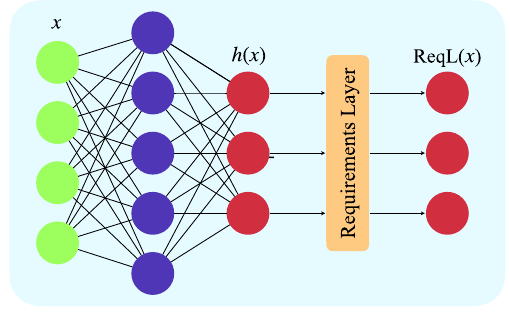
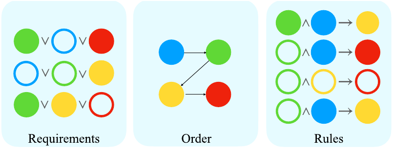
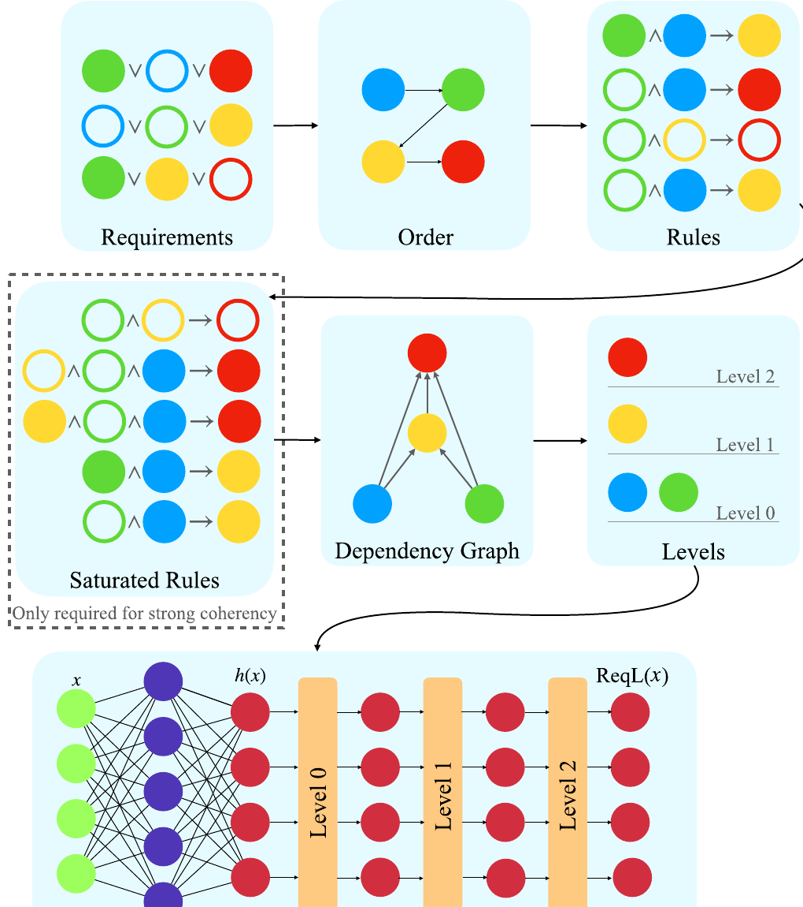

# 규칙을 "반드시" 지키는 신경망: CCN+ 뜯어보기

> Giunchiglia, Tatomir, Stoian, Lukasiewicz, *"CCN+: A neuro-symbolic framework for deep learning with requirements"*, International Journal of Approximate Reasoning 171 (2024). TU Wien · University of Oxford.

이 글은 CCN+ 논문을 읽으며 나눈 대화를 정리한 것이다. 논문의 요약이라기보다는, "이 프레임워크가 도대체 어떤 원리로 신경망이 논리 규칙을 위반하지 못하게 만드는가"를 입력·출력부터 ReqL 계층의 클리핑 메커니즘, label ordering, saturation, 그리고 학습 관여 방식까지 한 겹씩 벗겨낸 기록에 가깝다.

---

## 1. 이 논문이 풀려는 문제

신경망은 데이터에서 패턴을 잘 찾지만, 문제에 내재한 **요구사항(requirements)** 을 자주 위반한다. 예를 들어 "신호등이 빨강과 초록을 동시에 켤 수 없다" 같은 규칙이 주어져 있어도 신경망은 태연히 이를 어긴다. 그런데 요구사항 준수는 실제 배포, 특히 안전이 중요한 분야에서는 사실상 필수 조건이다.

이 문제가 얼마나 심각한지는 논문이 사용하는 자율주행 데이터셋 ROAD-R가 잘 보여준다. 초기의 제약 없는 모델은 높은 성능을 내지만, **예측의 90% 이상이 최소 하나의 요구사항을 위반**했다. threshold를 어떻게 잡든 마찬가지였다. 규칙을 지키지 못하는 모델은 아무리 정확도가 높아도 배포하기 어렵다.

### 1) 기존 접근과 그 한계

이 문제를 다루는 방향은 크게 둘로 나뉘어 왔다.

첫 번째는 **손실함수 기반** 접근이다. 요구사항을 논리식으로 보고 손실함수에 페널티로 녹여 넣는 방식(예: semantic loss, DL2)이다. 위반 횟수를 줄이는 데는 성공했지만, 결정적으로 **얻어진 모델이 요구사항을 만족한다는 보장을 주지 못한다.**

두 번째는 **구조 기반** 접근이다. 요구사항을 네트워크 토폴로지 자체에 제약으로 넣어 만족을 보장하는 방식이다. 하지만 기존 구조 기반 모델들은 (i) 표현력이 제한적이거나(계층적 제약만 처리), (ii) 각 출력이 시스템의 허용 가능한 한 구성에 대응해야 해서 그런 구성이 지수적으로 많아지거나, (iii) 성능이 충분히 나오지 않는 한계가 있었다.

특히 저자들의 이전 모델인 CCN(h)는 요구사항을 규칙(rule)으로 표현하되 **규칙의 머리(head)가 항상 양(positive)** 이어야 한다는 제약이 있었다. 이 때문에 완전한 명제논리를 다 담지 못했다.

---

## 2. 핵심 아이디어: CCN+

CCN+(Coherent-by-Construction Network+)는 **임의의 신경망을, 주어진 명제논리 요구사항에 대해 설계 단계에서부터(by design) 반드시 준수하도록** 만드는 뉴로-심볼릭 프레임워크다. 핵심은 신경망 `h` 위에 두 개의 구성요소를 얹는 것이다.

- **요구사항 계층(ReqL, Requirements Layer)**: 출력층 위에 얹혀서, 모델 예측이 요구사항 집합 Π와 결맞음(coherence)을 이루도록 강제한다.
- **요구사항 손실(ReqLoss, Requirements Loss)**: ReqL의 제약된 구조를 활용해 더 나은 성능을 끌어내는 손실함수다.

*그림 1. CCN+의 기본 구조. 입력 `x`가 임의의 신경망 `h`를 통과해 초기 출력 `h(x)`를 만든다. 이 출력은 요구사항을 어길 수 있다. 그 위의 Requirements Layer가 `h(x)`를 받아 Π를 반드시 만족하는 새 출력 `ReqL(x)`를 낸다.*

전체 흐름은 이렇다. 각 입력 `x`에 대해 신경망이 초기 출력 `h(x)`(요구사항을 어길 수 있는 "날 것")를 만들면, ReqL이 이를 Π를 반드시 만족하는 `ReqL(x)`로 변환한다. 그리고 학습은 이 `ReqL(x)` 출력에 대해 ReqLoss로 이뤄진다.

여기서 처음부터 분명히 해둘 것이 있다. **규칙 준수 자체는 "학습"으로 달성하는 게 아니라 ReqL의 구조로 보장된다.** ReqL은 학습 파라미터가 없는 결정론적 연산 계층이라, 학습이 잘 됐든 안 됐든, 심지어 학습 전이라도 출력은 수학적으로 항상 규칙을 만족한다. 즉 "지키도록 학습한다"기보다 **"애초에 어길 수 없는 구조로 만든다"** 가 더 정확한 표현이다. 이것이 손실 기반 방법("위반에 페널티를 줘서 학습으로 줄이는", 보장 없음)과 근본적으로 다른 지점이다.

### 1) CCN+가 CCN(h)와 다른 점

CCN+가 이전 모델과 결정적으로 다른 점은 **규칙의 머리가 양(A)일 수도, 음(¬A)일 수도 있다**는 것이다. 요구사항을 임의의 절(clause)로 받아 양/음 머리를 모두 가진 규칙으로 변환할 수 있어, 완전 명제논리를 전부 표현한다. 대신 양/음 머리가 섞이면 "모순되는 두 규칙이 동시에 발동하는 걸 어떻게 막을지" 같은 이론적 질문과 "절을 규칙으로 바꿀 때 어떻게 성능을 최대화할지" 같은 실무적 질문이 새로 생기는데, 논문의 상당 부분이 바로 이 문제들을 다룬다.

---

## 3. 입력과 출력의 형태

CCN+의 입출력을 정확히 구분해두면 이후 논의가 또렷해진다.

**입력은 두 가지**다. 성격이 완전히 다르다.

첫째, **데이터 포인트 `x` ∈ ℝ^D** — 매 예측마다 들어가는 보통의 입력이다. 이미지, 프레임, 특징 벡터 등 무엇이든 될 수 있고, CCN+는 `h`가 무엇을 받든 상관하지 않는다. ROAD-R 실험에서는 512×682 크기 영상 프레임(시퀀스 길이 8)이 3D-RetinaNet 검출기에 들어간다.

둘째, **요구사항 집합 Π** — 매 예측마다 바뀌는 게 아니라 문제 전체에 한 번 고정으로 주어지는 배경지식이다. 각 절은 `l₁ ∨ l₂ ∨ ⋯ ∨ lₙ` 형태(리터럴 = 라벨 A 또는 ¬A)다. 이 Π는 학습 대상이 아니라 **ReqL 계층의 구조를 결정하는 설계 입력**이다.

**출력은 `ReqL(x)` ∈ [0,1]^|A|** — 라벨마다 하나씩, 0~1 사이 값의 벡터다. 라벨 개수만큼의 차원을 가진다(ROAD-R은 41개 라벨 → 41차원). 각 성분 `ReqL_A`는 "라벨 A가 참일 정도"이고, 사용자 지정 threshold θ(표준 부정에서는 0.5)보다 크면 그 라벨이 예측된다.

여기서 두 성질이 핵심이다. **다중라벨(multi-label)** — 소프트맥스처럼 하나만 고르는 게 아니라 각 라벨이 독립적으로 켜지거나 꺼진다. 그리고 **결맞음 보장** — 이 출력 벡터에 threshold를 적용해 얻는 예측 집합은 Π의 모든 요구사항을 반드시 만족한다.

---

## 4. 요구사항이란 무엇인가: 출력 라벨 간의 제약

요구사항 Π는 **출력 공간(output space) 위에 정의된 논리적 제약**이다. 각 절의 리터럴이 전부 라벨(또는 라벨의 부정)이라는 점이 핵심인데, 이는 곧 **요구사항이 오직 라벨들끼리의 관계만 말한다**는 뜻이다. 입력 `x`나 신경망 내부는 전혀 언급하지 않는다. 예를 들어 `(¬RedTL ∨ ¬GreenTL)`은 "빨강 라벨과 초록 라벨이 동시에 켜질 수 없다"는, 순수하게 두 출력 라벨 사이의 관계다.

세 가지를 구분해두면 좋다.

첫째, **입력이 아니라 출력에 대한 조건**이다. "어떤 입력이 오든, 최종 예측 집합은 이 관계를 만족해야 한다"를 말한다. 그래서 입력과 무관하게 모든 예측에 일괄 적용되고, 바로 이 때문에 출력층(ReqL)에서 값을 조정하는 것만으로 강제할 수 있다.

둘째, **한 라벨만 말하는 제약도 있다.** 리터럴이 하나인 절(단순 원자 요구사항)은 "A는 항상 예측되어야 한다"처럼 단일 라벨에 대한 무조건 제약을 표현한다.

셋째, **정답이 아니라 정답이 지켜야 할 규칙**이다. 요구사항은 "이 입력의 정답은 무엇이다"가 아니라 "어떤 정답이든 반드시 만족해야 하는 불변식(invariant)"이다. 데이터에 의존하지 않는 배경지식이고, 그래서 학습 대상이 아니라 고정 입력으로 주어진다.

### 1) CNF로 주어진다

Π는 사실상 **CNF(Conjunctive Normal Form)** 로 주어진다고 보면 된다. Π 자체가 절들의 집합인데, 집합에 들어있다는 건 "이 절들을 전부 동시에 만족해야 한다"는 뜻이니 절들의 논리곱(AND), 각 절은 리터럴들의 논리합(OR) — 이것이 정확히 CNF의 정의다.

CNF라고 해서 표현력이 제한되지는 않는다. 임의의 명제논리식은 항상 동치인 CNF로 변환 가능하니, "CNF로 준다"는 건 "완전 명제논리를 다 표현할 수 있다"와 같은 말이다. 한 가지 실무적 조건은 Π가 **consistent(충족 가능)** 해야 한다는 것. 모순된 요구사항이면 만족시킬 방법이 없어 보장 자체가 무의미해지기 때문이다.

---

## 5. 절을 규칙으로: label ordering이 방향을 정한다

ReqL을 만들려면 절을 **규칙(rule)** 으로 바꿔야 한다. 절 `l₁ ∨ ⋯ ∨ lₙ ∨ l`에서 리터럴 하나(예: `l`)를 머리(head)로 삼으면 다음 규칙이 된다.

$$\neg l_1 \land \neg l_2 \land \cdots \land \neg l_n \rightarrow l$$

"몸통(body)의 리터럴들이 다 참이면, 머리 `l`이 반드시 참이어야 한다"는 뜻이다. 여기서 자연스러운 의문이 생긴다. 어떤 리터럴을 결론(머리)으로 고르느냐에 따라 결과가 달라지지 않을까?

예를 들어 절 `(¬RedTL ∨ ¬GreenTL)`은 두 가지로 쓸 수 있다.

- RedTL을 몸통, ¬GreenTL을 머리로 → **RedTL → ¬GreenTL** ("빨강이 켜지면 초록은 꺼져야 한다")
- GreenTL을 몸통, ¬RedTL을 머리로 → **GreenTL → ¬RedTL** ("초록이 켜지면 빨강은 꺼져야 한다")

두 규칙은 논리적으로 완전히 동치(원래 절의 대우 관계)라서 어느 쪽을 써도 결맞음 보장은 똑같이 성립한다. 그리고 이 예시는 특히 좋은데, **양쪽 리터럴이 다 음(negative)** 이라 어느 쪽을 머리로 골라도 머리가 항상 ¬형태(음의 머리)가 되기 때문이다. 이것이 바로 CCN(h)로는 못 다루던 케이스이고, CCN+가 음의 머리를 허용했기에 비로소 이런 "상호 배제" 제약을 규칙으로 표현할 수 있게 됐다.

### 1) 머리 선택 = label ordering

그렇다면 "머리 리터럴 선택"은 어디서 결정되는가? 이것이 바로 **label ordering(라벨 순서)** 이다. 둘은 별개가 아니라 같은 것이다. 절마다 머리를 독립적으로 고르는 게 아니라, **하나의 전역 라벨 순서 λ가 모든 절의 머리를 한꺼번에 결정**한다.

> 각 절에서, 그 절에 등장하는 라벨 중 레벨(level)이 가장 높은 라벨이 머리가 되고, 나머지는 몸통으로 간다.

레벨은 λ가 각 라벨에 매기는 정수(0 ~ |A|−1)이고, ReqL은 레벨 낮은 라벨부터 위로 순차 계산하니, "가장 높은 레벨 = 마지막에 계산되는 라벨 = 다른 것들로부터 추론되는 머리"가 된다. `(¬A₁ ∨ A₂)`에 대응시키면, λ(A₁) < λ(A₂)이면 머리가 A₂(규칙 A₁→A₂), λ(A₂) < λ(A₁)이면 머리가 ¬A₁(규칙 ¬A₂→¬A₁)이다.

그리고 이것은 **모든 순서를 다 시도하는 브루트포스가 아니다.** 라벨이 n개면 순서는 n!개라 전수조사는 불가능하다. 대신 논문은 순서를 설계 변수로 취급해, 성능이 좋아지는 순서를 휴리스틱으로 고르고(예: 자주 등장하거나 예측하기 쉬운 라벨을 낮은 레벨에 두기) ROAD-R 실험에서 그 영향을 직접 측정한다.

---

## 6. ReqL의 강제 원리: 구간 클리핑

이제 핵심이다. implication으로 바꾼 뒤 ReqL은 어떤 원리로 제약을 강제할까? 답은 "**implication을 만족하지 않는 유일한 상황을 겨냥해서, 그 상황에서만 머리 값을 강제로 넘겨버리는 구간 클리핑**"이다.

### 1) 위반이 일어나는 경우는 하나뿐

임계값 논리에서 규칙 `body → head`가 위반되는 경우는 단 하나 — 몸통이 전부 참인데 머리가 거짓일 때뿐이다. 몸통이 하나라도 거짓이면 implication은 자동으로 참이고, 머리가 참이어도 자동으로 참이다. 그래서 ReqL이 개입해야 하는 상황은 "몸통이 다 참"인 경우로 한정된다. 나머지 상황에선 신경망 출력 `h_A`를 그대로 두면 된다. 이 덕분에 ReqL은 필요할 때만 개입하고 그 외에는 `h`를 건드리지 않아 학습을 방해하지 않는다.

### 2) min = AND, max = OR

"몸통이 다 참인가?"를 연속값으로 재려면, 몸통(AND 연결)의 만족도를 **min**으로 잡는다.

$$\min_{l \in \text{body}(r)} \text{ReqL}_l$$

AND는 "가장 약한 고리"가 결정하니 min이 맞다. 이 값이 θ보다 크다는 것은 몸통의 모든 리터럴이 예측됐다는 뜻이다. 여러 규칙 중 하나라도 발동되면 되니까(OR) 규칙들 사이는 **max**로 묶는다. min/max는 퍼지 논리 연산이고, 임계값 θ에서 불리언 논리와 정확히 일치하도록 설계돼 있다.

### 3) 몸통 만족도 → 경계 → 클리핑

몸통 만족도를 두 개의 경계로 바꾼다. 양의 머리 규칙은 A를 위로 밀고, 음의 머리 규칙은 A를 아래로 누른다. 그리고 신경망 출력을 그 사이로 잘라 넣는다.

$$\text{ReqL}_A=\min\big(\max(h_A,b^+_A),b^-_A\big)$$

$$b^+_A=\max_{r\in\mathcal{r}^+_A}\Big(\min_{l\in\text{body}(r)}\text{ReqL}_l\Big),\qquad b^-_A = 1 - \max_{r \in \mathcal{r}^-_A}\Big(\min_{l\in\text{body}(r)} \text{ReqL}_l\Big)$$

이 클리핑이 강제의 전부다. $[b^+_A, b^-_A]$는 "A가 요구사항을 어기지 않으려면 있어야 할 값 구간(coherence interval)"이고, `h_A`는 그 안에서만 자유롭다. 어떤 양의 머리 규칙 몸통이 참이면 $b^+_A$가 θ 위로 올라가 A를 밑에서 밀어올리고, 어떤 음의 머리 규칙 몸통이 참이면 $b^-_A$가 θ 아래로 내려가 A를 위에서 눌러준다. 몸통이 안 참이면 양의 경계는 θ 아래, 음의 경계는 θ 위에 머물러 클리핑이 `h_A`를 건드리지 않는다. 즉 클리핑 구간이 **implication의 진리표와 정확히 같은 타이밍에** 좁아지거나 열린다.

### 4) RedTL/GreenTL로 확인

절 `(¬RedTL ∨ ¬GreenTL)`을 규칙 `RedTL → ¬GreenTL`로 변환했다고 하자. 이는 GreenTL에 대한 음의 머리 규칙이므로, GreenTL엔 양의 머리 규칙이 없어 $b^+ = 0$이고:

$$\text{ReqL}_{GreenTL} = \min\big(h_{GreenTL},\; 1-\text{ReqL}_{RedTL}\big)$$

- **RedTL이 예측됨** (ReqL_RedTL > 0.5) → 상한 1−ReqL_RedTL < 0.5 → ReqL_GreenTL은 무조건 0.5 미만으로 눌림 → **GreenTL 꺼짐.** 두 신호등이 동시에 켜지는 위반이 원천 차단된다.
- **RedTL이 예측 안 됨** (ReqL_RedTL < 0.5) → 상한 > 0.5 → 클리핑이 h_GreenTL을 건드리지 않음 → 신경망이 자유롭게 예측.

정확히 "빨강이 켜지면 초록을 강제로 끈다, 아니면 내버려 둔다" = implication의 의미 그대로다. 그리고 이 강제가 순환 없이 작동하려면 몸통 라벨들의 ReqL 값이 이미 확정돼 있어야 하므로, 앞서 본 레벨 순서에 따라 낮은 레벨부터 위로 계산한다. 이것이 "모든 예측이 Π와 coherent"라는 정리(Theorem 1)의 근거다.

---

## 7. 일반 case: 여러 규칙, 그리고 충돌

한 라벨 A에 여러 규칙이, 양/음 머리가 섞여 걸리면 문제가 하나 생긴다. 양/음 머리 규칙의 몸통이 서로 배타적이지 않으면, 두 규칙이 모순되는 강제를 동시에 걸어 $b^+ > b^-$가 되고 **구간이 비어버린다.** 예를 들어 양의 규칙은 "A를 켜라"($b^+$를 올림), 음의 규칙은 "A를 꺼라"($b^-$를 내림)를 동시에 요구하는 상황이다.

이를 막으려고, 각 레벨을 내려갈 때 **resolution(분해)** 으로 파생되는 암묵적 요구사항을 추가한다. 즉 레벨 k의 요구사항 집합은 위 레벨에서 그 레벨 라벨을 소거하고(bucket elimination), 그 라벨에 대한 양·음 절끼리 resolution한 결과를 더해 만든다. 이 구성은 이론의 induced width에 대해 지수적으로 유계임이 알려져 있다.

*그림 7. 요구사항에서 규칙을 얻는 과정. 각 색이 하나의 라벨(Green, Blue, Red, Yellow)이고, 라벨이 음(negative)으로 등장하면 원이 비어 있다. 왼쪽의 3개 요구사항이 가운데의 순서(Order)에 따라 오른쪽 4개 규칙으로 변환된다.*

### 1) 요구사항 3개가 규칙 4개가 되는 이유

그림 7에서 흥미로운 점은 요구사항이 3개인데 규칙이 4개가 된다는 것이다. 4번째 규칙은 원래 요구사항에서 직접 나온 게 아니라, 레벨을 내려가며 변수를 소거할 때 resolution으로 파생된 "숨은 요구사항"에서 나왔다.

순서 `Blue, Green, Yellow, Red`가 곧 레벨이다(Blue=0, Green=1, Yellow=2, Red=3). 먼저 최고 레벨 Red를 머리로 하는 두 규칙을 만든다. 그다음 Red를 소거하며 Yellow로 내려갈 때, Red를 쓰던 두 절을 그냥 버리면 정보가 손실되므로 Red에 대해 resolution을 한 번 해서 새 절 `(Green ∨ ¬Blue ∨ Yellow)`를 복원한다. 이 새 절이 Yellow를 머리로 하는 4번째 규칙 `¬Green ∧ Blue → Yellow`가 된다. 즉 3 → 4가 된 이유는 resolution이 절을 하나 추가로 만들어냈기 때문이다. 일반적으로 규칙 개수는 원래 절 개수와 같지 않고, 라벨 순서에 따라 어느 변수에서 resolution이 일어나는지가 바뀌면 규칙의 개수와 형태도 달라진다.

---

## 8. Saturation: 구간이 비지 않도록 보장하기

기본 결맞음(coherence)은 "몸통이 참이면 머리도 참"만 보장하는데, 연속값에서는 앞서 본 $b^+ > b^-$ 충돌이 생길 수 있다. 더 강한 조건인 **strong coherence**($\min_{body}\text{ReqL} \le \text{ReqL}_{head}$)를 원하면 규칙 집합을 **포화(saturation)** 시킨다.

### 1) 무손실 case split

핵심은 이 항등식이다.

$$(\text{body} \rightarrow \text{head}) \equiv (\text{body} \land B \rightarrow \text{head}) \land (\text{body} \land \neg B \rightarrow \text{head})$$

임의의 라벨 B에 대해 "B가 참인 경우"와 "B가 거짓인 경우"로 규칙을 쪼개도 불리언 논리에서는 완전히 동치다. 그래서 이 확장은 규칙의 의미를 바꾸지 않는다 — 같은 제약을 더 많은 규칙으로 다시 쓴 것뿐이다.

### 2) 절차

B는 아무거나 쓰는 게 아니라, 라벨 A에 대한 **모든 규칙(양·음 머리 전부)의 몸통에 등장하는 라벨 중 레벨이 가장 높은 것**을 고른다(이를 saturating atom이라 한다). 그리고 구현은 간단하다.

> B를 몸통에 포함하지 않는 규칙 r을, B를 넣은 것과 ¬B를 넣은 것 두 개로 교체한다.

### 3) 왜 통하는가

논문의 Example 4→5로 확인해보자. A(레벨 3), A₁(2), A₂(1), A₃(0)이고 규칙이 양의 머리 `A₃ → A`와 음의 머리 `¬A₁ ∧ A₂ → ¬A`, 값이 ReqL_A1=0.8, ReqL_A2=0.8, ReqL_A3=0.9라 하자.

포화 전에는 $b^+_A = 0.9 > b^-_A = 0.8$이라 구간이 비어버린다. 원인은 양의 규칙 몸통엔 A₁이 없고 음의 규칙 몸통엔 ¬A₁이 있어, 두 경계가 서로 다른 변수를 참조하며 각자 독립적으로 모순되는 값으로 밀렸기 때문이다.

두 규칙의 몸통 중 최고 레벨은 A₁이므로 saturating atom은 A₁. 양의 규칙 `A₃ → A`를 둘로 쪼갠다: `A₁ ∧ A₃ → A`, `¬A₁ ∧ A₃ → A`. 그러면:

$$b^+_A = \max(\min(0.8,0.9),\ \min(0.2,0.9)) = 0.8, \qquad b^-_A = 0.8$$

이제 $b^+ = b^- = 0.8$로 구간이 비지 않고 strong coherence가 성립한다. 포화 후 $b^+$가 $\max(A_1, 1-A_1)$을 통해 **A₁이라는 변수에 묶이면서**, 음의 경계도 A₁에 의존하므로 두 경계가 같은 최고 레벨 변수를 공유하게 된 것이다. 이렇게 변수를 공유시켜야만 연속값에서 $b^+ \le b^-$가 수학적으로 보장된다(Theorem 2, Corollary 2.1). 대가는 규칙 수가 최악의 경우 2배로 늘 수 있다는 점이고, 그래서 saturation은 strong coherence가 필요할 때만 끼우는 선택적 단계다.

---

## 9. ReqLoss: 후처리가 아니라 학습에 관여한다

ReqL이 출력을 변환하는 걸 보면 자연스레 이런 질문이 든다. 학습할 때 신경망이 규칙에 더 부합하도록 관여하는가, 아니면 학습 결과에 대한 후처리만 하는가? 답은 **후처리가 아니라 학습에 적극적으로 관여**한다는 것이다. 이것이 CCN+가 단순 후처리 baseline들과 갈리는 핵심 지점이다.

단, "무엇을" 학습시키는지를 구분해야 한다. **규칙 준수 자체는 학습하지 않는다** — ReqL 구조로 이미 완벽히 보장되니 배울 필요가 없다. 학습이 개입하는 지점은 "준수"가 아니라 **"요구사항을 성능 향상에 어떻게 써먹을지"** 이고, 여기서 ReqL이 결정적 역할을 한다.

### 1) gradient가 ReqL을 통과한다

핵심은 학습 시 손실을 `h`의 날 출력이 아니라 **ReqL의 출력에 대해 계산**한다는 것이다. ReqL은 min/max로만 이뤄진 미분 가능한 계층이고 순전파에 항상 포함되므로, 역전파 시 gradient가 ReqL을 **통과해서** 신경망 `h`의 가중치까지 흘러간다. 후처리라면 gradient가 `h`에서 끊기고 클리핑은 추론 때만 붙는 별도 단계겠지만, CCN+에선 클리핑이 계산 그래프의 일부다.

min/max의 gradient는 "활성화된 경로"로만 흐른다. 예를 들어 `ReqL_A2 = max(h_A2, h_A1)`에서 h_A1이 이기면 A₂에 대한 supervision이 h_A1 쪽으로 역전파된다. 즉 신경망이 "A₂의 예측을 A₁에게 위임(delegate)"하도록 배운다.

### 2) 왜 새 손실이 필요한가

그냥 ReqL에 표준 이진 교차엔트로피를 쓰면 gradient가 **엉뚱한 라벨을 밀어올리는** 문제가 생긴다(정답이 0인 라벨의 출력을 키우도록 학습해버림). 그래서 ReqLoss는 정답(ground truth)을 경계 계산에 반영해 gradient가 올바른 라벨로만 흐르게 만든다.

$$\text{ReqLoss}_A = -y_A \log(\text{ReqL}^p_A) - (1-y_A)\log(1-\text{ReqL}^n_A)$$

여기서 $\text{ReqL}^p_A, \text{ReqL}^n_A$는 $b^+, b^-$ 자리에 "정답에 의해 실제로 만족되는 몸통만" 반영해 만든 값이다. Theorem 3이 이를 보장한다: 정답이 1인 라벨은 $\partial\text{ReqLoss}/\partial h_A \le 0$(출력 키우도록), 정답이 0이면 $\ge 0$(줄이도록).

### 3) 신경망 내부가 실제로 바뀐다

이것이 후처리가 아니라는 가장 직접적 증거는 논문의 결정 경계 그림이다. ReqL을 거치기 전 신경망 `h`의 결정 경계를 그려보면, CCN+가 요구사항을 활용해 더 단순하고 잘 맞는 내부 함수를 학습해뒀다 — 어려운 라벨 예측을 쉬운 라벨에 위임하고 내부 표현을 재조직하는 식이다. 후처리라면 내부 함수는 그대로고 마지막에만 잘라냈을 텐데, 실제로는 `h` 자체가 재조직됐다는 뜻이다. 요약하면 CCN+는 **"compliant by design(구조로 보장) + learns to exploit(학습으로 활용)"** 이고, 둘 중 후자가 후처리와의 결정적 차이다.

---

## 10. 전체 파이프라인과 GPU 최적화

지금까지의 조각을 하나로 잇고, 실제로 GPU에서 돌아가게 만드는 마지막 단계까지 보자.

*그림 10. ReqL이 만들어지는 전체 흐름. 요구사항(Requirements)에서 라벨 순서(Order)를 정하면 규칙(Rules)이 결정된다. strong coherence가 필요하면 규칙을 포화(Saturated Rules)시킨다. 규칙으로부터 의존성 그래프(Dependency Graph)를 만들고, 이것이 여러 라벨을 같은 레벨(Levels)에 배정하게 해준다. 레벨이 정해지면 임의의 신경망 `h` 위에 ReqL을 얹는다.*

지금까지는 레벨당 라벨 하나(순차 계산)를 가정했지만, 그러면 느리다. 규칙들로 **의존성 그래프(DAG)** 를 만들고(몸통 라벨 → 머리 라벨로 엣지), 각 라벨의 레벨을 그래프상 높이로 재할당한다. 그러면 **서로 의존하지 않는 라벨들은 같은 레벨에 묶여 병렬 계산**이 가능하다. per-label 연산을 행렬 연산으로 바꿔 GPU에서 한 레벨의 모든 라벨 ReqL/ReqLoss를 동시에 처리한다. 이것이 ROAD-R(243개 요구사항, 41개 라벨) 같은 대규모 문제를 다룰 수 있게 해준다.

정리하면 흐름은 이렇다. **요구사항(CNF) → 라벨 순서 정해 규칙으로 변환 → (강한 결맞음 원하면 포화) → 의존성 그래프로 레벨·병렬화 → 임의 신경망 `h` 위에 ReqL 얹어 출력을 결합구간으로 클리핑 → ReqLoss로 정답 반영해 학습.**

---

## 11. 실험 결과

### 1) ROAD-R: 위반 0건, 그리고 성능 향상

ROAD-R에서 제약 없는 baseline은 예측의 90% 이상이 요구사항을 위반했지만, CCN+는 **위반을 단 한 건도 저지르지 않으면서** 성능까지 끌어올렸다. 아래는 6개의 state-of-the-art action detection 모델을 baseline으로 두고, 각각에 CCN+를 얹었을 때의 f-mAP다(높을수록 좋음, frequency/simulation 순서, 비포화 Π 기준).

| Detector | Baseline | CCN+ (Freq) | CCN+ (Sim) |
|---|---|---|---|
| I3D | 29.30 | 30.37 | **30.98** |
| RCGRU | 29.24 | **30.50** | 30.39 |
| RCLSTM | 28.93 | **29.91** | 29.88 |
| SlowFast | 29.73 | **31.88** | 31.56 |
| 평균 순위 (6개 config 중) | 4.7 | **1.3** | 2.3 |

모든 검출기에서 CCN+가 baseline을 넘어섰다. 가장 큰 향상은 SlowFast로, 29.73 → 31.88은 상대적으로 약 **7.2% 개선**이다. 평균 순위에서도 CCN+-Freq가 1.3으로 압도적이며, 이 차이는 Wilcoxon 검정에서 통계적으로 유의했다. 요구사항 준수(안전)와 성능이 동시에 좋아진 것이다.

### 2) 18개 실세계 데이터셋: SOTA를 모두 능가

ROAD-R 외에 18개 실세계 다중라벨 데이터셋에서, 완전 명제논리 요구사항을 다루는 현 SOTA인 SPL(Semantic Probabilistic Layer), 이전 모델 CCN(h), 그리고 현 SOTA 다중라벨 모델 CAMEL 등과 6개 지표로 비교했다. 아래는 대표적으로 **Average Precision(높을수록 좋음)** 을 몇몇 데이터셋에서 뽑은 것이다(각 행 최고값 굵게).

| Dataset | CCN+ | CCN(h) | SPL | CAMEL |
|---|---|---|---|---|
| EMOTIONS | **0.807** | 0.800 | 0.739 | 0.756 |
| ENRON | **0.709** | 0.704 | 0.514 | 0.708 |
| GENBASE | **0.997** | 0.996 | 0.975 | 0.990 |
| IMAGE | **0.812** | 0.807 | 0.761 | 0.793 |
| MEDICAL | **0.867** | 0.866 | 0.331 | 0.807 |
| SCENE | **0.872** | 0.868 | 0.784 | 0.824 |

CCN+는 이전 모델 CCN(h)의 최고 성능을 유지하면서 더 표현력 있는 요구사항까지 다루고, 명제논리 제약 준수를 보장하는 SOTA인 SPL을 큰 폭으로 앞선다. 논문은 6개 지표 전반에서 CCN+가 이들을 능가함을 보인다.

---

## 12. 정리

CCN+의 위치를 한 줄로 요약하면 이렇다. **규칙은 고정된 CNF 제약으로 주고, 신경망은 그 제약을 "구조적으로 위반 불가"하게 만든 뒤, 남는 여지에서 제약을 성능 향상에 활용하도록 학습한다.**

이 프레임워크는 논리적 추론을 수행하는 신경망을 만들거나 규칙을 데이터에서 발견하는 연구가 아니다. 요구사항은 사람이 미리 주는 것이고, CCN+는 그것을 label ordering으로 방향 있는 규칙으로 바꾼 뒤, ReqL에서 출력값을 "제약을 어길 수 없는 구간"으로 클리핑해서 강제하고, ReqLoss로 그 구조 위에서 gradient를 올바른 라벨로 흘려보낸다. 그 결과가 ROAD-R의 위반 0건 + 성능 향상, 그리고 18개 데이터셋에서의 SOTA 능가로 나타난다.

핵심 아이디어의 아름다움은, 준수를 "학습으로 유도하는 소망"이 아니라 "구조로 보장되는 사실"로 바꾸면서도, 바로 그 구조를 학습이 활용할 수 있게 미분 가능하게 열어두었다는 데 있다.
