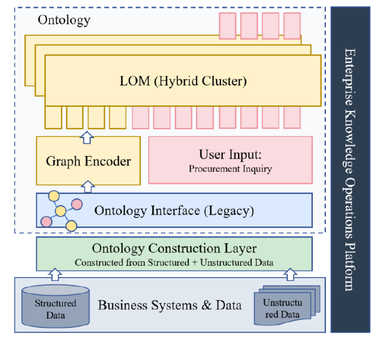
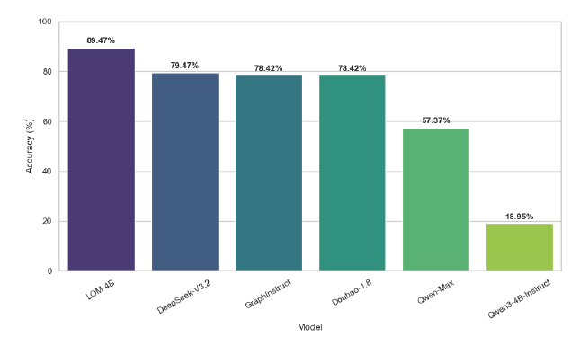
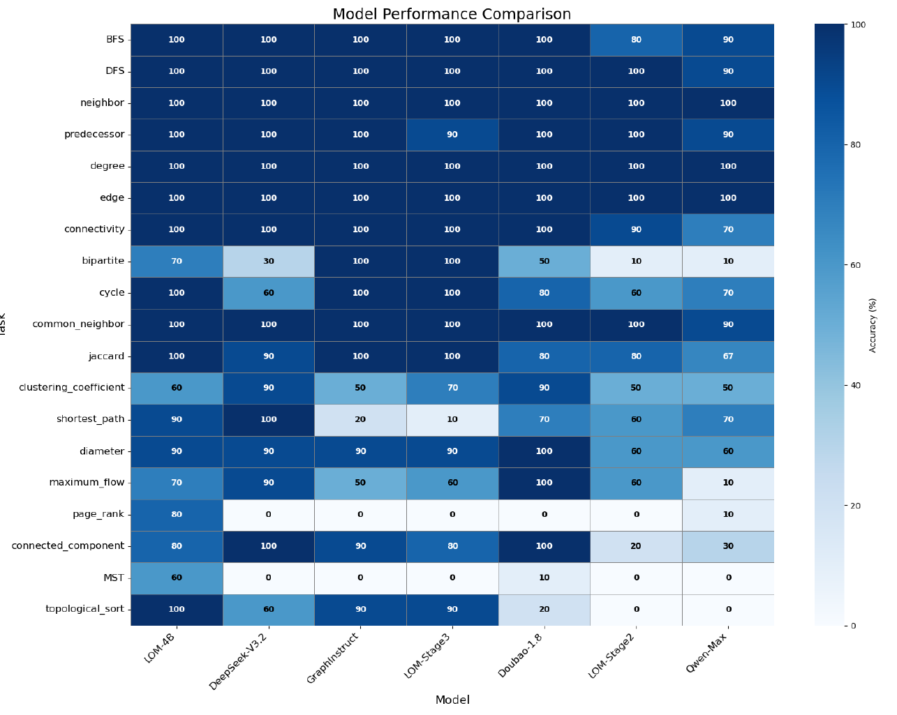

# 온톨로지를 LLM에 "모달리티"로 붙이기: Large Ontology Model 읽기

> Yao Zhang, Hongyin Zhu. *Construct, Align, and Reason: Large Ontology Models for Enterprise Knowledge Management.* Yonyou AI Lab, arXiv:2602.00029, 2026.

이 글은 논문을 읽으며 오간 질문들을 그대로 따라간다. "이건 결국 RAG 아닌가", "그래프를 매번 통째로 넣는다고?", "prefix tuning이랑 뭐가 다르지" 같은 의문이 이 논문의 설계를 이해하는 가장 좋은 경로였기 때문이다.

---

## 1. 이 논문이 풀려는 문제

### 1) 두 개의 단절

기업 지식관리에서 두 가지 단절이 있다.

**구축 측면**에서는 정형 DB와 비정형 텍스트가 따로 처리된다. 전통적인 스키마 매핑 도구는 레거시 DB의 암묵적 관계(누락된 외래키 같은)를 찾아내지 못하고, 표준 정보추출 모델은 도메인 적응력이 부족해 구조화된 백본과 풍부한 텍스트 지식을 병합하지 못한다.

**추론 측면**에서는 의미적 간극이 남는다. GNN은 위상 구조는 잡지만 복잡한 비즈니스 질문에 필요한 추론 깊이가 없고, LLM은 의미 지식은 갖췄지만 엄밀한 그래프 구조를 따르지 못한다. 이 단절 때문에 이종 기업 데이터에 대한 신뢰할 만한 multi-hop 추론이 어렵다.

### 2) 제안: construct–align–reason

논문이 내놓는 답이 **LOM(Large Ontology Model)** 이고, 프레임워크 이름 그대로 세 단계다.

- **construct** — 온톨로지 구축
- **align** — 온톨로지–텍스트 정렬
- **reason** — 생성적 온톨로지 추론

아키텍처 그림을 먼저 보면 전체 구도가 잡힌다.

아래층의 업무 시스템 및 데이터(정형·비정형)와 위층의 온톨로지 응용 사이에 **온톨로지 구축 층**이 놓이고, 데이터는 온톨로지 인터페이스를 거쳐 모델로 흘러들어간다. 모델은 이종 그래프 표현

$$\mathcal{G} = (\mathcal{V}, \mathcal{E}, \mathcal{N}, \mathcal{R})$$

으로 정형·비정형 데이터를 함께 모델링한다. 핵심 처리 단위는 세 가지다 — (1) 구조적 의존성을 잡는 **graph encoder**(graph transformer 기반), (2) 자연어 질의를 처리하는 **user input module**, (3) linear alignment projector가 그래프 특징을 LOM 임베딩 공간으로 매핑하는 **LOM hybrid cluster**.

그림에서 노란 토큰(그래프 인코더 쪽)과 분홍 토큰(사용자 입력 쪽)이 나란히 LOM 블록으로 올라가는 게 보인다. 이 그림 하나가 이후 논의의 대부분을 예고한다.

---

## 2. Construct: 외부 DB로부터 그래프를 만드는 과정

### 1) 목표

정형 DB를 온톨로지 $\mathcal{G}_S = (\mathcal{V}_S, \mathcal{E}_S)$로 바꾸는 것. 논문이 지목하는 걸림돌은 "semantic impedance mismatch" — 테이블·컬럼이라는 관계형 표현과 개념·관계라는 온톨로지 표현 사이의 간극이다. 특히 레거시 DB에는 외래키 제약이 선언돼 있지 않은 경우가 많아서, 스키마만 봐서는 테이블 간 연결을 알 수 없다. 여기에 **2단계 스캔 전략**을 쓴다.

### 2) 1단계 — 스키마 스캔 (명시적 키)

소스 테이블 집합 $\mathcal{T} = \{T_1, \dots, T_n\}$에서 스키마를 추출해 명시적 키를 찾는다. 판별 기준은 필드명에 `id`나 `code`가 포함되는지 같은 키워드 매칭이다.

이것만으로는 놓치는 게 많아서, LOM으로 암묵적 연관을 함께 탐지한다. 논문이 든 예가 `number` — 키워드 매칭으로는 안 걸리지만 의미상 식별자 역할을 하는 컬럼들이다.

### 3) 2단계 — 딥스캔 (암묵적 외래키)

여기가 핵심이다. 컬럼 이름만으로는 부족하니 **실제 값을 본다**. 각 테이블에서 1,000건을 무작위 샘플링해 슬라이딩 윈도우로 훑으며 컬럼 쌍의 값 중첩을 평가한다.

두 컬럼 $c \in T_i$, $c' \in T_j$ 사이의 관계를 다요인 신뢰도 함수로 정량화한다:

$$\Phi(c, c') = \lambda_1 \mathcal{S}_{\text{name}}(c, c') + \lambda_2 \mathbb{I}_{\text{type}}(c, c') + \lambda_3 \mathcal{S}_{\text{overlap}}(c, c') + \lambda_4 \mathcal{S}_{\text{card}}(c, c')$$

각 항이 하는 일은 이렇다.

- **$\mathcal{S}_{\text{name}}$** — 컬럼명의 의미적 유사도. 문자열 일치가 아니라 의미 기반 유사도라 `cust_id`와 `customer_number` 같은 쌍을 잡는다.
- **$\mathbb{I}_{\text{type}}$** — 데이터 타입 호환성 지시함수. 타입이 안 맞으면 이 항이 0이 되어 신뢰도를 떨어뜨린다. VARCHAR와 INT를 억지로 잇는 걸 막는 안전장치다.
- **$\mathcal{S}_{\text{overlap}}$** — 값 분포의 중첩도. 샘플링한 1,000건에서 계산한다. `orders.cust_id`의 값들이 `customers.id`의 값 집합 안에 대부분 들어가면 높게 나온다. **실제 데이터를 근거로 삼는 유일한 항**이라 사실상 가장 결정적인 신호다.
- **$\mathcal{S}_{\text{card}}$** — 카디널리티 패턴. 일대다 같은 구조를 추론한다. 외래키는 보통 한쪽이 유일하고 다른 쪽이 중복되는 비대칭 패턴을 보이므로, 이걸로 방향성과 관계 유형을 판별한다.

$\Phi$가 임계값 $\delta$를 넘으면 두 테이블 사이에 엣지를 만든다.

이 수식이 이 논문 구축부의 전부라고 해도 과언이 아니다. 이름·타입·값·분포라는 네 가지 신호를 가중합해 "선언되지 않은 외래키"를 복원하는 것이 목표이고, 어느 한 신호만으로는 오탐이 많다는 경험적 판단이 네 항의 조합에 반영돼 있다.

### 4) 3단계 — 이중층 조립

**inter-table 층**: 위에서 만든 엣지들로 테이블 간 그래프를 구성한다. 이대로는 약한 연결이 잔뜩 붙은 지저분한 그래프라, **k-core 분해**로 정리한다. 차수가 낮은 노드를 반복 제거해 밀도 높은 핵심만 남기는 방식이고, 논문 표현으로는 "위상 백본(topological backbone)"을 유지하는 것이다.

**개념 추상화**: 테이블들을 top-down으로 범주화해 상위 개념을 뽑는다. 이게 추상 schema 층이 된다.

**인스턴스 연결**: 마지막으로 개별 인스턴스 노드를 자기가 속한 테이블 노드에 연결한다. 데이터와 개념을 잇는 다리 역할이다.

결과가 **이중층 구조** — 추상 schema 층 + 구체 instance 층.

### 5) 비정형 쪽과의 융합

$\mathcal{G}_U$는 별도 파이프라인으로 만든다. 문서 파싱 → 트리플 추출 → 엔티티 중의성 해소 → 그래프 구축 순이다. 추출 단계에서는 vLLM으로 가속한 로컬 Qwen3(temperature 0.1)를 써서 2,000토큰 청크(150토큰 오버랩)를 처리하고, 엔티티와 서술적 속성을 뽑으면서 `{MENTIONS, RELATES_TO, IS_A}` 중에서 관계를 식별한다.

엔티티 중의성 해소는 3단계 계층 병합 규칙이다: (1) 편집거리 ≥ 0.85와 부분문자열 포함 ≥ 60%로 표면형 매칭, (2) 도메인 특화 정규화, (3) BGE-M3 임베딩 코사인 유사도 ≥ 0.85로 심층 의미 매칭.

두 층을 합칠 때는 휴리스틱 태깅 알고리즘으로 $\mathcal{G}_U$의 파일 노드에 속성 태그를 붙이고, 이를 $\mathcal{G}_S$ 인스턴스 층의 description과 매칭해 의미적 연결 $\Psi: \mathcal{G}_U \to \mathcal{G}_S$를 만든다. 이후 LOM의 링크 예측으로 누락 관계를 채워 그래프를 조밀하게 한다. 최종 그래프는 $\mathcal{G} = \mathcal{G}_S \cup \mathcal{G}_U$.

### 6) 이 구축 파이프라인을 비판적으로 볼 지점

**순환 의존이 있다.** 1단계의 암묵적 연관 탐지와 융합 단계의 링크 예측 모두 "LOM을 사용한다"고 쓰여 있는데, LOM은 이 온톨로지로 학습시킬 모델이다. 부트스트랩을 어떻게 했는지(사전 학습된 다른 모델을 썼는지, 반복 학습인지) 설명이 없다.

**하이퍼파라미터가 전부 미공개다.** $\lambda_1 \sim \lambda_4$의 값과 결정 방식, 임계값 $\delta$, k-core의 $k$ — 어느 것도 명시되지 않았다. 특히 $\lambda$ 가중치는 결과 그래프를 좌우하는데 학습으로 정하는지 수동인지도 불명확하다.

**검증이 없다.** 이 구축 파이프라인의 정확도를 재는 실험이 4장에 없다. 추론한 암묵적 외래키가 실제로 맞는지, 재현율이 어느 정도인지 측정한 결과가 논문에 나오지 않는다. 4장 실험은 전부 합성 그래프 대상이라 3.2절과 사실상 분리돼 있다.

**샘플 1,000건의 근거도 불명확하다.** 값 분포가 편향된 대형 테이블에서 이 표본이 충분한지, 왜 1,000인지에 대한 논의가 없다.

---

## 3. Graph encoder: 그래프가 토큰이 되기까지

### 1) 파이프라인 전체

논문이 명시한 차원 변화를 따라가면 이렇다.

> 노드 텍스트 설명 → all-mpnet-base-v2 (768차원) → dimension-matching projection → 3층 graph transformer (hidden 128, 8 heads) → linear graph projector → 2,560차원 → LLM 입력 시퀀스

### 2) 노드 특징 초기화

노드를 랜덤 벡터나 원핫으로 시작하지 않는다. 각 노드의 **텍스트 설명**을 Sentence-Transformer(all-mpnet-base-v2)로 인코딩해 768차원 특징을 만든다.

이게 설계상 중요한 선택이다. 노드가 처음부터 의미를 담은 벡터라서, 뒤에 나올 text-ontology grounding(그래프 토큰 → 텍스트 설명 복원 학습)이 성립할 수 있다. 순수 위상 정보만 있는 노드였다면 텍스트로 되돌릴 근거가 없다.

데이터는 PyG 포맷으로 저장되고 768차원 노드 특징과 그래프 구조를 함께 담아, 이종·동종 그래프 학습을 모두 지원한다.

### 3) Graph transformer 인코딩

구조는 3층, hidden 128, 8 attention heads. 표준 GNN(메시지 패싱)이 아니라 **graph transformer**를 쓴다 — 이웃 집계만 하는 게 아니라 노드 간 attention으로 구조적 의존성을 잡는다는 뜻이다. PageRank나 MST처럼 전역 구조를 봐야 하는 태스크에서 우위를 보인 것과 연결되는 선택이다.

인용된 선행 연구가 Li et al.(계층적 위상 지식을 통합한 pre-training graph autoencoder)과 **GraphMAE2**다. 즉 masked self-supervised 방식으로 사전 학습된 인코더 계열이다. 노드 특징 일부를 가리고 복원하도록 학습시켜 구조 표현을 얻는 접근.

### 4) LLM 임베딩 공간으로 투영

**linear** graph projector 하나로 2,560차원(Qwen3-4B의 hidden size)에 매핑한다. LLaVA의 비전 프로젝터와 같은 구조다. 이렇게 나온 벡터들이 graph token이 되어 instruction 토큰과 나란히 LLM 컨텍스트에 놓인다.

토큰 정의는 이렇다 — $\mathbf{e}_i$는 $i$번째 그래프 토큰, $s_i$는 메타타입, $\mathbf{c}_i$는 대응 텍스트 설명.

### 5) 그래프 토큰은 모든 노드에 대해 만들어지는가

논문이 명시적으로 말한 적은 없지만, 노드당 1토큰으로 읽는 게 가장 자연스럽고 표기법도 그쪽을 가리킨다.

- 토큰 정의가 노드 단위로 인덱싱된다. $\mathbf{c}_i$가 붙는 대상은 노드다(비정형 파이프라인에서 엔티티를 "descriptive attributes와 함께" 추출한다고 밝힘). 즉 토큰 ↔ 노드 대응.
- graph transformer는 기본적으로 노드별 표현을 출력한다. 전체를 하나로 모으는 readout이나 풀링 층에 대한 언급이 없다.
- projector가 **linear** 하나다. LLaVA 계열이 그렇듯 각 토큰을 독립적으로 매핑할 뿐 개수를 줄이지 않는다.
- intra-type 정렬이 "그래프 토큰 **시퀀스**에 대해 올바른 텍스트 **시퀀스**를 출력"하도록 학습한다. 데이터셋 정의도 $(\mathbf{e}_k, s_i)$ 쌍의 리스트와 $(\mathbf{c}_k, \mathbf{c}_{s_i})$ 쌍의 리스트를 짝지은 형태다. 개별 토큰이 개별 설명에 대응한다는 뜻이다.

벤치마크 그래프가 노드 5~50개니 그래프 토큰도 5~50개 수준이다. 컨텍스트 부담이 거의 없다.

### 6) 인코더 설계에서 걸리는 점

**128차원 병목이 눈에 띈다.** 768로 들어와 128로 줄었다가 2,560으로 펼쳐진다. 정보량의 상한은 중간의 128이 결정하므로, 텍스트 인코더가 담아온 의미의 상당 부분이 여기서 버려진다. 노드 5~50개짜리 그래프에는 충분했겠지만 실제 기업 온톨로지 규모에서도 유지될지는 별개 문제다.

**압축이나 풀링이 없다.** 노드 하나가 토큰 하나로 가는 구조로 읽히고, 여러 노드를 요약하는 단계가 서술돼 있지 않다. 확장성 문제가 인코더 설계 자체에 박혀 있는 셈이다.

**엣지가 토큰을 받는지 알 수 없다.** 실험 그래프는 방향·가중치 그래프를 포함하고 엣지가 5~200개다. 그런데 토큰이 노드 전용이라면 엣지 가중치는 인코더의 attention을 거쳐 노드 표현 안에 암묵적으로 녹아드는 수밖에 없다. 최단경로나 MST처럼 **가중치 값 자체가 답을 결정하는** 태스크에서 이건 꽤 손실이 큰 구조다. LOM-4B의 MST 정확도가 60%에 그친 것과 무관하지 않아 보인다. 반대로 엣지도 토큰화한다면 200개 엣지 그래프에서 토큰 수가 훨씬 늘어난다. 어느 쪽인지 논문으로는 판별이 안 된다.

**노드 순서와 식별자 문제도 언급이 없다.** 시퀀스로 넣는 이상 순서가 정해져야 하는데 어떤 규칙인지, 그래프 구간을 표시하는 특수 토큰이 있는지 서술되지 않았다. BFS처럼 "정확한 순서"로 채점하는 태스크에서 모델이 노드를 무엇으로 지칭하는지는 텍스트 설명에서 온다고 추정할 뿐이다.

**동결 여부도 애매하다.** 논문은 "alignment projector와 graph-token embedding을 학습한다"고만 쓴다. graph encoder 자체가 함께 업데이트되는지 얼려두는지 명시하지 않아, 재현하려면 추측이 필요한 대목이다.

---

## 4. Align & Reason: 3단계 학습과 답변 생성

### 1) 1단계 — 온톨로지 instruction fine-tuning

가장 기본이 되는 목적함수:

$$\mathcal{L} = -\mathbb{E}_{\mathcal{G}, \mathbf{q}, \mathbf{a} \sim \mathcal{D}} \log P(\mathbf{a} \mid (\mathcal{G}, \mathbf{q}); \theta)$$

$\mathcal{G}$는 그래프, $\mathbf{q}$는 질의, $\mathbf{a}$는 정답, $\theta$는 모델 파라미터다. $(\mathcal{G}, \mathbf{q})$가 주어졌을 때 올바른 $\mathbf{a}$를 출력하도록 $\theta$를 학습해, 기초적인 그래프 이해·추론 능력을 부여한다.

여기서 $\theta$가 "model parameters"로 명시된 게 중요하다. 뒤에서 prefix tuning과 비교할 때 결정적인 차이가 되는 지점이다.

### 2) 2단계 — text-ontology grounding

alignment projector와 graph-token 임베딩을 학습해 텍스트 인코더와 GNN 사이의 특징을 정렬한다. 정렬 데이터셋이 두 종류다.

**Intra-type alignment** — 단일 메타타입 안에서의 토큰 이해를 높인다. 주어진 그래프 토큰 시퀀스에 대해 올바른 텍스트 시퀀스를 출력하도록 학습한다.

$$\mathcal{D}^{\text{intra}} = \{[(\mathbf{e}_k, s_i), \dots], [(\mathbf{c}_k, \mathbf{c}_{s_i}), \dots]\}$$

$$\mathcal{L}_{\text{intra}} = \mathbb{E}_{d \sim \mathcal{D}^{\text{intra}}}[\text{CE}(d[0] \mid \text{LLM}(d[1]))]$$

**Inter-type alignment** — 복잡한 이종 관계를 위해 여러 메타타입의 토큰을 함께 쓴다.

$$\mathcal{D}^{\text{inter}} = \{[(\mathbf{e}_m, s_m), (\mathbf{e}_n, s_n), \dots], [(\mathbf{c}_m, \mathbf{c}_{s_m}), (\mathbf{c}_n, \mathbf{c}_{s_n}), \dots]\}$$

$$\mathcal{L}_{\text{inter}} = \mathbb{E}_{d \sim \mathcal{D}^{\text{inter}}}[\text{CE}(d[0] \mid \text{LLM}(d[1]))]$$

두 경우 모두 $d[0]$은 목표 텍스트 시퀀스(정답), $d[1]$은 LLM이 처리할 그래프 토큰 입력 시퀀스다.

이 단계의 의미는 뒤에서 다시 짚겠지만 한 줄로 말하면 이렇다 — 그래프 토큰은 어휘 사전에 없는 연속 벡터라서, "이 벡터는 이런 텍스트를 의미한다"를 미리 가르쳐 놓지 않으면 LLM 입장에서는 노이즈와 다를 바 없다.

### 3) 3단계 — 멀티태스크 instruction tuning + 커리큘럼 학습

$$\mathcal{D}^{\text{multi}} = \{\{(\mathbf{x}_{\text{pred}}, \mathbf{x}_{\text{reasoning}}) \mid \mathbf{x}_{\text{gen}}\}, \{\mathcal{G}^{\text{exp}} \mid \mathcal{G}^{\text{skg}}\}, \mathbf{t}_i, \mathbf{a}_i\}$$

$$\mathcal{L}_{\text{multi}} = -\mathbb{E}_{(\mathbf{t}, \mathbf{a}, \mathcal{G}) \sim \mathcal{D}^{\text{multi}}} \log P(\mathbf{a} \mid \mathbf{t}, \mathcal{G}; \theta)$$

$\mathbf{x}_{\text{pred}}$, $\mathbf{x}_{\text{reasoning}}$, $\mathbf{x}_{\text{gen}}$은 각각 예측·추론·생성 태스크의 입력 특징이고, $\mathcal{G}^{\text{exp}}$는 명시적 그래프 위상, $\mathcal{G}^{\text{skg}}$는 스키마 강화 지식그래프 구조를 가리킨다.

여기에 **커리큘럼 학습**을 얹는다. 난이도 순으로 샘플을 배열해, 단순 예측 태스크를 먼저 보여준 뒤 복잡한 생성 추론 시나리오로 넘어간다.

### 4) 데이터셋 — CoT가 핵심

기존 그래프 태스크 데이터셋은 단순 추론만 가르칠 뿐, 최소 신장 트리나 PageRank 같은 복잡한 태스크는 여전히 학습이 어렵다. 그래서 **CoT 강화 데이터셋**을 만든다.

핵심 아이디어는 알고리즘의 실행 궤적을 학습 데이터로 바꾸는 것이다. Dijkstra 최단경로, Kahn 위상정렬, Prim 최소신장트리, 선행노드 탐색 — 이 네 가지에 대해 단계별 기록 시스템이 실행 중 중간 상태(초기화, 노드 방문, 상태 갱신)를 포착하고 이를 자연어 chain-of-thought 설명으로 변환한다. 답을 외우게 하는 게 아니라 **추론 논리 전체를 배우게** 하려는 것이다.

최종 데이터셋은 19개 그래프 추론 태스크에 걸친 학습 샘플 115k. 기초 그래프 언어모델 학습용 20k와 심층 융합 학습용 95k로 나뉘고, 평가용으로 태스크당 10개씩 190개를 별도로 만들었다.

### 5) 답변은 어떻게 생성되는가

그래프 토큰들과 사용자 질의 토큰이 LLM 입력 시퀀스에 나란히 놓이고, 거기서부터 평범한 autoregressive 생성이 일어난다. 최대 생성 길이 4,096 토큰. self-attention이 질의 토큰에서 관련 그래프 토큰 쪽으로 주목하는 방식으로 융합된다. 인코더 단이 아니라 **디코더 단 융합**이다.

여기서 "context"라는 말에 함정이 하나 있다. RAG처럼 검색된 텍스트가 프롬프트에 들어가는 것과는 다르다. 그래프 토큰은 어휘 사전에 대응 항목이 없는 **연속 임베딩**이다. 시퀀스에서 자리를 차지할 뿐 사람이 읽을 수 있는 문자열로 디코딩되지 않는다. 그래서 2단계의 정렬 학습이 필수가 된다.

생성 방식도 바로 답을 뱉는 게 아니라 추론 과정을 먼저 생성한 뒤 최종 답에 도달한다. CoT 데이터셋이 이걸 학습시킨 것이다.

여기서 이 시스템의 근본적 성격이 드러난다. 외부 그래프 라이브러리를 호출하거나 실제 순회를 수행하는 게 아니다. PageRank든 MST든 **LLM이 생성하는 텍스트 안에서 알고리즘을 시뮬레이션**한다. 반복 수치 계산을 토큰 생성으로 흉내 내야 하니 이 두 태스크의 점수가 낮은 게 자연스럽다.

---

## 5. 이건 RAG인가?

논문을 읽으면 가장 먼저 드는 의문이다. 외부 DB에서 지식을 끌어와 LLM 입력에 붙인다는 큰 그림은 RAG와 같아 보인다. 결론부터 말하면 **부분적으로만 그렇고, 오히려 저자들이 명시적으로 RAG와 선을 긋는 논문**이다.

### 1) RAG와 다른 점

RAG는 추론 시점에 외부 저장소에서 관련 조각을 검색해 **텍스트로 프롬프트에 삽입**하고, 모델 가중치는 건드리지 않는다. LOM은 그래프를 graph transformer로 인코딩한 뒤 linear alignment projector로 LLM의 2,560차원 임베딩 공간에 **soft token으로 투영**하고, 그 정렬을 학습시킨다. 구조적으로는 RAG보다 LLaVA 같은 멀티모달 정렬에 가깝다. "온톨로지 = 새로운 모달리티"로 보는 관점이다.

저자들도 Related Work에서 GNN-RAG 등을 언급하며 이렇게 못 박는다.

> these approaches typically treat the knowledge graph as an external tool or retrieval source, rather than jointly modeling ontology construction, graph representation, and instruction-aligned reasoning within a unified framework.

### 2) 그럼에도 RAG스럽게 보이는 이유

외부 기업 DB·문서에서 지식을 끌어와 LLM 입력에 붙인다는 큰 그림은 같다. 파라미터 안에 지식을 다 넣지 않고 외부 구조를 참조한다는 점도 그렇다. "지식 주입(knowledge injection)" 계열로 묶으면 RAG와 형제 관계는 맞다.

### 3) 결정적 차이 — 검색 단계 자체가 없다

실제 평가에서 그래프는 이미 입력으로 주어진다(5~50 노드). 어떤 서브그래프를 가져올지 고르는 retriever가 없고, 평가 태스크도 BFS·PageRank·MST 같은 알고리즘 실행이다. **RAG의 성패를 가르는 검색 품질 문제가 이 논문에는 아예 등장하지 않는다.**

정리하면 구축 파이프라인은 RAG의 인덱싱 단계와 대응하지만, 추론부는 retrieval-augmented가 아니라 **encoder-fused**다.

---

## 6. Prefix tuning과의 관계

그래프 정보가 단어에서 온 이산 벡터가 아니라 연속 의미 벡터이고, 그런 prefix와 결합해 정답을 맞추도록 fine-tuning한다 — 이렇게 보면 prefix tuning과 닮았다. 계보상 실제로 연결돼 있지만, 결정적으로 갈리는 지점이 있다.

### 1) 닮은 부분

어휘 사전에 없는 연속 벡터가 시퀀스 앞쪽에 놓이고, 그 상태에서 정답 우도를 최대화하도록 학습된다는 골격은 같다. 식 (1)과 식 (7) 모두 정답 $\mathbf{a}$에 대한 next-token cross-entropy다. "soft token"이라는 성격도 공유한다.

### 2) 갈리는 지점 ① — prefix가 입력에 따라 달라진다

prefix tuning의 prefix는 **입력과 무관한 고정 파라미터 행렬**이다. 학습이 끝나면 모든 입력에 대해 같은 벡터가 붙는다. 담는 건 "이 태스크를 이렇게 수행하라"는 태스크 명세지 내용이 아니다.

LOM의 그래프 토큰은 매 입력마다 인코더가 **데이터로부터 계산**한다. 그래프가 바뀌면 토큰이 통째로 바뀐다. 태스크가 아니라 콘텐츠를 나른다.

### 3) 갈리는 지점 ② — 학습 범위

prefix tuning의 핵심 동기는 파라미터 효율이다. LLM을 완전히 얼리고 prefix만 학습한다. LOM은 식 (1)에서 $\theta$를 "model parameters"로 명시하고 이를 최적화한다 — 1단계부터 LLM 본체를 fine-tuning한다. 효율 기법이 아니다.

덧붙여 원조 prefix tuning(Li & Liang)은 **모든 층에** key-value를 삽입한다. LOM의 projector는 입력 임베딩 층 한 곳에만 매핑한다.

### 4) 갈리는 지점 ③ — grounding 목적함수의 유무

prefix tuning의 prefix는 경사하강이 만들어 주는 대로의 의미를 가질 뿐, 그게 무엇을 뜻하는지 명시적으로 가르치지 않는다. LOM은 intra/inter-type alignment로 "이 그래프 토큰 = 이 텍스트 설명"을 직접 학습시킨다. **의미가 지정된 soft token**이다.

### 5) 더 정확한 대응은 멀티모달 프로젝터

LLaVA와 3단계 구성이 거의 겹친다 — 인코더가 입력별 연속 토큰을 만들고, linear projector로 LLM 임베딩 공간에 올리고, 정렬 사전학습 후 instruction tuning.

그렇다고 prefix tuning 직관이 틀린 것도 아니다. 비전을 LLM에 붙인 초기 연구(Frozen, 2021)가 이미지 임베딩을 명시적으로 "학습된 prefix"라 불렀고, prompt tuning → soft prompt → 멀티모달 프로젝터는 실제로 이어진 흐름이다. 차이는 prefix가 **정적 파라미터냐 입력 함수냐**로 요약된다.

---

## 7. 쿼리 독립성, 그리고 정적 그래프의 역설

### 1) graph encoder는 쿼리를 보지 않는다

그래프 인코딩은 질문을 전혀 참고하지 않는다. 근거가 셋이다.

- 아키텍처의 세 컴포넌트가 병렬로 나열된다 — graph encoder, user input module, alignment projector. 인코더가 쿼리를 입력으로 받는 경로가 없다.
- 수식도 같은 얘기를 한다. $P(\mathbf{a} \mid (\mathcal{G}, \mathbf{q}); \theta)$와 $P(\mathbf{a} \mid \mathbf{t}, \mathcal{G}; \theta)$ — $\mathcal{G}$와 $\mathbf{q}$가 나란히 조건으로 들어갈 뿐 $\mathbf{q}$가 $\mathcal{G}$의 인코딩에 관여하지 않는다.
- 더 결정적인 건 정렬 학습 단계다. intra/inter-type alignment는 "그래프 토큰 시퀀스가 주어지면 대응 텍스트 시퀀스를 출력하라"로 학습하는데, 여기엔 쿼리가 아예 등장하지 않는다. 그래프 → 텍스트 단방향 매핑을 배우는 것이라 인코더는 쿼리 조건부가 될 수 없다.

노드 특징도 마찬가지다. all-mpnet-base-v2로 768차원 초기화 → graph encoder → projector로 이어지는 경로가 전부 쿼리와 무관하게 결정된다.

### 2) 함의 — 캐싱은 되지만 필터링은 안 된다

장점은 캐싱이다. 그래프 표현이 쿼리 독립적이니 한 번 계산해 두고 모든 질의에 재사용할 수 있다. 나아가 그래프 토큰이 시퀀스 앞쪽에 고정으로 붙으니 **KV 캐시를 질의 간에 재사용**할 수 있다. prefix KV를 미리 계산해 두면 질의마다 그래프 부분의 forward를 건너뛴다. 토큰 수가 많을수록 절감폭이 커지는 구조라, 오히려 쿼리 독립 설계의 가장 실질적인 보상이 여기 있다.

단점은 쿼리를 참고해 관련 부분만 추리는 장치가 인코더에도 없다는 것이다. 걸러내는 부담이 전부 LLM의 attention에 넘어간다. 노드 50개면 감당되지만 수만 개면 무리다. GNN-RAG처럼 질문으로 서브그래프 검색을 유도하는 계열과 갈리는 지점이 정확히 여기다.

### 3) 전부 정적인 건 아니다

이중층 구조가 여기서 의미를 갖는다. schema 층은 테이블 구조가 바뀔 때만 갱신되니 사실상 고정이다. 반면 instance 층은 주문이 쌓이고 문서가 추가될 때마다 바뀐다. 논문이 구축 프레임워크를 "layered, decoupled, and incrementally evolving"이라고 밝힌 게 이 부분을 염두에 둔 표현으로 읽힌다 — 전체 재구축이 아니라 증분 갱신을 상정한 것.

### 4) 역설 — 정적이면 다시 prefix tuning에 가까워진다

기업 온톨로지가 배포 중 고정이라면, 그래프 토큰은 **모든 질의에 동일하게 붙는 고정 행렬**이 된다. 앞에서 prefix tuning과의 차이로 "정적 파라미터냐 입력 함수냐"를 들었는데, 입력이 상수면 그 구분이 무너진다. 기능적으로는 아주 큰 학습된 prefix와 다를 바 없어진다.

남는 차이는 **파생물이라는 점**이다. DB가 바뀌면 재학습 없이 인코더만 다시 돌려 갱신된다. prefix tuning이라면 학습을 다시 해야 한다. 유지보수 관점에서는 이게 결정적이다.

그런데 캐싱·증분 인코딩·서빙 전략에 대한 서술이 논문에 전혀 없다. 게다가 4장 벤치마크는 190개 샘플이 **각각 다른 그래프**를 쓴다. 실험 설정에서는 그래프가 정적이지 않은 것이다. 기업 온톨로지라는 서사와 실제 평가 사이의 간극이 여기서도 드러난다.

---

## 8. 실험 결과

### 1) 설정

백본은 Qwen3-4B-Instruct(4B 파라미터, hidden 2,560, 36층, 32 attention heads, vocab 151,936, 최대 생성 4,096 토큰). 그래프 인코더는 사전학습된 graph transformer 3층, hidden 128, 8 heads.

벤치마크는 19개 태스크 190개 샘플이고 6개 범주로 나뉜다 — traversal(BFS, DFS), graph properties(degree, neighbor, edge existence, connectivity, cycle, bipartiteness, connected components, diameter), node similarity(common neighbors, Jaccard), paths and flows(predecessor, topological sort, shortest path, max flow), centrality(PageRank, clustering coefficient), tree structure(MST). 그래프는 노드 5~50개, 엣지 5~200개이며 무향·유향·가중 그래프를 모두 포함한다.

채점은 태스크별 엄격 기준이다 — 순회는 정확한 순서, 수치 태스크는 정확한 값, 불리언 질의는 올바른 분류, 리스트 출력은 집합 일치, 경로 관련은 유효성 검사.

### 2) 전체 정확도

| 모델 | 정확도 |
|---|---|
| **LOM-4B (제안)** | **89.47%** |
| DeepSeek-V3.2 | 79.47% |
| GraphInstruct | 78.42% |
| Doubao-1.8 | 78.42% |
| Qwen-Max | 57.37% |
| Qwen3-4B-Instruct (백본 그대로) | 18.95% |

높을수록 좋다. 눈여겨볼 비교는 두 가지다. **GraphInstruct**는 그래프 추론용으로 특별히 instruction tuning된 모델인데도 78.42%에 그쳤고, **Qwen3-4B-Instruct**는 LOM-4B의 백본 그 자체인데 18.95%다. 같은 4B 모델이 그래프 인코더와 3단계 학습을 얹었을 때 70%p 넘게 벌어진다는 뜻이다.

### 3) 태스크별 분해 — 여기가 진짜 이야기

BFS, DFS, neighbor, degree, edge 같은 기초 순회·속성 조회 태스크에서는 LOM-4B, DeepSeek-V3.2, GraphInstruct 모두 100%다. 현재의 LLM은 적절한 학습이나 구조 인식만 주어지면 그래프 데이터의 기본 문법과 국소 연결 규칙은 이미 습득했다는 뜻이다.

갈리는 건 계산 집약적이고 전역적인 추론 태스크다.

| 태스크 | LOM-4B | DeepSeek-V3.2 | GraphInstruct | Doubao-1.8 | Qwen-Max |
|---|---|---|---|---|---|
| page_rank | **80** | 0 | 0 | 0 | 10 |
| MST | **60** | 0 | 0 | 10 | 0 |
| topological_sort | **100** | 60 | 90 | 20 | 0 |
| shortest_path | 90 | **100** | 20 | 70 | 70 |
| maximum_flow | 70 | 90 | 50 | **100** | 10 |

PageRank와 MST에서 다른 선도 모델들이 **정확히 0%** 인데 LOM-4B만 80%, 60%를 유지한다. 반대로 최단경로는 DeepSeek-V3.2가 100%로 앞서고 최대유량은 Doubao-1.8이 100%다. 즉 범용 모델들도 산발적 강점은 보이지만 LOM-4B 같은 일관된 다재다능함은 없다는 게 저자들의 해석이다.

히트맵에는 LOM-Stage2와 LOM-Stage3도 함께 있어서 학습 단계별 진전을 볼 수 있다. Stage2는 topological_sort 0%, MST 0%, page_rank 0%인데 최종 LOM-4B에서 각각 100%, 60%, 80%가 된다. 3단계 학습이 어디에 기여했는지가 꽤 선명하게 드러난다.

### 4) Ablation

| 설정 | 정확도 |
|---|---|
| **LOM-4B (전체)** | **89.47%** |
| w/o CoT | 78.42% |
| w/o Instruct | 61.66% |
| w/o GNN, Instruct | 18.95% |

CoT 추론 메커니즘을 제거하면 11%p 넘게 떨어진다. 명시적 추론 단계가 복잡한 다단계 그래프 추론을 안내하는 데 결정적이며, 모델이 성급하게 틀린 결론으로 점프하는 걸 막아준다는 뜻이다.

instruction tuning을 빼면 61.66%로, 그래프 인코더까지 함께 빼면 18.95%로 무너진다. 이 마지막 수치가 중요하다 — **구조적 임베딩과 태스크 적응이 없는 표준 LLM은 그래프 추론에 근본적으로 부적합**하다는 것이고, 동시에 앞서 말한 "정렬 없이는 그래프 토큰이 노이즈에 불과하다"는 얘기의 실증이기도 하다.

Qwen-Max와의 대비도 같은 방향을 가리킨다. 규모만으로는 그래프 추론이 되지 않는다.

---

## 9. 한계와 열린 질문

논문이 스스로 인정하는 한계는 MST와 PageRank의 낮은 점수이고, 향후 강화학습 전략으로 더 깊은 구조 이해와 정확한 multi-hop 추론을 노리겠다고 밝힌다.

읽으면서 더 크게 걸린 지점들은 이렇다.

**확장성이 설계에 박혀 있다.** 노드당 1토큰이 맞다면, 인스턴스 노드 10만 개짜리 기업 온톨로지는 10만 토큰이 필요하다. 풀링도 검색도 없으니 통째로 넣는 것 외에 방법이 없고, 그건 불가능하다. 논문이 합성 그래프로만 평가한 이유가 이 지점에 있다고 봐도 될 것 같다.

그리고 여기에 구조적 긴장이 있다. 검색·선택 단계를 넣는 순간 그게 RAG의 retriever가 되고, "우리는 KG를 외부 검색 소스로 다루지 않는다"는 논문의 차별화 주장이 흐려진다. 스케일 확장 방법을 다루지 않은 게 우연이 아닐 수도 있다.

**구축부와 실험부가 분리돼 있다.** 2절에서 정성 들여 설명한 이중층 온톨로지 구축(Φ 함수, k-core, 엔티티 중의성 해소)은 4장 실험에서 한 번도 검증되지 않는다. 평가는 전부 5~50 노드 합성 그래프의 알고리즘 실행이다. "기업 지식관리"라는 제목과 실제 측정된 것 사이의 거리가 멀다.

**평가 규모가 작다.** 190개 샘플, 태스크당 10개다. 태스크별 정확도가 10% 단위로만 움직이는 이유이기도 하다(히트맵의 모든 숫자가 10의 배수인 게 그 증거다). 60%와 70%의 차이가 샘플 하나라는 뜻이라, 세밀한 비교에는 무리가 있다.

**재현이 어렵다.** $\lambda$ 가중치, 임계값 $\delta$, k-core의 $k$, 인코더 동결 여부, 그래프 인코더의 사전학습 코퍼스, 이종성 처리 방식, 그래프 위치 인코딩 — 모두 미명세다.

---

## 10. 정리

LOM은 온톨로지를 **새로운 모달리티**로 취급하는 시도다. 텍스트로 변환해 프롬프트에 넣는 대신, 전용 인코더로 연속 벡터를 만들고 projector로 LLM 임베딩 공간에 올린 뒤, 그 벡터가 무엇을 뜻하는지를 명시적 정렬 학습으로 가르친다. LLaVA가 이미지에 한 일을 그래프에 한 셈이다.

이 관점 자체는 설득력이 있고, ablation 수치(18.95% → 89.47%)가 그래프 인코더 + 정렬 학습의 기여를 분명히 보여준다. PageRank와 MST에서 다른 모델이 전부 0%일 때 홀로 점수를 내는 것도 인상적이다.

다만 논문이 파는 서사(기업 지식관리)와 실제 검증한 것(합성 그래프 알고리즘 실행) 사이에 간극이 있고, 그 간극의 정체가 **확장성**이다. 쿼리 독립 인코딩은 캐싱에는 유리하지만 필터링 수단이 없다는 뜻이기도 해서, 실제 기업 규모 온톨로지로 가려면 결국 서브그래프 선택기가 필요해진다. 그 순간 이 논문이 애써 구분지은 RAG와의 경계가 흐려진다는 게, 읽고 나서 가장 오래 남는 질문이다.
