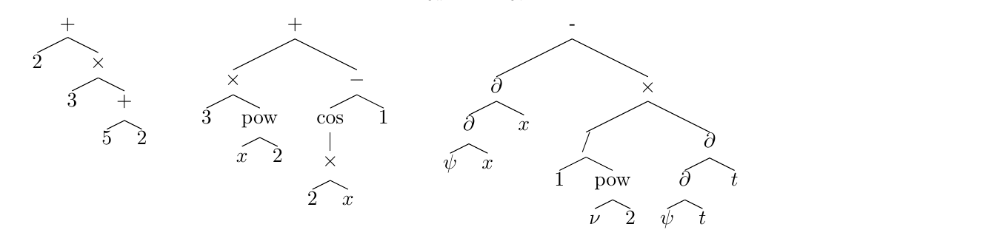
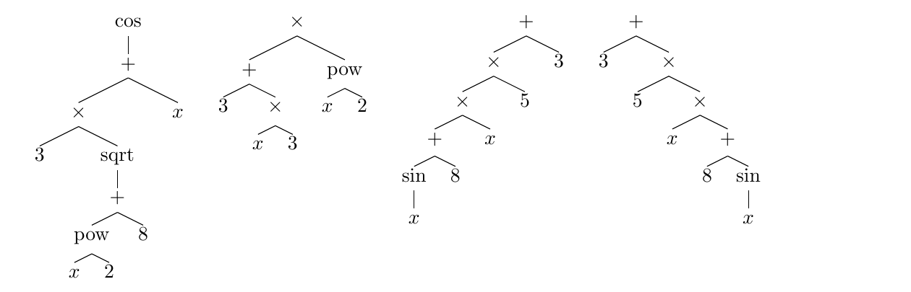

# 신경망으로 적분을 풀다 — Deep Learning for Symbolic Mathematics 읽기

> Guillaume Lample, François Charton (Facebook AI Research, 2019 / ICLR 2020)

신경망은 통계적이고 근사적인 문제에는 강하지만 정확한 계산이나 기호(symbol) 조작에는 약하다는 게 오랜 통념이었다. 이 논문은 그 통념을 정면으로 반박한다. 평범한 Transformer 기반 seq2seq 모델이 **함수 적분**과 **미분방정식 풀이** 같은 꽤 정교한 기호 수학 문제에서, 심지어 Mathematica·Maple·Matlab 같은 상용 컴퓨터 대수 시스템(CAS)을 능가한다는 것이다.

이 글은 이 논문을 읽으며 나눈 대화를 정리한 것으로, 핵심 주장 → 수학을 언어처럼 다루는 방법 → 랜덤 수식 생성 알고리즘 → 데이터셋 생성 기법 → 결과와 한계 순으로 짚는다.

---

## 1. 핵심 아이디어 — 기호 수학을 "번역 문제"로 재정의하다

이 논문의 프레이밍부터 짚고 넘어가자. 적분과 미분방정식 풀이를 "문제 수식 → 해답 수식"이라는 **수식 대 수식(=트리 대 트리) 번역**으로 재정의한 것이 이 논문의 출발점이고, 논문도 이를 "we regard this as a particular instance of machine translation"이라고 명시한다.

적분이든 미분방정식이든 결국 하나의 수식을 다른 수식으로 바꾸는 일이다. 예를 들어 미분방정식의 트리를 그 해의 트리로 매핑하는 것. 이걸 기계번역의 한 종류로 보겠다는 것이다.

### 1) 개념은 tree-to-tree, 구현은 seq2seq

여기서 흔히 오해하는 지점이 하나 있다. 개념적으로는 "트리에서 트리로의 번역"이 맞지만, **모델이 진짜 tree-to-tree는 아니다.** 논문은 Tree-LSTM이나 RNNG(Recurrent Neural Network Grammar) 같은 트리 생성 모델을 일부러 쓰지 않았다. 이유는 "tree-to-tree 모델은 구조가 복잡하고 학습·추론이 훨씬 느리다"는 것.

대신 이렇게 우회한다.

$$\text{tree} \xrightarrow{\text{전위표기법}} \text{sequence} \xrightarrow{\text{Transformer seq2seq}} \text{sequence} \xrightarrow{\text{역변환}} \text{tree}$$

트리를 전위(prefix) 시퀀스로 펴서 **평범한 seq2seq(Transformer)로 sequence-to-sequence 번역**을 하고, 트리↔시퀀스가 일대일 대응이라 결과를 다시 트리로 되돌린다. 그러니까 정확히 말하면 이 논문은 **"수식(트리)을 시퀀스로 표현한 뒤, tree-to-tree를 seq2seq 번역으로 환원해서 푼 것"**이다. 프레이밍은 트리, 엔진은 시퀀스인 셈이다.

---

## 2. 수학을 자연어처럼 다루기

### 1) 수식을 트리로

수식은 트리로 표현할 수 있다. 연산자와 함수는 내부 노드, 피연산자는 자식, 숫자·상수·변수는 잎(leaf)이 된다. 아래는 논문이 든 세 가지 예시다 — $2 + 3 \times (5+2)$, $3x^2 + \cos(2x) - 1$, 그리고 파동방정식의 일부.

트리는 연산 순서를 명확히 하고, 우선순위와 결합성을 처리하며, 괄호가 필요 없게 만든다. 공백이나 중복 괄호 같은 무의미한 기호를 제외하면 서로 다른 수식은 서로 다른 트리가 되고, 약간의 가정 하에 수식과 트리는 일대일 대응한다.

### 2) 트리를 시퀀스로 — 전위 표기법

기계번역 시스템은 보통 시퀀스를 다룬다. seq2seq로 트리를 생성하려면 트리를 시퀀스로 매핑해야 하는데, 여기서 **전위 표기법(prefix notation, 폴란드 표기법)**을 쓴다. 각 노드를 자식보다 먼저 쓰는 방식이다.

예를 들어 $2 + 3 \times (5+2)$는 `[+ 2 * 3 + 5 2]`가 된다. 흔한 중위 표기법과 달리 전위 시퀀스는 괄호가 필요 없어 더 짧다. 트리와 전위 시퀀스 사이에도 일대일 대응이 존재한다.

### 3) 문제 공간은 얼마나 큰가

가능한 수식의 개수를 세어보면 문제의 규모가 드러난다. 논문은 문제 공간을 이렇게 정의한다: 내부 노드 최대 $n$개, 단항 연산자 $p_1$개, 이항 연산자 $p_2$개, 잎 값 $L$개.

$p_1 = 0$이면 수식은 이진 트리이고, 내부 노드 $n$개짜리 이진 트리의 개수는 $n$번째 카탈란 수 $C_n$이다. 따라서 이항 연산자 $n$개짜리 수식의 개수는

$$E_n = C_n\, p_2^n\, L^{n+1} \approx \frac{4^n}{n\sqrt{\pi n}}\, p_2^n\, L^{n+1}, \qquad C_n = \frac{1}{n+1}\binom{2n}{n}$$

단항 연산자가 있으면($p_1 > 0$) 트리 개수는 큰 슈뢰더 수(large Schroeder number) $S_n$이 되고, 전체 수식 개수는 다음 점화식으로 계산된다.

$$(n+1)E_n = (p_1 + 2Lp_2)(2n-1)E_{n-1} - p_1(n-2)E_{n-2}$$

실제 실험 설정($L=11$, $p_1=15$, $p_2=4$, $n \le 15$)에서 이 조합은 $10^{40}$~$10^{60}$ 규모가 된다. 잎과 이항 연산자를 추가할수록 문제 공간이 급격히 커진다는 점이 핵심이다.

---

## 3. 랜덤 수식은 어떻게 생성하는가

학습 데이터를 만들려면 랜덤 수식이 필요한데, 이게 생각보다 까다롭다. 내부 노드 $n$개짜리 수식을 **균등하게(uniformly)** 뽑는 게 목표인데, 순진한 방법으로는 안 된다.

### 1) 왜 순진한 방법이 안 되나

재귀적으로 내려가거나 "각 노드가 잎일 확률 $p$" 같은 고정 확률을 쓰면 **깊은 트리 / 왼쪽으로 치우친 트리가 과도하게 자주** 나온다. 아래 네 개 트리는 논문이 "같은 확률로 생성하고 싶다"며 든 예시인데, 순진한 방법으로는 왼쪽에 몰린 트리가 오른쪽에 몰린 트리보다 자주 나와 버린다.

### 2) 해법 — 세어놓고 그 비율대로 뽑는다

핵심 아이디어는 이렇다. **각 갈림길에서 그 선택이 낳을 수 있는 트리의 개수를 미리 세어두고, 그 개수에 비례해서 뽑는다.** 그러면 마지막에 나오는 트리들이 자동으로 균등해진다.

$D(e, n)$을 "비어 있는 노드 $e$개, 아직 놓을 내부 노드 $n$개일 때 만들 수 있는 서로 다른 서브트리의 개수"라고 정의하자. 단항+이항(unary-binary)의 경우:

$$D(0, n) = 0, \quad D(e, 0) = 1, \quad D(e, n) = D(e-1, n) + D(e, n-1) + D(e+1, n-1)$$

각 항의 의미는 이렇다. 첫 번째 식은 빈 노드가 없는데 연산자가 남으면 불가능하다는 것. 두 번째는 놓을 연산자가 없으면 빈 노드가 전부 잎이 되어 트리가 유일하다는 것. 세 번째가 핵심인데, 첫 빈 노드가 (1) 잎이거나 → $D(e-1, n)$, (2) 단항 연산자이거나 → $D(e, n-1)$, (3) 이항 연산자인 → $D(e+1, n-1)$ 세 경우로 갈린다는 뜻이다.

이 $D$를 미리 표로 채워두면, "다음 내부 노드를 $k$번째 빈 자리에 arity $a$로 놓을 확률"이 곧 그 선택에 해당하는 트리 개수의 비율이 된다.

$$P\big(L(e,n)=(k,1)\big) = \frac{D(e-k,\, n-1)}{D(e,n)}, \qquad P\big(L(e,n)=(k,2)\big) = \frac{D(e-k+1,\, n-1)}{D(e,n)}$$

생성 절차(논문의 Algorithm 2)는 빈 노드 1개에서 시작해 $n$개를 다 쓸 때까지 이 분포에서 위치 $k$와 arity $a$를 샘플링하며 트리를 키운다. 골격이 완성되면 **"장식(decorate)"** 단계에서 내부 노드에 실제 연산자(단항 15개, 이항 4개), 잎에 실제 값($x$ 또는 정수, $L=11$)을 배정한다.

### 3) 작은 예로 이해하기 — 내부 노드 2개짜리 트리

추상적이니 아주 작은 예로 굴려보자. $n = 2$, 단항/이항 둘 다 허용. 이때 가능한 unary-binary 트리는 정확히 **6개**(슈뢰더 수 $S_2 = 6$)이고, 목표는 이 6개를 모두 $1/6$로 뽑는 것이다.

먼저 $D$ 표를 채운다.

| | $n=0$ | $n=1$ | $n=2$ |
|---|---|---|---|
| $e=1$ | 1 | 2 | **6** |
| $e=2$ | 1 | 4 | 16 |
| $e=3$ | 1 | 6 | 30 |

**Step 1 — $e=1, n=2$ (D=6).** 빈 자리가 하나뿐이라 위치는 $k=0$ 고정, arity만 정한다.

$$P(\text{단항}) = \frac{D(1,1)}{D(1,2)} = \frac{2}{6}, \qquad P(\text{이항}) = \frac{D(2,1)}{D(1,2)} = \frac{4}{6}$$

이 확률은 임의로 정한 게 아니라 개수를 센 결과다. "6개 중 2개는 단항 루트, 4개는 이항 루트"라는 사실 그 자체다. 이항이 뽑히면 빈 자식 2개가 생겨 $e=2, n=1$이 된다.

**Step 2 — $e=2, n=1$ (D=4).** 이제 위치 $k$와 arity를 같이 뽑는다. 네 경우가 각각 $1/4$로 나온다.

| 선택 | 계산 | 확률 |
|---|---|---|
| $k=0$, 단항 | $D(2,0)/D(2,1) = 1/4$ | 25% |
| $k=0$, 이항 | $D(3,0)/D(2,1) = 1/4$ | 25% |
| $k=1$, 단항 | $D(1,0)/D(2,1) = 1/4$ | 25% |
| $k=1$, 이항 | $D(2,0)/D(2,1) = 1/4$ | 25% |

정확히 균등하다. 여기서 $k=1$이 하는 일이 핵심인데, "앞의 1개 빈 자리는 잎으로 확정하고, 그다음 자리에 내부 노드를 놓는다"는 뜻이다. 이 $k$ 덕분에 왼쪽 편향이 사라진다.

**Step 3 — $n=0$.** 내부 노드를 다 썼으니 남은 빈 자리는 전부 잎. 마지막으로 각 자리에 기호를 채운다. 이항 루트 → `×`, 단항 노드 → `cos`, 잎 → `3`, `x` 를 뽑으면:

$$3 \times \cos(x) \;\Rightarrow\; \texttt{[* 3 cos x]}$$

한 줄로 요약하면, 트리를 "그냥 랜덤하게 자라게" 두면 모양이 편향되니, 각 갈림길에서 경우의 수를 세어 그 비율대로 뽑아 균등성을 확보하는 것이다.

---

## 4. 데이터셋 생성 — 이 논문의 진짜 기여

랜덤 수식을 만들 수 있어도, 학습에는 **(문제, 해답) 쌍**이 필요하다. 그런데 적분은 정답이 존재하지 않거나(예: $\int e^{x^2}dx$, $\int \log(\log x)\,dx$는 초등함수로 표현 불가) 구하기 어려운 경우가 많아, 순진하게는 데이터를 만들 수 없다. 이 문제를 우회하는 기법들이 논문의 핵심 기여다.

### 1) 적분 — 세 가지 생성 방식

**Forward (FWD).** 랜덤 함수를 만들고 CAS(SymPy)로 적분해 쌍을 만든다. CAS가 못 푸는 함수는 버린다.

**Backward (BWD).** 랜덤 함수 $f$를 만들고 그 도함수 $f'$를 계산해 $(f', f)$ 쌍을 만든다. 미분은 항상 가능하고 매우 큰 수식에서도 극도로 빠르며, 외부 적분 시스템이 필요 없다.

**Backward + 부분적분 (IBP).** BWD의 약점은 $x^3 \sin(x)$ 같은 단순한 함수의 적분이 좀처럼 안 나온다는 것. 이를 위해 부분적분 관계를 이용한다. 랜덤 함수 $F, G$의 도함수 $f, g$에 대해:

$$\int F g = FG - \int f G$$

$fG$의 적분을 이미 알고 있으면 $Fg$의 적분을 유도할 수 있다. 이렇게 하면 외부 CAS 없이도 $x^{10}\sin(x)$ 같은 함수의 적분을 만들어낼 수 있다.

### 2) 미분방정식 — 해를 먼저 만들고 방정식을 역산

1계 미분방정식은 이렇게 만든다. $y$에 대해 풀리는 이변수 함수 $F(x,y)=c$에서 출발해, $\forall(x,c),\, F(x, f(x,c))=c$를 만족하는 $f$가 존재하도록 한다. 양변을 $x$로 미분하면 $f_c$가 다음 방정식의 해가 된다.

$$\frac{\partial F(x,y)}{\partial x} + y'\frac{\partial F(x,y)}{\partial y} = 0$$

실제로는 해 $f(x,c)$를 먼저 생성하고, 그것이 만족하는 방정식을 역산하는 게 편하다. 예시 전체 과정:

| 단계 | 결과 |
|---|---|
| 랜덤 함수 생성 | $f(x) = x\log(c/x)$ |
| $c$에 대해 풀기 | $c = xe^{f(x)/x}$ |
| $x$로 미분 | $e^{f(x)/x}\big(1 + f'(x) - f(x)/x\big) = 0$ |
| 단순화 | $xy' - y + x = 0$ |

2계는 세 변수 $f(x, c_1, c_2)$로 같은 절차를 두 번 반복한다. $c_2$에 대해 풀어 미분하고, 다시 $c_1$에 대해 풀어 미분하는 식이다. $c_1$에 대한 풀이는 항상 되진 않지만 약 50% 성공한다.

### 3) 세 방식의 분포 차이

세 방식은 만들어내는 데이터의 성격이 다르다.

| | Forward | Backward | IBP | ODE 1 | ODE 2 |
|---|---|---|---|---|---|
| 학습셋 크기 | 20M | 40M | 20M | 40M | 40M |
| 입력 길이 | 18.9 | 70.2 | 17.5 | 123.6 | 149.1 |
| 출력 길이 | 49.6 | 21.3 | 26.4 | 23.0 | 24.3 |
| 길이 비율 | 2.7 | 0.4 | 2.0 | 0.4 | 0.1 |

FWD와 IBP는 짧은 문제 / 긴 해답을 만들고, BWD는 긴 문제 / 짧은 해답을 만든다. 미분방정식 생성기도 BWD처럼 방정식보다 훨씬 짧은 해를 만든다.

### 4) 데이터 정제

생성된 수식은 단순화한다. `[+ 2 + x 3]`과 `[+ 3 + 2 x]`는 둘 다 $x+5$이므로 `[+ x 5]`로, $\log(e^{x+3})$은 $x+3$으로, $\cos^2(x)+\sin^2(x)$는 1로 단순화한다. 다만 $\sqrt{(x-1)^2}$은 $x-1$의 부호를 가정할 수 없어 단순화하지 않는다. 또 $\log(0)$이나 $\sqrt{-2}$처럼 유한 실수로 평가되지 않는 무효 수식은 제거한다.

---

## 5. 모델과 평가

모델은 표준 Transformer다. attention head 8개, layer 6개, dimension 512. 논문은 "더 큰 모델을 써도 성능이 향상되지 않았다"고 밝힌다 — 즉 모델 쪽 혁신은 거의 없다.

평가가 깔끔한 지점이 있다. 기계번역은 BLEU 같은 근사 지표에 의존하지만, 여기서는 **정답을 직접 검증**할 수 있다. 생성된 해를 미분해서 원래 함수와 비교하거나(적분), 방정식에 대입해 확인하면(미분방정식) 정오답이 확정된다. 예를 들어 $xy' - y + x = 0$의 해로 모델이 $x\log(c) - x\log(x)$를 내놓으면, 참조 해 $x\log(c/x)$와 다르게 쓰였어도 SymPy로 동치임을 확인할 수 있다. 형태가 아예 다른 $xc - x\log(x)$가 나와도 방정식에 대입해 성립하면 유효한 해로 인정한다.

그래서 beam search의 모든 후보를 검증해 **하나만 맞아도 정답**으로 친다. "beam size 10" 결과는 10개 후보 중 적어도 하나가 맞았다는 뜻이다.

---

## 6. 결과 — CAS를 능가하다

500개 테스트 방정식에서 Mathematica(타임아웃 30초), Maple, Matlab과 비교한 결과다. 값이 높을수록 좋으며, 굵은 글씨가 각 열의 최고 성능이다.

| | 적분 (BWD) | ODE 1계 | ODE 2계 |
|---|---|---|---|
| Mathematica (30s) | 84.0 | 77.2 | 61.6 |
| Maple | 67.4 | – | – |
| Matlab | 65.2 | – | – |
| 본 모델 (beam 1) | 98.4 | 81.2 | 40.8 |
| 본 모델 (beam 10) | 99.6 | 94.0 | 73.2 |
| 본 모델 (beam 50) | **99.6** | **97.0** | **81.0** |

적분에서는 그리디 디코딩(beam 1)만으로도 100%에 가깝고, Mathematica는 85% 근처에 그친다. 1계 미분방정식은 beam 1일 때 Mathematica와 비슷하지만, beam 50을 쓰면 81.2%에서 97.0%로 뛰어 크게 앞선다. 추론은 보통 1초 미만이다.

흥미로운 점은 기계번역과 달리 beam을 키울수록 성능이 계속 오른다는 것이다. 정답 검증이 가능하고 동치 해가 여러 개 존재하기 때문에, 후보가 많아질수록 그중 맞는 게 나올 확률이 올라간다.

---

## 7. 흥미로운 관찰들

### 1) 동치 해를 스스로 생성한다

한 미분방정식에 대해 beam search 상위 10개 후보를 뽑아보면, 표기만 다를 뿐 **전부 유효한 해**다. 제곱근을 합치거나 상수를 바꾸면 서로 동치가 되는 표현들이다. 그런 훈련을 받은 적이 없는데도 모델이 동치 표현을 복원해내는 것은 상당히 흥미로운 현상이다.

### 2) 생성 방식에 따라 일반화가 크게 갈린다

FWD로만 학습한 모델은 BWD 테스트에서 17.2%, BWD로만 학습한 모델은 FWD 테스트에서 27.5%에 그친다. 두 데이터셋의 구조가 워낙 다르기 때문이다. BWD 모델은 "적분하면 식이 짧아진다"를 배워버려서 $x^5\sin(x)$ 같은 단순한 함수조차 못 푼다. 데이터를 섞으면 개선되는데, BWD+IBP는 FWD 정확도를 56.1%로, 세 개를 다 섞으면 94.3%까지 끌어올린다.

### 3) 생성기(SymPy)를 넘어서기도 한다

FWD 모델은 SymPy가 만든 데이터만 봤는데도, **SymPy가 적분하지 못하는 함수를 풀어내는** 사례들이 발견된다. 교사(SymPy)의 개별 실패를 학생이 넘어선 것 — 규칙 자체가 아니라 규칙이 만들어낸 패턴의 규칙성을 배웠기 때문으로 보인다. 다만 FWD 모델의 BWD 정확도(17.2%)가 SymPy(30%)보다 낮으므로 전반적으로 교사를 넘어섰다기보다는, 특정 함수군에서 상보적이라고 보는 게 정확하다.

---

## 8. 정리와 한계

이 논문의 기여는 두 축으로 나눌 수 있다. 하나는 **관점의 전환** — 기호 수학을 번역 문제로 재정의하고, 신경망이 기호 조작에 부적합하다는 통념을 깬 것. 다른 하나는 **그 관점을 실현시킨 데이터 생성 기법** — 정답이 보장된 쌍을 대량으로 만드는 FWD/BWD/IBP와 미분방정식 역산 방식이다. 모델은 표준 Transformer를 그대로 썼고 "더 키워도 향상 없다"고 할 정도이니, 무게중심은 확실히 데이터 쪽에 있다.

한계도 분명하다. 변수 하나, 내부 노드 15개 이하라는 제한된 문제 공간이고, FWD는 결국 CAS의 능력 범위에 데이터가 묶이는 구조적 약점이 있다. 또 모델이 수학 "규칙을 이해"했다기보다 대규모 패턴 매칭에 가깝다는 비판이 이후 후속 연구에서 제기되었다. 그럼에도 신경망이 정교한 기호 계산을 해낼 수 있음을 대규모로 보인 첫 사례라는 점에서, 이 논문의 임팩트는 분명하다.
