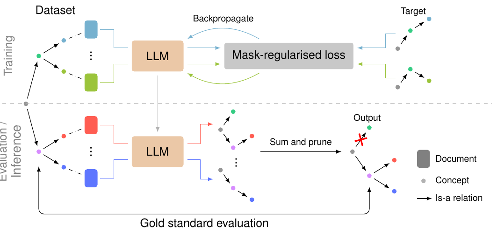
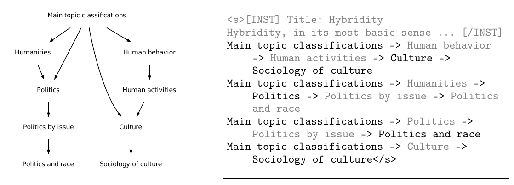

# LLM으로 온톨로지를 처음부터 끝까지 학습하기 — OLLM 논문 읽기

> Andy Lo, Albert Q. Jiang, Wenda Li, Mateja Jamnik, *End-to-End Ontology Learning with Large Language Models*, NeurIPS 2024
> (University of Cambridge / University of Edinburgh) · [코드·데이터셋](https://github.com/andylolu2/ollm)

이 글은 위 논문을 함께 읽으며 나눈 대화를 정리한 것이다. 온톨로지 학습을 "하위작업의 조합"이 아니라 "문서 → 부분 그래프(subgraph) 생성"이라는 하나의 end-to-end 문제로 재정의한 **OLLM**을 중심으로, 정답 데이터를 어떻게 구했는지, 이 방법이 왜 "추출"이 아니라 "생성"인지, 그리고 새로 제안된 평가 지표들이 무엇을 재는지까지 차례로 살펴본다.

---

## 1. 왜 이 논문이 필요한가

### 1) 온톨로지, 그리고 손이 많이 가는 문제

온톨로지는 도메인 지식을 개념(concept)과 관계(relation)로 구조화한 것이다. 위키피디아 카테고리처럼 개념과 소수의 taxonomic 관계(is-a 등)만 있는 단순한 것부터, Schema.org처럼 공리(axiom)와 여러 종류의 관계를 갖는 복잡한 것까지 폭이 넓다. 딥러닝 모델이 지식을 가중치 안에 암묵적으로 담는 것과 달리, 온톨로지는 지식을 **구조적이고 명시적으로** 표현하기 때문에 신뢰할 수 있고, 편집이 쉽고, 사람이 해석할 수 있다. 이런 장점 덕분에 엔티티 랭킹, 정보 검색, 시맨틱 웹 등 실무에서 널리 쓰인다.

문제는 온톨로지를 사람이 직접 만들려면 수작업이 많이 든다는 것이다. **온톨로지 학습(Ontology Learning, OL)**은 이 구축 과정을 대규모로 자동화하려는 연구 분야다. 단순한 온톨로지라면 소스 코퍼스로부터 개념과 taxonomic 관계를 발견해내는 작업에 해당한다. 이 논문은 도메인에 독립적이면서 확장 가능하고 더 나은 온톨로지를 만드는 방법을 목표로 한다. 참고로 이 논문은 개념과 taxonomic 관계(is-a, is-subclass-of)만 다룬다. 제약이나 공리, 비-taxonomic 관계는 대상이 아니고, 온톨로지의 **핵심 골격(taxonomic backbone)**만 만든다. 그래서 엄밀히는 택소노미 생성이라고 보는 편이 정확하다.

### 2) 기존 접근과 그 한계

전통적으로 OL은 여러 **하위작업(subtask)의 조합**으로 다뤄졌다. 예컨대 "개념 발견(concept discovery) → 관계 추출(relation extraction)"으로 파이프라인을 나누는 식이다. 최신 LLM이 이런 하위작업 각각을 꽤 잘 푼다는 것도 선행 연구로 확인되었다. 하지만 이 방식에는 두 가지 약점이 있다. 첫째, 하위작업을 따로 잘 푼다고 해서 그것이 최종 온톨로지의 품질로 직결된다는 보장이 없다 — 하위작업 간 상호작용을 잡지 못한다. 둘째, 관계 예측이 개념 쌍마다 이루어져 계산량이 개념 수의 제곱으로 늘어나기 때문에, 대규모 온톨로지로 확장하기 어렵다.

그래서 이 논문은 온톨로지를 하위작업으로 쪼개지 않고 **end-to-end로** 구축하는 방법을 세우고, 세 가지 연구 질문에 답한다: (1) LLM의 지식 기반을 활용해 온톨로지를 처음부터(from scratch) 어떻게 만들 것인가, (2) 이 방법이 실용적 규모까지 효율적으로 확장되는가, (3) 새로운 도메인에 얼마나 잘 일반화되는가.

---

## 2. OLLM의 핵심 아이디어



*OLLM 파이프라인. 학습(위)에서는 문서에 달린 관련 개념 주석을 이용해 LLM이 대상 온톨로지의 관련 subgraph를 모델링하도록 커스텀 정규화와 함께 학습한다. 추론(아래)에서는 문서마다 생성된 subgraph를 합산하고 pruning해 최종 온톨로지를 만든다.*

OLLM의 핵심은 개념 추출과 관계 추출을 별도 하위작업으로 분리하던 기존 방식과 달리, LLM이 **subgraph 자체(개념 노드 + 관계 엣지가 이미 들어있는 구조)를 곧바로 문자열로 생성**한다는 것이다. 즉 "subgraph를 만든다 = 개념과 관계를 동시에 만든다"이지, subgraph를 먼저 만들고 나서 다시 파싱해 개념·관계를 뽑아내는 게 아니다. 개별 엣지가 아니라 subgraph를 통째로 모델링하기 때문에, 세 개 이상의 노드 사이 상호작용 같은 고차 구조까지 배울 수 있다. 이 "한 번에 통째로 모델링한다"는 점이 논문에서 말하는 end-to-end의 의미다.

전체 흐름을 정리하면 이렇다. 문서마다 → LLM이 개념·관계가 포함된 subgraph를 통째로 생성 → 전 문서의 subgraph를 가중치 합산 → self-loop 제거, 역방향 엣지 정리, 임계값 pruning → 최종 택소노미. 여기서 "문서 하나 → subgraph 하나"는 단발 생성이지만, "코퍼스 전체 → 온톨로지 하나"는 여러 생성 결과를 모으는 집계 과정이다.

---

## 3. 정답 택소노미는 어디서 구했나

OLLM은 LLM을 파인튜닝해서 이 과정을 구현한다. 그러면 학습에 쓸 정답, 즉 "이 문서에 대응하는 정답 subgraph"는 어떻게 마련했을까? 결론부터 말하면 **정답 택소노미를 새로 만든 게 아니라, 이미 존재하는 구조화된 지식을 정답으로 빌려왔다.**

### 1) 전역 정답 그래프의 출처

Wikipedia의 **카테고리 체계**를 그대로 정답으로 쓴다. 루트 카테고리인 "Main topic classifications"에서 시작해 BFS로 깊이 3까지 훑어 전체 카테고리 그래프(개념 13,886개, 관계 28,375개, 문서 362,067개)를 만든다. 이 위키피디아 카테고리 계층 자체가 사람들이 오랫동안 쌓아온 준-택소노미라서, 이걸 "정답 온톨로지"로 간주하는 것이다. arXiv 실험에서는 arXiv가 공식으로 제공하는 분류체계를 정답으로 쓴다(개념 161개, 관계 166개, 문서 126,001개).

### 2) 문서와 개념의 연결(annotation)

여기서 중요한 점은 문서의 개념 집합 C를 **문서에서 "추출"하는 게 아니라는** 것이다. 어떤 모델이나 알고리즘이 본문을 읽고 개념을 뽑아내는 과정이 없다. C는 플랫폼이 이미 갖고 있는 카테고리 메타데이터를 그대로 가져온 것이다.

데이터 수집 방향이 사실 반대다. 논문은 문서를 먼저 고른 뒤 그 문서의 카테고리를 찾는 게 아니라, **카테고리에서 출발해 문서를 수집**한다. 각 카테고리에 대해 그 카테고리에 속한 페이지(제목+요약)를 최대 5,000개씩 가져온다. 그러면 "이 카테고리 → 이 문서들"이라는 매핑이 나오고, 이걸 문서 관점으로 뒤집으면 "이 문서 → 이 카테고리들"이 된다. 이 카테고리 집합이 바로 C다. arXiv도 같은 원리로, 저자들이 제출할 때 붙이는 arXiv 카테고리(cs.LG 등)를 그 논문의 C로 쓴다.

### 3) 문서별 정답 subgraph 잘라내기



*위키피디아 "Hybridity" 문서에 대해 유도된 정답 subgraph(왼쪽, N=4, C={Politics and race, Sociology of culture}). 오른쪽은 대응되는 학습 텍스트 시퀀스로, 회색으로 표시된 부분은 학습 타깃에서 무시되지만 뒤 토큰의 문맥으로는 여전히 존재한다.*

문서별 정답 택소노미는 전역 정답 그래프를 **슬라이스**해서 만든다. 문서의 개념 집합 C가 주어지면, 전역 그래프에서 **루트로부터 C에 속한 각 개념까지 이르는 경로(길이 최대 N)**를 모두 모으고, 그 경로들에 등장하는 노드·엣지의 합집합을 그 문서의 정답 subgraph로 정의한다. 위 Figure 2의 "Hybridity" 예시가 그것으로, C={Politics and race, Sociology of culture}이고 관련 경로는 `Main topic classifications → Politics → Politics by issue → Politics and race` 같은 것들이다. Wikipedia는 N=4, arXiv는 N=3을 쓴다.

즉 연구진이 한 일은 이 전역 정답 그래프에서 문서마다 관련 경로만 잘라내 (문서 → subgraph) 학습쌍을 자동 생성한 것이다. 사람 손으로 문서별 정답을 만든 게 아니라는 점이 데이터 확장성을 가능하게 했다. 그리고 C는 오직 이 학습용 정답 subgraph를 만들기 위한 앵커로만 쓰이며, 파인튜닝이 끝난 뒤 **추론 단계에서는 필요 없다.** 새 문서를 넣으면 모델이 학습한 대로 곧바로 경로(subgraph)를 생성하기 때문이다. 기존의 개념 발견이라는 하위작업을 정답 라벨로 우회해 버린 셈이다.

한 가지 덧붙이면, train/test 분리 때도 단순히 문서를 랜덤 분할하지 않는다. **정답 그래프 자체를 train/val/test로 먼저 나눈 뒤** 각 부분에서 문서-subgraph 쌍을 생성한다. 그래야 테스트에 "학습 때 못 본 개념"이 충분히 들어가서, 모델이 단순 암기가 아니라 진짜 일반화를 하는지 평가할 수 있기 때문이다.

---

## 4. "추출"이 아니라 "생성"이다

### 1) subgraph의 노드는 문서에 없을 수 있다

정답 subgraph를 자세히 들여다보면 흥미로운 사실이 드러난다. **정답 subgraph의 노드 상당수는 문서 본문에 등장하지 않는다.** 진짜 이유는 "중간(조상) 노드" 때문이다. subgraph는 루트에서 C의 개념까지 이어지는 경로들로 만들어지는데, 이 경로의 **중간에 끼어 있는 상위 개념들**이 문서에 없을 노드다. 앞의 "Hybridity" 예를 보면, 문서의 개념은 C={Politics and race, Sociology of culture}인데 정답 경로는 `Main topic classifications → Politics → Politics by issue → Politics and race`이다. 여기서 "Politics", "Politics by issue", "Main topic classifications" 같은 조상 노드는 Hybridity 문서 본문에 거의 확실히 안 나온다. 이 노드들은 모델이 **문서에서 추출하는 게 아니라 자기 지식으로 채워 넣어야** 하는 부분이다.

심지어 C의 개념조차 문서에 문자 그대로 없을 수 있다. C는 위키피디아 카테고리 메타데이터에서 온 것이라, "Sociology of culture"라는 카테고리에 속한 문서라도 그 문구가 본문(제목+요약)에 직접 나온다는 보장은 없다.

### 2) 문서로 조건화된 지식 기반 생성

그래서 OLLM이 하는 일은 문서에서 개념 문자열을 찾아 잘라내는 추출(extraction)이 아니다. subgraph의 많은 노드가 텍스트에 없다는 건, OLLM이 "문서에서 관계를 뽑아내는 추출기"가 아니라 **LLM의 내부 지식으로 계층 구조를 생성하는 모델**이라는 뜻이다. 논문의 첫 번째 연구 질문이 "어떻게 LLM의 지식 기반을 활용해 온톨로지를 처음부터 구축할 것인가"인 이유가 여기 있고, 파인튜닝 없이 프롬프팅만으로도 어느 정도 성능이 나오는 것도 LLM이 이런 상위 계층 지식을 이미 알고 있기 때문이다.

다만 문서 내용이 무시되는 것은 아니다. 문서(제목+요약)는 모델이 **택소노미의 어느 영역을 그려야 하는지 결정하는 조건(conditioning)**이다. 같은 모델이라도 "Hybridity" 문서를 넣으면 정치·문화 쪽 경로를, 물리학 논문을 넣으면 과학 쪽 경로를 생성한다. 문서는 "무엇에 관한 계층을 그릴지"를 지정하는 앵커 역할을 하고, 모델의 지식은 "그 계층이 실제로 어떤 상위 구조를 갖는지"를 채운다. 그래서 순수한 조회(retrieval)도 아니고 순수한 생성도 아닌, **문서로 조건화된 지식 기반 생성**이라고 보는 게 가장 정확하다.

### 3) 그렇다면 새 도메인에서는 위키피디아 편향이 지배하지 않을까

여기서 자연스러운 우려가 생긴다. 위키피디아로 학습한 모델을 새 문서 집합에 그대로 쓰면, 결과 택소노미는 문서 집합 자체의 특성보다 위키피디아의 영향을 크게 받지 않을까? 대체로 맞는 우려다. 위키피디아로 파인튜닝된 모델은 위키피디아의 개념 집합, 계층 구조, 명명 스타일까지 내재화한다. 상위·중간 개념은 문서가 아니라 모델 지식에서 나오니, 그 지식이 위키피디아라면 결과도 위키피디아색이 짙어질 수밖에 없다.

그래서 논문은 새 도메인에 모델을 그냥 쓰지 않는다. arXiv 실험의 핵심은, 위키피디아 모델을 그대로 적용한 게 아니라 **arXiv 문서-subgraph 쌍 2,048개로 추가 파인튜닝**했다는 점이다(OLLM transfer). 목표 도메인의 특성을 반영하려면 소량이라도 그 도메인의 지도학습 신호가 필요하다는 걸 방법론이 전제하는 셈이다.

전이 후에도 위키피디아 흔적은 남지만, 재구조화된다. 논문이 직접 관찰한 바로는 arXiv용 출력에 위키피디아에서 온 개념들이 들어있되 arXiv 온톨로지에 맞게 재배치되었다. 예를 들어 위키피디아에서 "Life" 밑에 나란히 있던 "Life sciences"와 "Biological evolution"이, arXiv 출력에선 "Life sciences"가 최상위로 올라가고 "Biological evolution"이 그 하위로 붙는 식이다. 즉 개념 어휘는 위키피디아 프라이어에서 오되, 배치 방식은 목표 도메인 쪽으로 상당히 옮겨간다. 이것이 논문이 강조하는 "데이터 효율적 도메인 적응"이다. 다만 여기엔 순환적 제약이 있다. "문서 집합만 있고 기존 택소노미가 전혀 없는" 완전한 신규 도메인에서 문서 내용만으로 순수하게 택소노미를 뽑아내는 것은 이 방법이 곧바로 해결해주지 않는다. 결국 위키피디아 프라이어에 기대거나, 목표 도메인에 이미 존재하는 정답 택소노미가 있어야 하기 때문이다.

---

## 5. subgraph 생성 단계 자세히 보기

이제 문서 하나에서 subgraph를 만들어내는 단계를 처음부터 끝까지 뜯어본다. 크게 네 부분으로 나뉜다.

### 1) 정답 subgraph 정의

문서 하나와 그 문서의 개념 집합 C가 주어졌을 때, 정답 subgraph를 전역 그래프에서 이렇게 잘라낸다. 먼저 **관련 경로(relevant paths)** — 루트에서 출발해 C에 속한 각 개념까지 도달하는, 길이 N 이하의 모든 경로를 모은다. 그다음 **관련 subgraph** — 이 경로들에 한 번이라도 등장한 노드(개념)와 엣지(관계)의 합집합이 그 문서의 정답 subgraph가 된다.

N의 선택도 원칙이 있다. N이 작을수록 subgraph가 작아져 모델이 배우기 쉽지만, 너무 작으면 정답 그래프의 엣지를 다 못 담는다. 그래서 "거의 모든 엣지(>99%)가 적어도 하나의 subgraph에 포함되는 가장 작은 N"을 고른다. Wikipedia는 N=4, arXiv는 N=3이다.

### 2) subgraph를 문자열로 선형화

LLM은 그래프를 직접 다룰 수 없으니 subgraph를 문자열로 바꿔야 한다. 기존 자기회귀 그래프 생성은 임의 노드에서 시작하는 BFS나 DFS 순서를 쓰는데, 이 논문은 그러지 않고 **subgraph를 만들어낸 "관련 경로들의 리스트" 그대로를 표현**으로 쓴다. 각 경로는 `->`로 노드를 이어 한 줄로 쓰고, 여러 경로를 줄바꿈으로 나열한다.

이 선택의 근거는 세 가지다. 첫째, subgraph가 애초에 이 경로들로부터 정의되었으니 가장 자연스러운 표현이다. 둘째, 각 경로의 "상위→하위" 계층 순서가 온톨로지의 계층적 성격에 맞는 바람직한 귀납 편향(inductive bias)이 된다. 셋째, 경로 기반 표현은 자연어 지시로 설명하기 쉬워서, 파인튜닝 없는 프롬프팅 baseline도 그럴듯한 결과를 낼 수 있다.

### 3) masked loss로 학습하기

학습 입력-타깃 형식은 Mistral instruct 형식을 따른다. 프롬프트(입력)에는 문서의 제목과 요약이 들어가고, 그 뒤에 정답 경로들이 타깃으로 붙는다(Figure 5 템플릿).

```
<s>[INST]
Title: {{ title }}
{{ abstract }}[/INST]

{{ path | join(" -> ") }}
</s>
```

핵심 트릭은 **masked loss 정규화**다. 그냥 파인튜닝하면 문제가 생긴다. 모든 경로가 루트에서 시작하므로 `Main topic classifications → Academic disciplines` 같은 **상위 관계는 거의 모든 학습 예시에 반복 등장**하는 반면, 말단의 세부 관계는 매우 다양하다. 둘을 같은 비율로 보여주면 모델이 고빈도 상위 관계에 과적합되고 저빈도 하위 관계엔 과소적합된다.

이를 막기 위해, 어떤 관계 $u \to v$가 학습셋에 총 $n$번 등장한다면, 학습 중 이 관계가 나올 때마다 $v$에 해당하는 토큰들의 손실을 다음 확률로 마스킹한다.

$$p_{\text{mask}}(u \to v) = \max\left(1 - \frac{M}{n},\ 0\right)$$

여기서 $M$은 "관계당 평균 등장 횟수"에 해당하는 상수다. 직관적으로, 자주 나오는 관계는 학습 전체에서 대략 $M$번만 타깃으로 반영되도록 억제하는 것이다. $n$이 크면(자주 나오는 관계) 마스킹 확률이 1에 가까워 거의 학습되지 않고, $n \le M$이면(드문 관계) 확률이 0이 되어 항상 학습된다. 중요한 점은, $v$가 타깃에서 마스킹되어도 $v$의 토큰은 입력 시퀀스에는 그대로 남아(Figure 2 오른쪽의 회색 텍스트) 뒤 토큰의 문맥 역할을 한다는 것이다. 만약 이 처리를 하지 않고 $v$를 아예 시퀀스에서 지워버리면 경로의 연결성이 깨지므로, "타깃에서만 빼고 문맥으로는 남긴다"는 설계가 필요하다. 이 정규화가 일반화를 크게 끌어올린다.

학습 설정은 다음과 같다. 베이스 모델은 Mistral 7B v0.2(instruct 아님)이고, 모든 어텐션·FFN 층에 LoRA(r=32, α=16)를 붙여 2 에폭(약 17K 스텝), 배치 16, 문맥 길이 2048, Adam(lr 1e-5)으로 학습한다. Wikipedia 기준 A100 12시간이 든다.

### 4) 추론: 문서 → subgraph 생성

학습이 끝나면, 새 문서의 제목+요약을 위 프롬프트 형식(`[INST] ... [/INST]`까지)으로 넣고 모델이 그 뒤 경로 리스트를 자기회귀적으로 생성한다. 실제로 모델이 출력하는 건 그래프 구조가 아니라 다음과 같은 **경로들의 문자열**이다.

```
Main topic classifications -> Politics -> Politics by issue -> Politics and race
Main topic classifications -> Culture -> Sociology of culture
```

temperature 0.1, nucleus sampling top-p 0.9로 샘플링하며, vLLM 서버로 초당 약 10개 문서를 처리한다. 이 출력 문자열을 파싱하면 그 문서의 subgraph(노드=개념, 엣지=관계)가 된다.

---

## 6. subgraph를 합쳐 온톨로지로 — pruning

여기까지가 "문서 하나 → subgraph 하나" 단계다. 최종 택소노미는 코퍼스의 모든 문서에 대해 이 생성을 반복한 뒤 그 결과를 합치고 다듬어 만든다. pruning이 등장하는 곳이 바로 여기다.

### 1) 가중 합산

문서마다 생성된 subgraph들 $G_1=(V_1,E_1), \dots, G_n=(V_n,E_n)$을 먼저 합집합으로 모은다. 이걸 raw 그래프라 부른다.

$$G_{\text{raw}}=(V_{\text{raw}}, E_{\text{raw}}), \quad V_{\text{raw}}=\bigcup_{i} V_i, \quad E_{\text{raw}}=\bigcup_{i} E_i$$

핵심은 그냥 합치는 게 아니라, 각 엣지 $(u,v)$가 **전체 subgraph들에서 몇 번 등장했는지를 가중치로 기록**한다는 점이다.

$$w(u,v)=\sum_{i=1}^{n}\mathbb{1}\big[(u,v)\in E_i\big]$$

직관적으로, 여러 문서가 반복해서 만들어낸 관계일수록 가중치가 높아지고 이는 "그 관계가 널리 지지받는 믿을 만한 관계"라는 신호가 된다. 반대로 한두 문서에서만 우연히 나온 관계는 가중치가 낮다. 이 가중치가 사실상 "여러 문서에 걸친 합의(voting)" 역할을 하고, 곧이어 pruning의 판단 기준이 된다.

### 2) 다섯 단계 pruning

가중 raw 그래프에 다음 단계들을 순서대로 적용해 최종 택소노미를 만든다.

1. **Self-loop pruning**: $(u,u)$ 형태의 자기 자신을 가리키는 엣지를 모두 제거한다.
2. **Inverse-edge pruning**: $(u,v)$와 $(v,u)$가 둘 다 있으면(양방향), 가중치가 더 낮은 쪽을 지운다. 즉 $w(v,u) > w(u,v)$이면 $(u,v)$를 제거해 더 무거운 쪽 단방향으로 만든다. is-a 관계는 방향성이 있어야 하니 방향 충돌을 해소하는 단계다.
3. **Absolute thresholding (α)**: 가중치가 전체에서 하위 α 분위수 아래인 엣지를 모두 제거한다. **전역적으로** 덜 중요한 엣지를 쳐낸다.
4. **Relative thresholding (β)**: 각 노드 $u$에서 나가는 엣지들을 가중치 오름차순으로 정렬하고, 누적 가중치 비율 $C(e_i)=\sum_{j\le i} w(e_j) / \sum_j w(e_j)$을 계산해 $C(e_i) \le \beta$인 하위 엣지들을 제거한다. 언어 생성의 top-p(nucleus) 샘플링과 같은 발상으로, 그 노드의 이웃들 중 상대적으로 덜 중요한 엣지를 걷어낸다. 3번이 절대 기준이라면 4번은 각 노드 내부의 상대 기준이라는 점이 다르다.
5. **Cleanup**: 위 과정을 거쳐 들어오거나 나가는 엣지가 하나도 없어진 고립 노드를 제거한다.

pruning 강도를 정하는 α와 β는 임의로 정하지 않고, **검증셋에서 Continuous F1을 최대화**하도록 그리드 서치로 고른다. 참고로 이 후처리는 OLLM만이 아니라 Hearst·REBEL·프롬프팅 등 모든 baseline에도 동일하게 적용해 비교의 공정성을 맞춘다.

---

## 7. 온톨로지를 어떻게 평가할까 — 새 지표들

온톨로지 평가는 어려운 문제다. "좋은 온톨로지"의 정량적 정의가 없고, 대부분의 지표는 한 측면(구조 또는 의미)만 잡는다. 게다가 기존 평가는 개념 이름을 글자 그대로 매칭하는 데 의존해, 두 온톨로지가 애초에 비슷하지 않으면 신뢰도가 떨어진다. 이 논문은 정답을 "좋은 온톨로지의 대리(proxy)"로 삼고, 사전학습 텍스트 임베딩과 그래프 기법을 써서 의미와 구조를 각각 재는 다섯 지표를 제안한다. 서로 다른 측면을 잡도록 상호보완적으로 설계했다. 정답 그래프를 $G=(V,E)$, 생성 그래프를 $G'=(V',E')$로 둔다.

### 1) Literal F1 — 기준용 sanity check

가장 단순하고 해석이 쉬운 참고용 지표다. 엣지를 글자 그대로 일치하는지로 비교한다.

$$\text{Literal precision}=\frac{|E\cap E'|}{|E'|}, \qquad \text{Literal recall}=\frac{|E\cap E'|}{|E|}$$

정확한 표현을 강하게 요구하기 때문에 신뢰도는 낮지만, 가장 직관적이라 제대로 돌아가는지 확인하는 기준선으로만 쓴다.

### 2) Fuzzy F1 — 의미 기반, 임베딩 매칭

동의어나 유사 표현을 틀렸다고 벌하지 않기 위해, 문자 일치 대신 **문장 임베딩의 코사인 유사도**로 개념을 비교한다. 두 개념 $u, u'$의 유사도를 $\text{NodeSim}(u,u')\in[-1,1]$이라 하면, 생성 그래프의 엣지 $(u',v')$는 정답 그래프에 양 끝점이 각각 임계값 $t$를 넘게 매칭되는 엣지가 존재할 때 맞은 것으로 친다.

$$\text{Fuzzy precision}=\frac{\big|\{(u',v')\in E' \mid \exists(u,v)\in E.\ \text{NodeSim}(u,u')>t \land \text{NodeSim}(v,v')>t\}\big|}{|E'|}$$

Recall은 정답과 생성을 뒤바꾼 대칭 형태다. 임베딩 모델은 all-MiniLM-L6-v2를 쓰고, 임계값 $t$는 **WordNet 동의어 쌍들의 코사인 유사도 중앙값인 0.436**으로 정한다(즉 동의어 수준이면 같은 개념으로 인정). 이로써 표현이 달라도 의미가 같으면 점수를 받는다.

### 3) Continuous F1 — 의미 기반, 최적 매칭

Fuzzy F1에는 허점이 있다. 임계값만 넘으면 매칭을 인정하니 매칭이 일대일이 아니게 되어, 예컨대 `A→B`와 `B←A→B'`(B와 B'가 fuzzy하게 매칭)처럼 실제론 다른 두 그래프가 만점을 받을 수 있다. Continuous F1은 이를 **두 그래프 사이 최고 점수의 엣지 일대일 매칭**을 구해 해결한다. 엣지 $(u,v)$와 $(u',v')$의 유사도는 두 끝점 유사도 중 더 낮은 쪽으로 정의한다(둘 다 잘 맞아야 높은 점수).

$$\text{sim}\big((u,v),(u',v')\big)=\min\big(\text{NodeSim}(u,u'),\ \text{NodeSim}(v,v')\big)$$

이 조건에서 최고 점수 매칭을 찾는 건 선형 할당 문제(linear assignment problem)이고 헝가리안 알고리즘으로 푼다. 그 최적 매칭 점수를 $s_{\text{cont}}$라 하면 Continuous precision은 $s_{\text{cont}}/|E'|$, recall은 $s_{\text{cont}}/|E|$이다. 일대일 제약 덕분에 Fuzzy F1의 중복 매칭 문제가 사라지고, 점수가 연속적이라 튜닝 신호로도 쓸 수 있다. 실제로 논문은 pruning 하이퍼파라미터 α, β를 이 Continuous F1 기준으로 튜닝한다.

### 4) Graph F1 — 구조 기반, 이웃 구조 반영

앞의 세 지표는 개별 엣지 단위라 더 넓은 구조를 못 본다. Graph F1은 "한 개념이 자기 지역 이웃과 어떻게 연결되어 있는가"를 잡으려 한다. 각 노드를 사전학습 임베더로 임베딩한 뒤, **단순 그래프 컨볼루션(simple graph convolution, K=2)**을 적용해 이웃 정보가 섞인 graph-aware 노드 임베딩을 만든다. 이 임베딩을 두 그래프 간 코사인 유사도로 비교하고, Continuous F1처럼 최고 점수의 노드 일대일 매칭을 구해 점수 $s_{\text{graph}}$를 얻는다(precision은 $s_{\text{graph}}/|V'|$, recall은 $s_{\text{graph}}/|V|$). 노드의 이름뿐 아니라 그 노드가 놓인 주변 구조까지 비슷해야 높은 점수가 나온다.

### 5) Motif distance — 구조 기반, 전역 구조 무결성

마지막은 다섯 지표 중 유일하게 개념 이름을 전혀 보지 않고 그래프의 "모양"만 비교하는 순수 구조 지표다. **Network motif**는 큰 그래프 안에서 반복적으로 나타나는 작은 부분 구조로, 보통 노드 3개짜리 연결된 subgraph를 쓴다. 노드 3개를 골랐을 때 그들이 어떤 패턴으로 연결되어 있는지를 유형별로 분류하는데, 온톨로지는 방향 그래프이므로 방향까지 고려한다. 대표적인 3-노드 패턴을 단순화하면 이렇다.

- **경로(path/chain)**: `A→B→C` — 계층이 한 줄로 깊게 이어짐. 택소노미의 전형적 모양.
- **분기(fork/out-star)**: `A→B`, `A→C` — 한 부모가 여러 자식을 가짐.
- **수렴(collider/in-star)**: `A→C`, `B→C` — 여러 부모가 한 자식을 공유.

(실제 방향 그래프에는 연결된 3-노드 유형이 13가지 있지만, 이해를 위해 위 세 가지로 단순화한다.) 핵심 직관은, 건강한 택소노미는 경로와 분기가 풍부한 반면, 모든 개념을 한 부모 밑에 몰아넣은 납작한 그래프는 분기(fork)만 잔뜩 나온다는 것이다. 그래서 3-노드 패턴의 **분포**를 비교하면 두 그래프의 구조적 성격이 얼마나 비슷한지 알 수 있다.

Motif distance는 정답 그래프 $G$와 생성 그래프 $G'$에서 모든 3-노드 subgraph의 분포 $P, Q$를 구한 뒤, 그 사이의 **total variation distance**로 정의한다. 0(완전히 같은 분포)에서 1(완전히 다름) 사이 값이고, **낮을수록** 좋다.

$$\text{MotifDist}=\text{TV}(P,Q)=\frac{1}{2}\sum_i |P_i - Q_i|$$

#### 예제로 계산해보기

**정답 그래프 G** (제대로 된 계층): 노드 R(루트), A, B, C, D / 엣지 `R→A, R→B, A→C, A→D`. 노드 3개 조합 중 연결된 subgraph만 세어 유형을 분류하면, {R,A,B}=분기, {R,A,C}=경로, {R,A,D}=경로, {A,C,D}=분기이다(나머지 조합은 노드끼리 엣지가 없어 연결이 끊기므로 제외). 즉 경로 2개, 분기 2개.

$$P = (\text{경로}=0.5,\ \text{분기}=0.5,\ \text{수렴}=0)$$

**생성 그래프 G' (나쁜 예 — 납작한 star)**: 모델이 모든 개념을 루트 밑에 붙임. 엣지 `R→A, R→B, R→C, R→D`. R을 포함한 3-노드 조합 6가지는 전부 `R→x, R→y` 형태라 모두 분기다.

$$Q = (\text{경로}=0,\ \text{분기}=1.0,\ \text{수렴}=0)$$

$$\text{TV}(P,Q)=\frac{1}{2}\big(|0.5-0|+|0.5-1.0|+|0-0|\big)=\frac{1}{2}(0.5+0.5)=0.5$$

Motif distance 0.5로 매우 크다. 계층의 깊이(경로)가 통째로 사라지고 죄다 분기만 남아 구조가 완전히 달라졌다는 뜻이다. 개념 이름은 똑같아도 모양이 다르면 벌점을 받는다.

**생성 그래프 G'' (좋은 예 — 비슷한 계층)**: 엣지 `R→A, R→B, A→C, B→D`. 연결된 3-노드 subgraph는 {R,A,B}=분기, {R,A,C}=경로, {R,B,D}=경로로 경로 2개, 분기 1개.

$$\text{TV}(P,Q'')=\frac{1}{2}\big(|0.667-0.5|+|0.333-0.5|\big)\approx 0.167$$

같은 노드 수여도 계층 구조가 정답과 닮았기 때문에 거리가 훨씬 작다(0.167 vs 0.5).

이 지표가 중요한 이유는, Fuzzy F1만 봤다면 프롬프팅도 괜찮아 보였겠지만 Motif distance가 그 구조적 허점을 잡아내기 때문이다. 하나의 완벽한 지표가 없기에, 서로 다른 측면을 잡는 상호보완적 지표들을 함께 보고 판단하려는 것이 논문의 의도다.

---

## 8. 결과

아래는 Wikipedia에서 OLLM과 주요 baseline을 비교한 표다(논문 Table 1에서 발췌). ↑는 높을수록, ↓는 낮을수록 좋다. 각 열에서 가장 좋은 값을 **굵게** 표시했다.

| 방법 | Literal F1 ↑ | Fuzzy F1 ↑ | Cont. F1 ↑ | Graph F1 ↑ | Motif Dist. ↓ |
|---|---|---|---|---|---|
| Memorisation | **0.134** | 0.837 | 0.314 | 0.419 | 0.063 |
| Hearst | 0.003 | 0.538 | 0.350 | 0.544 | 0.163 |
| REBEL | 0.004 | 0.624 | 0.356 | 0.072 | 0.132 |
| Three-shot (프롬프팅) | 0.031 | 0.880 | 0.475 | 0.622 | 0.354 |
| Finetune (마스킹 없음) | 0.124 | 0.884 | 0.470 | 0.588 | **0.050** |
| **OLLM** | 0.093 | **0.915** | **0.500** | **0.644** | 0.080 |

여기서 Hearst와 REBEL은 관계 추출 기반 전통 baseline인데, 논문은 이들에게 **정답 개념을 미리 제공하는** 큰 이점까지 주었다. 그럼에도 OLLM은 의미 지표(Fuzzy/Continuous/Graph F1)에서 모두 최고를 기록한다. 특히 눈여겨볼 점은 프롬프팅 방법(Three-shot 등)이 Motif distance에서 0.354로 나쁘다는 것이다 — 개념 이름은 그럴듯해도(Fuzzy F1 0.880) 그래프 모양이 엉성하다는 뜻이다. 반면 파인튜닝한 Finetune·OLLM은 0.050·0.080으로 확 낮아진다. "LLM을 그냥 프롬프팅해서 쓰면 구조 무결성이 떨어지지만 파인튜닝으로 해결된다"는 주장이 이 지표로 드러난다.

arXiv 실험에서도 OLLM(transfer)은 Fuzzy F1 0.570, Continuous F1 0.357, Graph F1 0.633으로 차선(각각 0.460, 0.290, 0.546)을 크게 앞선다. 단 2,048개 샘플만으로 새 도메인에 적응했다는 점, 그리고 위키피디아에서 배운 개념을 arXiv 스타일에 맞게 재구조화했다는 점이 이 실험의 핵심이다. 계산 비용도 Wikipedia 온톨로지 생성에 학습 12 A100-시간, 추론 7 A100-시간으로 현대 기준 modest한 수준이어서 확장성을 입증한다.

---

## 9. 한계와 맺음말

이 방법에는 짚어둘 제약이 있다. 가장 근본적인 것은 앞서 논의한 **도메인 프라이어 의존성**이다. 기존 택소노미가 전혀 없는 완전한 신규 도메인에서, 문서 집합의 내용만으로 순수하게 택소노미를 뽑아내는 문제는 이 방법이 곧바로 풀어주지 않는다. 위키피디아 프라이어에 기대거나 목표 도메인의 소량 정답 데이터가 있어야 한다. 또 생성된 그래프가 비순환(acyclic)임을 보장하지 않아 논리적으로 일관되지 않은 관계가 생길 수 있는데, 논문은 후처리로 사이클을 제거해 완화한다(Wikipedia에서 10,414개 엣지 중 26개만 제거하면 사이클이 사라졌다고 보고한다).

정리하면 OLLM은 온톨로지 학습을 하위작업 조합이 아닌 **end-to-end subgraph 생성 문제**로 재정의했고, 빈도 기반 masked loss 정규화로 일반화를 개선했으며, 임베딩·그래프 기반의 새 평가 지표를 함께 제시한 연구다. LLM은 문서에서 개념·관계를 추출하는 게 아니라, 문서를 조건으로 삼아 자신이 아는 계층 지식을 택소노미 형태로 생성한다 — 이 관점의 전환이 논문 전체를 관통하는 핵심이다.
