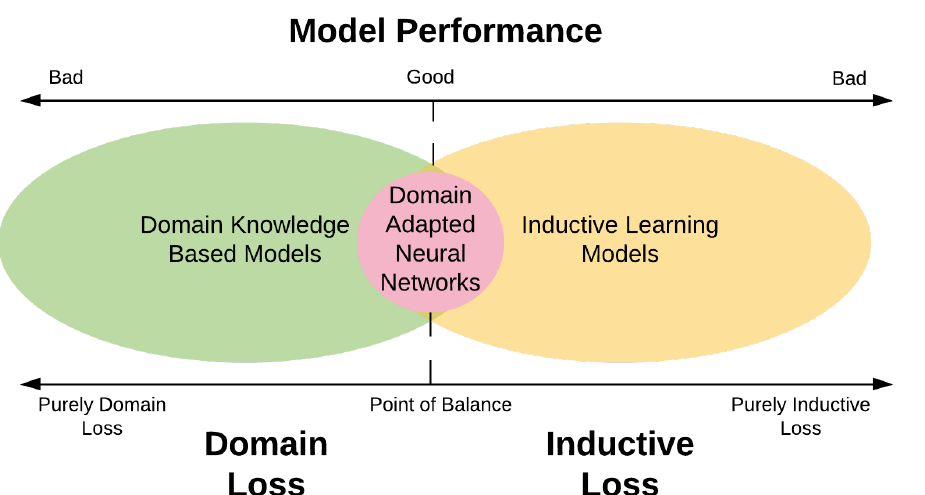
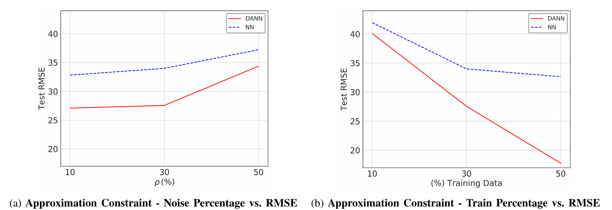
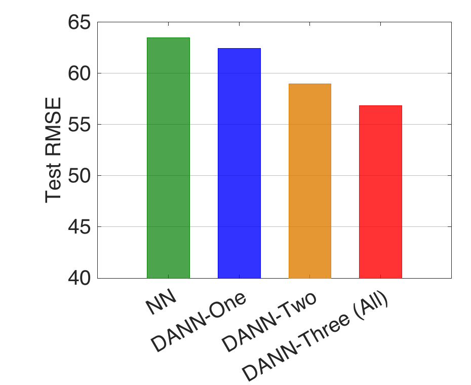

# 도메인 지식을 손실 함수에 넣는다는 것 — DANN 논문 읽기

> **Incorporating Prior Domain Knowledge into Deep Neural Networks**
> Nikhil Muralidhar, Mohammad Raihanul Islam, Manish Marwah, Anuj Karpatne, Naren Ramakrishnan
> *2018 IEEE International Conference on Big Data (Big Data), pp. 36–45*

물리 법칙을 신경망에 알려주는 방법으로 "손실 함수에 항을 하나 더 붙인다"는 접근이 있다. 이 논문은 그 아이디어를 가장 단순한 형태로 구현하고 실험한 초기 작업 중 하나다. ReLU 하나로 도메인 제약을 표현하는 트릭이 깔끔해서 읽을 가치가 있고, 동시에 그 손실항이 **실제로 언제 일을 하는가**를 따져 들어가면 이 접근의 한계도 선명하게 드러난다. 아래는 논문의 메커니즘을 뜯어보고, 마지막에 그 한계까지 밀어붙여 본 기록이다.

---

## 1. 이 논문이 서 있는 자리

### 1) 문제의식

딥러닝의 성공은 "데이터가 충분하다"는 전제 위에 서 있다. 하지만 발전소·원자로 같은 물리 인프라에서는 데이터가 세 방향으로 부족하다.

- **제한적이다** — 시스템이 운전 최적점 근처에서만 돌아가니, 그 바깥 구간의 데이터를 모으려면 비싸거나 위험하거나 아예 불가능하다.
- **비싸다** — 제조 설비에서는 데이터 수집 자체가 공정을 방해하거나 파괴 검사를 요구한다.
- **품질이 나쁘다** — 노후 장비와 레거시 부품 탓에 결측·손상·노이즈가 일상이다.

그래서 논문은 이렇게 묻는다. 이런 상황에서 도메인 지식이 부족한 데이터를 보완할 수 있는가?

### 2) 순수 귀납과 순수 도메인 사이



*Figure 1. 양 극단 — 왼쪽은 도메인 지식만으로 하드코딩한 모델, 오른쪽은 데이터만으로 배우는 순수 귀납 모델. 둘 다 성능이 나쁘고, DANN은 그 사이 균형점을 노린다.*

한쪽 끝에는 아무 사전 지식 없이 데이터에서 전부 유도하는 "백지(tabula rasa)" 학습이 있고, 반대쪽 끝에는 전문가가 모든 것을 수작업으로 하드와이어링하는 접근이 있다. 양 극단이 나쁘다는 데는 대체로 합의가 있지만, 최적점이 어디인지는 불분명하다. 딥러닝에서 도메인 지식은 보통 **아키텍처 선택**으로 들어간다 — 이미지에는 병진 불변성이 있으니 CNN, 순차 구조에는 RNN. 하지만 이런 사례들은 모두 데이터가 풍부한 상황이다.

DANN(Domain Adapted Neural Networks)은 아키텍처가 아니라 **손실 함수**를 통해 지식을 주입한다.

---

## 2. 전체 손실 함수

### 1) 세 항의 조합

$$\arg\min_f \; Loss(Y,\hat{Y}) + \lambda_D \, Loss_D(\hat{Y}) + \lambda R(f)$$

- $Loss(Y,\hat{Y})$ — 일반적인 MSE. 회귀 문제의 귀납적(inductive) 손실이다.
- $Loss_D(\hat{Y})$ — **도메인 손실.** 이 논문의 핵심이며, 학습된 모델이 데이터뿐 아니라 도메인 규칙에도 부합하도록 강제한다.
- $R(f)$ — 모델 복잡도를 억제하는 $L_2$ 정규화.

$\lambda_D$는 도메인 손실의 비중을 정하는 하이퍼파라미터로, 논문은 경험적으로 $\lambda_D = 1.0$을 택했다.

여기서 눈여겨볼 점 하나. **$Loss_D$는 인자로 $\hat{Y}$만 받는다.** 정답 $Y$를 보지 않는다. 이 구조적 성질이 나중에 이 접근의 가능성과 한계를 동시에 결정한다.

논문은 두 종류의 제약을 인코딩한다. 하나씩 보자.

### 2) 베이지안 관점에서

논문 자신이 언급하듯, 손실 함수에 도메인 지식을 더하는 것은 베이지안 관점에서 **사전 분포(prior)를 추가하는 것과 등가**다. 데이터가 말해주지 못하는 부분을 사전 지식이 채운다는 그림이다.

---

## 3. Approximation Constraint — "울타리 밖으로 나갈 때만 벌금"

### 1) 직관

도메인 전문가가 "이 값은 보통 10~20 사이야"라고 말해줬다고 하자. 이걸 손실 함수로 어떻게 옮길까?

가장 단순한 발상은 벌점 함수를 이렇게 정의하는 것이다.

- 예측이 10~20 **안에** 있으면 → 벌점 0 (아무 말 안 함)
- 예측이 8이면 → 벌점 2 (아래로 2만큼 넘음)
- 예측이 25면 → 벌점 5 (위로 5만큼 넘음)

즉 **울타리 안에서는 자유롭게 놀되, 밖으로 나간 거리만큼만 벌금**을 매긴다.

### 2) 수식

전문가가 정상 작동 범위 $[y_l, y_u]$를 준다고 하면, 제약의 함수 형태는 이렇다.

$$g(\hat{Y}) = \begin{cases} 0 & \text{if } \hat{Y} \in [y_l, y_u] \\ |y_l - \hat{Y}| & \text{if } \hat{Y} < y_l \\ |y_u - \hat{Y}| & \text{if } \hat{Y} > y_u \end{cases}$$

그리고 이걸 실제 손실로 옮긴 형태가 다음과 같다.

$$Loss_D(\hat{Y}) = \sum_{i=1}^{m} \text{ReLU}(y_l - y^i) + \text{ReLU}(y^i - y_u)$$

$$\text{ReLU}(z) = z^+ = \max(0, z)$$

### 3) ReLU가 왜 딱 맞는가

$\text{ReLU}(z) = \max(0, z)$는 "양수면 그대로, 음수면 0"이다. 이게 위 규칙과 정확히 같은 모양이다.

- **아래쪽 위반**: $\text{ReLU}(y_l - \hat{y})$ — 예측이 하한보다 작으면 $y_l - \hat{y} > 0$이므로 넘은 거리만큼 벌점. 크면 음수가 되어 0.
- **위쪽 위반**: $\text{ReLU}(\hat{y} - y_u)$ — 반대 방향으로 똑같이.

두 개를 더하면 끝이다. 범위 안에 있으면 두 항 모두 0이라 총 벌점 0. 밖으로 나가면 한쪽만 켜진다. **if 문 세 개짜리 조건부 함수를 조건문 없이 표현한 것**이 트릭의 전부다.

### 4) 왜 굳이 ReLU인가 (그냥 if 쓰면 안 되나)

신경망은 역전파로 학습하니 **미분 가능해야** 한다. ReLU는 미분이 0 아니면 1로 깔끔하고, 이미 모든 딥러닝 프레임워크에 들어 있다. 게다가 그래디언트 방향이 자연스럽다 — 위로 넘쳤으면 "예측을 내려라", 아래로 샜으면 "올려라"는 신호가 자동으로 나오고, 안전 구간에 있으면 그래디언트가 0이라 **아무 간섭도 하지 않는다**.

이 마지막 성질이 중요하다. 도메인 제약이 모델을 특정 값으로 끌어당기는 게 아니라, 상식적인 범위 안에서는 데이터가 하고 싶은 대로 하게 놔둔다. 논문에서 데이터가 늘어날수록 DANN도 계속 좋아지는(제약이 방해하지 않는) 이유가 여기 있다.

---

## 4. Monotonicity Constraint — "순서가 뒤집혔을 때만 벌금"

### 1) 직관

Approximation constraint가 **하나의 예측값**을 보고 "범위 밖이냐"를 따졌다면, monotonicity constraint는 **두 예측값을 짝지어** 보고 "순서가 맞느냐"를 따진다.

물의 산소 용해도 예를 보자. 압력이 높아지면 산소는 더 잘 녹는다. 그러면 같은 물에 대해:

- 압력 그대로 → 예측 $\hat{y}_1$
- 압력 +5 decibar → 예측 $\hat{y}_2$

반드시 $\hat{y}_1 < \hat{y}_2$여야 한다. 정답이 얼마인지 몰라도, **둘 사이의 대소 관계만은 물리학이 보장**한다. 모델이 이걸 뒤집으면 그건 확실히 틀린 것이다.

### 2) 수식 뜯어보기

$$Loss_D(\hat{Y}_1, \hat{Y}_2) = \sum_{i=1}^{m} \underbrace{\mathbb{I}\big((x_1^i < x_2^i) \wedge (\hat{y}_1^i > \hat{y}_2^i)\big)}_{\text{위반한 쌍만 골라내는 필터}} \cdot \underbrace{\text{ReLU}(\hat{y}_1^i - \hat{y}_2^i)}_{\text{뒤집힌 정도}}$$

읽는 순서는 이렇다.

- **입력은 $x_1 < x_2$인데** (전제: 압력이 실제로 더 높은 상황)
- **예측은 $\hat{y}_1 > \hat{y}_2$이면** (모순: 그런데 용해도를 더 낮게 예측)
- **뒤집힌 크기 $\hat{y}_1 - \hat{y}_2$만큼 벌점**

여기서도 원리는 같다. 순서가 맞으면 $\hat{y}_1 - \hat{y}_2 < 0$이라 ReLU가 0을 뱉고, 아무 간섭도 하지 않는다. 뒤집힌 만큼만, 뒤집힌 쌍에만 벌금이 붙는다.

사실 indicator의 $\hat{y}_1 > \hat{y}_2$ 조건은 ReLU와 겹친다 — ReLU가 이미 그 역할을 한다. indicator가 진짜 하는 일은 $x_1 < x_2$인 쌍만 골라내는 것이다.

### 3) 두 제약의 차이

| | Approximation | Monotonicity |
|---|---|---|
| 지식의 형태 | "값이 이 범위 안에" | "A면 B보다 크다" |
| 필요한 것 | 예측 1개 + 범위 | 예측 2개(짝) |
| 전문가가 줘야 할 것 | 구체적 숫자 $y_l, y_u$ | 방향(부호)뿐 |

두 번째 줄이 실무적으로 중요하다. **단조성은 숫자를 몰라도 쓸 수 있다.** "압력 올리면 용해도 올라감" 정도는 전문가가 즉답할 수 있지만, "이 조건에서 용해도는 8.2~9.7 mg/L"는 훨씬 말하기 어렵다. 그래서 뒤에 나올 실험 표에서도 monotonicity 쪽 개선폭이 approximation보다 크게 나온다.

---

## 5. 실험 설정

### 1) 두 데이터셋

**합성 데이터**로는 Bohachevsky 함수를 쓴다.

$$f(x_1, x_2) = k_1 x_1^2 + k_2 x_2^2 + a_1\cos(p_1 \pi x_1) + a_2 \cos(p_2 \pi x_2) + K$$

**실데이터**로는 물의 산소 용해도를 쓴다. North Atlantic and Iceland Basin Biofloat 48 데이터에서 수온 $t$, 염도 $s$, 압력 $p$를 가져와 다음 물리 관계식으로 용해도를 계산한다.

$$f_1 = \alpha_1 + \alpha_2(100/t) + \alpha_3\ln(t/100) - \alpha_4(t/100)$$
$$f_2 = f_1 + s\big(-\alpha_5 + \alpha_6(t/100) - \alpha_7((t/100)^2)\big)$$
$$f(p,s,t) = e^{f_2 (p/100)}$$

산소 용해도는 온도·염도에 반비례하고 압력에 비례한다는 것이 여기 주입되는 도메인 지식이다.

### 2) 노이즈 주입 방식

이 부분이 나중의 논의에서 결정적이다. 논문은 **행 값을 서로 바꿔치기해서** 노이즈를 만든다. Approximation 실험에서는 $x_1$과 $x_2$ 값을 맞바꿔 계산된 $f(x_1,x_2)$가 정상 범위 밖으로 나가게 하고, monotonicity 실험에서는 $y_i$와 $y'_i$를 맞바꿔 단조성이 깨지게 한다. 오염 비율 $\rho$는 10%에서 50%까지 변화시킨다.

즉 **인위적으로 만든 노이즈는 항상 제약을 위반하는 방향**이다. 이 설계가 결과를 어떻게 규정하는지는 6절에서 다시 다룬다.

### 3) 모델과 평가

DANN과 비교 대상 vanilla NN은 **완전히 동일한 아키텍처**를 쓴다. 유일한 차이는 손실 함수에 도메인 항이 있느냐 없느냐다. 60-20-20 분할, RMSE로 평가하며 테스트셋은 항상 노이즈가 없다. 검증셋은 노이즈가 있는 경우와 없는 경우 두 가지로 나눠 실험한다.

---

## 6. 결과

### 1) 전체 요약

논문이 보고한 전 실험 평균 개선폭은 **19.5%**이며, 최저 4%, 최고 42.7%다.

| 제약 | 데이터셋 | 검증셋 | 실험 유형 | 평균 개선율 (DANN over NN) |
|---|---|---|---|---|
| Approximation | Bohachevsky | Noisy | $\rho$ vs. RMSE | 14.67% |
| Approximation | Bohachevsky | Noisy | 학습 데이터 % vs. RMSE | 22.98% |
| Monotonicity | Bohachevsky | Noisy | $\rho$ vs. RMSE | 32.65% |
| Monotonicity | Bohachevsky | Noise-Free | $\rho$ vs. RMSE | **42.70%** |
| Monotonicity | Bohachevsky | Noisy | 학습 데이터 % vs. RMSE | 28.06% |
| Monotonicity | Bohachevsky | Noise-Free | 학습 데이터 % vs. RMSE | 18.32% |
| Monotonicity | O₂ 용해도 | Noisy | $\rho$ vs. RMSE | 7.19% |
| Monotonicity | O₂ 용해도 | Noise-Free | $\rho$ vs. RMSE | 13.18% |
| Monotonicity | O₂ 용해도 | Noisy | 학습 데이터 % vs. RMSE | **4.05%** |
| Monotonicity | O₂ 용해도 | Noise-Free | 학습 데이터 % vs. RMSE | 10.94% |

수치는 모두 RMSE 기준 개선율이므로 높을수록 좋다. 합성 데이터(Bohachevsky)의 개선폭이 실데이터(O₂)보다 일관되게 크다는 점은 눈여겨볼 만하다.

### 2) 노이즈와 데이터 양에 따른 거동



*Figure 2. (a) 노이즈 비율 $\rho$를 10→50%로 변화 (학습 데이터 30% 고정). (b) 학습 데이터 비율을 10→50%로 변화 (노이즈 $\rho$=30% 고정). 빨간 실선이 DANN, 파란 점선이 NN. 낮을수록 좋다.*

여기서 세 가지를 읽을 수 있다.

**첫째, 노이즈가 심할수록 격차가 커진다.** O₂ 실험 기준으로 $\rho$=50%에서 이득이 17%인 반면 $\rho$=10%에서는 8%에 그친다. 노이즈가 적으면 DANN의 이점도 줄어든다.

**둘째, 데이터가 적어도 버틴다.** Fig. 2b에서 RMSE 25라는 임계값을 잡아보면, DANN은 학습 데이터의 약 40%만으로 이를 달성하는 반면 NN은 전량을 써도 그 선을 넘지 못한다. 최소 허용 오차 기준이 있는 실무 상황에서 의미 있는 차이다.

**셋째, 제약이 학습을 방해하지 않는다.** 데이터가 늘어날수록 DANN도 계속 좋아진다. 논문 표현대로 "적용된 도메인 제약이 모델이 유용한 귀납적 신호를 흡수하는 것을 막는 강한 편향은 존재하지 않는다." 이는 3절 4)에서 본 "만족하면 그래디언트가 0"이라는 힌지 구조의 직접적 귀결이다.

### 3) 제약을 여러 개 쌓으면



*Figure 8. 압력만(DANN-One) → 압력+온도(DANN-Two) → 압력+온도+염도(DANN-Three)로 제약을 늘릴수록 RMSE가 단조 감소한다. 노이즈 검증셋, $\rho$=20%.*

제약 하나가 함수 공간을 한 방향으로 좁혀주니, 세 개면 세 방향에서 조여주는 셈이다. 실제로 NN(63.5) → DANN-One(62.4) → DANN-Two(59.0) → DANN-Three(56.8) 순으로 개선된다.

---

## 7. 이 손실항은 언제 일을 하는가

여기서부터가 논문을 읽으며 가장 오래 붙들었던 질문이다. 정리하면 이렇게 시작한다. **데이터에 오류가 있을 때만 이 제약이 작동하는 것 아닌가? 라벨이 정확하다면 불필요한 항 아닌가?**

### 1) 트리거 조건은 "데이터"가 아니라 "예측"이다

수식을 다시 보면 명확하다 — $Loss_D(\hat{Y})$는 **$Y$를 인자로 받지 않는다.** 정답이 뭔지 보지 않고 예측만 본다. 즉 "데이터와 예측이 어긋났나"가 아니라 "예측 자체가 상식에 어긋났나"를 묻는다.

이론적으로는 깨끗한 데이터에서도 모델이 제약을 위반할 수 있는 경로가 있다. 데이터가 없는 구간에서의 외삽, 모델 용량 부족, 학습 초기의 미수렴 상태 등이다. 특히 논문이 상정하는 상황은 "라벨이 틀렸다"보다 **"라벨이 있는 구간이 좁다"**에 가깝다. 발전소는 최적 운전 구간에서만 돌아가니 그 바깥 데이터가 아예 없고, 훈련 라벨이 100% 정확해도 관측된 적 없는 입력에서 신경망이 뭘 뱉을지는 아무도 통제하지 않는다.

### 2) 그런데 MSE가 이미 그 일을 하고 있다

여기서 한 발 더 들어가면 문제가 생긴다. 깨끗한 라벨이 범위 안에 있다면, MSE는 이미 예측을 그 라벨 쪽으로 끌어당긴다. 라벨이 범위 안이므로 예측도 범위 안으로 간다. 도메인 손실이 하려던 일을 MSE가 **더 강한 형태로** 이미 하고 있는 것이다.

"더 강한 형태"라는 게 핵심이다. 신호의 정밀도가 다르다.

- **MSE**: "12.4로 가라" — 목표점을 특정
- **도메인 손실**: "10~20 사이 어디든" — 구간만 지정

구간 제약은 점 제약의 **느슨한 부분집합**이다. 라벨이 옳다면 정보량이 더 적은 항을 덧붙이는 셈이고, 실제로 그래디언트도 0이라 아무 일도 하지 않는다.

### 3) 결정적인 구현 세부사항

그럼 "데이터가 없는 구간을 도메인 손실이 대신 채운다"는 앞의 논리는 어떻게 되나? 여기서 Eqn. 3을 다시 봐야 한다.

$$Loss_D(\hat{Y}) = \sum_{i=1}^{\color{red}{m}} \text{ReLU}(y_l - y^i) + \text{ReLU}(y^i - y_u)$$

합의 범위가 $i = 1$부터 $m$까지, 즉 **훈련 배치의 행에 대해서만** 계산된다. 그리고 그 훈련 행들에는 이미 MSE도 걸려 있다.

이것이 뜻하는 바는 분명하다. **도메인 손실이 보는 모든 점에 이미 MSE도 걸려 있으므로, 이 항이 MSE가 닿지 않는 영역을 대신 채우는 일은 이 구현에서 일어나지 않는다.** 관측되지 않은 구간에는 애초에 어떤 손실도 걸리지 않기 때문이다.

### 4) 그래서 남는 메커니즘 하나 — 줄다리기

논문의 노이즈 주입 방식을 다시 보자. 오염된 라벨은 **항상 정상 범위 밖으로 나가도록** 만들어졌다. 이때 한 샘플에서 두 힘이 반대로 걸린다.

- **MSE**: "저 이상한 라벨(예: 35)로 가라" → 범위 밖으로 밀어냄
- **도메인 손실**: "20 이하로 돌아와라" → 범위 안으로 당김

**정상 샘플에서는 도메인 손실이 정확히 0**이므로 아무 힘도 없다. 결국 이 항의 실질적 기능은 하나로 좁혀진다 — **오염된 샘플의 영향력만 골라서 깎아내는 것.**

기능적으로는 Huber loss나 outlier clipping 같은 robust loss와 같은 계열이고, 다만 "무엇이 이상치인가"를 통계가 아니라 도메인 지식이 정해준다는 차이가 있다. 이것도 나름의 가치는 있다 — 통계적 이상치 탐지는 오염률이 30~50%면 무너지지만, 물리 법칙은 오염률과 무관하게 유효하다.

### 5) "더 강요한다"는 표현은 조금 어긋난다

이 항을 "MSE가 하는 일을 더 세게 밀어주는 것"으로 이해하기 쉬운데, 정확하지 않다. 균일한 증폭이 아니기 때문이다. 만약 단순 강화라면 MSE 계수를 키우면 될 텐데, 그건 정반대 효과(오염 샘플까지 더 세게 학습)를 낸다.

정확히는 **조건부·일방향 힘**이다. 조건을 만족하면 완전히 꺼지고, 위반한 방향으로만 켜진다. 그래서 하는 일은 "전체를 더 세게 밀기"가 아니라 **"샘플 간 영향력 재분배"**다.

### 6) 실험적 공백

짚고 넘어갈 지점이 있다. **논문은 $\rho = 0\%$(노이즈 없음) 실험을 하지 않는다.** $\rho$를 10%에서 50%까지만 변화시킨다. 그래서 "완전히 깨끗한 데이터에서 DANN이 NN과 같아지는가, 아니면 여전히 이기는가"는 이 논문만으로 답할 수 없다.

더구나 sparse data 실험(Fig. 2b, 5a, 7)조차 $\rho$를 30~50%로 고정한 채 진행된다. 즉 "데이터가 적어서 좋아진 것"과 "노이즈를 막아서 좋아진 것"이 분리되지 않는다. 위험한 것은 아니지만, 제목이 약속하는 "도메인 지식을 신경망에 통합한다"의 범위에 비하면 실제로 검증된 메커니즘은 좁다.

---

## 8. 구현 관점 — Siamese 구조

### 1) 하나의 네트워크, 세 번의 호출

Monotonicity constraint를 구현하려면 여러 예측을 동시에 만들어야 한다. 개념적으로는 정확히 Siamese 구조지만, 실제 구현은 "네트워크 여러 개"가 아니라 **같은 네트워크를 한 계산 그래프 안에서 여러 번 호출**하는 형태다. 가중치 공유는 별도 장치가 필요 없다. 같은 객체를 호출하니 자동으로 공유된다.

### 2) 왜 반드시 동시에 처리해야 하나

$Loss_D = \text{ReLU}(\hat{y}_1 - \hat{y}_2)$는 **두 출력 모두에 대해** 미분값을 갖는다.

$$\frac{\partial Loss_D}{\partial \theta} = \underbrace{\frac{\partial Loss_D}{\partial \hat{y}_1}\frac{\partial \hat{y}_1}{\partial \theta}}_{+1 \times \nabla f(X)} + \underbrace{\frac{\partial Loss_D}{\partial \hat{y}_2}\frac{\partial \hat{y}_2}{\partial \theta}}_{-1 \times \nabla f(X')}$$

두 항이 **같은 $\theta$로 합쳐진다.** 그래서 backward 시점까지 두 forward pass의 그래프가 모두 살아 있어야 한다. 따로 돌려서 나중에 합칠 수 없다.

작은 MLP로 직접 확인해보면 위반이 발생했을 때 그래디언트가 이렇게 나온다.

```
y   : [-0.566 -0.414 -0.393 -0.319 -0.422]
y'  : [-2.902 -2.137 -2.343 -2.061 -2.497]
y'' : [-5.241 -3.824 -4.176 -3.691 -4.448]
violations (y>y'): [1 1 1 1 1]   (y'>y''): [1 1 1 1 1]

dL/dy   : [ 1.  1.  1.  1.  1.]   → 높게 나온 쪽을 끌어내림
dL/dy'  : [ 0.  0.  0.  0.  0.]   → 양쪽 제약에서 상쇄
dL/dy'' : [-1. -1. -1. -1. -1.]   → 낮게 나온 쪽을 끌어올림
```

**가위처럼 양쪽에서 동시에 조여 순서를 되돌린다.** 중간 항 $\hat{y}'$이 0인 게 흥미로운데, $(\hat{y},\hat{y}')$ 쌍에서는 아래쪽이고 $(\hat{y}',\hat{y}'')$ 쌍에서는 위쪽이라 정확히 상쇄된 것이다. 양쪽에서 균등하게 당겨지는 상태다.

### 3) 두 가지 구현, 동일한 결과

**(a) 세 번 호출**

```python
y1 = net(X); y2 = net(Xp); y3 = net(Xpp)
```

**(b) 하나의 배치로 concat 후 분할** ← 실무적으로 이쪽

```python
out = net(torch.cat([X, Xp, Xpp]))       # (3m, 1)
y1, y2, y3 = out.chunk(3)
```

수치적으로 확인해보면 손실도 그래디언트도 완전히 일치한다(수치미분 대비 오차 $3\times10^{-9}$). (b)가 커널 호출이 1/3이라 GPU에서 훨씬 빠르다.

전체 손실 조립은 다음과 같다.

```python
loss = mse(y1,Y) + mse(y2,Yp) + mse(y3,Ypp) \
     + lam_D * (relu(y1-y2).sum() + relu(y2-y3).sum()) \
     + lam * l2(net)
```

인접 쌍 두 개만 걸면 된다. $\hat{y}<\hat{y}'<\hat{y}''$는 추이율로 따라온다.

### 4) 실무적으로 걸리는 지점

**행 정렬이 깨지면 안 된다.** $X$, $X'$, $X''$의 $i$번째 행은 같은 원본 샘플이어야 한다. 세 텐서를 **독립적으로 셔플하면 제약이 무의미해진다.** 셔플은 삼중쌍 단위로, 즉 인덱스를 한 번 뽑아 세 텐서에 같이 적용해야 한다. DataLoader를 쓴다면 세 개를 따로 만들지 말고 하나의 Dataset이 삼중쌍을 반환하게 짜는 편이 안전하다.

**메모리는 3배다.** 세 forward의 활성값을 backward까지 들고 있어야 한다. 배치 크기를 그만큼 줄여야 할 수 있다.

**indicator는 미분 대상이 아니다.** 마스크로만 쓰고 그래디언트를 통과시키지 않는다. 실제로는 신경 쓸 필요가 거의 없는데, **ReLU의 도함수가 이미 그 마스크와 같기 때문**이다.

참고로 approximation constraint는 점별(pointwise) 제약이라 forward 한 번이면 끝난다. 단조성은 구조적으로 3배 비싸다. 논문이 두 제약을 나란히 놓지만 구현 부담은 꽤 다르다.

---

## 9. 짝 데이터는 어디서 오는가

### 1) 찾는 게 아니라 만든다

핵심 차이 — 기존 데이터를 단조 순서로 **찾아서 묶는** 게 아니라, 순서를 아는 짝을 **만들어낸다.**

논문이 한 일을 보자. 원본 $X$ 하나에서 출발해 $X'$는 압력만 +5 dbar, $X''$는 압력만 +10 dbar로 만든다. 온도·염도는 그대로 둔다. 그래서 $\hat{y} < \hat{y}' < \hat{y}''$가 **설계상 보장**된다. 정렬할 필요가 없다. 애초에 순서를 알고 만들었으니까.

### 2) 왜 "찾기"가 아니라 "만들기"인가

데이터에서 단조 삼중쌍을 채굴하려 하면 곧바로 막힌다. 단조성은 **다른 변수가 고정일 때만** 성립하기 때문이다.

> A: 압력 100, 온도 5°C
> B: 압력 120, 온도 15°C

압력은 B가 높지만 온도도 높다. 온도는 용해도를 낮추므로 $y_A < y_B$를 단정할 수 없다. 관측 데이터에서 **ceteris paribus를 만족하는 쌍은 사실상 존재하지 않는다.** 그래서 합성이 유일한 실용적 경로다.

이건 제약이 아니라 오히려 장점이다 — 원본 $m$개에서 삼중쌍 $m$개를 공짜로 얻고, 원하면 얼마든 더 만들 수 있다.

### 3) 3은 특별한 숫자가 아니다

손실은 **쌍 단위**로 정의된다. 논문이 셋을 쓴 건 데이터셋을 셋 만들었기 때문일 뿐이다.

- 2개 → 쌍 1개, forward 2배
- 3개 → 쌍 2개, forward 3배
- $k$개 → 사슬 제약 $k-1$개

2개만 써도 완전히 동작한다. 개수는 계산 비용과 제약 밀도 사이의 선택이다.

### 4) 배치 구성

```python
idx = perm[i:i+B]                    # 삼중쌍 단위로 샘플링
xb  = X[idx]                         # (B, d)
xb1 = xb.clone(); xb1[:, P] += 5.0   # 압력 축만 이동
xb2 = xb.clone(); xb2[:, P] += 10.0
out = net(torch.cat([xb, xb1, xb2])) # (3B, 1)
y, y1, y2 = out.chunk(3)
```

배치 크기 $B$는 **삼중쌍 개수**이고, 실제 forward 행 수는 $3B$다. 짝을 미리 만들어 저장할 필요조차 없다 — 학습 루프에서 즉석 생성하면 메모리도 아끼고, 섭동 크기를 매 배치 랜덤화하면 augmentation 효과까지 붙는다.

### 5) Eqn. 5의 indicator가 여기서 이해된다

이렇게 설계로 순서를 보장하면 $\mathbb{I}(x_1 < x_2)$는 항상 참이라 **논문 설정에서는 사실상 불필요하다.**

그럼 왜 넣었나 — 순서가 보장되지 않은 쌍도 받을 수 있게 하려는 것이다. 임의의 두 행을 던져도 indicator가 방향을 그때그때 판정하니 정렬 없이 쓸 수 있다. 일반성을 위한 장치인데, 정작 논문 자신은 그 일반성을 쓰지 않는다.

---

## 10. 라벨 문제, 그리고 이 설정의 인위성

### 1) 논문은 세 데이터셋 모두에 라벨을 갖고 있다

$X'$, $X''$를 인위적으로 생성했다면 그것들에 대한 정답은 없을 텐데, MSE는 $Y$에 대해서만 계산했을까? 아니다. 이유가 중요하다. **정답이 닫힌 형태의 수식이기 때문**이다.

- 합성 데이터: $Y, Y', Y''$ 모두 Bohachevsky 함수(Eqn. 6)에 넣어서 계산
- "실"데이터: $Y, Y', Y''$ 모두 산소 용해도 공식(Eqn. 7)에 넣어서 계산

즉 O₂ 데이터셋의 라벨은 **측정값이 아니다.** Biofloat에서 가져온 건 입력 $(t, s, p)$뿐이고, 용해도는 저자들이 공식으로 계산해 만들었다. 그러니 압력을 +5 올린 입력에 대해서도 같은 공식에 다시 넣으면 그만이다. 라벨 생성 비용이 0이다.

평가 부분이 이를 확인해준다.

> "The RMSE score of the predictions $\hat{Y}, \hat{Y}', \hat{Y}''$ compared against the true values $Y, Y', Y''$ respectively"

세 개 전부에 대해 RMSE를 잰다. 따라서 학습 손실도 세 개 MSE + 도메인 손실 형태였다고 보는 게 자연스럽다. 다만 정직하게 덧붙이면, 논문은 다중 데이터셋일 때의 **전체 목적함수를 명시적으로 쓰지 않는다.** Eqn. 1은 일반형이고, MSE가 세 개 다 걸리는지는 평가 방식에서 유추한 것이다.

### 2) 그래서 이 설정은 인위적이다

정답 공식을 이미 알고 있다면 애초에 신경망이 왜 필요한가? 통제된 실험을 위한 선택이라는 건 이해되지만, 결과적으로 **현실에서 가장 중요한 조건이 한 번도 테스트되지 않았다.** 실제 센서로 측정한 라벨이라면 $X'$, $X''$에 대응하는 값은 존재하지 않는다. 그 압력에서 측정한 적이 없으니까.

### 3) 오히려 라벨이 없는 버전이 더 강한 설계다

라벨 없이 $X'$, $X''$를 생성하면 손실은 이렇게 된다.

$$\underbrace{MSE(Y, \hat{Y})}_{X \text{에만 작용}} + \lambda_D \underbrace{\big[\text{ReLU}(\hat{y}-\hat{y}') + \text{ReLU}(\hat{y}'-\hat{y}'')\big]}_{X', X'' \text{에서는 유일한 신호}}$$

$X'$, $X''$에는 MSE가 아예 없다. 도메인 손실이 그 영역에서 **단독으로** 함수 모양을 결정한다.

7절에서 제기한 "라벨이 맞으면 제약은 중복 아니냐"는 문제의 답이 여기서 나온다. 중복이 생기는 건 도메인 손실이 MSE와 **같은 점 위에** 걸리기 때문이다. 겹치지 않는 점으로 옮기면 중복이 사라진다.

이게 PINN(Physics-Informed Neural Networks)의 collocation point이고, 지금 physics-ML의 표준 형태다. **논문은 그 문턱까지 갔지만 넘지 않았다** — 세 데이터셋을 만들어놓고 정답도 같이 만들어버렸으니 결국 평범한 multi-task 회귀에 힌지 정규화 하나를 얹은 구조가 됐다.

---

## 11. 정리

이 논문의 기여를 정직하게 요약하면 이렇다.

**좋은 점.** 도메인 지식을 미분 가능한 손실항으로 옮기는 방법을 두 가지 형태(범위 제약, 순서 제약)로 깔끔하게 정식화했다. 특히 ReLU 힌지 구조는 "만족하면 스스로 꺼진다"는 성질을 갖는데, 이 덕분에 제약을 넣어서 손해 볼 일이 적고 데이터가 늘어나도 학습을 방해하지 않는다. 제약을 여러 개 쌓으면 성능이 단조 개선된다는 것도 확인했다. 무엇보다 monotonicity는 전문가에게 **숫자가 아니라 방향만** 물으면 되므로 실무 적용 문턱이 낮다.

**한계.** 도메인 손실이 라벨 있는 훈련 점 위에서만 계산되므로, 실제로 검증된 메커니즘은 **도메인 지식으로 이상치를 판정하는 robust loss** 하나로 좁혀진다. $\rho = 0$ 실험의 부재와, sparse data 실험조차 노이즈를 고정한 채 진행했다는 점이 이 좁음을 가린다. 게다가 "실데이터"의 라벨이 실은 해석적 공식의 출력이라, 신경망이 필요한 상황 자체가 재현되지 않았다.

**그리고 위험 방향.** 이 접근에서 진짜 위험은 "제약이 쓸모없어지는 것"이 아니라 **"도메인 지식이 틀렸을 때"**다. 전문가가 준 범위가 잘못됐거나 단조성이 특정 조건에서 깨진다면, 이 항은 깨끗한 데이터가 알려주는 진실을 적극적으로 밀어낸다. 이때는 $\lambda_D$가 클수록 나빠진다. 논문은 물리 법칙처럼 확실한 지식만 다뤄서 이 문제를 피해간다.

2018년이라는 시점을 감안하면 이 논문은 physics-ML 스펙트럼에서 보수적인 초기 지점에 있다. 아이디어의 핵심($Loss_D$가 $Y$를 보지 않는다)은 이미 다 갖춰져 있었지만, 그 성질을 라벨 없는 점으로 확장하는 마지막 한 걸음은 PINN 계열에 넘겨졌다. 그 한 걸음이 어디였는지를 짚어보는 것만으로도 읽을 값어치가 있는 논문이다.

---

*논문: Muralidhar, N., Islam, M. R., Marwah, M., Karpatne, A., & Ramakrishnan, N. (2018). Incorporating Prior Domain Knowledge into Deep Neural Networks. 2018 IEEE International Conference on Big Data, 36–45.*
