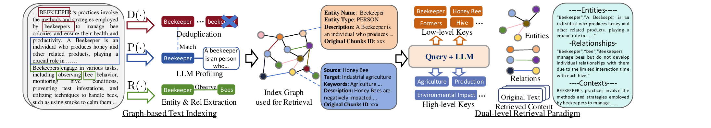

# LightRAG는 왜 "커뮤니티"를 만들지 않고도 GraphRAG를 이기는가

> 논문: *LightRAG: Simple and Fast Retrieval-Augmented Generation* (Zirui Guo, Lianghao Xia 외, HKU, EMNLP 2025 Findings)
> 코드: github.com/HKUDS/LightRAG

이 글은 LightRAG 논문을 처음부터 순서대로 요약한 글이 아니다. 논문을 함께 읽으며 실제로 오갔던 질문들 — "GraphRAG와 가장 다른 점이 뭐야?", "그럼 GraphRAG는 왜 애초에 커뮤니티를 만들었지?", "1-hop 이웃 확장은 엔티티 중심이야?" — 을 따라가며, 그 질문들이 풀리는 순서대로 논문 내용을 재구성한 기록이다.

---

## 1. LightRAG가 풀려는 문제

기존 RAG(Retrieval-Augmented Generation) 시스템은 두 가지 근본적인 한계를 가진다.

첫째, 데이터를 **flat한 텍스트 조각(chunk)** 단위로만 다루기 때문에 엔티티 간의 복잡한 상호연관성을 이해하지 못한다. 둘째, 맥락 인식 능력이 부족해 여러 문서에 흩어진 정보를 종합하지 못한다. 예를 들어 "전기차 보급이 도시 대기질과 교통 인프라에 어떤 영향을 주는가"라는 질문에, 기존 RAG는 전기차 관련 문서와 대기질 관련 문서를 각각 검색할 뿐 둘을 연결짓지 못한다.

LightRAG는 이 문제를 **그래프 구조를 텍스트 인덱싱·검색에 통합**하는 방식으로 풀어낸다. 핵심 구성 요소는 두 가지다.

### 1) Graph-based Text Indexing
문서를 청크로 나눈 뒤 LLM으로 엔티티와 관계를 추출해 지식 그래프를 구성한다. 각 엔티티·관계마다 LLM 프로파일링으로 key-value 쌍을 만들고, 중복되는 엔티티·관계는 병합(dedup)한다.

### 2) Dual-level Retrieval Paradigm
"구체적인 질문"과 "포괄적인 질문"을 모두 다루기 위해 low-level retrieval과 high-level retrieval을 병행한다.

아래 Figure 1이 이 두 구성 요소를 한 장에 담고 있다 — 논문이 실제로 든 예시("Beekeeper" 관련 텍스트)를 그대로 따라가며 보면 이해가 빠르다.

왼쪽 절반(Graph-based Text Indexing)은 원문 텍스트에서 엔티티·관계를 추출(R)하고, LLM으로 프로파일링(P)해서 key-value 쌍을 만들고, 중복을 제거(D)해 인덱스 그래프를 만드는 과정이다. 오른쪽 절반(Dual-level Retrieval Paradigm)은 그렇게 만들어진 그래프에서 low-level key(엔티티 중심)와 high-level key(주제·관계 중심)를 각각 검색해 답변을 생성하는 과정이다. 이 두 축이 이 논문 전체를 관통하는 뼈대이고, 아래 절들은 이 그림의 각 조각을 하나씩 더 깊이 파고든 결과다.

실험은 Agriculture, CS, Legal, Mixed 4개 도메인의 UltraDomain 벤치마크(60만~500만 토큰)에서 진행됐고, NaiveRAG·RQ-RAG·HyDE·GraphRAG와 비교해 Comprehensiveness/Diversity/Empowerment/Overall 네 지표 대부분에서 우위를 보였다. 이 결과는 8절에서 표로 다시 살펴본다.

---

## 2. GraphRAG와 가장 다른 점: "커뮤니티"를 만들지 않는다

LightRAG를 그래프 기반 RAG의 원조 격인 GraphRAG(Edge et al., 2024)와 비교했을 때 가장 핵심적인 차이는, GraphRAG가 의존하는 **"커뮤니티 탐지 + 커뮤니티 요약"** 단계를 LightRAG는 아예 쓰지 않는다는 점이다.

### 1) GraphRAG의 방식: 커뮤니티 순회
GraphRAG는 그래프를 여러 커뮤니티로 나누고, 각 커뮤니티마다 LLM으로 요약 리포트를 미리 만들어 둔다. 질의가 들어오면 이 리포트들을 map-reduce 방식으로 순회(traversal)하며 답을 조합한다.

### 2) LightRAG의 방식: 키워드로 그래프를 직접 매칭
LightRAG는 커뮤니티 구조 자체를 만들지 않는다. 대신 질의에서 로컬(구체적)·글로벌(추상적) 키워드를 뽑아 그래프의 엔티티·관계 key-value 쌍을 벡터 검색으로 직접 매칭하고, 검색된 노드의 1-hop 이웃까지만 확장해 문맥을 보강한다. 이 인덱싱 과정은 논문에서 다음과 같이 정식화된다.

$$\hat{D} = (\hat{V}, \hat{E}) = (\text{Dedupe} \circ \text{Prof})(V, E), \qquad V, E = \bigcup_{D_i \in D} \text{Recog}(D_i)$$

풀어 쓰면: 각 텍스트 청크 $D_i$에 대해 LLM이 엔티티·관계를 인식(Recog)하고, 이를 모두 합친 뒤 LLM 프로파일링(Prof)으로 key-value 쌍을 생성하고, 중복 제거(Dedupe)를 거쳐 최종 그래프 $\hat{D}=(\hat{V},\hat{E})$를 얻는다. 이 과정에는 GraphRAG처럼 그래프를 다시 클러스터링하고 각 클러스터를 요약하는 별도의 무거운 단계가 없다 — 그래프를 만드는 것 자체가 곧 검색 가능한 인덱스가 된다.

### 3) 비용으로 확인하는 차이: Table 3 실측치
이 설계 차이가 실제로 얼마나 큰 비용 격차를 만드는지, 논문은 Legal 데이터셋을 기준으로 검색 단계와 증분 업데이트 단계를 나눠 실측했다(Table 3).

| 구분 | GraphRAG | LightRAG |
|---|---|---|
| 검색(retrieval) 단계 토큰 | **약 610,000** (610개 커뮤니티 리포트 × 평균 1,000토큰) | **100 미만** |
| 검색 단계 API 호출 | 수백 회 (커뮤니티별 순회) | **1회** |
| 증분 업데이트 토큰 | **약 1,399 × 2 × 5,000 ≈ 1,399만** (기존+신규 커뮤니티 리포트 재생성) | 신규 엔티티·관계를 기존 그래프에 병합만 (재생성 없음) |

수식으로 정리하면:

$$T_{GraphRAG}^{retrieval} \approx 610 \times 1{,}000 = 610{,}000 \text{ tokens}, \qquad T_{LightRAG}^{retrieval} < 100 \text{ tokens}$$

$$T_{GraphRAG}^{update} \approx 1{,}399 \times 2 \times 5{,}000 \text{ tokens}$$

GraphRAG가 새 문서를 추가할 때마다 1,399개 커뮤니티 리포트를 통째로 재생성해야 하는 반면(원본+신규 두 벌), LightRAG는 새 엔티티·관계를 기존 그래프에 union으로 합치기만 하면 된다. 이 부분은 4절에서 다시 다룬다.

추가로 부록의 실측 비교(Table 5~7)도 같은 방향을 가리킨다.

| 지표 | LightRAG | GraphRAG |
|---|---|---|
| 평균 질의 시간(초) | **11.2** | 23.6 |
| 최종 저장 공간(MB) | **39.5** | 286.7 |
| 문서 삽입 시간(초, 5개 문서 범위) | **418 ~ 561** | 642 ~ 953 |

*(시간·저장공간·토큰 모두 낮을수록 좋음. 정확도 결과는 8절에서 별도로 다룬다.)*

---

## 3. 그림으로 보는 두 파이프라인 — 그리고 정정

두 시스템의 구조 차이를 시각적으로 정리하면: 문서 → 엔티티/관계 추출(공통 단계) → [GraphRAG: 커뮤니티 탐지+요약 / LightRAG: 그래프 병합] → [GraphRAG: 질의 시 커뮤니티 순회(61만 토큰·수백 회 호출) / LightRAG: 이중 레벨 키워드 매칭(100토큰 미만·1회 호출)] → 답변 생성. 비용·속도 격차가 갈리는 지점은 바로 이 세 번째 화살표, 즉 **질의(query) 처리 단계**다.

### 1) 흔히 하는 오해: "이 비교가 문서 추가 시나리오다"

이 파이프라인 비교를 처음 보면 "이게 새 문서가 추가될 때의 절차를 설명한 것이고, 그래서 LightRAG가 커뮤니티를 안 만드니까 비용이 절약되는 것"이라고 오해하기 쉽다. 그러나 실제로는 그렇지 않다.

이 비교의 메인 파이프라인은 문서 추가 시나리오가 아니라 **평상시 인덱싱 → 질의 응답의 일반적인 흐름**이며, 강조되는 비용(610,000 vs 100 미만 토큰)은 **질의 1건당(retrieval phase) 비용**이다. 문서가 새로 추가될 때의 비용(incremental update)은 이와는 별개의, 2절 Table 3 오른쪽 열에서 다룬 시나리오다.

### 2) 그래도 결론은 같은 방향이다

다만 "LightRAG가 커뮤니티를 만들지 않는다"는 설계 하나가 (1) 질의 시점의 비용/속도와 (2) 문서 추가 시점의 업데이트 비용, **두 군데에서 동시에** 이득을 준다는 직관 자체는 맞다. 커뮤니티 구조의 부재라는 같은 원인이 서로 다른 두 단계(질의 vs 업데이트)에서 각각 다른 방식으로 비용을 줄여주는 것이지, 하나의 비용 절감이 두 번 계산된 것은 아니라는 점만 구분해서 이해하면 된다.

---

## 4. 그렇다면 GraphRAG는 애초에 왜 커뮤니티를 만들었나

LightRAG가 커뮤니티 없이도 잘 동작한다면, GraphRAG는 왜 처음부터 그 무거운 구조를 도입했을까?

### 1) Global sensemaking을 위한 사전 계산된 요약

GraphRAG(Edge et al., 2024, "From Local to Global: A Graph RAG Approach to Query-Focused Summarization")가 커뮤니티를 만든 목적은 **"전체 코퍼스를 아울러야 답할 수 있는 포괄적 질문(global sensemaking question)"**에 대응하기 위해서다.

기존 RAG는 "이 데이터셋 전체를 관통하는 주요 테마가 뭐야?" 같은 질문에 취약하다 — 답이 특정 청크 하나가 아니라 코퍼스 전체에 흩어진 정보를 종합해야 나오기 때문이다. GraphRAG는 이를 query-focused summarization 문제로 보고, 코퍼스를 미리 주제별로 클러스터링(커뮤니티화)해서 각 커뮤니티마다 LLM 요약을 사전에 만들어 둔다. 질의 시에는 이 요약들을 map-reduce 방식으로(각 커뮤니티에서 부분 답변 생성 → 종합) 활용해 포괄적인 답을 낸다.

즉 커뮤니티는 "사실 하나를 정확히 찾는" 세부 질문이 아니라, "전체 그림을 요약·종합해야 하는" 상위 수준 질문에 대응하기 위한 **사전 계산된 다중 해상도 요약 인덱스**였다.

### 2) LightRAG의 답: 같은 목표를 더 싸게 달성한다

흥미로운 지점은, LightRAG의 dual-level retrieval도 사실 같은 목표(구체적+포괄적 질문 모두 대응)를 추구한다는 것이다. 다만 커뮤니티를 미리 다 요약해 두는 무거운 방식 대신, **질의 시점에 로컬/글로벌 키워드로 그래프를 직접 훑는** 훨씬 가벼운 방식으로 같은 목표를 달성하려 한다. LightRAG는 "커뮤니티가 왜 필요했는지"를 부정한 게 아니라, "그 목적을 더 싸게 달성하는 다른 방법을 찾은" 것에 가깝다.

---

## 5. Dual-level Retrieval의 상세 메커니즘

그렇다면 LightRAG는 커뮤니티 없이 어떻게 구체적 질문과 포괄적 질문을 동시에 다룰 수 있을까? 이 메커니즘은 인덱싱 단계의 key 설계에서부터 시작된다.

### 1) 인덱싱 단계: key 설계가 low/high-level 구분의 토대

- **엔티티의 index key = 엔티티 이름 자체.** 구체적이다. (예: "Cardiologist")
- **관계의 index key = LLM이 생성한 여러 키워드**로, 연결된 엔티티들을 아우르는 "global theme"이 포함된다. 포괄적이다. (예: "medical diagnosis")

이 구조 자체가 이후의 low-level/high-level 구분의 토대가 된다.

### 2) 질의 키워드 추출과 매칭

질의 $q$가 들어오면 LLM이 로컬 키워드 $k^{(l)}$과 글로벌 키워드 $k^{(g)}$를 동시에 추출한다(논문 부록 Figure 5 프롬프트, `{"high_level_keywords": [...], "low_level_keywords": [...]}` 형식의 JSON 출력). 이후:

- low-level keyword → 벡터 검색으로 **엔티티** 후보 매칭
- high-level keyword → 벡터 검색으로 **관계**(및 연결된 global key) 매칭

### 3) 1-hop 이웃 확장 (high-order relatedness)

매칭된 노드·엣지만으로는 문맥이 부족할 수 있어, LightRAG는 검색된 그래프 요소의 1-hop 이웃까지 끌어온다. 논문의 정의는 다음과 같다.

$$\{v_i \mid v_i \in V \wedge (v_i \in \mathcal{N}_v \vee v_i \in \mathcal{N}_e)\}$$

여기서 $\mathcal{N}_v$는 **검색된 노드**들의 1-hop 이웃, $\mathcal{N}_e$는 **검색된 엣지**들의 1-hop 이웃이다. 이 식이 왜 중요한지는 7절에서 실제 사례와 함께 다시 짚는다 — 얼핏 "엔티티 중심으로만 확장되는 것 아닌가" 싶지만, 실제로는 엔티티(low-level 결과)와 관계(high-level 결과) **양쪽 모두**가 확장의 출발점이 된다.

### 4) 최종 조합

entities + relationships + 원문 텍스트 조각을 합쳐 LLM에 전달해 답변을 생성한다.

**왜 이 구조가 구체적/포괄적 질문을 모두 다룰 수 있는가.** 구체적 질문은 주로 low-level(엔티티) 채널이, 포괄적 질문은 주로 high-level(관계·주제) 채널이 답을 준다. 실제 질문 대부분은 이 둘의 혼합이기 때문에, 두 채널을 항상 병행하면 커버리지가 넓어진다. 논문의 ablation(-High=low-level만 사용, -Low=high-level만 사용)이 이를 실증한다 — -High는 특정 엔티티에는 강하지만 포괄적 질의에서 성능이 하락하고, -Low는 포괄성은 좋지만 특정 엔티티에 대한 깊이가 약하다. 이 ablation 수치는 6절에서 표로 확인한다.

### 5) 작은 예시로 전체 파이프라인 따라가기

이 메커니즘을 논문이 실제로 든 예시 문장으로 따라가 보면 훨씬 명확해진다. 논문 3.1절이 그래프 추출 예시로 직접 사용한 문장이다.

> "Cardiologists assess symptoms to identify potential heart issues."

1. **원문 청크**: 위 문장 하나.
2. **엔티티·관계 추출**: 엔티티 "Cardiologist", "Heart Disease" / 관계 "Cardiologist —diagnoses→ Heart Disease" (논문이 직접 든 예시).
3. **Index key-value 생성** (Figure 1의 Beekeeper 사례 구조를 그대로 적용): 엔티티 "Cardiologist"의 key = "Cardiologist"(이름 자체), value = 요약 텍스트. 관계의 key = LLM이 생성한 테마 키워드(예: "medical diagnosis", "symptom assessment"), value = 관계 요약.
4. **질의 예시**: "심장 전문의는 어떻게 심장 질환을 진단하나요?" → `low_level_keywords = ["Cardiologist", "Heart Disease"]`, `high_level_keywords = ["medical diagnosis", "symptom assessment"]`.
5. **매칭**: low-level → 엔티티 인덱스에서 "Cardiologist", "Heart Disease" 직접 매칭. high-level → 관계 인덱스에서 "medical diagnosis" 테마와 유사한 관계 매칭 (표현이 정확히 같지 않아도 벡터 유사도로 매칭 가능).
6. **1-hop 이웃 확장**: 예를 들어 그래프에 "ECG —detects→ Heart Disease"라는 관계가 있었다면, "Heart Disease"의 이웃인 "ECG"도 함께 끌려온다.
7. **최종 조합**: entities + relations + 원문 조각을 LLM에 전달해 답변을 생성한다.

---

## 6. Naive RAG는 이미 low-level에 강한 것 아닌가?

여기서 자연스럽게 따라오는 질문이 있다. 일반적인 (그래프 없는) Naive RAG도 벡터 유사도로 구체적인 정보를 찾는 데는 이미 강할 텐데, 그렇다면 LightRAG의 진짜 강점은 high-level 쪽에 있다고 봐야 하지 않을까? 그리고 만약 그렇다면, global theme을 표현하는 관계 key와 high-level keyword를 얼마나 잘 생성하느냐가 모델 성능을 좌우하는 병목이 아닐까?

### 1) 데이터로 보면 더 미묘하다: 코퍼스 크기·복잡도에 달려 있다

방향은 대체로 맞지만, ablation(Table 2) 데이터를 자세히 보면 더 미묘한 그림이 나온다.

| 데이터셋 | 특성 | -High (low-level만) | -Low (high-level만) | Full LightRAG |
|---|---|---|---|---|
| Legal | 94문서, 500만 토큰 — 크고 복잡 | 83.2% *(Diversity)* | **86.4%** *(Diversity)* | 86.4% *(Diversity)* |
| Agriculture | 12문서, 200만 토큰 — 작고 단순 | **65.2%** *(Comprehensiveness)* | 64.0% *(Comprehensiveness)* | 67.6% *(Comprehensiveness)* |

*(모든 값은 NaiveRAG 대비 승률(%), 높을수록 좋음)*

Legal에서는 -Low(high-level만)의 Diversity가 풀 모델과 동일(86.4%)하고 -High(low-level만)는 더 낮다(83.2%) — high-level 채널의 기여가 크다는 뜻이다. 반면 Agriculture에서는 반대로 -High(low-level만, 65.2%)가 -Low(high-level만, 64.0%)보다 근소하게 낫다. 즉 **"코퍼스가 크고 복잡할수록 high-level 채널의 기여가 커지는 경향"**이라고 보는 것이 더 정확하다.

한 가지 더 감안해야 할 점은, 이 논문의 평가 질의 자체가 "코퍼스 전체 이해가 필요한" 질문으로 생성됐다는 것이다(부록 9.1, Edge et al. 2024의 질문 생성 방식을 그대로 채택). 즉 벤치마크 자체가 애초에 global sensemaking형 질문에 치우쳐 있어서, Naive RAG가 진짜 잘할 법한 단순 조회형 질문은 평가에 적었을 가능성이 있다.

### 2) high-level 생성 품질이 병목이라는 가설 — 간접 증거는 있지만 직접 검증되지 않았다

"global key·high-level keyword 생성 품질이 성능을 좌우한다"는 추론은 타당하며, 간접적인 증거도 있다. 논문의 "-Origin" ablation(원문 텍스트를 제외하고 LLM이 만든 key-value 요약만 사용)이 일부 데이터셋(Agriculture, Mix)에서 오히려 성능이 더 좋게 나온다 — 이는 시스템 성능이 원문 텍스트보다 **LLM의 인덱싱 단계 요약·추출 품질**에 크게 의존한다는 뜻이다.

low-level(엔티티 이름 추출)은 상대적으로 결정적인 개체명 인식(NER)에 가깝지만, high-level(관계의 global theme 요약)은 훨씬 추상적이고 해석적인 LLM 판단을 요구하기 때문에 구조적으로 더 불안정할 여지가 크다. 다만 매칭이 정확한 문자열 일치가 아니라 벡터 임베딩 유사도이기 때문에 표현이 조금 달라도 완충되는 면은 있다.

**단, 이 부분은 논문이 직접 검증하지 않은 지점이다.** keyword extraction에 쓰는 LLM을 바꿔가며 비교하거나, high-level keyword의 오류를 별도로 분석한 실험은 없다. 이 논문의 흥미롭지만 미검증인 한계로 짚어둘 만하다.

---

## 7. 마지막 정정: 1-hop 확장은 엔티티만이 아니라 엣지도 중심이 된다

5절에서 소개한 high-order relatedness 식을 다시 보자.

$$\{v_i \mid v_i \in V \wedge (v_i \in \mathcal{N}_v \vee v_i \in \mathcal{N}_e)\}$$

이 식을 처음 보면 "1-hop 이웃으로 확장하는 것은 low-level에서 매칭된 엔티티를 중심으로 확장되는 것"이라고 이해하기 쉽다. 그러나 이는 정확하지 않다.

### 1) $\mathcal{N}_v$와 $\mathcal{N}_e$는 각각 다른 출발점을 갖는다

식이 말하는 것은 low-level(노드) 검색 결과와 high-level(엣지) 검색 결과 **양쪽 모두**를 중심으로 각각 확장이 일어난다는 것이다.

- $\mathcal{N}_v$ = **검색된 노드**들의 1-hop 이웃 (엔티티 중심 확장)
- $\mathcal{N}_e$ = **검색된 엣지**들의 1-hop 이웃 (관계 중심 확장)

### 2) Physician–Diabetes 예시로 보는 비대칭 설계

이 구분이 왜 중요한지는 예시로 보면 명확해진다. 만약 high-level 키워드 "medical diagnosis"가 (Cardiologist–Heart Disease 관계가 아니라) 그래프의 전혀 다른 곳에 있는 "Physician —diagnoses→ Diabetes"라는 관계와 매칭됐다고 하자. "Physician"과 "Diabetes"는 low-level 키워드("Cardiologist", "Heart Disease")와는 무관하기 때문에, 노드 매칭만으로는 전혀 검색되지 않았을 대상이다.

하지만 그 **관계 자체가 high-level 매칭으로 검색됐기 때문에**, $\mathcal{N}_e$를 통해 그 관계의 양 끝 엔티티(Physician, Diabetes)가 자동으로 컨텍스트에 딸려 들어온다. 즉 이 설계는 관계를 찾으면 그 양 끝 엔티티까지 함께 딸려오도록 **대칭적으로** 만들어져 있다 — high-level 채널이 추상적인 테마만 가져오고 그 관계의 구체적 근거(엔티티)를 놓치는 상황을 방지하기 위한 설계다.

---

## 8. 결과로 확인하기: LightRAG는 실제로 얼마나 이기는가

지금까지 다룬 설계상의 이점(커뮤니티 없는 가벼운 인덱싱, dual-level retrieval, 1-hop 확장)이 실제 성능으로 이어지는지를 논문의 headline 결과로 확인해 보자. Table 1은 LightRAG와 각 baseline을 4개 데이터셋에서 1:1로 맞붙여 LLM이 승자를 판정한 승률(win rate)이다. 아래는 네 baseline 전체에 대한 **Overall** 지표 기준 결과다.

| 데이터셋 | vs NaiveRAG | vs RQ-RAG | vs HyDE | vs GraphRAG |
|---|---|---|---|---|
| Agriculture | **67.6%** | **67.6%** | **75.2%** | **54.8%** |
| CS | **61.2%** | **62.0%** | **58.4%** | **52.0%** |
| Legal | **84.8%** | **85.6%** | **73.6%** | **52.8%** |
| Mix | **60.0%** | **60.0%** | **57.6%** | 49.6% (GraphRAG **50.4%**) |

*(각 셀은 LightRAG의 승률(%). 50% 초과면 LightRAG 우세, 굵게 표시. 유일하게 Mix 데이터셋에서 GraphRAG를 상대로는 근소하게 열세(49.6%)를 보인다.)*

가장 눈에 띄는 지점은 **Legal 데이터셋(94문서, 500만 토큰 — 가장 크고 복잡한 데이터셋)에서 NaiveRAG 대비 84.8% 승률**을 기록한 것이다. 데이터셋 규모가 커질수록 baseline과의 격차가 벌어지는 경향이 뚜렷하며, 이는 6절에서 다룬 "코퍼스가 크고 복잡할수록 high-level 채널의 기여가 커진다"는 관찰과도 일관된다. GraphRAG와 비교했을 때도 세 데이터셋에서는 근소하게 우세하지만, 별도로 컴팩트하게 요약해 둔 것을 보면 GraphRAG와의 격차 자체는 다른 baseline만큼 크지 않다 — LightRAG의 진짜 강점은 "정확도를 유지하면서 비용을 극적으로 낮췄다"는 데 있지, GraphRAG를 정확도 면에서 압도적으로 이긴다는 데 있지 않다는 점을 함께 읽어야 한다.

---

## 9. 정리

이 대화를 관통한 하나의 질문은 결국 "GraphRAG가 커뮤니티로 얻으려던 것을, LightRAG는 커뮤니티 없이 어떻게 얻는가"였다. 답은 **인덱싱 단계에서 엔티티(구체적 key)와 관계(포괄적 key)를 애초에 다르게 설계**해 두고, 질의 시점에 로컬/글로벌 키워드로 이 두 채널을 동시에 훑은 뒤, 검색된 노드와 엣지 양쪽을 중심으로 1-hop 이웃을 대칭적으로 확장하는 것이다. 이 설계는 GraphRAG가 사전에 커뮤니티를 요약해 두는 방식보다 질의당 비용(610,000 → 100 미만 토큰)과 증분 업데이트 비용을 극적으로 낮추면서도, 정확도 면에서는 대체로 앞서거나 비등한 성능을 보인다.

다만 짚어볼 만한 한계도 있다. high-level(관계의 global theme) 생성 품질이 시스템 성능의 병목일 가능성이 있다는 것은 -Origin ablation을 통한 간접 증거일 뿐, 논문이 직접 검증한 것은 아니다. 또한 벤치마크 질문 자체가 global sensemaking형으로 편중되어 있어, Naive RAG가 실제로 강할 법한 단순 조회형 질문에 대한 비교는 상대적으로 부족하다. 이런 지점들은 LightRAG의 dual-level retrieval을 실제로 도입할 때 함께 검증해볼 가치가 있는 질문으로 남는다.
