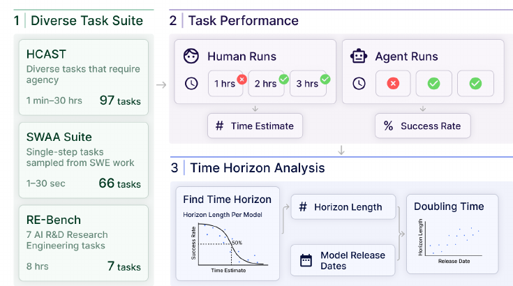
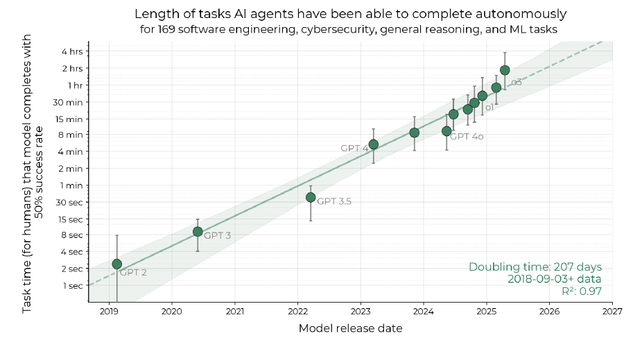
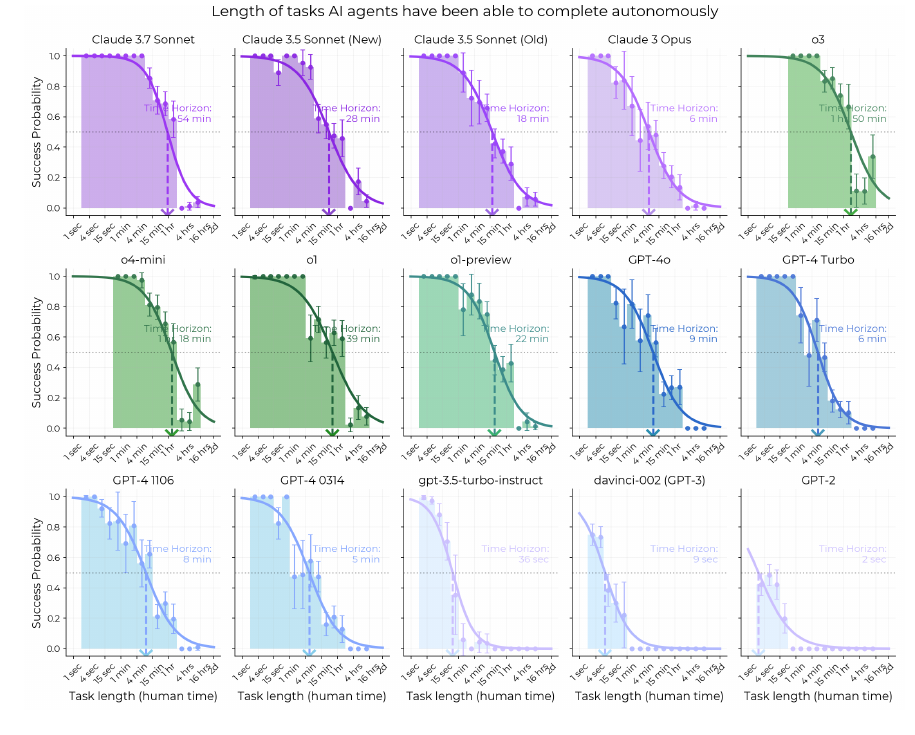

# AI는 "얼마나 긴 일"을 해낼 수 있을까 — 시간 지평(Time Horizon)으로 AI 능력을 재다

> METR, *Measuring AI Ability to Complete Long Software Tasks* (NeurIPS 2025) 읽기
>
> 이 글은 논문을 한 줄 요약하려는 글이 아니다. 논문을 읽으며 실제로 오갔던 질문들 — "시간으로 난이도를 재는 게 정당한가", "왜 토큰이 아니라 시간인가", "사람이 실패한 건 왜 안 세나", "이 로지스틱 식은 대체 어떻게 생긴 건가", "향상의 원동력이 언젠가 마르지 않을까" — 을 하나씩 따라가며 논문의 방법론과 함의를 뜯어본 기록이다.

---

## 1. 이 논문이 풀려는 문제

### 1) 벤치마크 점수는 오르는데, 그게 무슨 뜻인지 모른다

지난 5년간 프론티어 AI는 단순 텍스트 생성에서 몇 시간짜리 머신러닝 연구 프로젝트를 자율 수행하는 수준까지 왔다. 그런데 "벤치마크 점수 85%"가 현실에서 어느 정도의 능력인지는 여전히 직관적으로 와닿지 않는다. 논문은 기존 벤치마크의 세 가지 한계를 지적한다.

첫째, 벤치마크 과제는 경제적으로 가치 있는 실제 업무가 아니라 **인위적인 문제**가 많다. 둘째, 벤치마크는 종종 "지금 모델이 못하는 문제"만 골라서(adversarially selected) 만들어지므로, 사람과의 비교가 처음부터 AI에 불리하게 기운다(HellaSwag, Humanity's Last Exam이 그런 예다). 셋째, 그리고 가장 결정적으로, 개별 벤치마크는 **금방 포화(saturate)**되고, 서로 다른 벤치마크를 하나의 자로 비교할 방법이 없다. 그래서 GPT-2와 Claude 3.7처럼 능력 격차가 엄청난 두 모델을 같은 눈금 위에 놓고 "얼마나 발전했나"를 말하기가 어렵다.

### 2) 해법 — "시간 지평(time horizon)"이라는 공통의 자

논문의 핵심 아이디어는 AI 능력을 **사람이 그 일을 하는 데 걸리는 시간**으로 환산하는 것이다. 구체적으로 **50% 과제완수 시간 지평(50%-task-completion time horizon)**을 이렇게 정의한다.

> AI 에이전트가 50% 성공률로 해낼 수 있는 과제를, 사람 전문가가 하면 보통 얼마나 걸리는가.

즉 "이 모델은 사람으로 치면 N분/N시간짜리 일을 반타작으로 해낸다"고 말할 수 있게 만든 것이다. 모델이 모든 길이의 과제를 안정적으로 해내는 건 아니므로, 일반화해서 **X% 시간 지평** — X% 확률로 성공시키는 과제의 길이 — 을 측정한다.

이 척도의 매력은 GPT-2든 o3든 하나의 연속적인 눈금 위에 올려놓을 수 있다는 데 있다. 벤치마크가 포화되어도, 사람 시간이라는 자는 계속 늘어난다.

---

## 2. 방법론 — 사람과 AI에게 같은 과제를 시키고, 로지스틱으로 지평을 뽑는다

논문의 측정 파이프라인은 세 단계다. 아래 그림이 전체 그림을 요약한다.

*그림 1. (1) 170개 과제로 다양한 과제 모음을 만든다. (2) 사람과 AI 에이전트가 각각 과제를 시도하는데, 사람 쪽에서는 **성공한 사람의 소요 시간**을, AI 쪽에서는 **성공률**을 기록한다. (3) 로지스틱 모델을 fit해 각 AI가 50% 성공하는 지점의 시간 지평을 구하고, 이를 모델 출시일에 대해 그린다.*

### 1) 세 개의 데이터셋, 170개 과제

- **HCAST** — 일반 소프트웨어/에이전트 과제, 1분~30시간 범위, 97개
- **RE-Bench** — 머신러닝 연구 엔지니어링 과제, 8시간 고정, 7개
- **SWAA (Software Atomic Actions)** — 이 논문이 새로 만든 초단시간(1~30초) 원자적 과제 66개. 2023년 이전의 약한 모델(GPT-2 등)에서도 신호를 잡기 위한 장치다.

### 2) 난이도는 "성공한 사람의 시간"으로 매긴다

각 과제의 난이도(=길이)는, 그 과제를 **성공한** 숙련된 사람 베이스라이너들의 소요 시간의 **기하평균(geometric mean)**으로 정한다. 기하평균을 쓰는 이유는 사람 소요 시간이 대략 로그정규분포를 따르기 때문이며, 이 값이 평균 시간보다 모델 성능을 더 잘 예측한다.

### 3) 12개 모델(2019~2025)을 평가한다

각 에이전트/과제 쌍마다 8회씩 실행해 성공률을 기록하고, 인간 심리측정학(특히 문항반응이론, IRT)에서 착안한 로지스틱 회귀로 50% 지평을 추정한다. 이 로지스틱 식은 이 글의 핵심이라 뒤에서 따로 자세히 뜯어본다(6절).

---

## 3. 핵심 결과 — 6년째 7개월마다 2배

*그림 2. 모델이 50% 신뢰도로 완수할 수 있는 과제의 길이(사람 기준)가 6년간 약 7개월마다 2배로 늘어왔다. 세로축은 로그 스케일이고, 음영은 계층적 부트스트랩으로 계산한 95% 신뢰구간이다.*

50% 시간 지평은 2019~2025년 내내 지수적으로 증가했고, **두배 주기(doubling time)는 약 207일(≈7개월)**, 95% 부트스트랩 신뢰구간은 166~240일(대략 ±19%)이다. 회귀의 R²은 0.97로 매우 높다. o3의 50% 지평은 약 110분이고, GPT-2는 겨우 2초였다.

모델별 지평을 나란히 놓으면 그 진보가 한눈에 들어온다. (아래 표는 논문 Figure 4에서 각 모델의 50% 시간 지평을 뽑은 것이다.)

| 모델 | 출시 시기 | 50% 시간 지평 |
|---|---|---|
| GPT-2 | 2019 | 2초 |
| davinci-002 (GPT-3) | 2020 | 9초 |
| gpt-3.5-turbo-instruct | 2022 | 36초 |
| GPT-4 0314 | 2023 초 | 5분 |
| GPT-4 1106 | 2023 말 | 8분 |
| Claude 3 Opus | 2024 초 | 6분 |
| GPT-4o | 2024 | 9분 |
| Claude 3.5 Sonnet (New) | 2024 말 | 28분 |
| o1 | 2024 말 | 39분 |
| **Claude 3.7 Sonnet** | 2025 초 | **54분** |
| **o3** | 2025 | **110분 (1시간 50분)** |

*2초에서 110분까지 — 약 6년 만에 3,000배 이상이다. 그리고 o3는 장기 추세선보다 유의하게 위(p = 0.006)에 있어, 2024~2025년 구간의 추세가 더 빠를 가능성을 시사한다. 실제로 2023~2025년 성장률은 2019~2025년 전체보다 약 20% 빠르다.*

향상의 원동력은 단순 지식이 아니다. 질적 분석 결과, 최근 모델이 나아진 지점은 **도구 사용, 실수를 반복하지 않고 교정하는 능력, 논리적 추론, 그리고 긴 과제를 끝까지 버티는 신뢰성**이었다. 이 "신뢰성·지속성"이라는 축은 뒤(5절, 11절)에서 다시 중요하게 등장한다.

---

## 4. 이 척도가 재는 것은 "AI의 속도"가 아니다

논문을 읽으며 가장 먼저 걸리는 질문. **AI가 문제를 푸는 데 걸린 시간은 고려하지 않나?**

결론부터 말하면, 이 척도는 철저히 **사람 기준 시간(human expert clock-time)으로만** 정의된다. AI가 실제로 그 문제를 푸는 데 쓴 벽시계 시간(wall-clock time)이나 추론 시간은 척도에 들어가지 않는다.

50% 지평이 110분이라는 건 "o3가 110분짜리 과제를 110분 안에 푼다"는 뜻이 **아니다**. "사람 전문가가 하면 약 110분 걸리는 난이도의 과제를 o3가 50% 확률로 성공시킨다"는 뜻이다. 여기서 '분'은 **과제 난이도를 재는 자** 역할일 뿐이고, AI가 그걸 5분 만에 풀든 2시간을 쓰든 척도에는 반영되지 않는다. (실제로 AI는 대부분 사람보다 훨씬 빠르게 끝낸다.)

왜 이렇게 했나? 목적이 "AI가 얼마나 빠른가"가 아니라 **"AI 능력을 사람 능력과 직관적으로 비교"**하는 데 있기 때문이다. GPT-2와 Claude 3.7처럼 격차가 큰 모델을 하나의 눈금 위에 놓으려면, AI의 실행 속도가 아니라 과제 자체에 붙은 고정된 난이도(사람 시간)를 자로 삼아야 한다.

그렇다고 AI 쪽 비용을 완전히 무시한 건 아니다. 논문은 (a) 에이전트 실행에 토큰 예산/추론 연산(inference-time compute) 제한이 걸려 있고 best-of-k 등으로 더 많은 연산을 쓰면 성능이 크게 달라질 수 있다는 점, (b) 향후 **모델 비용·성공률·채점 노력을 함께 반영하는 "비용 지표(cost metric)"**를 만들 계획이라는 점을 명시한다. 즉 "AI 쪽 비용"은 이 척도의 정의에서 뺐을 뿐, 별도의 한계이자 후속 과제로 남겨두었다.

### 그럼 토큰 수가 더 공정한 비교 아닌가?

자연스럽게 이어지는 반론. "AI가 쓴 시간보다 **쓴 토큰의 수**가 더 공정한 비교 아닌가? 같은 문제를 푸는 데 몇 토큰이 필요한가를 기준으로 삼으면 되지 않나?"

토큰은 훌륭한 **효율·비용 척도**지만, 이 논문이 답하려는 질문에는 맞지 않는다. 이유를 하나씩 보면:

1. **이 논문의 목적은 "AI vs 사람" 비교인데, 토큰은 사람 쪽에 대응물이 없다.** 사람은 토큰을 소비하지 않는다. 사람과 AI가 둘 다 지출하는 공통 화폐는 시간뿐이다. 토큰을 축으로 쓰면 "이 AI는 사람으로 치면 어느 수준이냐"는 비교 자체가 불가능해진다.

2. **토큰은 "과제 난이도"가 아니라 "AI가 들인 노력"을 잰다 — 축이 다르다.** 사람 소요 시간은 어떤 AI가 붙든 변하지 않는, 과제에 고정된 속성이다. 반면 "그 문제를 푸는 데 드는 토큰 수"는 모델마다 값이 달라진다. 약한 모델은 토큰을 무한정 쓰고도 못 풀 수 있고, 강한 모델은 적게 쓰고 푼다. 그러면 "이 과제의 난이도"가 측정하는 모델에 따라 계속 바뀌어서, 12개 모델을 하나의 고정된 난이도 사다리 위에 놓으려는 설계가 무너진다.

3. **실패한 과제에서는 토큰 수가 정의되지 않는다.** 50% 지평을 구하려면 난이도 척도가 AI가 실패한 과제에도 정의돼 있어야 한다. 모델이 끝내 못 푼 과제에 대해 "해결에 필요한 토큰 수"는 무한대 혹은 미정이다. 반면 사람 시간은 성공한 베이스라이너가 있으니 모든 과제에 라벨이 붙는다.

4. **토큰은 모델 간 동일 단위가 아니다.** GPT-2의 BPE 토큰과 추론 모델의 토큰은 "생각 한 단위"로서 등가가 아니다. 추론 모델은 겉으로 안 보이는 방대한 CoT를 태우고, best-of-k·트리 탐색을 얹으면 토큰 수가 능력과 무관하게 요동친다.

정리하면, 토큰 기반 비교가 틀린 게 아니라 **다른 질문("AI가 얼마나 효율적인가")에 맞는 축**이다. 그리고 그 질문은 논문 스스로 "비용 지표"라는 이름으로 후속 과제에 남겨두었다.

---

## 5. 50% 지평과 80% 지평, 그리고 "시간으로 난이도를 잴 수 있나"

### 1) 80% 지평은 왜 50% 지평보다 짧은가

논문은 80% 시간 지평도 함께 측정한다. 80% 지평은 "AI가 **80% 확률로** 성공시킬 수 있는 과제의 (사람 기준) 길이"다. 성공률 문턱을 50%에서 80%로 더 높게 요구할수록, 그 기준을 통과하는 과제는 더 짧고 쉬운 것들로 좁혀진다. AI가 어쩌다 반타작으로 맞히는 과제보다, 안정적으로 8할을 맞히려면 훨씬 만만한 과제여야 하기 때문이다.

그래서 80% 지평은 50% 지평보다 대략 **5배 짧다**. 예컨대 50% 지평이 110분이면 80% 지평은 20분대 수준이다. 중요한 건, 절대 길이만 5배 짧을 뿐 **증가 추세(약 7개월마다 2배)의 기울기 자체는 50%와 유사하다**는 점이다.

### 2) 시간만으로 난이도를 평가할 수 있을까?

여기서 더 근본적인 의문이 생긴다. 어떤 과제는 어렵지는 않지만 **단지 할 일이 많아서** 오래 걸릴 수도 있다. 시간이라는 하나의 축으로 "난이도"를 온전히 잡을 수 있나?

논문도 시간 = 난이도라고 주장하지 않는다. 시간 지평이 재는 건 정확히는 과제의 **"길이(length)"**이지 인지적 난이도가 아니다(그래서 그래프 x축 라벨도 "difficulty"가 아니라 "human time-to-complete"다). 논문은 이 한계를 세 가지 방식으로 다룬다.

- **같은 시간이라도 모델 난이도는 천차만별이다.** 논문은 "같은 human time rating을 가진 과제들이 모델에게는 난이도가 크게 다르다"고 명시하고, 그래서 개별 모델의 지평 값보다 **추세의 기울기**를 더 신뢰한다고 밝힌다.

- **"messiness(지저분함)" 점수를 따로 만들었다.** 길이와는 별개의 축으로, 명확한 피드백 루프가 없거나 자원 제약이 있거나 새 환경인 과제들을 점수화했다. messiness가 높은 과제에서 모델 성능이 유독 떨어진다는 것을, 즉 "길이만으로는 잡히지 않는 난이도 차원이 있다"는 것을 데이터로 인정한 것이다.

- **"길지만 쉬운" 과제의 실패는 다른 종류의 실패다.** 단계가 100개인 과제는 각 단계가 쉬워도, 매 단계 성공 확률이 99%면 전체 성공률은 약 37%로 떨어진다. AI가 긴 과제에서 실패하는 건 종종 개별 단계가 어려워서가 아니라, **많은 단계에 걸쳐 실수 없이 버티는 신뢰성이 부족해서**다. 3절에서 본 "향상의 원동력 = 신뢰성·지속성"이 바로 이 "길이형 난이도"를 설명한다.

오히려 이게 이 척도가 흥미로운 이유이기도 하다. 인간 세계에서도 "한 달짜리 프로젝트"는 매 순간이 천재적으로 어려워서가 아니라 **많은 하위 작업을 일관되게 끝까지 수행해야 해서** 가치 있고 어렵다. 경제적으로 의미 있는 노동의 상당수가 이 "길이·지속성" 유형이다. 그래서 논문은 인지적 난이도가 아니라 "얼마나 긴 과제를 자율적으로 완수하느냐"를 일부러 축으로 삼았다. 시간은 "얼마나 머리를 써야 하나"가 아니라 **"얼마나 오래 자율적으로 지탱하느냐"**의 대리 지표에 가깝다.

---

## 6. 방법론을 한 겹 더 — 사람 실패는 왜 안 세나

측정 방법론(그림 1)을 다시 보면 한 가지 비대칭이 눈에 띈다. **AI 쪽(Agent Runs)에서는 실패가 성공률에 그대로 반영되는데, 사람 쪽(Human Runs)에서는 실패한 시도가 시간 추정에 들어가지 않는다.**

실제로 그렇다. 사람 쪽에서는 약 460회 시도 중 실패·문제 있는 시도를 걸러내고 **286개의 성공한 베이스라인만** 남긴 뒤, 그 성공 시도들의 **기하평균**으로 과제 길이를 정한다. 성공한 사람이 없는 과제는 수동 추정치로 대체한다. 즉 사람의 실패는 난이도 추정에 안 들어간다.

논문은 이 선택의 이유를 실용적·원리적 두 가지로 든다.

- **실용적 이유:** 각 과제마다 "시간 대비 성공 확률 곡선"을 그리려면 과제당 사람 시도가 아주 많아야 하는데, 그만큼의 베이스라인을 모으는 게 현실적으로 어렵다.

- **원리적 이유:** 사람의 실패는 **모델에는 해당하지 않는 이유**로 발생하는 경우가 많다. 그 과제에 필요한 전문성이 없던 사람이 배정됐거나, 지루하거나 중간에 방해받아서 포기한 경우다. 게다가 보상 체계가 "성공 베이스라인을 빨리 많이 따는" 쪽으로 설계돼서, 계약자들이 어려운 과제는 대충 찍고 빨리 포기해 다른 과제로 넘어갈 유인이 있었다.

다만 논문은 바로 이어서, 이 선택이 공짜가 아님을 인정한다. **"성공에 조건부로 걸러내면(conditioning on success) 과제 길이가 짧게 잡히는 쪽으로 편향되어, 모델의 시간 지평을 과소추정할 수 있다."** 어려워서 사람도 실패한 과제일수록 "성공한 사람의 시간"만 남으면 실제보다 짧은 난이도로 기록되고, 그러면 그 과제를 푼 AI의 지평이 실제보다 낮게 나올 수 있다는 것이다. 앞서 감지한 비대칭은 의도된 설계지만, 알려진 대가를 치른다.

---

## 7. Fig 3의 볼록함 — 왜 직선이 아니라 로지스틱인가

논문 Figure 3의 오른쪽 패널은 (전 모델 평균) 성공률을 사람 소요 시간에 대해 그린 것으로, 대략 반비례한다. 그런데 자세히 보면 점들이 회귀직선에 잘 얹혀 있지 않고 **약간 볼록한** 형태를 보인다. 이건 무엇일까?

핵심은, 그 직선이 "진짜 모델"이 아니라 단순 선형 회귀일 뿐이고, 볼록함은 예상된 현상이라는 것이다.

- Figure 3 오른쪽의 회귀식은 `y = −0.07x + 0.66, R² = 0.83`이며, 여기서 x는 **로그(사람 시간)**, y는 성공률이다. R²이 0.83이면 경향은 잡지만 완벽하진 않다는 뜻이고, 점들이 직선에서 체계적으로 벗어나는 게 당연하다.

- **성공률은 0~1에 갇혀 있다.** 그런데 직선은 위아래로 무한히 뻗는다. 짧은 과제 쪽(성공률 1에 가까운 영역)에서는 직선이 1을 뚫고 올라가려 하니 점들이 직선 아래로 눌리고, 긴 과제 쪽(0에 가까운 영역)에서는 직선이 0 밑으로 내려가려 하니 점들이 직선 위로 뜬다. 이 두 효과가 합쳐지면 **S자(로지스틱) 곡선을 직선으로 근사할 때 생기는 전형적인 볼록/오목 편차**가 나온다. 직선이 잘못 그려진 게 아니라, 직선으로는 원래 못 맞추는 관계인 것이다.

- 그래서 논문의 실제 계산(Figure 4)은 직선이 아니라 **로지스틱 함수**를 fit한다. 성공 확률이 0~1에 갇힌다는 걸 처음부터 반영한다.

- 여기에 두 가지가 더 겹친다. 하나는 **SWAA/HCAST 경계의 점프** — 논문은 "1분 미만 SWAA 과제와 1분 초과 HCAST 과제 사이에 성공률 점프가 있다"고 명시한다. 다른 하나는 Figure 3이 **GPT-2부터 o3까지의 평균**이라, 변곡점 위치가 제각각인 여러 로지스틱 곡선을 평균 내면 더 완만하고 휘어진 형태가 나온다는 점이다.

아래는 그 로지스틱 fit을 모델별로 그린 논문 Figure 4다. 각 곡선이 0.5를 지나는 지점이 그 모델의 50% 시간 지평이다.

*그림 3. 모든 모델의 성공률을 과제 길이(사람 시간)에 대해 그린 로지스틱 fit. 왼쪽 위(Claude 3.7 Sonnet, 54분)에서 오른쪽 아래(GPT-2, 2초)로 갈수록 곡선이 왼쪽으로 밀려 있다 — 능력이 낮을수록 지평이 짧다는 뜻이다.*

---

## 8. 핵심 수식 — 로지스틱 회귀식을 뜯어보기

이 논문에서 유일하게 반드시 이해해야 하는 식은 시간 지평 계산식이다(Section 3.1).

$$
p_{\text{success}}(\text{agent},\text{task}) = \sigma\big((\log h_{\text{agent}} - \log t_{\text{task}}) \cdot \beta_{\text{agent}}\big)
$$

기호를 하나씩 보자.

**σ (시그모이드/로지스틱 함수).** $\sigma(z) = 1/(1+e^{-z})$. 입력 z를 0~1 사이 확률로 눌러 담는 S자 함수다. z가 크면 1에, 음수면 0에 수렴하고, z=0일 때 정확히 0.5가 된다. 7절에서 말한 "성공률이 0~1에 갇힌다"는 제약을 이 함수가 구조적으로 보장한다.

**$t_{\text{task}}$ (과제 난이도 = 고정값).** 그 과제를 성공한 사람 베이스라이너들의 소요 시간 기하평균이다. 과제마다 하나씩 정해지는 상수이며, 학습되는 값이 아니다. x축(난이도 눈금) 역할을 한다.

**$h_{\text{agent}}$ (그 모델의 50% 시간 지평 = 학습되는 값).** 우리가 궁극적으로 구하려는 값. 모델별로 fit해서 얻는 파라미터이고, 이 자체가 곧 50% 시간 지평이다.

**$\beta_{\text{agent}}$ (기울기/변별력 = 학습되는 값).** 로지스틱 곡선이 얼마나 가파른지를 정하는 모델별 파라미터.

**왜 $\log h - \log t = \log(h/t)$ 형태인가.** 괄호 안은 사실 두 시간의 비율에 로그를 씌운 $\log(h_{\text{agent}}/t_{\text{task}})$다. 그래서:

- $t = h$ (과제 소요 시간이 지평과 같음) → $\log 1 = 0$ → $\sigma(0) = 0.5$. **성공률 정확히 50%.** 이게 "h가 50% 시간 지평"이라는 정의 그 자체다.
- $t < h$ (지평보다 짧은/쉬운 과제) → $\log(h/t) > 0$ → 성공률 > 0.5.
- $t > h$ (지평보다 긴/어려운 과제) → $\log(h/t) < 0$ → 성공률 < 0.5.

시간이 2초~수 시간까지 여러 자릿수에 걸쳐 있고 베이스라인 시간이 로그정규분포에 가깝기 때문에, 선형이 아니라 **로그 공간**에서 다루는 게 핵심이다.

**β의 역할.** β가 클수록 지평 근처에서 성공→실패로 급격히 꺾인다(그 모델은 지평보다 짧은 건 확실히 하고 긴 건 확실히 실패하는, 신뢰성 높은 모델). β가 작을수록 완만하게 넘어간다(들쭉날쭉한 모델). 5절에서 본 "80% 지평이 50% 지평보다 5배 짧다"도 이 β로 결정된다 — β가 완만할수록 80% 지평이 50% 지평에서 멀어진다.

**h를 구하는 법.** $p = 0.5$가 되는 t를 찾는 건데, 위 식에서 그 지점은 바로 $t = h_{\text{agent}}$다. 따로 역산할 필요 없이 **fit으로 얻은 $h_{\text{agent}}$가 곧 50% 시간 지평**이다.

---

## 9. 한 걸음 더 — 이 식은 표준 로지스틱의 "재매개변수화"다

익숙한 로지스틱 회귀는 $p = \sigma(w \cdot x + b)$ 꼴이다. 논문 식은 새로운 모델이 아니라, 이것과 **완전히 동일한 2-파라미터 모델을 파라미터만 갈아끼운 것**이다. 전개해 보면 드러난다.

$$
p = \sigma\big(\beta \cdot (\log h - \log t)\big) = \sigma\big(\underbrace{-\beta}_{w}\cdot \log t + \underbrace{\beta \log h}_{b}\big)
$$

예측변수를 $x = \log t$로 놓으면 표준형과 항별로 대응한다.

- 기울기 $w = -\beta_{\text{agent}}$
- 절편 $b = \beta_{\text{agent}} \cdot \log h_{\text{agent}}$

즉 두 식은 fit 결과도 우도(likelihood)도 곡선도 똑같다. **"의미를 담기 위해 파라미터를 갈아끼운 것"**이다.

작은 정밀화 하나. β는 기울기 w와 (부호만 뒤집힌) 같은 정보라 깔끔하게 대응하지만, h는 절편 b 하나에 대응하는 게 아니다. 표준형을 역으로 풀면 $\log h = -b/w$, 즉 **h는 로짓이 0이 되는 지점(곡선이 50%를 지나는 x위치)**이고 이는 절편과 기울기 둘 다에 의존한다. 그러므로 논문은 (기울기, 절편) 쌍을 **(기울기, 문턱위치) 쌍**으로 재매개변수화한 것이고, 그 문턱위치가 곧 "시간 지평"이다.

**왜 굳이 이렇게 했나 — 세 가지 실익:**

1. **관심 있는 값을 바로 얻는다.** 표준형으로 fit하면 w, b가 나와 다시 −b/w로 역산해야 하지만, h를 파라미터로 직접 넣으면 fit이 h와 그 신뢰구간을 곧바로 뱉는다. "개별 h는 오차가 크지만 추세 기울기는 신뢰한다"는 논의가 가능한 것도 h가 직접 추정되는 양이기 때문이다.

2. **단위와 해석.** b는 그 자체로 의미가 흐릿한 무차원 값이지만, h는 "분/시간" 단위의 시간이라 곧바로 해석된다.

3. **두 질문의 분리.** "이 모델은 어느 길이까지 하나?"(위치 h)와 "지평 근처에서 얼마나 딱 잘라 성공/실패가 갈리나?"(기울기 β)는 모델마다 독립적으로 달라지는 별개의 특성이다. (w, b)는 이 둘이 뒤섞여 있지만 (h, β)는 깔끔히 떼어낸다.

그리고 이 재매개변수화는 우연이 아니라, 심리측정의 **2-모수 로지스틱 IRT 모델** $a\cdot(\theta - b)$와 정확히 같은 구조다. 대응시키면 능력 $\theta = \log h_{\text{agent}}$, 문항 난이도 $b = \log t_{\text{task}}$, 변별도 $a = \beta_{\text{agent}}$. **결정적 차이**는, 표준 IRT가 문항 난이도를 응답 데이터에서 학습하는 것과 달리, 이 논문은 난이도를 **사람의 베이스라인 시간에서 직접** 가져온다는 점이다. 그래서 "AI가 어려워하니까 어려운 문제"라는 순환논리를 피한다.

---

## 10. 그래서 이 논문이 말하려는 것 — 함의

### 1) AI 진보를 재는 "공통의 자"를 제안한다
가장 근본적인 기여는 방법론 자체다. 시간 지평은 AI 능력을 "사람으로 치면 N분/N시간짜리 일"로 환산해, 포화되지 않고 서로 다른 모델을 하나의 눈금에 놓을 수 있게 한다.

### 2) 능력 향상이 놀랍도록 규칙적이고 빠르다
6년 내내 약 7개월마다 2배라는 지수 추세가 깨지지 않았고, 2024~2025년 구간은 더 빠를 가능성이 있다. 이 규칙성이 미래 능력을 예측하는 도구가 된다.

### 3) 원동력은 지식이 아니라 지속성·신뢰성이다
도구 사용, 실수 교정, 논리적 추론, 긴 과제를 끝까지 버티는 신뢰성이 핵심 동력이다.

### 4) 핵심 예측 — "한 달짜리 일을 하는 AI"의 도착 시점
추세를 외삽하면, AI가 **1개월(약 167 근무시간) 분량의 소프트웨어 과제**를 50% 신뢰도로 해내는 시점이 **2028년 중반~2030년 중반**(중심 추정 약 2029년 중반, 80% CI 폭 약 2년)으로 나온다. 최근의 더 빠른 추세가 이어지면 이르면 2027년, 심지어 2026년 말까지 당겨질 수 있다. 왜 "한 달"이냐면, (a) 큰 소프트웨어 개발·창업·과학적 발견 같은 경제적으로 큰 가치를 자율 생산할 수 있는 규모이고, (b) 신입사원이 온보딩을 끝내고 가치를 내기 시작하는 기간이라 "사람 직원처럼 맥락을 습득해 일하는" 문턱이기 때문이다.

### 5) 절대값이 10배 틀려도 결론은 안 바뀐다
개별 지평 측정값에는 오차가 크지만 추세의 기울기는 견고하다. "설령 절대 측정이 10배 어긋나도, 10년 안에 며칠~몇 주짜리 작업을 자율 수행하는 AI가 나온다"는 방향성은 흔들리지 않는다. 2배 상수 오차는 도착 시점을 겨우 0.6년 늦출 뿐이다.

### 6) 안전·거버넌스에 대한 경고가 진짜 동기다
충분히 긴 지평을 가진 AI는 큰 가치를 만들 수도, CBRN 무기 개발이나 자기복제 같은 치명적 행동을 할 수도 있다. 많은 프론티어 개발사가 "특정 능력 수준"을 기준으로 안전장치를 발동하기로 약속했기에, 능력을 정량적으로 추적·예측하는 이 척도가 책임 있는 AI 거버넌스의 토대가 된다는 것이 저자들의 주장이다. "50% 신뢰도의 1개월 지평만으로도 사회에 변혁적일 수 있다"고 경고한다.

### 7) 그러나 — 곧이곧대로 믿지 말라는 자기 경계
이 과제들은 자동 채점이 되고 잘 정의된, 현실보다 깔끔한 과제다. 실제 업무는 자동 채점이 없고, 다른 에이전트·자원 제약·동적 환경·높은 신뢰도 요구가 섞인 "지저분한" 일이며, 모델은 바로 이런 데서 성능이 급락한다. 따라서 이 추세가 실세계로 그대로 일반화될지는 불확실하고, 정확한 예측을 위해선 더 현실적인 벤치마크가 필요하다고 저자들도 인정한다.

---

## 11. 열린 질문 — 원동력은 언젠가 마르지 않을까

마지막으로, 이 논문의 예측을 흔들 수 있는 가장 실질적인 반론 하나. 향상의 원동력이 **모델을 키우거나 토큰을 늘리는 연속적 스케일링**이 아니라 도구 사용·교정·추론 같은 **질적 능력**이라면, 이런 것들은 연속적으로 발전하기보다 학문적 발견에 의해 **점프**하는 경향이 있다. 그렇다면 이 원동력이 소진되거나 느려지는 시점이 올 수 있지 않을까?

이건 저자들도 **가장 큰 불확실성의 원천**으로 인정하는 지점이다. Figure 6 주석에 "이 그림은 추세 변화와 외적 타당성 문제를 반영하지 않았으며, 우리 불확실성의 대부분이 거기서 온다"고 못 박혀 있다.

**왜 이 지적이 특히 치명적인가.** 먼 미래 예측은 "절대값이 몇 배 틀리는 것"에는 둔감하지만 **"두배 주기가 바뀌는 것"에는 극도로 민감**하다(부록 E.1). 상수 오차 2배는 1개월 지평 도착을 0.6년 늦출 뿐이지만, 두배 주기가 2배로 느려지면 무려 4.8년이 밀린다. "원동력이 느려지는 시점"은 정확히 이 **기울기 변화**에 해당하므로, 실제로 일어난다면 예측을 가장 크게 흔든다.

**저자들도 "일회성 부양" 가능성을 명시한다.** 부록 E.2에서, 2024년 이후의 가속이 결과 기반 RL로 에이전트성을 키우는 후처리(agency training) 덕분일 수 있다고 보면서, 곧바로 이렇게 적는다. **"다만 2024~2025년의 agency training은 낮게 달린 열매(low-hanging fruit)를 딴 일회성 부양일 수도 있고, 그 경우 이득이 소진되면 지평 성장은 느려질 것이다."** compute scaling도 "앞으로 5년 안에 연산을 몇 자릿수나 더 키울 여력이 있을지 불분명하다"며 감속 요인으로 꼽는다.

**다만 반대 방향으로 볼 근거도 있다.** 저자들의 최종 판단은 "그럼에도 가속 쪽이 더 likely"인데, 논리는 세 가지다.

- **총합은 매끄러워 보인다.** 지난 6년 동안 원동력은 이미 여러 번 갈아탔다(대규모 트랜스포머 → RLHF → 도구/스캐폴딩 → 추론·RL). 개별 발견은 점프였지만 서로 다른 시점의 점프를 합치면 로그 스케일에서 놀랍도록 곧은 직선이 나왔다. 하나가 마르면 대개 다음 원동력이 이어받았다.

- **추론·교정 능력도 부분적으로 스케일링에 얹혀 있다.** 추론 향상은 RL·추론연산 투입량과 강하게 연동돼서, 순수한 아이디어 점프라기보다 "연산을 태우는 새 축"의 성격도 있다. 투자가 계속되는 한 이 축도 당분간 밀린다.

- **탐색 주체가 많아졌다.** 여러 대형 연구소가 동시에 파고들면, 발견 자체는 이산적이어도 "다음 돌파구가 도착하는 빈도"는 어느 정도 규칙성을 띠기 쉽다.

**정리하면**, 이 가설은 논문 프레임 안에서 완전히 정당하며, 저자들도 그것을 (a) 가장 큰 불확실성으로 인정하고 (b) "일회성 부양 후 둔화" 시나리오로 명시적으로 열어둔다. 다만 저자들의 베팅은 "원동력이 바뀌어도 추세가 유지됐고, 지속 투자가 다음 돌파구를 공급할 것"이라는 쪽이다. 결국 이건 경험적으로 열린 질문이고, 논문 스스로 "2024년 이후 기울기 변화가 실재하는지 검정하려면 더 많은 모델이 필요하다(현재 7개뿐)"며 판단을 유보한다.

---

## 닫는 말

이 논문을 읽는 가장 정확한 자세는, 지수 추세를 **법칙**이 아니라 **"원동력이 계속 공급된다는 조건부 예측"**으로 받아들이는 것이다. 시간 지평이라는 자는 분명 아름답다 — AI 능력을 사람이 이해할 수 있는 단위로 번역하고, 포화 없이 GPT-2부터 o3까지를 하나의 직선 위에 올려놓는다. 그리고 그 직선이 6년째 7개월마다 2배로 곧게 뻗어 있다는 사실은, 절대 시점이 불확실하더라도 그 방향과 속도만으로 지금부터의 대비를 요구하기에 충분하다.

동시에 논문은 스스로에게 가장 엄격한 비평가다. 사람 실패를 버리는 데서 오는 과소추정, 시간으로 난이도를 재는 데서 오는 messiness의 사각지대, 깔끔한 과제와 지저분한 현실 사이의 간극, 그리고 원동력이 마를 가능성까지 — 모두 논문 본문과 부록에 정직하게 적혀 있다. 그 정직함이야말로 이 예측을 진지하게 받아들일 이유다.

---

*출처: Kwa, West et al., "Measuring AI Ability to Complete Long Software Tasks," NeurIPS 2025 (METR). 코드: https://github.com/METR/eval-analysis-public*
