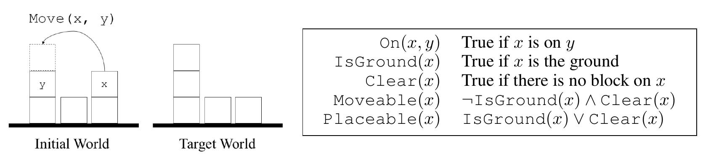
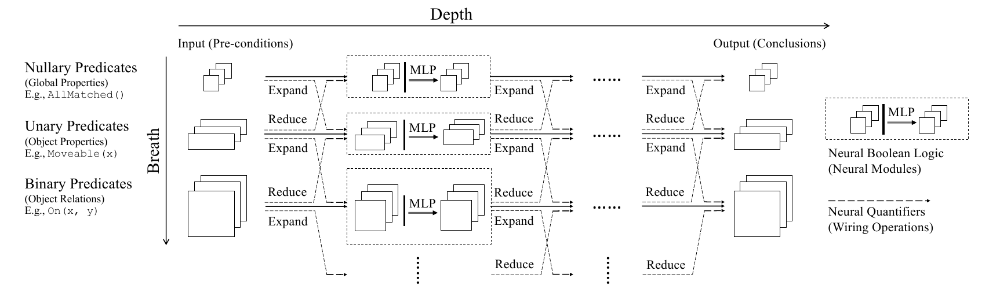
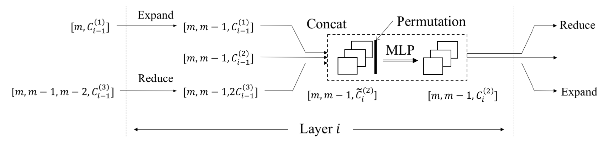

# Neural Logic Machines: 논리 규칙을 학습하는 신경망

> Honghua Dong, Jiayuan Mao, Tian Lin, Chong Wang, Lihong Li, Denny Zhou
> **ICLR 2019** — Tsinghua University (ITCS, IIIS), Google, ByteDance
> [프로젝트 페이지](https://sites.google.com/view/neural-logic-machines)

작은 배열로 학습한 모델이 긴 배열도 정렬하고, 20명짜리 가족트리로 학습한 모델이 100명짜리 가족트리에서 100% 정확도를 낸다. Neural Logic Machines(NLM)는 신경망과 논리 프로그래밍을 결합해 이런 **완벽한 일반화**를 달성한 neural-symbolic 아키텍처다.

이 글은 논문의 구조를 따라가되, 특히 **모델의 입력과 출력이 정확히 무엇인지**, 그리고 **"MLP를 모든 객체에 공유한다"는 말이 정확히 무슨 뜻인지**에 많은 지면을 할애한다. 이 두 가지가 NLM을 이해하는 데 가장 중요하면서도 오해하기 쉬운 지점이기 때문이다.

---

## 1. 이 논문이 존재하는 이유

### 1) 딥러닝의 systematicity 문제

딥러닝은 음성 인식, 이미지 분류, 기계 번역, 게임 플레이에서 큰 성공을 거뒀다. 그러나 Fodor & Pylyshyn(1988) 이래로 연결주의 모델의 **systematicity**(체계성, 예컨대 재귀적 시스템의 이해) 문제에 대한 논쟁이 계속되어 왔다.

가장 단순한 예가 배열 정렬이다. RNN은 학습 때 본 것보다 **조금만 긴 배열**도 정렬하지 못한다. 길이 10짜리로 학습한 모델에게 길이 12를 주면 무너진다. 정렬이라는 **규칙**을 배운 것이 아니라 길이 10짜리 입력의 패턴을 외운 것이기 때문이다.

### 2) 논리 시스템의 확장성 문제

반대편에는 귀납 논리 프로그래밍(ILP)이 있다. 양성 예제와 음성 예제가 주어지면, ILP 시스템은 모든 양성 예제를 함의하고 음성 예제는 하나도 함의하지 않는 규칙 집합을 학습한다. 기호와 확률을 결합하면 systematicity 같은 고차 인지 능력에서 비롯된 많은 문제가 자연스럽게 해결된다.

그러나 **조합 규칙의 탐색 공간이 지수적으로 커지기 때문에**, ILP는 작은 규칙 집합을 넘어서 확장되기 어렵다. 게다가 전통적인 ILP 방법은 탐색 공간 크기를 제한하기 위해 **사람이 손으로 만든 과제별 규칙 템플릿**을 요구한다.

### 3) Blocks World가 요구하는 네 가지

논문은 고전적인 blocks world 문제로 논의를 구체화한다.



*Figure 1. (왼쪽) blocks world의 도식. 초기 world와 목표 world가 주어지면, 에이전트는 블록을 옮겨 초기 configuration을 목표 configuration으로 변환해야 한다. (오른쪽) 논문 전체에서 blocks world를 정의하는 데 사용되는 문장들.*

블록 `x`가 moveable이고 `y`가 placeable이면 `Move(x, y)`로 `x`를 `y` 위에 올릴 수 있다. 블록 위에 다른 블록이 없으면 moveable/placeable이고, ground는 항상 placeable이다.

단순해 보이지만 이 과제를 자동으로 수행하는 학습 시스템을 만들려면 네 가지 난관이 있다.

1. **lifted rule을 복원하고 일반화해야 한다.** 특정 객체에 묶이지 않고 객체에 균일하게 적용되는 규칙을 배워, 학습 때보다 블록이 많은 world에도 일반화해야 한다.
2. **고차 관계 데이터와 양화사를 다뤄야 한다.** 이는 전형적인 그래프 신경망의 범위를 넘어선다. 예를 들어 관계 `r`의 전이성 규칙 `r(a,c) ← ∃b r(a,b) ∧ r(b,c)`를 적용하려면 **세 객체 (a,b,c)를 동시에 살펴봐야** 한다.
3. **규칙 복잡도에 대해 확장 가능해야 한다.** 전통적 ILP는 학습할 규칙 수에 대해 지수적 계산 복잡도를 겪는다.
4. **최소한의 학습 사전지식만으로 규칙을 복원해야 한다.** 손으로 만든 템플릿에 의존해서는 안 된다.

NLM의 핵심 직관은 이것이다: **논리 AND와 OR 같은 연산은 신경망으로 효율적으로 근사할 수 있고, 신경 모듈 사이의 배선(wiring)이 논리 양화사를 실현할 수 있다.**

---

## 2. 핵심 아이디어: 술어를 텐서로, 규칙을 신경 연산자로

NLM은 **Closed-World Assumption** 하의 논리 기계를 신경망으로 구현한 것이다. 기본 술어들이 객체 집합 위에 grounding되어 전제(premises)로 주어지면, NLM은 1차 논리 규칙을 순차적으로 적용해 결론(conclusions)을 도출한다.

입력이 Closed-World Assumption 하에 있다는 점은 짚어둘 만하다. **명시되지 않은 것은 "모름"이 아니라 거짓이다.** 입력은 세계에 대한 완전한 기술이지 부분적 지식베이스가 아니다.

### 1) 논리 술어 = 확률 텐서

객체 집합 $\mathcal{U} = \{u_1, u_2, \ldots, u_m\}$이 있을 때, arity가 $r$인 술어 $p(x_1, \ldots, x_r)$을 이 객체 집합 위에 grounding하면 다음 모양의 텐서가 된다.

$$[m^r, C^{(r)}] \triangleq [m,\; m-1,\; m-2,\; \ldots,\; m-r+1,\; C^{(r)}]$$

여기서 $C^{(r)}$은 arity가 $r$인 술어의 개수이고, 마지막 차원이 술어에 대응한다. 직관적으로 $[m, C^{(1)}]$ 모양의 텐서는 "객체들의 속성" 묶음이고, $[m, m-1, C^{(2)}]$ 모양의 텐서는 "객체 쌍 사이의 관계" 묶음이다.

세 가지 성질이 중요하다.

**값은 [0,1]의 실수다.** True일 확률로 해석되는 확률 텐서이며, 전제·중간결과·결론 전부 동일하다. 입력이 하드한 0/1이어도 내부는 확률로 흐른다. 이 연속 완화(relaxation) 덕분에 모델 전체가 미분 가능해진다.

**대각 원소는 제외된다.** 인수로 쓰인 객체들이 서로 배타적이어야 한다는 제약($i_j \neq i_k$)이 있다. 그래서 두 번째 차원이 $m$이 아니라 $m-1$이다. 이 제약이 표현력을 제한하지는 않는데, "빠진" 항목은 더 낮은 arity 술어의 grounding으로 표현할 수 있기 때문이다. 예를 들어 이항 술어 $p$에 대해 $p(x,x)$의 값들은 단항 술어 $p'(x) \triangleq p(x,x)$의 grounding으로 표현된다.

**객체 자체에는 아무 특징도 없다.** 이 점이 특히 중요하다. 객체는 익명 심볼이고 embedding도 ID도 없다. 정보는 100% 술어 텐서 안에만 있다.

### 2) Boolean logic = 공유 MLP

논문은 boolean logic에 대해 다음 메타 규칙을 사용한다.

$$\hat{p}(x_1, x_2, \cdots, x_r) \leftarrow \texttt{expression}(x_1, x_2, \cdots, x_r) \tag{1}$$

여기서 `expression`은 모든 변수에 걸친 술어들로 이루어진 임의의 boolean 식이고, $\hat{p}$는 결론 술어다. 예를 들어 `Moveable(x) ← ¬IsGround(x) ∧ Clear(x)`가 이 메타 규칙의 인스턴스다.

신경망 구현은 텐서 표현을 변환하는 `Permute` 연산과 그 뒤에 오는 MLP다.

$$\hat{p}(u_{i_1}, \cdots, u_{i_r}) = \sigma\Big(\text{MLP}\big(p_{1,1}(u_{i_1},\ldots,u_{i_r}), \cdots, p_{k,r!}(u_{i_1},\ldots,u_{i_r})\big);\, \theta\Big) \tag{2}$$

여기서 $\sigma$는 sigmoid, $\theta$는 학습 가능한 파라미터다. **서로 배타적인 모든 인덱스 집합에 대해 같은 MLP가 적용된다.** 따라서 $\theta$의 크기는 객체 수 $m$과 무관하다.

논문은 이 성질을 Horn clause의 암묵적 unification에 비유한다.

> 규칙 $\hat{p}(x) \leftarrow p_1(x) \wedge p_2(x)$는 암묵적으로 $\forall x\; \hat{p}(x) \leftarrow p_1(x) \wedge p_2(x)$를 의미한다.

이 문장이 NLM 전체를 떠받치고 있다. 5절에서 자세히 다룬다.

### 3) 양화사 = 배선

양화사에는 두 가지 메타 규칙이 있다. 첫 번째는 **확장(expansion)**이다.

$$\forall x_{r+1}\; q(x_1, x_2, \cdots, x_r, x_{r+1}) \leftarrow p(x_1, x_2, \cdots, x_r) \tag{3}$$

새로운 변수 $x_{r+1}$을 도입해 술어 $p$로부터 새 술어 $q$를 만든다. 이게 왜 필요한가? 다음 규칙을 보자.

```
ValidMove(x,y) ← Moveable(x) ∧ Placeable(y)
```

우변의 술어들이 **변수의 부분집합만** 인수로 받기 때문에 이 규칙은 식 (1)의 메타 규칙에 맞지 않는다. 하지만 확장과 boolean logic을 함께 쓰면 표현된다.

```
1. ∀z MoveableX(x,z) ← Moveable(x)                    (식 3)
2. ∀z PlaceableY(y,z) ← Placeable(y)                  (식 3)
3. ValidMove(x,y) ← MoveableX(x,y) ∧ PlaceableY(y,x)  (식 1)
```

신경망 구현 `Expand(·)`는 각 술어의 텐서 표현을 $(m-r)$번 복제해 새 차원에 쌓는다. 파라미터가 없다.

두 번째는 **축소(reduction)**다.

$$q(x_1, x_2, \cdots, x_r) \leftarrow \forall x_{r+1}\; p(x_1, x_2, \cdots, x_r, x_{r+1}) \tag{4}$$

여기서 $\forall$는 $\exists$로 대체될 수도 있다. 신경망 구현 `Reduce(·)`는 $x_{r+1}$ 차원을 따라 **최댓값($\exists$)과 최솟값($\forall$)을 취해 두 결과 텐서를 쌓는다.** 따라서 출력 채널이 $2C$가 된다. 역시 파라미터가 없다.

여기서 중요한 사실 하나. **모델은 $\exists$와 $\forall$ 중에 고르지 않는다.** 둘 다 계산해서 채널로 쌓아두고, 무엇이 쓸모 있는지는 뒤이은 MLP가 가중치로 판단한다.

---

## 3. 아키텍처



*Figure 2. NLM의 도식. 순전파 과정에서 NLM은 객체의 속성과 관계를 입력으로 받아 순차적 논리 연역을 수행하고, 객체들의 결론적 속성이나 관계를 출력한다. 가로축이 depth, 세로축이 breadth이며, 실선 박스가 학습되는 MLP(Neural Boolean Logic), 점선 화살표가 파라미터 없는 배선(Neural Quantifiers)이다.*

### 1) 격자 구조

NLM은 **깊이 $D$개 층(가로) × 각 층마다 $B+1$개 계산 유닛(세로)**의 격자다. 세로 유닛들은 각각 arity $0$부터 $B$까지의 술어 텐서를 담당한다.

$$\mathcal{O}_i = \left\{O_i^{(0)}, O_i^{(1)}, \cdots, O_i^{(B)}\right\}$$

$\mathcal{O}_0$이 기본 술어들의 grounding 텐서(전제)이고, 마지막 층의 $\mathcal{O}_D$가 결론이다. 층 $i$의 모든 계산 유닛은 **동시에** 작동하며 $\mathcal{O}_{i-1}$을 입력받아 $\mathcal{O}_i$를 생성한다.

층이 깊어질수록 더 높은 수준의 추상화가 형성된다. 논문의 표현을 빌리면, 1층의 출력이 `Clear(x)`를 나타낸다면 더 깊은 층은 `Moveable(x)` 같은 더 복잡한 술어를 출력할 수 있다. 따라서 **NLM의 순전파는 규칙 적용의 연쇄로 해석할 수 있다.**

### 2) Inter-group / Intra-group 계산



*Figure 3. 층 $i$의 이항 술어에 대한 NLM 내부 계산 블록. $C_i^{(j)}$는 층 $i$의 그룹 $j$의 출력 술어 수를 나타내고, $[\cdot]$는 텐서의 모양을 나타낸다.*

**Inter-group 계산**은 이전 층의 세로로 이웃한 그룹($r-1$, $r$, $r+1$)을 가져와 확장/축소로 모양을 맞춰 중간 텐서를 만든다.

$$I_i^{(r)} = \text{Concat}\left(\text{Expand}\left(O_{i-1}^{(r-1)}\right),\; O_{i-1}^{(r)},\; \text{Reduce}\left(O_{i-1}^{(r+1)}\right)\right) \tag{5}$$

연결 후 중간 텐서 $I_i^{(r)}$은 $[m^r, \widetilde{C}_i^{(r)}]$ 모양이며, 새 술어 수는

$$\widetilde{C}_i^{(r)} \triangleq C_{i-1}^{(r-1)} + C_{i-1}^{(r)} + 2C_{i-1}^{(r+1)}$$

이고 계수 2는 두 양화사($\forall$와 $\exists$)에서 온다.

주목할 점은 **Expand와 Reduce가 이웃한 arity끼리만 연결한다**는 것이다. 그룹 $r$은 이전 층의 $r-1$, $r$, $r+1$ 세 개만 받는다. unary 정보가 ternary 그룹까지 올라가려면 **두 층**이 필요하다. 이게 depth와 breadth가 함께 커지는 이유다.

**Intra-group 계산**은 식 (1)의 neural boolean logic으로 구현된다.

$$O_i^{(r)} = \sigma\left(\text{MLP}\left(\text{Permute}\left(I_i^{(r)}\right);\, \theta_i^{(r)}\right)\right) \tag{6}$$

이항 그룹의 경우 구체적으로는 각 객체 쌍 $(x,y)$에 대해

$$O_i^{(2)}(x,y) = \text{MLP}\left(\text{Concat}\left(I_i^{(2)}(x,y),\, I_i^{(2)}(y,x)\right);\, \theta_i^{(2)}\right)$$

가 되고, `Concat(·,·)`이 `Permute` 연산에 해당하며 **MLP는 모든 객체 쌍 $(x,y)$에 공유된다.**

> **논문 §2.3의 한 문장 주의.** 논문에는 *"Between layers, we use intra-group computation (Eq. 1). The predicates at each layer are grouped by their arities, and inside each group, we use inter-group computation (Eq. 3 and 4)"*라고 되어 있는데, 식 5·6과 Figure 3에 비추면 두 용어가 뒤바뀐 것으로 보인다. 실제 동작은 **arity를 가로지르는 것이 inter-group(식 3·4), 그룹 안에서 boolean을 계산하는 것이 intra-group(식 1)** 이다.

### 3) 한 층의 정확한 순서

이항 그룹($r=2$) 하나를 놓고 처음부터 끝까지 따라가면 이렇다.

```
[이전 층]   O⁽¹⁾ [m, 8]        O⁽²⁾ [m, m−1, 8]        O⁽³⁾ [m, m−1, m−2, 8]
                 │                      │                        │
   Expand  ──────┘                      │                        └────── Reduce
   변수 도입                             │                              ∃=max, ∀=min
        ↓                                ↓                                ↓
     [m,m−1,8]                      [m,m−1,8]                        [m,m−1,16]
        └──────────────── Concat ────────┴────────────────────────────────┘
                              ↓
                        I⁽²⁾ [m, m−1, 32]
                              ↓  Permute (2! 순열)
                            [m, m−1, 64]
                              ↓  MLP 64→8 + sigmoid     ← 학습되는 유일한 곳
                        O⁽²⁾ [m, m−1, 8]
                              ↓  (residual: 입력을 concat)
```

앞의 세 단계(Expand/Reduce/Concat)가 **inter-group** — arity를 맞춰서 서로 다른 항수의 술어가 한 boolean 식 안에 등장할 수 있게 만드는 일이다. 뒤의 두 단계(Permute/MLP)가 **intra-group** — 정렬된 술어들의 boolean 조합을 학습하는 일이다.

여기서 결정적인 사실: **파라미터를 가진 것은 MLP뿐이다.**

| 연산 | 역할 | 파라미터 |
|---|---|---|
| `Expand` | 변수 도입 (텐서 복제) | **없음** |
| `Reduce` | 변수 소거 (∃=max, ∀=min) | **없음** |
| `Permute` | 인수 순열 (축 전치) | **없음** |
| `MLP` + sigmoid | boolean 조합 | **학습됨** |

즉 **양화사는 배선으로 하드코딩되어 있다.** 모델이 "∃를 쓸까 ∀를 쓸까"를 탐색하는 게 아니다. 그래서 "규칙을 만들어낸다"의 실체는 **이미 arity가 정렬되어 눈앞에 놓인 술어들의 어떤 boolean 조합이 유용한 새 술어가 되는가를 MLP 가중치로 학습하는 것**이다. ILP처럼 규칙 공간을 탐색하는 게 아니라, 가능한 조합을 전부 펼쳐놓고 경사하강으로 가중치를 미는 것 — 이것이 지수적 탐색을 다항 시간으로 바꾼 트릭이다.

### 4) 표현력과 복잡도

NLM의 표현력은 네 가지 요인에 달려 있다.

1. **깊이 $D$** — 최대 연역 단계 수를 제한한다.
2. **너비 $B$** — 객체 간 관계의 arity를 제한한다. 실제로는 과제에 따라 보통 2 또는 3.
3. **층당 출력 술어 수 $C$** — 논문 §2.4는 8 또는 16 정도로 작게 잡는다고 하고, 부록 B.2는 실제 전 실험에서 **8로 고정**했다고 밝힌다.
4. **MLP의 표현력** — 얕은 네트워크에 적은 뉴런을 선호한다. 실제 설정은 **은닉층 0개**다. 논문은 이를 **논리 복잡도에 대한 저차원 정규화**로 보며, 학습된 규칙이 단순해지도록 유도한다고 밝힌다.

순전파/역전파의 계산 복잡도는 $O(m^B D C^2)$이고 파라미터는 $O(DC^2)$개다. $B$가 작은 상수라고 가정하면 **허용된 술어 수에 대해 이차(quadratic)** 다. ∂ILP의 지수적 의존성과 대비되는 지점이다.

---

## 4. 입력과 출력을 정확히

이제 이 글의 첫 번째 핵심으로 들어간다. NLM의 입력과 출력이 정확히 어떤 물건인가?

### 1) 입력과 출력은 같은 형태다

NLM은 **벡터 하나를 받아 벡터 하나를 내는 모델이 아니다.** arity별로 나뉜 $B+1$개 텐서의 집합을 받아, 같은 구조의 $B+1$개 텐서 집합을 낸다.

```
입력  O₀ = { O₀⁽⁰⁾, O₀⁽¹⁾, O₀⁽²⁾, ..., O₀⁽ᴮ⁾ }   (premises, 전제)
                    ↓  D개 층
출력  O_D = { O_D⁽⁰⁾, O_D⁽¹⁾, O_D⁽²⁾, ..., O_D⁽ᴮ⁾ }  (conclusions, 결론)
```

**입력과 출력의 구조가 동일하다는 점이 중요하다.** 그래서 층 $i$의 출력이 층 $i+1$의 입력으로 그대로 들어간다. 특별한 입력 인코더도, 출력 디코더도 없다.

| arity | 의미 | 모양 | 예시 |
|---|---|---|---|
| 0 (nullary) | 전역 속성 | `[C⁽⁰⁾]` | `AllMatched()` |
| 1 (unary) | 객체 속성 | `[m, C⁽¹⁾]` | `Moveable(x)` |
| 2 (binary) | 객체 쌍 관계 | `[m, m-1, C⁽²⁾]` | `On(x,y)` |
| 3 (ternary) | 3개 객체 관계 | `[m, m-1, m-2, C⁽³⁾]` | — |

입력과 출력의 유일한 차이는 **채널 수**다.

| | 채널 수 $C^{(r)}$ |
|---|---|
| 입력 $\mathcal{O}_0$ | **과제가 결정** (보통 1~12개) |
| 중간·마지막 층 | **8** (전 실험 고정) |

### 2) arity는 개수가 아니라 축의 개수다

여기가 가장 오해하기 쉬운 지점이다. **arity는 "개수"가 아니라 "인덱스 축의 개수"다.**

- **술어 4개** → 텐서의 **마지막 축** 크기가 4
- **arity 3** → 마지막 축 **앞에 인덱스 축이 3개**

```
출력 텐서 모양:  [ m, m−1, m−2, 4 ]
                  └─── arity 3 ───┘  └ 술어 4개
```

3항 술어 $p(x,y,z)$는 인수 슬롯이 3개이지만, 출력값이 3개인 게 아니라 **그 슬롯에 객체를 배정하는 모든 방법마다 값 하나씩**이 나온다. 술어 4개, arity 3, $m=10$이면:

```
서로 다른 객체 3개의 순서쌍 개수 = 10 × 9 × 8 = 720
총 스칼라 값 = 720 × 4 = 2,880
```

RGB 이미지에 비유하면 명확하다. "채널 3개, 2차원 이미지"가 값 6개가 아니라 $H \times W \times 3$인 것과 같다. 여기서 arity가 차원 수, 술어 수가 채널 수다.

$m-1$, $m-2$인 것은 인덱스가 서로 달라야 한다는 제약 때문이며, 그래서 arity 3은 $m \geq 3$이어야 성립한다.

NLM 전체 출력은 이런 텐서들의 묶음이다. $B=3$, $m=10$, 그룹당 술어 8개라면:

| 그룹 | 모양 | 값 개수 |
|---|---|---|
| nullary | `[8]` | 8 |
| unary | `[10, 8]` | 80 |
| binary | `[10, 9, 8]` | 720 |
| ternary | `[10, 9, 8, 8]` | 5,760 |
| | **합계** | **6,568** |

이 중 과제에 필요한 그룹 하나만 골라 head를 붙인다. `IsUncle`이면 binary 그룹만 쓰고 나머지는 버려진다 — 계산은 되지만 최종 답에는 안 쓰인다.

한 가지 구현상의 주석. 논문 표기는 $[m, m-1, m-2]$지만, 부록 F 코드에서는 `input3: [B, M, M, M, hidden_dim]`으로 **$m^3$을 그대로 저장하고 마스크로 대각을 지운다.** 그래서 메모리는 $m^r$만큼 잡히고, 논문의 복잡도 $O(m^B \cdot D \cdot C^2)$가 여기서 나온다. breadth를 2~4로 묶어두는 이유이기도 하다 — $B$를 1 올리면 텐서가 $m$배로 커진다.

### 3) 술어마다 arity는 태생적으로 고정되어 있다

입력 술어들이 여러 arity로 복제되는 것이 아니다. 술어마다 arity는 **과제가 정해준다.**

- `IsFather(x,y)` → 본래 2항
- `IsStart(x)` → 본래 1항
- `HasEdge(x,y)` → 본래 2항

입력 술어들은 **각자의 arity 그룹에 배정될 뿐**이다. Expand/Reduce로 arity를 오가는 일은 **네트워크 내부, 층과 층 사이에서만** 일어난다. 입력 단계에서는 일어나지 않는다.

실제 과제의 입력 구성은 이렇다.

| 과제 | $\mathcal{O}_0^{(1)}$ | $\mathcal{O}_0^{(2)}$ |
|---|---|---|
| Family tree (m=20) | — | `[20, 19, 4]`<br/>IsSon, IsDaughter, IsFather, IsMother |
| Graph (m=10) | `[10, k]`<br/>color one-hot | `[10, 9, 1]`<br/>HasEdge |
| Path (m=10) | `[10, 2]`<br/>IsStart, IsTarget | `[10, 9, 1]`<br/>인접행렬 |
| Blocks World | — | `[m, m−1, 12]`<br/>비교 술어 12개 |
| Sorting | — | `[m, m−1, 2]`<br/>`i<j`, `a[i]<a[j]` |

**Blocks World 입력이 특히 중요하다.** 각 객체는 원래 `world_id`, `object_id`, `coord_x`, `coord_y` 네 개의 **수치** 속성을 갖지만, NLM에 들어가는 건 이 숫자들이 아니라 **모든 객체 쌍에 대한 비교 결과인 12개 binary 술어**다.

```
SameWorldID, SmallerWorldID, LargerWorldID
SameID,      SmallerID,      LargerID
Left,        SameX,          Right      (x좌표 비교)
Below,       SameY,          Above      (y좌표 비교)
```

두 world(현재/목표)의 객체를 한 집합에 넣고 **교차 쌍까지 전부** 관계를 준다. 즉 숫자를 순서 관계로 이산화하는 전처리가 반드시 필요하다. 이것이 논문이 결론에서 인정한 한계와 직결된다 — NLM은 혈압 같은 실수 입력을 직접 못 받는다.

### 4) 비어 있는 그룹은 어떻게 되나

$B=3$인데 입력에 3항 술어가 없으면(대부분의 과제가 그렇다), $\mathcal{O}_0^{(3)}$는 비어서 시작한다. 그래도 3항 그룹은 존재하고, **1층에서 `Expand`$(\mathcal{O}_0^{(2)})$로 채워진다. 고차 관계는 주어지는 게 아니라 만들어지는 것이다.**

2-OutDegree가 이 경로를 실제로 쓴 사례다. 입력은 인접행렬(2항)뿐인데 규칙 자체가 3항을 요구한다.

```
2-OutDegree(a) ← ∃b ∃c ∀d  HasEdge(a,b) ∧ HasEdge(a,c) ∧ ¬HasEdge(a,d)
```

그래서 $B=4$, $D=5$가 필요했고, ∂ILP는 3항 intentional 술어를 감당 못 해 이 과제에서 N/A였다.

### 5) head — 채널 하나를 고르는 게 아니라 FCL을 단다

마지막 층 출력 $\mathcal{O}_D$는 여전히 술어 텐서다. 여기에 과제별 head를 붙인다. 논문 §3.2는 이렇게 적는다.

> NLM의 경우 마지막 층의 해당 출력 술어 그룹을 가져와(속성 예측이면 $O_D^{(1)}$, 관계 예측이면 $O_D^{(2)}$) **linear layer로 속성이나 관계를 분류한다.**

왜 채널 하나를 고르는 게 아니라 학습된 조합인가? **마지막 층의 8개 채널은 익명이기 때문이다.** 어느 채널이 `IsUncle`을 담당해야 하는지 모델에 알려주는 장치가 없다. 채널 번호는 가중치 초기화에 따라 아무렇게나 정해진다.

그래서 **의미를 부여하는 일 자체가 head의 역할이다.** 지도 신호가 head를 통해 역전파되면서 "8개 채널의 이 조합이 IsUncle이다"를 학습하고, 동시에 그 gradient가 아래 층들로 흘러가 애초에 유용한 8개 채널이 만들어지도록 유도한다. head가 one-hot에 가깝게 수렴하면 결과적으로 채널 하나를 고르는 것과 같아지지만, **그렇게 되도록 강제되지는 않는다.**

**이 linear layer도 모든 객체/쌍에 공유된다.** head가 쌍마다 다른 가중치를 가지면 지금까지 쌓아온 lifted 성질이 마지막 단계에서 무너진다. 아래 층이 전부 $m$에 무관해도 head가 $m$에 의존하면 $m=100$에서 쓸 수 없다. 논문이 §3.4에서 굳이 **"shared MLP"**라고 명시한 이유다.

> 각 객체 쌍의 출력 관계 술어 $O_D^{(2)}(x,y)$에 **공유 MLP**를 적용해 행동 점수 $s(x,y)$를 계산한다. `Move(x,y)`의 확률은 $\propto \exp s(x,y)$이다.

RL 과제에서는 점수를 낸 뒤 **모든 쌍에 걸쳐 Softmax**를 취해 행동 분포를 만든다. 여기가 지도학습과 갈리는 지점이다 — 지도학습은 grounding마다 독립적으로 분류하지만, RL은 grounding들끼리 경쟁시킨다.

### 6) 부수적인 점: 질의응답이 아니다

NLM은 질문 하나에 답 하나를 주는 구조가 아니다. `IsUncle`이면 **모든 객체 쌍에 대한 $m(m-1)$개 값을 한 번에** 계산해 낸다.

비교 대상인 MemNN은 실제로 질의응답 방식이었다. 객체 $x$가 아버지를 갖는지 판단하려면 `id(x)`를 질문으로 MemNN에 넣고, MemNN이 메모리에 여러 번 질의하며 은닉 상태를 갱신한 뒤, 최종 은닉 상태로 `HasFather(x)`를 분류한다. 이 차이가 성능 격차의 일부다.

---

## 5. 공유 MLP: 이 모델을 이해하는 열쇠

두 번째 핵심으로 넘어간다. "MLP를 모든 객체에 공유한다"는 말이 정확히 무슨 뜻인가?

### 1) 객체란 무엇인가

객체 집합 $\mathcal{U} = \{u_1, \ldots, u_m\}$은 **번호 말고는 아무것도 없는 익명의 심볼들**이다. 특징 벡터도, embedding도, ID도 없다.

| 과제 | 객체 하나 = | $m$ |
|---|---|---|
| Family tree | 가족 구성원 한 명 | 20 → 100 |
| Graph | 노드 하나 | 10 → 50 |
| Sorting | 배열의 **슬롯** 하나 (정수가 아니라) | 4~10 → 50 |
| Blocks World | 블록 하나 또는 ground. **두 world의 객체가 한 집합에** | 2~12 → 50 |

객체에 대해 아는 것은 **전부 술어 텐서 안에만** 있다. "3번 사람"이라는 존재 자체는 비어 있고, `IsFather(3,7)=1` 같은 관계값만이 3번을 규정한다.

이걸 확인해주는 증거가 데이터 생성 과정에 있다. 논문은 family tree에서 *"사람의 순서를 무작위로 치환한다"*, Blocks World에서 *"블록의 id를 무작위로 섞는다"*고 명시한다. 인덱스 순서에 정보가 새지 않는다는 걸 확실히 하기 위한 조치다.

### 2) MLP는 모형 전체에서 몇 개이고 어디에 있나

NLM은 깊이 $D$ × $(B+1)$개 arity 그룹의 격자이고, 이 격자의 **칸 하나마다 MLP가 정확히 하나** 있다.

```
            r=0      r=1      r=2      r=3
 층 1      θ₁⁽⁰⁾    θ₁⁽¹⁾    θ₁⁽²⁾    θ₁⁽³⁾
 층 2      θ₂⁽⁰⁾    θ₂⁽¹⁾    θ₂⁽²⁾    θ₂⁽³⁾
  ⋮
 층 D      θ_D⁽⁰⁾   θ_D⁽¹⁾   θ_D⁽²⁾   θ_D⁽³⁾
```

Blocks World는 $D=7$, $B=2$ → **21개**. 2-OutDegree는 $D=5$, $B=4$ → **25개**. 각각은 은닉층 0개, 출력 8차원짜리 아주 작은 MLP다. 그리고 앞서 봤듯 **모형에서 파라미터를 가진 것은 이 MLP들이 전부다.**

### 3) "공유"의 정확한 의미

한 칸 안에서 MLP는 **그 arity의 모든 인덱스 조합에 대해 동일한 가중치로 반복 적용**된다. 이항 그룹을 예로 들면:

$$O^{(2)}(x, y) = \sigma\Big(\text{MLP}\big(\text{Concat}(I^{(2)}(x,y),\, I^{(2)}(y,x));\, \theta^{(2)}\big)\Big) \quad \text{모든 } x \neq y \text{ 에 대해}$$

파라미터 수를 직접 세보자 ($C=8$, $B=3$ 기준).

- 이전 층에서 들어오는 중간 술어 수: $\widetilde{C}^{(2)} = C^{(1)} + C^{(2)} + 2C^{(3)} = 8 + 8 + 16 = 32$
- Permute가 $2! = 2$배로 늘림 → 입력 차원 **64**
- MLP: $64 \times 8 + 8 =$ **520개**

$m$이 20이든 100이든 이 520개는 변하지 않는다. 바뀌는 건 이 함수를 몇 번 호출하느냐뿐이다. $m=20$이면 380개 쌍에 대해, $m=100$이면 9,900개 쌍에 대해 **똑같은 520개 파라미터**가 재사용된다.

**구현상으로는 별도의 제약이 아니다.** 부록 F 코드를 보면:

```python
def neural_logic(input, hidden_dim):
    return dense(_input_permutations(input), hidden_dim, activation=tf.sigmoid)
```

`dense`는 **마지막 축에만** 작용하고 앞쪽 축들(`[batch, M, M, ...]`)에 대해서는 브로드캐스팅한다. 술어 축을 맨 뒤에 놓았기 때문에 공유가 **자동으로 따라온다**. CNN에서 커널이 모든 공간 위치에 공유되는 것과 정확히 같은 구조 — 1×1 convolution이라고 생각하면 된다. **다만 공유되는 축이 공간이 아니라 객체 튜플이다.**

### 4) Permute가 필요한 이유

MLP는 고정 길이 벡터만 받는다. 만약 쌍 $(x,y)$에 대해 $I(x,y)$만 넣어주면 `q(x,y) ← p(y,x)` 같은 규칙을 표현할 방법이 없다. 그래서 $r!$개 순열을 전부 쌓아서 넣는다.

논문의 3항 예시를 보자. 객체 $a, b, c$에 대해 $\hat{p}(a,b,c)$를 계산할 때, 모든 입력 술어 $j$에 대해

$$p_j(a,b,c),\; p_j(a,c,b),\; p_j(b,a,c),\; p_j(b,c,a),\; p_j(c,a,b),\; p_j(c,b,a)$$

6개 전부를 조건으로 받는다. 이렇게 해야 boolean meta-rule이 **인수 순서에 무관하게 완전**해진다.

대가는 $r!$ 팽창이다. 논문이 *"술어 수에 대해서는 다항식이지만 breadth에 대해서는 계승적(factorially)"*이라고 한 것이 이 지점이다. $B$를 2~4로 작게 잡는 이유이기도 하다.

### 5) 한 층의 MLP는 규칙 하나가 아니라 8개를 배운다

"규칙이 동일하다"는 말은 **어떤 객체에 적용되든 동일하다**는 뜻이지, 술어에 대해 동일하다는 뜻이 아니다.

한 층의 MLP는 규칙을 **하나** 배우는 게 아니라 **$C=8$개를 동시에** 배운다. 출력 뉴런 하나하나가 각각 별개의 규칙이기 때문이다.

```
출력 채널 1:  p̂₁(x,y) ← [입력 술어들의 어떤 boolean 조합]
출력 채널 2:  p̂₂(x,y) ← [다른 조합]
   ⋮
출력 채널 8:  p̂₈(x,y) ← [또 다른 조합]
```

$64 \times 8$ 가중치 행렬의 **열 하나가 규칙 하나**다. 그러니 "한 층 = 8개의 규칙 묶음"이고, 공유가 보장하는 것은 이 **8개 규칙 세트가 (1,2) 쌍이든 (87,43) 쌍이든 똑같이 적용된다**는 것이다.

### 6) 무엇이 공유되지 않는가

공유는 **한 칸 내부에서 객체 튜플에 대해서만** 일어난다.

- 같은 층의 다른 arity 그룹 → **다른** MLP ($\theta_i^{(1)} \neq \theta_i^{(2)}$)
- 다른 층의 같은 arity 그룹 → **다른** MLP ($\theta_1^{(2)} \neq \theta_2^{(2)}$)

층 $i+1$의 MLP는 층 $i$가 **방금 발명해낸 술어들**을 입력으로 받는다. 입력 공간의 의미 자체가 층마다 다르므로, 같은 함수일 수가 없다. 차원도 실제로 안 맞는다. residual link를 쓰면 부록 F 코드처럼

```python
outputs = [tf.concat([x, y], -1) for x, y in zip(outputs, [input0, input1, input2, input3])]
```

새로 만든 8개에 그 층의 입력이 그대로 붙으므로 **채널 수가 층마다 불어난다.** 가중치를 공유하고 싶어도 shape가 다르다.

**두 가지가 대등한 설계 결정이 아니라는 점에 주목할 만하다.**

- **객체 간 공유** = 의도적인 weight tying. 논문이 굳이 도입한 **제약**이고, 일반화의 원천이다.
- **층 간 비공유** = 그냥 보통의 깊은 신경망. 특별히 한 일이 없는 **기본값**이다.

CNN에 그대로 대응된다. 커널은 모든 공간 위치에 공유되지만(=객체), 층마다 커널은 다르다. NLM은 픽셀 공간 대신 **객체 튜플 공간 위의 CNN**이다.

### 7) 왜 이것이 곧 ∀ 인가

쌍마다 가중치가 따로 있다면 모형이 배우는 것은 "(3,7) 쌍에서는 이렇게 하라"는 **상수에 묶인 lookup table**이다. $m=20$에서 380개 쌍의 가중치를 배워봐야 $m=100$의 9,900개 쌍 중 9,520개는 학습된 적이 없다.

가중치를 공유하면 학습되는 함수 $f: \mathbb{R}^{64} \to \mathbb{R}^{8}$가 **변수에 대한 진술**이 된다. **공유가 곧 $\forall x \forall y$다.**

부수적으로 네트워크 전체가 **객체 인덱스 치환에 대해 equivariant**해진다. Expand·Reduce·Permute·공유 MLP가 전부 인덱스 대칭 연산이므로, 객체 번호를 바꿔 넣으면 출력 텐서도 똑같이 번호가 바뀔 뿐이다.

대조군을 보면 선명해진다. MemNN 실험에서는 각 객체에 0~255 범위의 이진 정수를 고유한 "이름"으로 부여했다. 거기서는 객체 정체성이 학습해야 할 특징이고, 그래서 $m=20$에서 100으로 가면 `HasFather` 정확도가 99.9%에서 59.8%로 무너진다. **NLM은 애초에 배울 이름이 없어서 무너질 것이 없다.**

---

## 6. 실험 결과

지도학습 과제에는 Softmax-Cross-Entropy를, 강화학습 과제에는 REINFORCE를 사용한다. 비교 대상은 연결주의 대표로 **MemNN**(Memory Networks), 기호주의 대표로 **∂ILP**(Differentiable ILP, 당시 SOTA ILP 프레임워크)다.

### 1) 관계 추론: Family Tree와 General Graph

모든 모델은 작은 인스턴스로 학습하고 큰 인스턴스로 테스트한다. MemNN은 Micro/Macro 정확도로 보고한다.

| Family Tree | MemNN (m=20) | MemNN (m=100) | ∂ILP (m=100) | **NLM (m=100)** |
|---|---|---|---|---|
| HasFather | 99.9%/99.9% | 59.8%/65.2% | 100% | **100%** |
| HasSister | 86.3%/85.5% | 59.8%/66.4% | 100% | **100%** |
| IsGrandparent | 96.5%/84.7% | 97.7%/63.7% | 100% | **100%** |
| IsUncle | 96.3%/85.8% | 96.0%/64.0% | 100% | **100%** |
| IsMGUncle | 99.7%/98.4% | 98.4%/81.7% | 100% | **100%** |

| General Graph | MemNN (m=10) | MemNN (m=50) | ∂ILP (m=50) | **NLM (m=50)** |
|---|---|---|---|---|
| AdjacentToRed | 95.2%/94.6% | 93.1%/91.9% | 100% | **100%** |
| 4-Connectivity | 92.3%/90.5% | 81.3%/88.0% | 100% | **100%** |
| 6-Connectivity | 67.6%/58.8% | 43.9%/67.9% | 100% | **100%** |
| 1-OutDegree | 99.8%/99.7% | 78.6%/81.2% | 100% | **100%** |
| 2-OutDegree | 81.4%/61.8% | 96.7%/87.7% | **N/A** | **100%** |

높을수록 좋다. 읽어낼 점이 셋이다.

첫째, **NLM과 ∂ILP 모두 100%를 달성**한다. 관계 추론 자체는 기호적 접근으로도 풀리는 문제다. 둘째, **MemNN은 크기가 커지면 무너진다.** `HasFather`가 99.9% → 59.8%로 떨어지는 것이 단적인 예다. 셋째, **∂ILP는 2-OutDegree에서 N/A다.** 3항 intentional 술어가 필요한데 메모리 제약으로 감당하지 못한다. 여기서 NLM만 살아남는다.

참고로 `IsMGUncle`(maternal great uncle)은 DNC(Differentiable Neural Computer) 논문에서도 사용한 관계다. "분류"가 아니라 "찾기" 과제로 설정을 최대한 복제했을 때 DNC는 81.8% 정확도에 그친다.

### 2) 의사결정: Blocks World, Sorting, Path

여기서 진짜 격차가 벌어진다. 두 지표를 `/`로 구분해 보고한다 — **과제 완수 확률**과 **완수했을 때 평균 이동 횟수**다. 모든 모델은 $m \leq 12$로 학습했다.

| 과제 | MemNN (m=10) | MemNN (m=50) | **NLM (m=10)** | **NLM (m=50)** |
|---|---|---|---|---|
| Blocks World | 0% / N/A | 0% / N/A | **100% / 12** | **100% / 84** |
| Sorting | 100% / 22 | 90% / 986.6 | **100% / 8** | **100% / 45** |
| Path | 45% / 13.3 | 12% / 42.7 | **100% / 4** | **100% / 4** |

완수 확률은 높을수록, 이동 횟수는 적을수록 좋다. ∂ILP는 **아예 확장이 안 되어 결과가 없다.** MemNN은 최대 $m \times 4$ 이동 안에 blocks world를 완수하지 못한다.

Sorting에서 $m=50$일 때 MemNN이 986.6회, NLM이 45회다. 20배 이상 차이다. 흥미로운 점은 **하이퍼파라미터와 랜덤 시드에 따라 학습된 알고리즘이 Selection Sort, Bubble Sort 등으로 해석 가능**했다는 것이다.

Path 과제는 DNC와 직접 비교된다. Graves et al.(2016)에서 DNC는 유사한 설정에서 55.3% 확률로 최단 경로를 찾는다. 그런데 논문은 이를 **지도학습(예측)이 아니라 강화학습(의사결정)** 과제로 더 어렵게 만들었다 — 에이전트가 경로를 따라 다음 노드를 반복적으로 선택하고 실제로 이동한다. 그 조건에서 NLM은 100%다.

### 3) 학습 방법: 시험과 실패로 안내되는 커리큘럼

NLM 학습이 쉽지는 않다. 논문은 인간의 교육 시스템에서 착안한 **exam-guided curriculum learning**을 쓴다.

학습 인스턴스를 복잡도별로 묶어 "수업(lesson)"을 만들고(Blocks World면 블록 개수), 쉬운 수업부터 제시한다. 주기적으로 같은 복잡도의 새 인스턴스로 "시험"을 보고, 정확도가 임계값을 넘으면 다음 수업으로 **진급**한다. 마지막 수업의 임계값은 100%이고, 이전 수업들은 과적합 방지를 위해 0.5%씩 선형으로 낮춘다.

또 하나의 필수 요소는 **실패 사례 기록**이다. 에이전트가 성공한 인스턴스와 실패한 인스턴스를 각각 pool에 모아두고, 확률 $\Omega$로 성공 pool에서, $1-\Omega$로 실패 pool에서 균형 샘플링한다. 이 전략이 모델이 국소 최적에 갇히는 것을 막는다.

과제별 난이도는 graduation ratio(10번의 서로 다른 시드 중 성공 비율)에서 드러난다.

| 과제 | Depth | Breadth | Residual | **Graduation** |
|---|---|---|---|---|
| HasFather | 4 | 3 | ✗ | 100% |
| IsMGUncle | 4 | 3 | ✗ | **20%** |
| 6-Connectivity | 8 | 3 | ✓ | 60% |
| 2-OutDegree | 5 | 4 | ✓ | 100% |
| Sorting | 3 | 2 | ✓ | 100% |
| Path | 5 | 3 | ✓ | 60% |
| Blocks World | 7 | 2 | ✓ | **40%** |

`IsMGUncle`의 20%는 무작위 생성 데이터에서 해당 관계가 상대적으로 희소하기 때문이다. 학습 예제의 최대 인원을 30명으로 늘리면 50%로 오른다.

정확도의 신뢰도에 대해서는, Blocks World의 특정 학습 모델을 100,000개 샘플로 테스트해 실패 사례가 하나도 없었고, Chernoff bound의 곱셈 형태에 따라 **정확도가 최소 99.98%임을 99.7% 신뢰도로** 주장한다.

---

## 7. 한계와 열린 질문

### 1) 재귀 불가 — 층 간 비공유의 대가

앞서 층끼리 파라미터를 공유하지 않는다고 했다. 이는 그냥 설계상의 사소한 선택처럼 보이지만, 직접적인 결과가 있다. **NLM은 같은 규칙을 반복 적용하는 재귀를 표현하지 못한다.** 부록 D가 이를 전제로 깔고 있다.

> NLM에서는 유한한 경우만 고려한다. 따라서 규칙들 사이에 술어의 **순환 참조가 존재해서는 안 된다.** 순환 참조 지원으로의 확장은 future work로 남긴다.

증거가 하이퍼파라미터 표에 그대로 있다.

| 과제 | Depth |
|---|---|
| 4-Connectivity | 4 |
| 6-Connectivity | **8** |

전이성(transitivity) 규칙 하나를 배워서 여섯 번 돌리면 될 일을, **hop 수가 늘어나면 층을 더 쌓아야** 한다. 층이 가중치를 공유했다면 recurrent한 반복 연역이 되어 깊이와 무관해졌을 텐데, 그러지 않았기 때문에 각 추론 단계가 자기 파라미터를 따로 소비한다.

같은 뿌리에서 **깊이 $D$를 사람이 미리 정해야 한다**는 문제도 나온다. 모델이 "이 문제는 세 단계면 충분하네"라고 스스로 판단하지 못한다. 논문이 첫 번째 future work로 적응적 깊이 선택을 꼽은 이유다.

### 2) 실수 입력 불가

NLM은 기호 입력을 요구하는데, 이는 혈압 같은 많은 입력이 실수인 의료 등의 응용에서 쉽게 확보되지 않는다. Blocks World에서 좌표를 12개 비교 술어로 이산화해야 했던 것이 그 증상이다.

다만 **부분적인 탈출구는 있다.** NLM은 완전 미분 가능하므로 입력 술어를 다른 신경망의 출력으로 대체할 수 있다. 부록 C에서 논문은 `AdjacentToRed`를 `AdjacentToNumber0`으로 바꿔, 각 노드에 MNIST 이미지를 주고 LeNet이 뽑은 길이 10의 sigmoid 벡터를 **unary 술어 텐서로 그대로 사용**했다. LeNet과 NLM을 joint로 학습해 $m=10$ 훈련 → $m=50$ 테스트에서 **99.4%**를 얻었다.

입력과 출력의 형식이 같기 때문에 이런 접합이 가능하다는 점을 다시 확인할 수 있다.

### 3) 학습된 규칙을 읽을 수 없다

ILP는 규칙을 설명 가능한 형식으로 학습하지만, **NLM이 학습한 규칙은 신경망의 가중치로 암묵적으로 인코딩된다.** 사람이 읽을 수 있는 규칙을 추출하는 것은 의미 있는 future work라고 논문은 적는다.

그래서 `Clear(x)`, `Moveable(x)` 같은 예시는 논문이 이해를 돕기 위해 든 것일 뿐, "3번 채널이 Clear를 학습했다"고 확인된 것이 아니다. 모델이 층마다 만드는 것은 $C=8$개의 **익명 채널**이다.

정확도 검증도 그래서 간접적이다. 논문은 *"전통적 ILP 시스템처럼 유도된 규칙을 들여다봐서 NLM의 정확도를 직접 증명할 수는 없다"*며, 대신 테스트 샘플링으로 경험적으로 추정한다고 밝힌다.

**ILP는 규칙을 명시적으로 내놓는 대신 확장이 안 되고, NLM은 확장되는 대신 규칙이 보이지 않는다. 이 교환이 논문의 본질적 거래다.**

### 4) 객체 수 상한

모든 술어가 텐서로 표현되기 때문에 **객체/엔티티나 관계의 수가 작은 값(예: 1000 미만)으로 제한되어야 한다.** 이는 지식베이스 추론용으로 개발된 시스템들과 어느 정도 대비되는 지점이며, 논문은 대규모 엔티티 집합으로의 확장성을 future work로 남긴다.

$O(m^B)$ 복잡도를 생각하면 당연한 귀결이다. $B=3$에 $m=1000$이면 이미 $10^9$ 규모의 텐서다.

### 5) 학습의 어려움

NLM 학습은 여전히 간단하지 않으며 커리큘럼 학습 같은 기법을 써야 한다. 논문은 **NLM을 최적화하는 효과적이면서도 더 단순한 대안을 찾는 것이 중요하다**고 적는다. Blocks World의 graduation 40%, `IsMGUncle`의 20%가 그 어려움을 수치로 보여준다.

---

## 8. 정리

NLM을 한 문장으로 압축하면 이렇다.

> **알고 있는 사실들을 확률 텐서로 놓고, 양화사는 배선으로 고정한 채 boolean 조합만 학습하는 층을 $D$번 쌓아 forward chaining을 흉내내되, 그 층의 MLP를 모든 객체에 공유함으로써 학습된 것이 특정 객체가 아닌 lifted rule이 되도록 강제한 모델.**

설계의 핵심 선택들을 되짚으면:

| 선택 | 결과 |
|---|---|
| 술어를 텐서로 표현 | 미분 가능, 신경망과 접합 가능 |
| 양화사를 배선으로 고정 | 탐색 공간 제거 → 지수 복잡도가 다항으로 |
| ∃와 ∀를 둘 다 계산 | 선택을 학습으로 미룸 |
| **MLP를 객체에 공유** | **파라미터가 $m$과 무관 → 완벽한 일반화** |
| MLP를 층 간 비공유 | 재귀 표현 불가, 깊이가 고정 예산 |
| $C=8$로 좁게 유지 | 논리 복잡도 정규화, 단순한 규칙 유도 |
| 모든 값을 [0,1] 연속값으로 | 미분 가능성 획득, 규칙 해석성 상실 |

NLM의 인상적인 일반화는 표현력을 일부러 좁힌 대가로 얻은 것이다. 이 점을 기억하면 논문의 강점과 한계가 같은 뿌리에서 나온다는 것이 보인다.

논문은 다음 연구 방향들을 남긴다. 문제에 맞는 깊이를 적응적으로 선택하는 모델, 실수 성분을 가진 벡터 입력의 처리, 커리큘럼 학습 없이도 되는 더 단순한 최적화 기법, 그리고 학습된 신경망으로부터 사람이 읽을 수 있는 규칙을 추출하는 방법이다.

---

### 참고

- 논문: [Neural Logic Machines (ICLR 2019)](https://arxiv.org/abs/1904.11694)
- 프로젝트 페이지: https://sites.google.com/view/neural-logic-machines (학습된 정렬 알고리즘 시연 영상 포함)
- 부록 F에 TensorFlow로 작성된 breadth 3짜리 NLM 층의 최소 구현이 실려 있다. 40여 줄로 전체 메커니즘이 들어간다.
