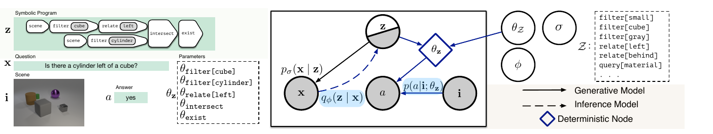
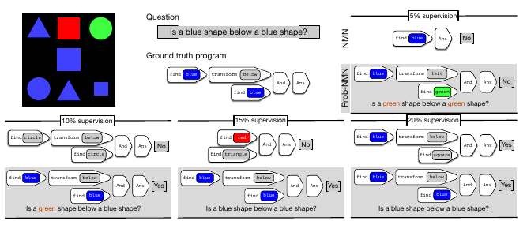
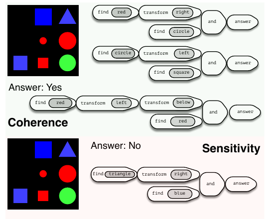

# 프로그램을 확률변수로: Prob-NMN 읽기

> **Probabilistic Neural-symbolic Models for Interpretable Visual Question Answering**
> Ramakrishna Vedantam, Karan Desai, Stefan Lee, Marcus Rohrbach, Dhruv Batra, Devi Parikh
> ICML 2019 · Facebook AI Research / Georgia Tech

Visual Question Answering(VQA)에서 "이 모델이 왜 그렇게 답했는가"를 프로그램 형태로 보여주려는 시도는 꽤 오래됐다. Neural Module Network 계열이 그것이다. 이 논문은 거기에 한 가지를 바꾼다 — **프로그램을 확률변수로 만든다.** 바꾸는 건 하나인데 따라 나오는 결과가 둘이다. 적은 지도 데이터로도 읽을 수 있는 프로그램이 나오고, 모델의 추론을 거꾸로 캐물을 수 있게 된다.

이 글은 논문을 처음부터 훑기보다, 실제로 읽으면서 걸렸던 지점들 — z가 정확히 뭔지, p(z)는 왜 필요한지, 왜 학습을 3단계로 쪼갰는지 — 을 중심으로 정리한 것이다.

---

## 1. 문제의식

기존 neural-symbolic VQA 모델(NMN, N2NMN 등)은 질문 → 프로그램 → 답변 파이프라인을 **결정론적**으로 다룬다. 이 때문에 두 가지가 막힌다.

첫째, 프로그램 지도 데이터가 적으면 생성되는 프로그램이 질문의 의도를 제대로 반영하지 못한다. 프로그램 어노테이션은 비싸다 — 사람이 질문 하나하나에 "이 질문은 이런 연산을 이 순서로 조합해야 한다"를 붙여줘야 한다. 그런데 그게 적으면 모델이 뱉는 프로그램은 금세 무너진다.

둘째, 모델의 추론 과정을 역으로 캐물을 방법이 없다. z가 결정론적 함수 z = f(x)라면 뒤집을 분포 자체가 없기 때문이다.

논문이 겨냥하는 두 개념이 여기서 나온다. 하나는 **data-efficient legibility** — 적은 teaching example로도 프로그램이 질문의 의도를 명확히 전달하는가. 저자들은 로봇 모션의 legibility 개념(Dragan et al., 2013)에서 이 표현을 빌려온다. 다른 하나는 **coherence와 sensitivity** — 모델의 믿음을 직접 조회할 수 있는가.

---

## 2. 핵심 아이디어: 프로그램을 잠재변수로

**함수형 프로그램 z를 확률적 잠재변수로 취급**한다. 이미지 i가 주어졌을 때 결합분포를 다음과 같이 분해한다.

$$p(x, z, a \mid i) = p(z)\, p(x \mid z)\, p(a \mid i; \theta_z)$$

각 항의 의미는 이렇다. **p(z)** 는 프로그램의 사전분포, **p(x|z)** 는 프로그램에서 질문을 생성하는 디코더, **p(a|i;θ_z)** 는 프로그램을 이미지에 실행해 답을 내는 실행기다. 여기에 더해 질문에서 프로그램을 역추정하는 추론망 **q_φ(z|x)** 가 있다.

생성 스토리로 읽으면 이렇다. 프로그램 z를 먼저 샘플링하고, 그로부터 질문 x를 생성한다. 그리고 z와 이미지 i로 답 a를 생성한다. z의 각 심볼(`filter[cube]`, `relate[left]` 등)은 각각 신경망 모듈 θ_z를 인스턴스화한다.



*논문 Figure 1. 왼쪽은 실제 예시 — 질문 "Is there a cylinder left of a cube?"에 대한 심볼 프로그램과 그것이 호출하는 모듈 파라미터들. 오른쪽은 plate notation으로 그린 그래피컬 모델. 실선은 생성 모델, 점선은 추론 모델, 파란 다이아몬드 θ_z는 결정론적 노드다. 기존 NMN은 이 그래프에서 파란색으로 표시된 부분집합만 갖는다.*

여기서 놓치기 쉬운 게 하나 있다. **생성 방향에서는 프로그램이 질문보다 먼저 온다.**

```
생성(generative):   z → x           프로그램을 뽑고, 그로부터 질문을 만든다
                    (z, i) → a

추론(inference):    x → z           q_φ(z|x). 질문을 보고 프로그램을 역추정
```

우리가 직관적으로 떠올리는 "질문을 파싱해서 프로그램을 만든다"는 **추론 경로**이지 생성 모델의 이야기가 아니다. 생성 스토리는 오히려 "머릿속에 어떤 추론 계획 z가 먼저 있고, 그걸 자연어로 발화한 게 질문 x다"에 가깝다. 이 방향 때문에 p(z)가 조건부일 수 **없다**. 루트 노드니까.

---

## 3. 함수형 프로그램 z란 정확히 무엇인가

### 1) 트리이자 시퀀스

논문 2절 도입부의 정의는 이렇다.

> z be the **prefix serialization of a program**. 즉 z = (z₁, ⋯, z_T), z_t ∈ Z, Z는 program token vocabulary.

핵심은 **z가 두 얼굴을 가진다**는 점이다.

- **의미론적으로는 트리** — 각 노드가 시각적 연산자인 tree-structured graph
- **표현상으로는 토큰 시퀀스** — 그 트리를 prefix(전위) 순회로 직렬화한 것

트리를 시퀀스로 펴는 이유는 q_φ(z|x)와 p_σ(x|z), p(z)가 모두 **LSTM**이기 때문이다. LSTM은 트리를 직접 뱉을 수 없으므로, 트리를 유일하게 복원 가능한 토큰열로 바꿔놓고 seq2seq 문제로 푼다.

### 2) 프로그램 토큰 Z의 구성

토큰은 arity(인자 개수)에 따라 나뉜다. 이 arity가 트리 구조를 결정하므로, prefix 직렬화만으로 원래 트리를 유일하게 복원할 수 있다 — 폴란드 표기법과 동일한 원리다.

| arity | 토큰 예 | 입력 → 출력 |
|---|---|---|
| 0 | `scene` | (없음) → 이미지 전체 attention |
| 1 | `filter[cube]`, `find[blue]`, `filter[gray]` | attention → attention |
| 1 | `relate[left]`, `transform[below]`, `relate[behind]` | attention → attention |
| 2 | `intersect`, `And` | attention × attention → attention |
| 1 (종결) | `exist`, `query[material]`, `Answer` | attention → 답변 분포 |

CLEVR은 이 vocabulary가 **40개 토큰**, 프로그램 최대 길이 25다. SHAPES는 **12개 토큰**, 길이 4~6.

### 3) 입력 예제 ① — CLEVR

**질문 x:** "Is there a cylinder left of a cube?"

**프로그램 트리:**

```
                    exist
                      |
                  intersect
                 /          \
        relate[left]      filter[cylinder]
              |                  |
       filter[cube]            scene
              |
            scene
```

**prefix serialization z (모델이 실제로 다루는 형태):**

```
z = [ exist, intersect, relate[left], filter[cube], scene,
      filter[cylinder], scene ]
```

**실행 과정:** 각 토큰 z_t가 자기 파라미터 θ_{z_t}를 가진 작은 CNN을 인스턴스화한다. `scene`으로 이미지 attention을 시작한다. θ_filter[cube]가 큐브 영역에 attention을 주고, θ_relate[left]가 그 왼쪽 영역으로 attention을 옮긴다. 다른 가지에서 θ_filter[cylinder]가 실린더 영역을 잡고, θ_intersect가 두 attention을 결합한다. 마지막으로 θ_exist가 답 `yes`를 출력한다.

여기서 결정적인 점이 하나 있다. **θ_z는 z가 정해지면 결정론적**이다 — Figure 1에서 파란 다이아몬드로 그려진 deterministic node가 그것이다. 확률적인 건 z 자체이고, θ_z는 z에 따라 모듈들을 조립한 결과일 뿐이다.

### 4) 입력 예제 ② — SHAPES

SHAPES는 vocabulary가 훨씬 작아서 구조를 보기 좋다.

**질문 x:** "Is a blue shape below a blue shape?"

**정답 프로그램 (트리):**

```
              Answer
                |
               And
              /    \
   transform[below]  find[blue]
          |
     find[blue]
```

**prefix serialization z:**

```
z = [ Answer, And, transform[below], find[blue], find[blue] ]
```

**답변 a:** `Yes`

### 5) z는 "답의 논리식"이 아니라 "답을 구하는 절차"

이 구분이 중요하다. z에는 **답에 대한 정보가 없다.**

위의 CLEVR 프로그램을 이미지 A에 실행하면 `yes`, 이미지 B에 실행하면 `no`가 나온다. z는 질문만의 함수이고 — p(z)는 i와 독립으로 가정된다 — 답은 z와 i를 **함께** 넣어야 나온다.

논문이 독립성 가정 **a ⊥ x | i, z**를 강조하는 이유가 여기 있다. 프로그램이 질문과 답 사이를 완전히 매개해야 프로그램이 답의 진짜 설명이 된다. 뒤에서 다시 보겠지만, 이 가정이 무너지면 프로그램은 장식으로 전락한다.

그러니 z는 "질문을 실행 가능한 형태로 번역한 것" 또는 "reasoning plan"으로 읽는 게 정확하다.

### 6) 분포와 표본을 구분해야 한다

z를 "vocabulary에 대한 확률분포의 시퀀스"라고 뭉뚱그리기 쉬운데, 여기서 한 겹을 더 나눠야 한다. 논문 Lemma 1이 Π를 따로 도입하는 지점이 정확히 이곳이다.

**q_φ(z|x)라는 분포는** 각 시점 t마다 categorical 파라미터 π_t를 내놓는다. Lemma 1 원문:

> let z_t, the token at the t-th timestep in a sequence z be distributed as a categorical with parameters π_t. Let us denote Π = {π_t}ᵀ_{t=1}

**z 자체는** 거기서 뽑은 표본, 즉 **hard token의 시퀀스**다. 실행되는 건 이쪽이다.

```
분포:  q_φ(z|x) = [π₁, π₂, ..., π_T]        각 π_t ∈ 확률 단체
표본:  z        = [exist, intersect, ...]    각 z_t ∈ Z (이산 심볼)
```

모듈을 조립할 때는 "70% filter[cube] + 30% filter[sphere]"를 인스턴스화할 수 없다. 하나의 토큰이 확정되어야 하나의 CNN이 정해진다. 그래서 z가 이산이고, 그래서 기대값이 φ에 대해 미분 불가능하며, 그래서 **REINFORCE**가 필요하다. "분포의 시퀀스"로 뭉뚱그리면 이 논문의 기술적 난점 전체가 사라져버린다.

### 7) 토큰 ↔ 신경망 모듈은 1:1 대응

$$\theta_z = \{\theta_{z_t}\}_{t=1}^{T}$$

> given a symbol in the program, say `find[green]`, the model instantiates parameters θ_find[green]

여기서 대문자와 소문자를 구분해야 한다. 논문이 표기를 나눠 쓴다.

| | 정체 | 크기 | 성질 |
|---|---|---|---|
| **θ_Z** | 어휘 Z의 **모든** 모듈 파라미터 은행 | 고정 (CLEVR 40개, SHAPES 12개) | **학습 대상** |
| **θ_z** | 특정 프로그램 z가 호출한 모듈들을 트리대로 **조립한 것** | z마다 다름 | z가 정해지면 **결정론적** |

즉 θ_Z는 **부품 창고**, θ_z는 **그 창고에서 z의 설계도대로 조립한 기계**다.

여기서 두 가지가 따라온다. 하나는 **파라미터 공유** — `find[blue]`가 등장하는 모든 프로그램이 같은 θ_find[blue]를 쓴다. 한 프로그램 안에서 두 번 나와도 같은 가중치다. 위 SHAPES 예제의 두 `find[blue]`는 동일 모듈이고, 두 호출 지점의 그래디언트는 합산되어 한 번 적용된다. RNN이 시점마다 같은 가중치를 쓰는 것과 동일한 상황이다.

다른 하나는 **조합적 일반화** — 학습 때 본 적 없는 토큰 조합도 각 모듈이 제대로 학습되어 있으면 실행된다. SHAPES가 compositionally novel 질문을 test에 두는 이유가 이걸 검증하기 위해서다.

덧붙여, θ_z는 θ_Z의 사본이 아니라 **참조**다. 논문이 "instantiate"라는 동사를 쓰는 것도 이 때문이다. 임베딩 테이블을 학습할 때 "조회한 벡터를 업데이트한 뒤 테이블에 다시 써넣는" 단계가 없는 것과 같다. forward에서 계산 그래프가 θ_Z의 텐서를 직접 참조하고, backward는 그 텐서로 곧장 흘러든다. 학습되면서 동시에 반영되는 것이지, 분해해서 되돌려놓는 작업이 따로 있는 게 아니다.

### 8) 왜 조합이 자유로운가: 중간 타입의 단일화

모듈을 임의로 결합하려면 입출력 규격이 맞아야 한다. 그 규격 — arity와 타입 시그니처 — 은 토큰마다 **사람이 미리 정의한다.**

```
scene                    : ()                      → Attention
find[A] / filter[A]      : Attention               → Attention
transform[R] / relate[R] : Attention               → Attention
And / intersect          : Attention × Attention   → Attention
Answer / exist / query[P]: Attention               → AnswerDist
```

논문 본문의 서술이 이와 부합한다.

> the parameters θ_z for symbols z parameterize small, deep convolutional neural networks which **optionally** take as input an **attention map** over the image

"optionally"가 단서다 — attention을 받는 모듈과 받지 않는 모듈(`scene`, arity 0)이 나뉜다는 뜻이다. 다만 텐서 형태나 각 모듈의 층 구성 같은 상세는 Appendix로 넘겼다.

여기가 진짜 요령인데, **모든 중간 표현이 같은 타입(고정 크기 attention map)이다.** `transform[below]`는 자기 입력이 `find[blue]`에서 왔는지 `And`에서 왔는지 알 필요가 없다. 규격이 같으니 그냥 받는다. 덕분에 트리 모양이 프로그램마다 달라도 동일한 모듈 은행으로 커버되고, 처음 보는 조합도 배선만 하면 실행된다.

그리고 같은 arity 표가 서로 다른 목적으로 두 번 쓰인다.

```
z = [Answer, And, transform[below], find[blue], find[blue]]   ← LSTM이 뱉은 평평한 토큰열
        │
        │  ① arity로 prefix 파싱 (폴란드 표기법)
        ▼
      트리 구조 복원
        │
        │  ② 타입 시그니처로 모듈 배선
        ▼
      θ_z (실행 가능한 네트워크)
```

①이 없으면 토큰열을 트리로 되돌릴 수 없고, ②가 없으면 어느 출력이 어느 입력으로 가는지 정할 수 없다.

---

## 4. 문법 사전분포 p(z)

### 1) 한 줄 요약

p(z)는 **"프로그램 언어의 어법을 배운 언어모델"**이다. 어떤 질문에 대응하는지는 전혀 모르고, 오직 **"이런 토큰 배열은 프로그램으로 말이 된다 / 안 된다"**만 안다.

### 2) 문법책 vs. 번역 사전

영한 번역기를 만든다고 하자. 필요한 게 두 가지다.

| | 만드는 비용 | 아는 것 |
|---|---|---|
| **영어 문법책** | 쌈 — 문법 규칙만 알면 올바른 영어 문장을 무한히 찍어낼 수 있음 | "The cat sat on the mat"은 영어답다. "Cat the mat on sat the"는 아니다 |
| **영한 대역 쌍** | 비쌈 — 사람이 한 문장씩 대응시켜야 함 | "고양이가 매트에 앉았다" ↔ "The cat sat on the mat" |

p(z)가 **문법책**이고, 지도 데이터 {xⁿ, zⁿ}이 **대역 쌍**이다. 문법책은 사람 손을 전혀 타지 않는다 — 규칙이 이미 형식적으로 정의돼 있으니 컴퓨터가 알아서 문장을 뽑아낼 수 있다.

### 3) SHAPES에서 1,848개가 나오는 과정

SHAPES의 프로그램 문법을 prefix 형태로 쓰면 대략 이렇다. (논문이 문법을 명시하진 않았고, Figure 2·3에 등장하는 토큰과 |Z| = 12라는 수치로부터 재구성한 것이다.)

```
Program → Answer Expr
Expr    → And Expr Expr           (arity 2)
        | transform[R] Expr       (arity 1)
        | find[A]                 (arity 0)

R ∈ {left, right, above, below}                      … 4개
A ∈ {red, green, blue, circle, square, triangle}     … 6개
```

토큰 수를 세면 find 6 + transform 4 + And 1 + Answer 1 = **12개**로, 논문의 |Z| = 12와 맞아떨어진다.

이제 이 규칙을 **기계적으로 전개**해서 길이 4~6짜리 프로그램을 전부 나열한다.

```
Answer transform[left] find[red]
Answer transform[left] find[blue]
...
Answer And transform[below] find[blue] find[blue]   ← Figure 2의 정답
Answer And transform[below] find[blue] find[green]
Answer And transform[left]  find[red]  find[circle]
Answer And transform[right] find[square] find[triangle]
...
```

색·모양 6가지 × 관계 4가지 × 트리 모양 몇 종류를 다 조합하면 **1,848개**가 나온다. 사람은 한 명도 개입하지 않았다. 이 1,848개로 LSTM을 maximum likelihood 학습시킨 게 p(z)이고, 이후 **고정**된다.

여기가 핵심인데, 시뮬레이션으로 뽑은 건 z **뿐**이다.

```
문법 시뮬레이션 결과:   z = [Answer, And, transform[below], find[blue], find[blue]]
                       x = ???  ← 없음. 필요 없음.
```

p(z)는 주변분포라서 질문이 필요 없다. 반면 q_φ(z|x)를 지도학습하려면 반드시 (x, z) **쌍**이 있어야 하고, 그건 사람이 붙여야 한다. 그래서 SHAPES에서 5~20%, CLEVR에서 0.143%만 쓴다.

### 4) p(z)가 실제로 하는 일: 탐색 공간 가지치기

SHAPES에서 길이 4~6인 **아무 토큰 배열**의 수는 12⁴ + 12⁵ + 12⁶ ≈ **3,255,552개**다. 이 중 실제로 파싱되는 프로그램은 **1,848개**, 약 **0.06%**다.

나머지 99.94%는 이런 쓰레기다.

```
[find[blue], find[blue], And, And, transform[left]]      ← And의 인자가 모자람. 트리로 파싱 불가
[Answer, Answer, find[red], transform[above], And]       ← Answer가 두 번, 구조 붕괴
[transform[left], transform[left], transform[left], ...] ← find가 없어 attention 시작점 없음
```

**p(z)가 없다면** q_φ(z|x)는 무라벨 질문에 대해 이런 배열을 자유롭게 뱉는다. 실행조차 안 되므로 모듈 학습이 시작되지 못한다. p(z)를 걸어두는 실질적 이유는 벌점이 아니라 **실행 가능성**의 문제다.

다만 p(z)는 하드한 문법 검사기가 아니라는 점은 짚어둘 만하다. LSTM을 MLE로 학습한 결과물이므로 "유효/무효" 이진 판정기가 아니라 **부드러운 확률분포**다. 문법 위반은 금지되는 게 아니라 비싸진다. 시뮬레이션 집합에 특정 조합이 더 자주 나오면 p(z)는 그 **통계적 편향까지** 학습한다.

### 5) 무조건부 prior라는 것의 의미

$$p(x, z, a \mid i) = \underbrace{p(z)}_{\text{조건부 없음}} \cdot p(x \mid z) \cdot p(a \mid z, i)$$

z가 맨 앞에 있고 조건부가 없다. x에도 i에도 의존하지 않는 **무조건부 주변분포**다.

i와 독립인 건 **가정**이고, 대가가 있다. 논문 각주 1이 이걸 자백한다.

> this model assumes **independence of programs from images**, which corresponds to the **weak sampling** assumptions in concept learning (Tenenbaum, 1999)

즉 "이미지가 뭐든 사람은 똑같은 분포로 질문한다"고 가정한 것이다. 현실은 아니다 — 빨간 공만 있는 사진에 "실린더가 큐브 왼쪽에 있나?"라고 묻지는 않는다. 이걸 **question premise** 문제라 부르고, 각주는 해법도 같이 제시한다.

> one can handle question premise ... by **reparameterizing the answer variable to include a relevance label**

답변 변수에 "이 질문이 이 이미지에 적절한가" 라벨을 끼워 넣으면 p(z)를 무조건부로 두면서도 처리 가능하다는 것이다. 이 논문에서 구현하지는 않았다.

---

## 5. 3단계 학습

데이터셋은 D = {xⁿ, zⁿ}ᴺ ∪ {xᵐ, aᵐ, iᵐ}ᴹ이고 N ≪ M이다. N개는 질문에 프로그램이 달린 teaching set, M개는 질문·이미지·답만 있는 VQA set이다. 즉 z는 **부분적으로만 관측되는** 잠재변수다.

학습은 {θ_Z, σ, φ}를 추정하는 것이고, 논문은 이를 stage-wise로 나눈다.

### 1) 1단계: Question Coding

$$\sum_m \log p(x_m) \geq \sum_m \mathbb{E}_{z \sim q_\phi(z|x_m)}\Big[\log p_\sigma(x_m|z) - \beta \log q_\phi(z|x_m) + \beta \log p(z)\Big] = U_{qc} \tag{1}$$

$$\mathcal{L} \approx \sum_{n=1}^{N} \alpha \log q_\phi(z^n|x^n) + \log p_\sigma(x^n|z^n) \tag{3}$$

Eq.(1)은 무라벨 질문에 대한 ELBO이고 Eq.(3)은 소수 라벨 쌍에 대한 항이다. Algorithm 1은 **두 항을 함께** 최적화한다고 명시한다.

정확히는 **양방향**을 동시에 학습한다. q_φ(z|x)가 질문 → 프로그램(encoder), p_σ(x|z)가 프로그램 → 질문(decoder)이다. 즉 **z를 병목으로 하는 질문 오토인코더**다. 목적함수를 보면 이미지 i도 답 a도 등장하지 않는다 — 답은 주변화되어 있다. 그래서 이미지 없이, 질문 코퍼스와 소수의 (질문, 프로그램) 쌍만으로 학습 가능하다.

그렇다면 정답 프로그램 없이 U_qc만으로도 학습이 되는가? 원리상은 된다. 그건 그냥 질문에 대한 이산 시퀀스 VAE다. 문제는 **그렇게 얻은 z가 우리가 원하는 프로그램 언어가 아니라는 것**이다.

> The U_qc term in Equation (1) does **not capture the semantics of programs**, in terms of how they relate to particular questions.

`filter[cube]`라는 토큰이 실제로 "큐브 찾기"를 뜻하도록 만드는 건 U_qc 어디에도 없다. 재구성만 잘 되면 되므로 z는 임의의 압축 코드로 수렴한다.

핵심 메커니즘은 **q_φ가 두 항에서 공유된다**는 것이다. 소수의 라벨 쌍이 심볼의 의미를 고정(anchor)하고, U_qc가 그 grounding을 대량의 무라벨 질문으로 전파한다.

> it effectively **propagates groundings** from question-aligned programs during the coding phase.

한편 β는 1보다 **작게** 쓴다. 논문은 이를 명시적으로 밝힌다.

> In practice, we follow prior work in **violating the bound, using β < 1** to scale the contribution from KL(q(z|x)‖p(z))

실험에서는 β = 0.1이다. 이유는 균형이다. β가 너무 크면 q_φ가 p(z)로 붕괴해서 질문을 무시하고 "문법적으로 그럴듯한 아무 프로그램"만 낸다. 너무 작으면 문법 제약이 사라져 파싱 불가능한 토큰열이 나온다.

### 2) 2단계: Module Training

1단계가 끝나면 q_φ(z|x)가 질문을 프로그램으로 바꿔주지만, **θ_Z는 아직 난수**다. `find[green]`이라는 심볼은 있는데 그에 해당하는 CNN이 초록색과 아무 관계가 없다.

$$\max_{\theta_Z} \sum_{m=1}^{M} \mathbb{E}_{z \sim q(z|x_m)}\big[\log p_{\theta_z}(a_m \mid z, i_m)\big] \tag{5}$$

> The goal is to find a good initialization of the module parameters, say θ_find[green] that **binds the execution to the computations expected for the symbol** `find[green]`

각 항목의 처지가 서로 다르다는 게 중요하다. **q_φ(인코더)** 는 동결되었지만 z를 샘플링하는 데 **사용된다**. **p_σ(디코더)** 와 **p(z)** 는 식에 **아예 등장하지 않는다** — 동결이 아니라 부재다.

여기서 이 단계를 분리한 실질적 이득이 나온다. 기대값의 샘플링 분포 q_φ(z|x)가 **θ_Z에 의존하지 않으므로**,

$$\nabla_{\theta_Z} \mathbb{E}_{z \sim q_\phi}\big[\log p(a|i;\theta_z)\big] = \mathbb{E}_{z \sim q_\phi}\big[\nabla_{\theta_Z} \log p(a|i;\theta_z)\big]$$

미분이 기대값 안으로 그냥 들어간다. z를 한 번 뽑고 나면 그 뒤는 평범한 지도학습이다. **깨끗한 Monte Carlo 그래디언트**이고 분산이 낮다. Algorithm 1의 각주가 이를 뒷받침한다 — score function estimator가 언급되는 식은 (1)과 (4)뿐이고, **(5)는 없다.**

실행이 실제로 도는 방식은 이렇다. SHAPES 질문 "Is a blue shape below a blue shape?"에 대해 q_φ가 z를 하나 샘플링하면,

```
find[blue]        ──→ att₁ = θ_find[blue](i)              파란 것 위치 attention
find[blue]        ──→ att₂ = θ_find[blue](i)              (같은 가중치, 공유)
transform[below]  ──→ att₃ = θ_transform[below](att₂)     att₂의 아래쪽으로 이동
And               ──→ att₄ = θ_And(att₁, att₃)            두 attention 결합
Answer            ──→ p(a) = θ_Answer(att₄)               분포 출력
```

정답 `Yes`와의 cross-entropy를 계산하고, **경로에 등장한 모듈들로만** 그래디언트가 흐른다. `find[red]`나 `transform[left]`는 이 예제에서 업데이트되지 않는다. 여기서 실무적 함의가 하나 나온다 — **희귀 토큰은 학습 신호를 적게 받는다.**

### 3) 3단계: Joint Training

$$\mathcal{L} + U_f \approx \sum_{m=1}^{M} \mathbb{E}_{z \sim q_\phi(z|x_m)}\Big[\gamma \log p(a_m|i_m;\theta_z) + \log p_\sigma(x_m|z) - \beta \log q_\phi(z|x_m) + \beta \log p(z)\Big] + \sum_{n=1}^{N}\Big[\alpha \log q_\phi(z^n|x^n) + \log p_\sigma(x^n|z^n)\Big] \tag{6}$$

γ > 1은 답변 우도에 붙는 스케일 인자다. 답변은 질문보다 정보량(bits)이 적으므로 키워준다. 실험에서는 γ ∈ {1, 10, 100}을 스윕한다. α와 β는 1단계와 같은 값을 쓴다.

**3단계에서 고정되는 건 p(z) 하나뿐이다.** θ_Z, σ, φ 모두 학습된다. φ만 REINFORCE(moving average baseline)로, 나머지는 일반 그래디언트로 업데이트된다.

### 4) 왜 단계를 나누는가

1·2단계면 충분해 보이는데 3단계가 왜 필요한가? 논문은 앞의 둘을 **완성품이 아니라 초기화**로 명시한다.

> The goal is to find a **good initialization** of the module parameters (2단계)

> Having trained the question code and the neural module network parameters, we train all terms jointly, optimizing the **complete evidence** with the lower bound L + U_f (3단계)

즉 실제 목적함수를 최적화하는 건 3단계뿐이고, 앞의 둘은 대리 목적(surrogate)이다.

3단계의 핵심 역할은 **인코더가 처음으로 답변 신호를 받는다**는 것이다. 1단계에서 q_φ는 답을 한 번도 본 적이 없다. 질문 재구성만으로는 구분할 수 없는 게 있다 — 두 프로그램이 똑같이 질문을 잘 복원하는데 하나만 실행상 옳은 경우, 1단계는 이 둘을 구별할 근거가 없다. Eq.(6)의 γ log p(a|i;θ_z) 항이 그 구별을 처음으로 제공한다. 말하자면 1단계는 **문법·형태**를 맞추고, 3단계가 **실행 의미론**을 맞춘다.

반대로 순서를 지키지 않으면 어떻게 되는가. 2.3절이 설명한다.

> training the joint model without first running module training is possible, but **trickier**, because the gradient from an **untrained neural module network would pass into the q_φ(z|x) inference network, adding noise** to the updates.

3단계에서 φ는 REINFORCE로 학습되고, 그 **보상이 모듈의 답변 정확도**다. 모듈이 난수 상태면 보상 자체가 난수다. 그러면 φ는 "좋은 프로그램"이 아니라 노이즈를 좇게 되고, 1단계에서 애써 만든 인코더가 망가진다.

> Indeed, we find that **inference often deteriorates** when trained with REINFORCE on a reward computed from an untrained network (Table 1).

Table 1이 그 증거다. 5% 지도에서 NMN의 joint training 프로그램 예측은 **0.0 ± 0.0**이고, Prob-NMN도 28.12 ± 28.12 — 표준편차가 평균과 같아서 사실상 운에 맡긴 상태다.

반대 방향도 성립한다.

> higher program prediction accuracies generally lead to better module training, which **further improves** the program prediction performance.

인코더 품질 → 모듈 품질 → 인코더 품질의 선순환이고, 1·2단계는 그 순환에 시동을 걸어주는 부트스트랩이다.

한편 디코더 log p_σ(x|z)가 3단계에도 남아 있는 건 안전장치다. γ가 100까지 커지면 z가 "정답만 잘 맞히는 코드"로 표류할 위험이 생기는데, 재구성 항이 질문 의미에 묶어둔다.

---

## 6. 결과

### 1) CLEVR

CLEVR은 프로그램 지도를 **1,000쌍(전체의 0.143%)**만 쓴다. 나머지 질문·이미지·답 쌍은 프로그램 없이 사용한다.

| 단계 | NMN (Johnson et al., 2017) | Prob-NMN (제안) |
|---|---|---|
| [I] Question Coding — 프로그램 예측 | 62.47 ± 9.82 | **93.15 ± 8.61** |
| [II] Module Training — VQA 정확도 | 79.26 ± 4.03 | **94.42 ± 3.77** |
| [III] Joint Training — 프로그램 예측 | 63.08 ± 9.91 | **93.87 ± 8.73** |
| [III] Joint Training — VQA 정확도 | 79.38 ± 4.21 | **95.52 ± 4.15** |
| **Test — VQA 정확도** | 75.71 | **97.73** |

*단위 %, 높을수록 좋음. Validation은 CLEVR v1.0 validation split에서 뽑은 20K 예제, 15개 random seed 기준. 비교 대상인 NMN은 이 문제를 위해 만들어진 준지도 neural module network(Johnson et al., 2017)를 같은 저지도 조건으로 옮긴 것으로, 약한 baseline이 아니다.*

주목할 점은 격차가 **1단계에서 이미 벌어진다**는 것이다. question coding만으로 62.47 → 93.15로 30%p 차이가 나고, 그 이득이 이후 단계로 그대로 전달된다.

### 2) SHAPES

SHAPES는 지도 비율을 5/10/15/20%로 바꿔가며 본다. 여기서 %는 **unique question 기준**이라, 20% 지도에서도 unique question의 80%는 프로그램을 본 적이 없다.

| 지도 비율 | NMN — Test VQA | Prob-NMN — Test VQA | NMN — 프로그램 예측 | Prob-NMN — 프로그램 예측 |
|---|---|---|---|---|
| 5% | 60.06 ± 3.88 | **71.95 ± 11.15** | 0.0 ± 0.0 | **28.12 ± 28.12** |
| 10% | 61.99 ± 0.96 | **94.53 ± 2.06** | 6.25 ± 10.83 | **90.62 ± 6.98** |
| 15% | 61.32 ± 2.36 | **97.02 ± 0.84** | 0.0 ± 0.0 | **95.31 ± 5.18** |
| 20% | 78.59 ± 19.27 | **96.97 ± 1.30** | 43.75 ± 43.75 | **96.87 ± 5.41** |

*프로그램 예측은 joint training 종료 시점 기준. 단위 %, 높을수록 좋음.*

> Prob-NMN quickly outpaces NMN, achieving test VQA accuracies **30-35% points higher** for >5% program supervision.

5%에서는 두 방법 모두 부진한데, 논문은 이를 조합적 추론을 배우기에 예제가 너무 적은 구간으로 해석한다.

여기서 3단계의 가치도 드러난다. 10% 지도에서 프로그램 예측은 2단계 후 60.18에서 3단계 후 90.62로 **30.4%p** 뛰고, VQA는 75.80에서 96.86으로 오른다. 반면 CLEVR에서는 94.42 → 95.52로 이득이 작다. 논문도 *"these improve **marginally**"*라고 인정한다.

이유는 단순하다. CLEVR은 1단계 question coding이 이미 93%에 도달해서 고칠 게 별로 없다. 반면 SHAPES 10%는 60%에서 출발하니 여지가 크다. 정리하면 — **3단계의 가치는 1단계 이후 인코더가 얼마나 틀린 채로 남아 있느냐에 비례한다.**

### 3) Legibility: 프로그램이 실제로 어떻게 무너지는가



*논문 Figure 2. 좌상단이 입력 이미지·질문·정답 프로그램. 나머지는 지도량별 예측 결과로, 흰 배경이 NMN, 회색 배경이 Prob-NMN이다. Prob-NMN 블록 아래 문장은 p_σ(x|z)로 재구성한 질문이다.*

정답 프로그램은 `find[blue] → transform[below] → find[blue] → And → Ans`다.

> We see the limited supervision negatively affects NMN program prediction, with the 5% model resorting to simple `Find[X]→Answer` structures.

5% NMN은 `find[blue] → Ans`로 붕괴한다. `And`와 `transform`이 통째로 사라진 퇴화 구조로, 답은 맞출 수 있어도 추론 계획으로는 무의미하다.

반면 Prob-NMN의 오류 양상이 흥미롭다.

> the mistakes made by the Prob-NMN model, e.g., green in 5% supervision are **also made when reconstructing the question** (also substituting green for blue). Further, when the token does get corrected to blue, the question also eventually gets reconstructed (partially correctly (10%) and then fully (15%)), and the program produces the correct answer. This indicates that there is **high fidelity** between the learnt question space, the answer space and the latent space.

5%에서 프로그램이 `green`으로 틀리면 재구성된 질문도 "Is a **green** shape below a **green** shape?"로 똑같이 틀린다. 10%에서 부분적으로, 15%에서 완전히 교정되면서 질문도 함께 정확해진다. 잠재공간·질문공간·답변공간이 서로 붙어서 움직인다는 증거다.

---

## 7. Coherence와 Sensitivity

### 1) 정의

서론의 정의는 이렇다.

> 1) **coherent**: programs which lead to similar answers are consistent with each other
> 2) **sensitive**: tweaking the answer meaningfully changes the underlying reasoning plan

결론에서는 질문형으로 다시 쓴다.

> **coherence** (how consistent are the reasoning patterns which lead to the same decision?)
> **sensitivity** (how sensitive is the decision to the reasoning pattern?)

### 2) 공통 메커니즘: 역방향 질의

둘 다 **같은 하나의 연산**에서 나온다.

$$z \sim p(z \mid a, i)$$

말로 풀면 — **"이 이미지에서 답이 a가 되려면, 너는 어떤 추론을 거쳤어야 한다고 믿니?"**

평소 쓰는 방향과 반대다.

| | 방향 | 용도 |
|---|---|---|
| 정방향 (추론) | x → z → a | VQA 수행 |
| **역방향 (질의)** | **(a, i) → z** | **모델 디버깅** |

질문 x는 조건에 없다는 점에 주의해야 한다. 질문을 주지 않고 **이미지와 답만** 준 뒤 프로그램을 뽑는다. 베이즈 규칙으로 쓰면 모델 분해식에서 바로 따라온다.

$$p(z \mid a, i) \propto p(z) \cdot p(a \mid i; \theta_z)$$

즉 "문법적으로 그럴듯하면서(prior) 실행했을 때 실제로 답 a가 나오는(likelihood)" 프로그램에 확률이 몰린다. 구체적인 샘플링 절차는 Appendix로 넘어가 있다.



*논문 Figure 3. 이미지와 답만 주고 모델에게 "그 답으로 이어질 프로그램"을 생성시킨 결과. 위쪽(Coherence)은 답을 `Yes`로 고정했을 때 나온 서로 다른 세 프로그램, 아래쪽(Sensitivity)은 같은 이미지에 답만 `No`로 바꿨을 때의 결과다. SHAPES 20% 지도 모델.*

### 3) Coherence — 같은 답, 여러 경로

답을 `Yes`로 고정하고 z를 여러 개 뽑는다.

> Given the image and the answer `yes`, we observe that one is able to generate **multiple, diverse reasoning patterns which lead to the answer**, by sampling z ~ p(z|a, i), showing a kind of **systematicity** in reasoning (Lake et al., 2017)

Figure 3 상단에서 나온 세 프로그램을 prefix로 쓰면 이렇다.

```
[answer, and, transform[right],  find[red],    find[circle]]
[answer, and, transform[left],   find[circle], find[square]]
[answer, and, transform[below], transform[left], find[red], find[red]]
```

검증 포인트는 두 가지가 **동시에** 성립하는가다. **다양성** — 서로 다른 색·모양·관계를 쓴 별개의 경로. 그리고 **일관성** — 그럼에도 전부 그 이미지에서 실제로 `Yes`로 평가된다.

> the generated programs are **consistent with each other**, and **evaluate to the specified answer**

만약 뽑힌 프로그램들이 실행했을 때 서로 다른 답을 내놓는다면, 모델의 프로그램 공간과 답변 공간이 어긋나 있다는 뜻이다. 정확도는 높아도 내부가 정합적이지 않은 상태다.

### 4) Sensitivity — 답을 바꾸면 추론도 바뀌는가

이미지는 그대로 두고 조건만 `No`로 바꾼다.

> when we change the answer to `no`, keeping the image the same, we observe that the reasoning pattern **changes meaningfully**, yielding a program that evaluates to the desired answer

```
[answer, and, transform[right], find[triangle], find[blue]]
```

실패 모드를 생각하면 왜 이게 의미 있는지 분명해진다. 만약 답을 뒤집었는데 **같은 프로그램이 계속 나온다면**, 모델에게 프로그램은 답과 무관한 장식이라는 뜻이다. 실행이 실제로 답을 결정하는 게 아니라 다른 경로로 답이 정해지고 있다는 신호다.

### 5) 왜 확률 모형에서만 가능한가

결정론적 NMN에서는 z = f(x), 그냥 함수다. 함수에는 뒤집을 분포가 없다. 질문 없이 "답이 yes가 되는 추론"을 물으면 정의되지 않은 질의다.

z를 **확률변수**로 만든 순간 베이즈 규칙이 적용 가능해지고, 하류 변수(a)로 조건화해 상류 변수(z)를 역추정할 수 있게 된다. 논문이 자기 기여로 명시하는 지점이다.

> We are **not aware of any prior work on VQA** where it is possible to reason about coherence or sensitivity of the reasoning performed by the model.

### 6) 독립성 가정이 전제다

이게 성립하려면 **a ⊥ x | i, z**가 지켜져야 한다. 프로그램이 질문과 답 사이를 **완전히 매개**해야 "어떤 프로그램이 이 답을 낳는가"라는 물음이 진짜 인과 경로를 묻는 게 된다.

논문은 N2NMN(Hu et al., 2017)을 반례로 든다. 이 방법은 완전 비지도 설정에서 test 96.19%를 찍는다. Prob-NMN의 SHAPES 성능보다 높다. 그런데,

> the programs in this case become **non-compositional**, as the model **leaks information from questions to answers via attention**, meaning that programs **no longer carry the burden of explaining the observed answers**. This makes the modules illegible.

질문 attention으로 정보가 새면 프로그램을 아무리 뒤집어봐야 답의 실제 근거가 아니므로, coherence/sensitivity 진단 자체가 무의미해진다. 높은 정확도가 오히려 이 실패를 가린다.

> In general, our approach makes the **right independence assumptions** (a ⊥ x|i, z) which helps legibility to emerge, along with our careful design of the three stage optimization procedure.

---

## 8. 한계와 남는 질문

정직하게 짚어둘 부분들이 있다.

**coherence/sensitivity에 정량 지표가 없다.** Table 1·2는 전부 정확도이고, 두 성질은 Figure 3의 사례 몇 개로만 제시된다. 보인 결과도 SHAPES 20% 지도 모델 하나뿐이라, 저지도 구간에서도 성립하는지는 미확인이다. 즉 "이런 질의를 던질 수 있는 모델을 만들었다"는 **능력의 존재 증명**이지, "우리 모델이 얼마나 coherent한지 측정했다"는 벤치마크는 아니다. 후속 연구가 지표화할 여지로 남겨둔 셈이다.

**분산이 크다.** SHAPES 20% NMN의 프로그램 예측이 43.75 ± 43.75, Prob-NMN 5%가 28.12 ± 28.12다. 논문도 이를 인정하고 question coding 5회 → 최선 선택 → module training 10회 → joint training에서 γ 스윕이라는 다단계 선택 프로토콜을 쓴다. 실험 비용이 상당하고, "best of N" 선택이 들어간다는 점은 재현성 측면에서 부담이다.

**Lemma 1의 실용성.** 논문 스스로 밝히듯 Lemma 1의 하한은 delta posterior 가정 때문에 마지막 KL 항이 ∞가 되어 그대로 쓸 수 없다. 결국 앞의 두 항만 근사로 쓴다. 저자들도 각주에서 *"a promising direction for obtaining tighter bounds could be to change the parameterization of the variational q(Π) distribution"*이라며 열어둔다. 이론적 기여는 기존 준지도 목적함수(Miao & Blunsom, 2016; Yin et al., 2018)에 대한 **해명**에 가깝지, 새로운 실용 알고리즘은 아니다.

**β < 1은 ELBO 위반이다.** 논문이 *"violating the bound"*라고 직접 쓴다. 시퀀스 디코딩에서 posterior collapse를 막기 위한 관행적 처방(Bowman et al., 2016; Alemi et al., 2018)이지만, 이 시점에서 최적화 대상은 더 이상 evidence의 하한이 아니다.

**아키텍처 상세가 Appendix에 있다.** 모듈 CNN의 구조, 샘플링 절차, CLEVR에서의 coherence/sensitivity 결과가 모두 본문 밖이다.

---

## 9. 정리

이 논문의 변경점은 하나다 — 프로그램 z를 결정론적 함수의 출력에서 **확률변수**로 바꾼 것. 그런데 그 하나에서 두 가지가 따라 나온다.

**첫째, prior를 걸 자리가 생겼다.** p(z)는 프로그램 문법에서 시뮬레이션한 데이터로 학습되므로 사람 손이 필요 없다. SHAPES에서 이 사전분포가 후보를 3백만 개에서 2천 개로 좁혀준다. 덕분에 남은 "질문↔프로그램 대응"만 소수의 라벨로 학습하면 되고, CLEVR에서 1,000쌍(0.143%)으로 프로그램 예측 93%를 찍는 데이터 효율이 여기서 나온다.

**둘째, p(z|a, i)를 물어볼 수 있게 됐다.** 이미지와 답만 주고 "그 답으로 이어질 추론"을 생성시키는 질의는 결정론적 모델에서는 정의조차 되지 않는다.

두 기여가 같은 뿌리에서 나온다는 게 이 논문의 구조다. 제목의 "Probabilistic"이 장식이 아닌 이유다.

그리고 세 단계 학습은 그 확률 모형을 실제로 굴리기 위한 공학이다. 이산 잠재변수를 REINFORCE로 다뤄야 하는데, 보상을 계산할 모듈이 아직 난수라면 학습이 시작되지 않는다. 1단계가 인코더를, 2단계가 모듈을 각각 저분산 목적으로 초기화해두고, 3단계에서 비로소 진짜 목적함수를 함께 최적화한다. 논문이 반복해서 강조하는 *"careful design of the three stage optimization procedure"*는 수사가 아니라 이 순서가 없으면 실제로 무너진다는 관찰의 요약이다.

---

*본문 인용은 모두 논문 원문(ICML 2019, PMLR 97)에서 가져왔다. 수치는 논문 Table 1·2, 그림은 Figure 1·2·3에서 발췌·크롭했다. SHAPES 문법 재구성은 논문에 명시된 |Z| = 12와 Figure 2·3에 등장하는 토큰에서 추정한 것으로 원문의 서술이 아니다.*
