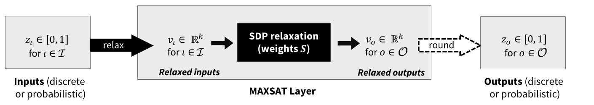
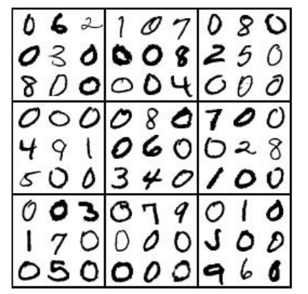

# SATNet: 딥러닝에 논리 추론을 심는 법

> Po-Wei Wang, Priya L. Donti, Bryan Wilder, Zico Kolter — *SATNet: Bridging deep learning and logical reasoning using a differentiable satisfiability solver* (ICML 2019)

이 논문은 여러 분야가 겹쳐 있어서 처음 읽으면 벽이 높게 느껴집니다. 딥러닝, 명제 논리, 조합 최적화, 반정부호 계획법(SDP)이 한 편 안에 다 들어 있거든요. 그래서 이 글은 각 조각을 초보자도 따라올 수 있게 하나씩 풀어놓고, 마지막에 다시 합치는 순서로 갑니다. 최적화를 전공하지 않았어도 끝까지 읽을 수 있도록 필요한 배경은 그때그때 채워 넣었습니다.

---

## 1. 왜 이 논문이 나왔나

### 1) 딥러닝이 잘 못하는 것

딥러닝은 강력하지만 스도쿠나 패리티(parity)처럼 **이산적·논리적 제약**이 지배하는 문제를 잘 못 풉니다. 이미지를 분류하고 문장을 번역하는 데는 뛰어나지만, "이 행에는 같은 숫자가 두 번 나올 수 없다" 같은 딱딱하고 전역적인(hard and global) 규칙은 좀처럼 포착하지 못합니다.

반대로 기존의 논리 추론 시스템은 규칙을 사람이 직접 넣어줘야 했습니다. 규칙만 주어지면 완벽하게 추론하지만, 규칙 자체를 데이터에서 발견하지는 못했죠.

논문의 문제의식은 이 둘 사이의 빈 자리입니다. 저자들이 드는 예가 스도쿠인데, 만약 스도쿠의 규칙(문제 변수들 사이의 관계)이 주어지지 않는다면, **게임의 규칙을 배우는 일과 퍼즐을 푸는 일을 동시에, end-to-end로** 할 수 있으면 좋겠다는 것입니다.

### 2) 목표를 한 문장으로

이 논문의 핵심은 "딥러닝으로 최적화 문제를 푼다"가 아니라 "**최적화(MAXSAT solver)를 딥러닝의 한 층으로 집어넣어, 논리 규칙을 데이터로부터 학습한다**"에 가깝습니다.

이 구분이 논문을 읽는 내내 중요하므로 조금 더 짚고 가겠습니다.

"딥러닝으로 최적화를 푼다"는 프레임은 보통 "최적화 문제를 신경망이 근사해서 빠르게 풀어준다"는 뜻입니다. 즉 최적화가 **목적**이고 딥러닝이 **수단**이죠. SATNet에서 MAXSAT을 실제로 풀긴 하지만, 그건 최종 목표가 아니라 학습을 가능하게 하는 중간 장치입니다.

SATNet에서 최적화(SDP 완화 + 좌표하강)는 **미분 가능한 레이어**로 쓰입니다. 진짜 목표는 그 레이어의 가중치 $S$, 즉 **논리적 제약(규칙) 자체를 학습**하는 것입니다. 스도쿠 예를 보면 규칙을 사람이 넣어주지 않고, 예제(입력–정답 쌍)만 주면 MAXSAT 레이어를 통과시키며 backprop으로 규칙에 해당하는 가중치를 학습합니다. "이미 아는 최적화 문제를 푸는 것"이 아니라 "**어떤 최적화 문제(제약 구조)인지를 배우는 것**"이 핵심 기여입니다.

그래서 논문의 위치는 **differentiable optimization layer** 계열입니다. OptNet(이차계획법을 층으로), submodular 최적화 층 등과 같은 흐름에서, SATNet은 **SDP/MAXSAT을 미분 가능하게 만들어 논리 관계 학습에 쓴 첫 사례**로 자리매김합니다.

한 줄로 하면: *최적화를 푸는 딥러닝이 아니라, 최적화를 품은 딥러닝*입니다.

---

## 2. 배경 지식 다지기

논문 3장에 들어가기 전에 필요한 개념을 순서대로 쌓겠습니다. 이 절만 넘기면 나머지는 훨씬 수월합니다.

### 1) SAT — 만족 가능성 문제

SAT는 "이 논리식을 **참으로 만드는 변수 배정이 존재하는가**?"를 묻는 문제입니다. 불리언 변수 $x_1, x_2, \dots$ 각각에 참/거짓을 넣어서 전체 식을 참으로 만들 수 있으면 satisfiable, 없으면 unsatisfiable이죠. 답은 예/아니오뿐입니다.

논리식은 보통 **CNF(합취 표준형, Conjunctive Normal Form)** 로 씁니다. 구조는 이렇습니다.

- **리터럴(literal)**: 변수 하나 또는 그 부정. 예: $x_1$, $\neg x_2$
- **절(clause)**: 리터럴들을 OR로 묶은 것. 예: $(x_1 \lor \neg x_2 \lor x_3)$. 절은 리터럴 중 **하나라도 참이면 만족**됩니다.
- **전체 식**: 절들을 AND로 묶은 것. 예: $(x_1 \lor \neg x_2) \land (\neg x_1 \lor x_3)$. **모든 절이 동시에 참**이어야 전체가 참.

SAT는 컴퓨터과학 최초로 NP-완전으로 증명된 문제(Cook–Levin 정리)로, 이론적 난이도의 기준점입니다.

### 2) MAXSAT — 최적화 버전

현실에선 "모든 절을 만족시키는 배정이 아예 없는" 경우가 많습니다(over-constrained). 이때 "그럼 포기"가 아니라 "**최대한 많이 만족시키자**"로 목표를 바꾼 게 MAXSAT입니다.

정의: 주어진 CNF에서 **만족되는 절의 개수를 최대화하는 변수 배정을 찾아라.**

SAT가 "전부 만족 가능한가?"라는 결정 문제라면, MAXSAT은 "가능한 한 많이"를 찾는 **최적화 문제**입니다. SAT는 MAXSAT의 특수한 경우예요(만족 개수가 절의 총 개수와 같은지 보면 됨).

구체적 예를 들죠. 변수 $x_1, x_2$에 절 세 개:

$$C_1 = (x_1 \lor x_2), \quad C_2 = (\neg x_1 \lor x_2), \quad C_3 = (\neg x_2)$$

- $x_1=T, x_2=T$: $C_1$✓ $C_2$✓ $C_3$✗ → 2개 만족
- $x_1=F, x_2=T$: $C_1$✓ $C_2$✓ $C_3$✗ → 2개
- $x_1=F, x_2=F$: $C_1$✗ $C_2$✓ $C_3$✓ → 2개
- $x_1=T, x_2=F$: $C_1$✓ $C_2$✗ $C_3$✓ → 2개

이 경우 세 개를 다 만족시키는 배정은 없고(즉 unsatisfiable), MAXSAT의 답은 **2개**입니다. 이렇게 "완벽히는 못 풀어도 최선의 타협"을 찾는 게 MAXSAT의 본질입니다.

실전에서는 몇 가지 변형이 자주 쓰입니다. **Weighted MAXSAT**은 절마다 가중치를 부여하고 만족된 절들의 가중치 합을 최대화합니다. **Partial MAXSAT**은 절을 hard clause(반드시 만족)와 soft clause(가능하면 만족)로 나눕니다. **MAX-kSAT**은 각 절의 리터럴이 정확히 $k$개인 경우인데, 여기서 $k$는 **절 하나에 들어가는 리터럴 수**이지 전체 변수 개수가 아닙니다(전체 변수는 $n$, 전체 절은 $m$으로 따로 표기). MAX-2SAT, MAX-3SAT이 근사 알고리즘 연구의 표준 벤치마크입니다.

MAXSAT은 **NP-hard**입니다. 변수가 $n$개면 배정 경우의 수가 $2^n$이라, 다 뒤지는 건 금방 불가능해지죠. 그래서 접근법이 정확히 푸는 쪽(branch-and-bound 등)과 근사하는 쪽으로 갈리는데, 근사 쪽의 대표가 다음에 볼 **SDP 완화**입니다.

### 3) SDP와 positive semidefinite

SDP는 **Semidefinite Programming(반정부호 계획법)** 의 약자입니다. 선형계획법(LP)을 행렬 변수로 확장한 볼록 최적화의 한 갈래예요. 일반적인 SDP는 대칭 행렬 변수 $X$에 대해 이렇게 씁니다.

$$\min_{X} \; \langle C, X \rangle \quad \text{s.t.} \quad \langle A_i, X \rangle = b_i, \;\; X \succeq 0$$

핵심은 세 가지입니다. **변수가 행렬이다**(벡터가 아니라 대칭행렬 $X$를 최적화). **목적함수와 제약이 선형이다**($\langle C, X \rangle = \mathrm{tr}(C^\top X)$는 행렬 원소들에 대해 선형). 그리고 **$X \succeq 0$ 제약**이 SDP를 SDP답게 만듭니다.

여기서 positive semidefinite(PSD, 반정부호)가 등장하는데, 이름이 무섭지만 직관은 "**행렬 버전의 '0 이상'**"입니다. 숫자에서 "음수가 아니다"에 해당하는 개념을 행렬로 확장한 것이라고 보면 됩니다.

숫자 하나 $a$가 있을 때 "$a \ge 0$"은 익숙하죠. 그런데 행렬 $X$에 대해서는 "$\ge 0$"을 어떻게 정의할까요? 원소가 다 양수라는 뜻이 아닙니다. 대신 이렇게 정의합니다.

$$\text{모든 벡터 } z \text{에 대해} \quad z^\top X z \ge 0$$

$z^\top X z$는 항상 **스칼라(숫자 하나)** 가 나옵니다. 즉 "어떤 벡터를 넣어도 결과 숫자가 음수가 안 나오는 행렬"이 PSD입니다. 숫자 $a$의 "$a \ge 0$"이 "$a z^2 \ge 0$ for all $z$"와 같다는 걸 떠올리면, 그 자연스러운 행렬 확장인 셈이죠.

직관적인 그림을 세 가지로 잡을 수 있습니다.

**방향을 뒤집지 않는 변환.** 행렬 $X$를 벡터에 작용하는 변환으로 보면, PSD는 "어떤 벡터든 90도 이상 꺾지 않는다"는 뜻입니다. $z$와 $Xz$ 사이 각도가 항상 90도 이내라는 것($z^\top Xz \ge 0$은 두 벡터의 내적이 음수가 아니라는 것).

**고유값이 다 0 이상.** 대칭행렬이라면 PSD는 모든 고유값이 0 이상인 것과 똑같습니다. 이게 실무에서 가장 자주 쓰는 판별법이에요.

**위로 열린 그릇.** $f(z) = z^\top X z$를 곡면으로 그리면, PSD일 때 이 곡면이 **아래로 볼록한 그릇(bowl) 모양**이 됩니다. 최적화에서 PSD가 중요한 이유가 여기 있습니다 — 그릇 모양이면 최저점을 확실히 찾을 수 있으니까요.

"semi"가 붙는 이유는 0을 허용하기 때문입니다. positive definite는 $z \ne 0$이면 항상 $z^\top X z > 0$(엄격히 양수)이고, positive **semi**definite는 $z^\top X z \ge 0$으로 0도 허용합니다. 숫자로 치면 "양수($>0$)"와 "음수가 아님($\ge 0$)"의 차이죠.

PSD 제약이 정의하는 영역(PSD cone)은 볼록(convex)하기 때문에, SDP 전체가 볼록 문제가 되어 전역 최적해를 효율적으로 구할 수 있습니다.

### 4) 그람 행렬 — 관계의 요약

마지막 조각입니다. 그람 행렬(Gram matrix)은 한 마디로 "**벡터들 사이의 모든 내적을 모아놓은 표**"입니다. 벡터 집합 $v_1, \dots, v_n$이 있을 때 $(i, j)$ 칸에 $v_i^\top v_j$를 적어 넣은 행렬이죠.

$$G_{ij} = v_i^\top v_j, \qquad G = V^\top V \;\; (V = [v_1 \; v_2 \; \cdots \; v_n])$$

핵심은 그람 행렬이 벡터들의 **절대적 위치는 버리고 상대적 관계만 남긴다**는 점입니다. 내적 $v_i^\top v_j = \|v_i\|\|v_j\|\cos\theta$는 두 벡터의 **길이와 사이 각도**를 담으니까요. 대각선 $G_{ii} = \|v_i\|^2$는 각 벡터의 길이, 비대각 $G_{ij}$는 두 벡터가 얼마나 같은 방향인지를 나타냅니다(양수면 비슷한 방향, 0이면 직교, 음수면 반대 방향).

왜 쓰는가는 세 가지로 정리됩니다.

**관계만 필요할 때 좌표를 없앨 수 있다.** 많은 문제에서 정작 중요한 건 벡터의 절대 좌표가 아니라 "둘이 같은 편인가 반대편인가" 같은 관계입니다. 커널 방법이나 SVM에서 데이터를 좌표로 안 보고 "쌍쌍의 유사도"로만 다루는 게 정확히 이 아이디어입니다.

**항상 PSD라서 볼록 최적화로 넘어갈 수 있다.** $G = V^\top V$는 무조건 positive semidefinite입니다. 임의의 $z$에 대해 $z^\top V^\top V z = \|Vz\|^2 \ge 0$ — 제곱이라 절대 음수가 안 되죠. 이 성질이 결정적입니다. "벡터들을 찾아라"라는 문제를 "이런 조건을 만족하는 **PSD 그람 행렬을 찾아라**"로 바꾸면, 후자는 매끄러운 볼록 문제(SDP)가 됩니다. 딱딱한 문제를 풀 수 있는 형태로 옮기는 다리 역할이죠.

**반대로 그람 행렬에서 벡터를 복원할 수 있다.** PSD 행렬 $G$가 주어지면 $G = V^\top V$가 되는 $V$를 항상 찾을 수 있습니다(촐레스키 분해나 고유분해로). 그래서 "관계를 먼저 풀고 → 실제 벡터를 뽑아내는" 2단계 전략이 성립합니다.

---

## 3. 핵심 아이디어 — 논리 변수를 벡터로 바꾸기

이제 배경이 다 모였으니 논문의 중심 아이디어로 들어갑니다.

### 1) 왜 완화가 필요한가

MAXSAT을 그대로 풀면 변수가 $\{-1, +1\}$ 같은 이산값이라 NP-hard입니다. SDP 완화(relaxation)의 아이디어는 이산 변수 $v_i \in \{-1, +1\}$를 **단위 구면 위의 연속 벡터** $v_i \in \mathbb{R}^k, \|v_i\|=1$ 로 바꾸는 것입니다. 그러면 두 변수의 관계는 내적 $v_i^\top v_j$(즉 벡터 사이 각도)로 표현되고, 이 벡터들의 그람 행렬 $X = V^\top V$는 자동으로 $X \succeq 0$을 만족합니다. 그래서 "이산값 배정"이라는 조합 문제가 "PSD 행렬 찾기"라는 볼록 문제로 완화됩니다.

이렇게 푼 연속해 $v_i$를 다시 이산값으로 되돌리는 과정이 **랜덤화 반올림(randomized rounding)** 입니다. Goemans–Williamson(1995)은 이 완화가 MAXCUT에서 최적값의 최소 0.878배를 보장한다는 유명한 근사 보증을 증명했습니다. SATNet의 3장은 사실상 이 고전적 결과의 확장이라, GW 완화를 이해하면 논문의 절반이 풀립니다.

### 2) 논리 변수가 벡터가 되는 방식 — 구체적 예제

원래 논리 변수는 참=+1, 거짓=−1 두 값뿐입니다. 이걸 **길이가 1인 벡터** $v_i$로 바꾸고, 하나의 기준 화살표 $v_\top$("진리 방향", truth direction)를 둡니다. 그러면 변수의 참/거짓은 "$v_i$가 $v_\top$와 **같은 쪽을 향하는가**"로 읽습니다.

2차원($k=2$)에서 $v_\top = (1, 0)$이라 하면:

- $v_1 = (1, 0)$ → $v_\top$와 완전히 같은 방향, $\cos\theta = v_1^\top v_\top = 1$ → **참(확률 1)**
- $v_2 = (-1, 0)$ → 정반대, $\cos\theta = -1$ → **거짓(확률 0)**
- $v_3 = (0, 1)$ → 직각, $\cos\theta = 0$ → **참/거짓 반반**

즉 딱딱한 0/1이 아니라, **각도로 표현되는 연속적인 확신도**가 됩니다. 논문은 이 대응을 랜덤화 반올림에 근거해 $P(\tilde{v}_i = 1) = \cos^{-1}(-v_i^\top v_\top)/\pi$로 씁니다.

**논리 제약도 각도 관계로 번역됩니다.** 구체적 예로, 패리티(XOR)에서 나오는 "두 변수는 값이 서로 달라야 한다"는 제약을 봅시다. 이산 세계에선 $x_1 \ne x_2$죠. 벡터 세계에선 이게

$$v_1^\top v_2 = -1 \quad(\text{서로 반대 방향, } 180°)$$

로 번역됩니다. 반대로 "두 변수가 같아야 한다"는 $v_1^\top v_2 = +1$(같은 방향)이 되고요. 최적화는 이 각도 조건들을 최대한 맞추도록 모든 벡터를 조금씩 회전시킵니다.

작은 SAT 예를 하나 끝까지 돌려보죠. 절이 두 개라 합시다: "$x_1$과 $x_2$는 달라야" + "$x_2$와 $x_3$도 달라야". 벡터로 옮기면 $v_2$는 $v_1$의 반대, $v_3$는 $v_2$의 반대 → 결국 $v_3$는 $v_1$과 같은 방향. 최적화를 돌리면 예컨대 $v_1=(1,0),\ v_2=(-1,0),\ v_3=(1,0)$으로 자리를 잡습니다. 여기에 $v_\top=(1,0)$을 적용해 반올림하면 "$x_1$=참, $x_2$=거짓, $x_3$=참" — 두 제약을 모두 만족하는 배정이 나옵니다.

### 3) 왜 굳이 벡터로?

만약 변수를 그냥 스칼라 $\pm 1$로 두면 값이 **딱 두 점에 갇혀** 있어서, "조금 참 쪽으로" 같은 미세 조정이 불가능합니다. 경사도 없고 미분도 안 되죠. 반면 원 위의 벡터는 **매끄럽게 회전**할 수 있어서, 여러 제약을 동시에 조금씩 타협하며 만족시키는 방향으로 굴러갈 수 있습니다. 게다가 2차원을 넘어 $k$차원($k \approx \sqrt{2n}$)으로 올리면, 서로 충돌하는 제약들을 풀어놓을 "여유 공간"이 생겨서 더 많은 절을 동시에 만족시킬 수 있습니다.

---

## 4. 수식으로 본 SATNet

### 1) MAXSAT 문제의 원래 형태 (식 1)

논문은 각 변수 $i$에 대해 $\tilde{s}_i \in \{-1, 0, 1\}^m$을 정의합니다. $\tilde{s}_{ij}$는 절 $j$에서 변수 $\tilde{v}_i$의 부호(양의 리터럴이면 $+1$, 부정이면 $-1$, 등장하지 않으면 $0$)입니다. 그러면 MAXSAT은 이렇게 쓰입니다.

$$\underset{\tilde{v} \in \{-1,1\}^n}{\text{maximize}} \sum_{j=1}^{m} \bigvee_{i=1}^{n} \mathbf{1}\{\tilde{s}_{ij}\tilde{v}_i > 0\}$$

읽는 법: 각 절 $j$마다 안쪽 $\bigvee$(OR)는 "그 절의 리터럴 중 하나라도 참인가"를 보고, 바깥 $\sum$은 만족된 절의 개수를 셉니다. 이걸 최대화하라는 것 — 앞서 본 MAXSAT의 정의 그대로입니다. 문제는 $\tilde{v}$가 $\{-1,1\}$에 갇혀 있어서 미분도 안 되고 조합 폭발이 일어난다는 점입니다.

### 2) SDP 완화 (식 2) — 논문의 심장

$$\underset{V \in \mathbb{R}^{k \times (n+1)}}{\text{minimize}} \; \langle S^\top S, \, V^\top V \rangle \quad \text{subject to} \quad \|v_i\| = 1, \;\; i = \top, 1, \dots, n$$

여기서 $V \equiv [v_\top \; v_1 \; \cdots \; v_n] \in \mathbb{R}^{k \times (n+1)}$는 각 변수를 나타내는 단위 벡터들의 모음이고, $S \equiv [\tilde{s}_\top \; \tilde{s}_1 \; \cdots \; \tilde{s}_n]\,\mathrm{diag}(1/\sqrt{4|\tilde{s}_j|}) \in \mathbb{R}^{m \times (n+1)}$는 절 가중치 행렬입니다.

이 식이 왜 중요한지 짚어보겠습니다. $V^\top V$는 앞에서 본 **변수들의 그람 행렬**이고, $S^\top S$는 **제약(절)들의 그람 행렬**입니다. 두 그람 행렬의 내적을 최소화한다는 건, "학습된 논리 제약과 변수 배정의 기하적 관계를 맞춘다"는 뜻인 거죠.

$X = V^\top V$로 두면 원래 SDP가 되지만, $V$ 자체를 변수로 쓰면 차원이 $n \times n$에서 $k \times n$으로 줄어 계산이 훨씬 싸집니다. 논문은 $k > \sqrt{2n}$이면 최적 SDP 해를 복원한다는 Barvinok–Pataki 결과를 이용해 $k = \sqrt{2n} + 1$로 잡습니다. 이 저차원 형태는 비볼록(non-convex)이지만, 좌표하강으로 최적해까지 수렴합니다.

### 3) 좌표하강 업데이트 (식 3)

$$v_i = -g_i / \|g_i\|, \quad \text{where} \;\; g_i = VS^\top s_i - \|s_i\|^2 v_i$$

각 $v_i$를 하나씩 잡고, 나머지를 고정한 채 목적함수를 최소화하는 방향으로 갱신합니다. $\|v_i\|=1$ 제약이 있으니 계산된 방향 $g_i$를 정규화해서 다시 단위 벡터로 만들죠. 논문은 이 업데이트가 SDP의 전역 최적 고정점으로 **증명 가능하게 수렴**한다고 밝힙니다. 즉 비볼록 형태이지만 실제로는 안정적으로 풀립니다.

### 4) $S$의 정체 — CNF가 있어야 할 자리

여기가 이 논문에서 가장 헷갈리기 쉬운 지점이고, 동시에 가장 중요한 지점입니다.

고전적인 MAXSAT solver는 이렇게 동작합니다.

> **입력**: CNF 논리식(절들) + 부분 배정 → **출력**: 나머지 변수 배정

여기서 CNF는 사람이 주는 것이죠. SATNet은 이 구조를 뒤집습니다.

> **입력**: 부분 배정만 → **출력**: 나머지 변수 배정
> **CNF(절 구조)는? → 가중치 $S$로 학습됨**

즉 $S$가 "CNF가 있어야 할 자리"를 차지합니다. 다만 $S$는 $\pm1/0$의 이산적 절 표현이 아니라 **실수값 행렬**이라, 경사하강으로 학습될 수 있는 겁니다. 이게 논문의 핵심 트릭입니다.

---

## 5. SATNet 레이어의 동작 단계

*논문 Figure 1. 알려진 변수의 배정 $z_\iota$(이산 또는 확률값)를 입력받아, 완화(relax) → SDP 풀이(가중치 $S$ 사용) → 반올림(round)을 거쳐 미지 변수의 배정 $z_o$를 출력한다.*

### 1) 입력은 논리식이 아니다

**SATNet 레이어는 CNF 논리식을 입력받지 않습니다.** 그리고 모델 안에 CNF로 변환하는 과정도 없습니다. 이 점을 놓치면 전체 그림이 안 잡힙니다.

레이어의 **입력과 출력은 둘 다 참/거짓 공간**입니다. 입력은 아는 변수들의 배정 $z_I \in [0,1]$(참일 확률), 출력은 모르는 변수들의 배정 $z_O \in [0,1]$이에요. 벡터는 그 사이 **레이어 안에서만** 잠깐 등장하는 중간 표현입니다.

### 2) 사람이 정하는 것 — 변수 인코딩

CNF는 안 주지만, "**불리언 변수를 어떻게 정의할지**"는 사람이 설계합니다. 이건 학습 전에 한 번 정하는 구조적 선택이고, 모델 안의 계산 단계가 아닙니다.

스도쿠 예로 구체화하면:

- 9×9 격자, 각 칸에 1~9 숫자 → 불리언 변수 $v_{i,j,d}$ = "칸 $(i,j)$에 숫자 $d$가 들어간다"
- 총 $n = 9 \times 9 \times 9 = 729$개 불리언 변수
- 절 개수 $m$은 **하이퍼파라미터**로 정함 — "이만큼의 규칙을 담을 용량을 주겠다"는 뜻 (논문은 $m = 600$, 보조 변수 300개 사용)

여기까지가 설계이고, "이 문제를 몇 개의 불리언 변수로 표현할까"까지만 정합니다. **규칙(절)은 하나도 안 씁니다.**

### 3) 한 번의 forward pass

퍼즐 하나가 들어올 때의 흐름입니다(논문 Algorithm 1의 FORWARD).

**최초 입력.** 그 퍼즐의 **주어진 칸들**이 입력입니다. 힌트로 30칸이 채워져 있다면, 그 칸들에 해당하는 $30 \times 9 = 270$개 변수의 값을 안다는 뜻이죠. 이걸 $z_I$로 넣습니다 — 예컨대 어떤 칸에 3이 있으면 $v_{i,j,3}=1$, 나머지 $v_{i,j,d}=0$. 남은 51칸 × 9 = 459개 변수가 미지수 집합 $\mathcal{O}$이고, 이게 출력 대상입니다. 그러니까 입력은 **논리식이 아니라 그냥 0~1 사이 숫자들의 벡터**입니다.

**레이어 내부.** 세 단계가 이어집니다.

1. 입력 인코딩: $z_I \to V_I$ (참/거짓 확률을 벡터로, 식 5)
2. 풀기: 좌표하강으로 $V_O$ 계산 (Alg 2)
3. 출력 디코딩: $V_O \to z_O$ (벡터를 다시 참/거짓 확률로, 식 7)

즉 "참/거짓 → 벡터 → (풀기) → 벡터 → 참/거짓"의 왕복이 **레이어 내부에서 매번** 일어납니다. 벡터는 그때그때 새로 계산되는 활성값(activation)이지, 저장되는 파라미터가 아닙니다.

인코딩·디코딩은 **학습 파라미터가 아니라 고정된 변환**이라는 점도 중요합니다. 보통 신경망 레이어(선형변환 $Wx+b$ + 활성함수)와 달리, 식 5와 식 7은 "확률 ↔ 각도"를 오가는 결정론적 수학 변환이에요. 학습되는 가중치가 없습니다.

### 4) backward — 해석적으로 유도된 그래디언트

backward는 좌표하강을 그대로 미분한 게 아닙니다. 반복 solver를 통째로 autodiff로 되짚으면 비싸고 불안정하니까, 논문은 SDP 해에 대한 그래디언트를 **닫힌 형태로 직접 유도**하고, 그 backward도 별도의 좌표하강(Alg 3)으로 효율적으로 풉니다. 즉 "레이어이긴 한데, 표준 레이어 스택이 아니라 backward가 손으로 유도된 특수 레이어"입니다.

목적함수는 레이어와 분리되어 있습니다. 논문의 backward 인터페이스가 이 점을 명확히 보여줘요 — 레이어는 외부에서 $\partial \ell / \partial Z_O$를 **입력으로 받아서** 시작합니다. 즉 손실 $\ell$의 형태는 레이어 바깥에서 정하고, 레이어는 그게 뭐든 상관하지 않습니다. 실제로 스도쿠 실험에서는 자릿수별 음의 로그우도(digit-wise negative log likelihood)를, Visual Sudoku에서는 크로스엔트로피를 씁니다.

---

## 6. 무엇이 학습되는가

### 1) 학습되는 건 벡터가 아니라 $S$

신경망이 예제로부터 배우는 건 벡터가 아니라 **논리 제약을 담은 가중치 행렬 $S$**입니다. 벡터는 매 예제마다 새로 풀려서 나오지만, $S$는 예제 전체에 걸쳐 조금씩 갱신되며 남습니다.

학습 루프는 이렇습니다.

- 출력 $z_O$(확률)와 정답을 비교해 손실 계산
- backprop이 레이어(벡터 왕복 + 좌표하강)를 관통해 흐름
- 그래디언트로 **$S$를 업데이트**

학습 때와 예측 때의 차이는 벡터 유무가 아니라 **반올림 여부**입니다. 벡터↔참거짓 변환은 학습 때도 예측 때도 똑같이 일어납니다(둘 다 레이어를 통과해야 하니까). 진짜 차이는 학습 시에는 출력을 **부드러운 확률 $[0,1]$**로 유지해 그래디언트가 흐르게 하고, 예측 시에는 출력 확률을 **딱딱한 참/거짓 $\{0,1\}$으로 반올림**해 최종 답으로 낸다는 것입니다.

### 2) 왜 이게 "암기"가 아니라 "규칙 학습"인가

여기에 중요한 포인트가 하나 있습니다. **$S$는 모든 퍼즐이 공유하는 단 하나의 행렬**입니다. 퍼즐마다 다른 $S$를 쓰는 게 아니에요.

그래서 "퍼즐→해답" 쌍을 외우는 식으로는 손실을 못 줄입니다. 학습 퍼즐도 테스트 퍼즐도 매번 다른 격자인데, 그 전부를 하나의 $S$로 풀어내려면 **개별 사례가 아니라 모든 퍼즐에 공통된 구조**, 즉 스도쿠 규칙 자체를 담는 수밖에 없죠. 이 "하나의 $S$를 공유한다"는 제약이 규칙 학습을 강제하는 장치입니다.

---

## 7. 실험 결과

### 1) 스도쿠 — 규칙을 주지 않고 배우기

논문은 9×9 스도쿠를 학습 9K개 / 테스트 1K개로 실험합니다. 입력은 힌트가 채워진 격자의 비트 표현과 "어떤 비트를 채워야 하는지"를 나타내는 마스크이고, 라벨은 완성된 정답입니다. 규칙은 한 줄도 주지 않습니다.

비교 대상은 스도쿠용 CNN(ConvNet)과, 여기에 어떤 비트를 학습해야 하는지 알려주는 이진 마스크를 추가로 받는 ConvNetMask입니다.

| 모델 | 원본 스도쿠 (Test) | 순열 스도쿠 (Test) | Visual 스도쿠 (Test) |
|---|---|---|---|
| ConvNet | 0.04% | 0% | 0% |
| ConvNetMask | 15.1% | 0% | 0.1% |
| **SATNet (제안)** | **98.3%** | **98.3%** | **63.2%** |

*보드 단위 정확도(높을수록 좋음), 학습 9K / 테스트 1K. Visual 스도쿠의 이론적 최대치는 74.7%이며, SATNet의 63.2%는 그 85% 수준입니다.*

주목할 점이 몇 가지 있습니다.

**ConvNet은 학습 데이터는 외우지만 일반화에 완전히 실패합니다.** 원본 스도쿠에서 학습 정확도는 72.6%인데 테스트는 0.04%예요. 마스크를 준 ConvNetMask도 학습 91.4% / 테스트 15.1%에 그칩니다.

**순열 스도쿠가 결정적 증거입니다.** 저자들은 "우리 구조가 정말 게임의 규칙을 배우는지, 아니면 입력의 지역성(locality)에 과적합하는지"를 확인하려고, 비트 표현에 **고정된 순열을 적용한** 보드로 실험합니다. 이러면 지역성 구조가 사라져 사람이 볼 수 있는 스도쿠 형태가 아니게 되지만, 비트들 사이의 관계 자체는 그대로 유지됩니다. 결과는 SATNet이 **원본과 똑같은 98.3%**를 유지한 반면, CNN 계열은 마스크를 줘도 0%로 무너집니다. 논리 구조를 배운 쪽과 시각적 패턴에 기댄 쪽이 여기서 갈립니다.

참고로 학습 속도도 나쁘지 않습니다. GTX 1080 Ti에서 22 에폭/37분 만에 95.0% 테스트 정확도에 도달하고, 100 에폭(172분)에 98.3%를 찍습니다. 비교 대상으로 시도한 OptNet은 며칠을 돌려도 진전이 거의 없었다고 합니다.

### 2) Visual Sudoku — 지각과 논리의 결합

*논문 Figure 3. MNIST 손글씨 숫자로 만든 스도쿠 보드 이미지. 1–9가 적힌 칸은 고정된 힌트이고, 0은 미지 칸을 뜻한다.*

여기서는 입력이 논리적 표현이 아니라 **이미지**입니다. 각 칸에 LeNet 기반 CNN을 적용해 숫자를 분류하고, 그 **칸별 확률 출력이 곧 SATNet 레이어의 논리 입력 $z_I$**가 됩니다. 전체를 크로스엔트로피로 end-to-end 학습하며, 그래디언트가 SATNet 레이어를 관통해 CNN까지 흘러 둘이 함께 학습됩니다.

이 실험은 앞서 말한 "최적화를 품은 딥러닝"이 실제로 작동함을 보여주는 사례입니다. 미분 가능한 논리 레이어이기 때문에 이질적인 모듈(지각 + 추론)을 파이프라인으로 이어붙일 수 있는 거죠.

---

## 8. 한계와 열린 질문

논문의 성과는 분명하지만, 조금 더 파고들면 구조적인 한계들이 드러납니다. 이 절은 논문을 비판하려는 게 아니라, 이 방법이 정확히 무엇을 할 수 있고 무엇을 못 하는지 경계를 긋기 위한 것입니다.

### 1) 학습된 것은 기호가 아니다

SATNet은 신경-기호 통합(neuro-symbolic AI) 문헌에서 대표적으로 인용되는 연구가 맞습니다. 제목의 logical reasoning은 은유가 아니라 **진짜 명제 논리**를 가리켜요. SAT는 명제 논리 그 자체이고, 스도쿠 규칙도 패리티도 전부 명제 논리 절로 표현됩니다. 최적화(SDP)는 이 논리 문제를 미분 가능하게 푸는 수단일 뿐, 다루는 지식의 성격 자체는 논리적입니다.

다만 neuro-symbolic 안에서도 어느 쪽 끝에 있느냐를 구분해야 정확합니다. 크게 두 방향이 있어요. **기존 기호 지식을 신경망에 주입**하는 방향(사람이 아는 규칙·온톨로지를 넣어주고 신경망이 그 안에서 동작)과, **기호적 구조를 데이터로부터 학습**하는 방향(규칙을 주지 않고 예제만으로 논리 관계를 발견). SATNet은 명확히 둘째 쪽입니다.

여기서 중요한 단서가 붙습니다. SATNet이 학습하는 결과물은 **사람이 읽을 수 있는 기호적 규칙이 아닙니다.** 학습된 건 연속값 가중치 행렬 $S$이고, 이건 근사적·soft한 제약을 인코딩할 뿐, "이 절이 스도쿠의 이 규칙"이라고 해석해서 뽑아낼 수 있는 형태가 아니에요. 정리하면 다루는 **문제**는 기호적/논리적이지만, 학습된 **표현**은 하위기호적(sub-symbolic)입니다.

### 2) $S$를 CNF로 되돌릴 수 있는가 — 원리적으로 어렵다

그렇다면 학습된 $S$에서 규칙을 추출할 수는 없을까요? 결론부터 말하면 원리적으로 어렵고, 논문도 그 방법을 제시하지 않습니다. 단순한 구현상의 한계가 아니라 구조적인 이유가 있습니다.

**가장 결정적인 이유는 $S$가 회전에 대해 결정되지 않는다는 점입니다.** 목적함수를 다시 보면 $\langle S^\top S, V^\top V \rangle$에서 $S$는 오직 $S^\top S$의 형태로만 등장합니다. 그런데 임의의 직교행렬 $Q$($Q^\top Q = I$)에 대해

$$(QS)^\top (QS) = S^\top Q^\top Q S = S^\top S$$

즉 **$S$를 아무렇게나 회전시켜도 목적함수가 완전히 똑같습니다.** 학습이 끝나 나온 $S$와 그걸 회전시킨 $QS$는 모델 입장에서 구별 불가능한 동일한 해예요.

이게 왜 치명적이냐면, 회전은 $S$의 **행들을 서로 뒤섞습니다.** CNF에서 "한 행 = 한 절(clause)"이어야 하는데, 행 자체가 임의로 섞여도 무방하다면 **개별 행에 절로서의 의미가 없다**는 뜻입니다. 논리 구조가 있다면 그건 행 하나하나가 아니라 $S^\top S$라는 집합적 관계에만 담겨 있는 거죠. 뽑아낼 "그 절"이라는 게 애초에 유일하게 정해지지 않습니다.

여기에 몇 가지 장벽이 겹칩니다. **타입 불일치** — 고전 인코딩에서 $S$의 원소는 $\{-1, 0, +1\}$인데 학습된 $S$는 조밀한 실수 행렬이라, 임계값으로 이산화해도 원래 동작이 보존된다는 보장이 없습니다. **완화의 비타이트성** — SATNet이 푸는 건 진짜 MAXSAT이 아니라 SDP 완화라서, $S$는 "충실한 MAXSAT 인스턴스가 되도록"이 아니라 "완화된 solver가 정답을 내도록" 최적화됩니다. **보조 변수** — 원 문제에 없는 auxiliary variable이 낀 "절"은 스도쿠 언어로 번역할 대상이 아예 없습니다.

### 3) 전이와 일반화 — 되는 것과 안 되는 것

그렇다면 학습된 결과를 더 큰 복합 문제로 옮길 수는 있을까요? 여기서는 앞의 "CNF 추출 불가"보다 훨씬 희망적인 답이 나옵니다.

**되는 것: 모듈 단위 결합과 절 행렬 이어붙이기.**

먼저 학습된 SATNet 레이어를 통째로 다른 신경망에 끼워 넣는 것은 자연스럽게 됩니다. Visual Sudoku가 정확히 이 그림이죠. 서로 다른 종류의 모듈(지각 + 논리)을 파이프라인으로 잇는 건 오히려 이 방법의 강점입니다.

더 흥미로운 건, $S$ 개별 행은 해석 불가능하지만 **행을 추가하는 것은 의미가 있다**는 점입니다. MAXSAT 목적함수가 절에 대해 합(sum)이기 때문이에요. $S_1$이 학습된 제약이고 $S_2$가 새 제약이라면, 세로로 쌓은 $S = [S_1; S_2]$에 대해

$$S^\top S = S_1^\top S_1 + S_2^\top S_2 \;\Rightarrow\; \langle S^\top S, V^\top V\rangle = \langle S_1^\top S_1, V^\top V\rangle + \langle S_2^\top S_2, V^\top V\rangle$$

즉 **두 제약 집합의 논리곱(AND)이 목적함수의 덧셈으로 깔끔하게 표현**됩니다. 개별 행을 해석할 필요 없이 통째로 합칠 수 있어요. 회전 불변성도 여기선 걸림돌이 아닙니다 — $S_1$을 회전시켜도 $S_1^\top S_1$은 그대로니까요. 변수가 $n' > n$으로 늘어나는 경우도 기존 $S_1$의 오른쪽에 0 열을 덧붙여 처리할 수 있습니다("이 절들은 새 변수를 건드리지 않는다"는 뜻이라 의미가 보존됨). 실용적으로는 warm-start 후 미세조정, 또는 $S_1$을 얼려두고 새 행만 학습하는 adapter 방식이 가능합니다.

**안 되는 것: 문제 크기를 넘나드는 일반화.**

진짜 벽은 여기입니다. SATNet의 $S$는 **고정된 변수 개수 $n$에 묶여** 있습니다. 9×9 스도쿠로 배운 $S$($n=729$)를 16×16 스도쿠에 쓸 수 없습니다 — 변수 개수가 다르고 대응 관계가 없거든요.

왜 그럴까요. 고전 논리는 **1차 논리(first-order)** 로 규칙을 씁니다: "∀행 ∀숫자, 그 행에 그 숫자는 정확히 한 번". 이 규칙은 양화사(quantifier)와 변수 덕분에 크기와 무관하게 성립하고, 9×9든 16×16이든 그대로 적용됩니다(lifted representation). 반면 SATNet은 **명제 논리(propositional)** 수준에서 동작합니다. 규칙이 "$v_{1,1,3}$과 $v_{1,2,3}$은 동시에 참일 수 없다" 같은 **구체적 사례로 전부 펼쳐진(grounded)** 형태로만 존재해요. 펼쳐진 순간 크기에 고정됩니다.

일반화의 진짜 장벽은 해석 불가능성이 아니라 **이 lifted 표현의 부재**입니다. 그래서 후속 neuro-symbolic 연구의 큰 줄기가 lifted/relational 표현을 미분 가능하게 다루는 방향(∂ILP, Neural LP, Logic Tensor Networks 등)으로 갑니다.

### 4) 후속 검증에서 제기된 문제

마지막으로 정직하게 덧붙일 부분이 있습니다. 이진 입력 스도쿠(격자를 직접 넣는 버전) 결과는 비교적 견고하지만, **Visual Sudoku** 쪽은 후속 연구에서 문제가 제기되었습니다.

Chang et al.(NeurIPS 2020)이 원 구현에서 **라벨 누출(label leakage)** 문제를 발견했고, 그걸 제거하니 visual 버전은 제대로 동작하지 않았습니다. 이미지에서 인식한 기호를 논리 변수에 연결하는 "symbol grounding"이 스스로 되지 않았던 거죠. 이후 연구들이 이 부분을 보완하는 방법을 제안했습니다. 논문의 핵심 기여(미분 가능한 MAXSAT 레이어와 논리 구조 학습) 자체가 무너진 건 아니지만, 지각과 논리를 잇는 부분은 생각보다 어려운 문제라는 게 드러난 셈입니다.

---

## 9. 정리

SATNet의 기여를 한 번에 요약하면 이렇습니다.

MAXSAT을 푸는 **미분 가능한 solver**를 하나의 신경망 레이어로 만들었습니다. 구체적으로 MAXSAT을 SDP로 완화하고 좌표하강으로 근사한 뒤, 그 해에 대해 **해석적으로 미분**하는 방법을 유도해 backward pass를 효율적으로 계산했습니다. 레이어의 **가중치 $S$가 곧 학습되는 논리적 제약**에 해당하므로, 규칙을 하드코딩하는 대신 데이터로부터 배울 수 있습니다.

이를 통해 딥러닝이 전통적으로 어려워하던 패리티 함수를 단일 비트 지도학습만으로 학습하고, 규칙을 전혀 주지 않은 채 예제만으로 9×9 스도쿠를 98.3% 정확도로 풀며(순열을 가해 지역성을 없애도 동일한 98.3%), CNN과 결합해 이미지 입력까지 end-to-end로 처리합니다.

동시에 남긴 숙제도 분명합니다. 학습된 표현이 하위기호적이라 **기호적 해석과 재조합이 불가능**하고, 명제 수준으로 접지되어 있어 **문제 크기를 넘나드는 일반화가 안 됩니다**. SATNet은 미분 가능성을 얻는 대가로 기호적 이식성을 내준 셈이고, 이후 neuro-symbolic 연구들이 "미분 가능하면서도 해석 가능하고 lifted된 규칙을 얻는 법"을 과제로 삼는 배경이 여기 있습니다.

그럼에도 "논리 추론을 딥러닝에 통합한다"는 오래된 목표를 향해 구체적이고 검증 가능한 한 걸음을 내디딘 연구라는 점은 분명합니다. 저자들이 결론에서 밝힌 표현을 빌리면, 강력하면서도 범용적인 MAXSAT 풀이라는 원시 연산(primitive)을 미분 가능한 틀로 감싸서, **도메인의 정확한 구조를 모르고 데이터로부터 배워야 하는 상황에서도 "암묵적" 논리 추론이 일어나게** 하려는 시도입니다.

---

### 이 논문을 더 파고들고 싶다면

최적화 배경이 없다면 다음 순서를 권합니다. **선형대수**가 가장 중요합니다 — 특히 "내적 = 두 벡터 사이의 각도"라는 직관이 SATNet 완화의 전부라 해도 과언이 아닙니다. 그다음 **볼록 최적화의 기초 개념**(목적함수 + 제약, 볼록성, LP)을 얕게 훑고, PSD와 SDP의 정의만 잡으면 충분합니다. 마지막으로 **Goemans–Williamson의 MAXCUT SDP 완화**를 한 번 이해해 보세요. SATNet 3장은 이 고전적 결과의 확장이라, GW 완화를 이해하면 논문의 절반이 풀립니다. 여기에 OptNet(Amos & Kolter, 2017) 같은 "미분 가능한 최적화 층" 개념을 곁들이면 논문의 위치가 선명해집니다.
