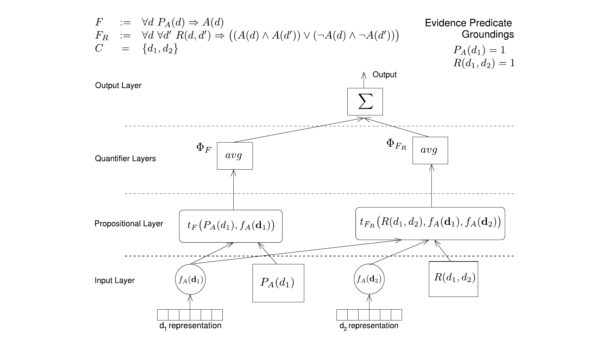
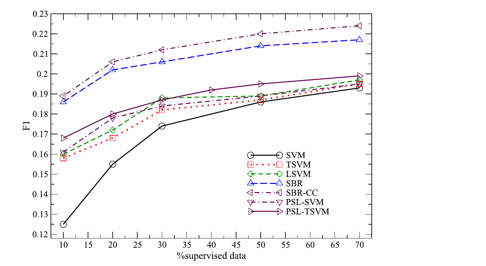

# Semantic-based Regularization for Learning and Inference

> Michelangelo Diligenti, Marco Gori, Claudio Saccà, *Artificial Intelligence* 244 (2017), 143-165  
> 지금까지의 대화를 바탕으로 정리한 한국어 해설

이 논문의 핵심은 **데이터로부터의 학습과 논리적 추론을 하나의 최적화 문제로 통합**하는 것이다. 저자들은 이를 **Semantic-Based Regularization(SBR)**이라고 부른다.

SBR의 본질은 특정한 커널 알고리즘 하나에 있지 않다. 학습 가능한 함수가 미지의 술어에 대한 퍼지 진릿값을 출력하고, 1차 논리로 표현된 지식을 미분 가능한 제약으로 바꾸어 그 함수까지 역전파한다는 데 있다. 논문은 이 함수 근사기로 커널 머신을 사용하지만, 같은 구조를 신경망으로 확장하는 것도 가능하다.

## 1. 이 논문이 해결하려는 문제

기존 방법은 대체로 두 부류로 나뉜다.

- SVM과 커널 머신은 텍스트의 TF-IDF 같은 고차원 실수 특징을 잘 처리하지만, 객체 사이의 관계나 논리 규칙을 직접 표현하기 어렵다.
- Markov Logic Network(MLN), Probabilistic Soft Logic(PSL) 같은 통계적 관계 학습은 논리와 관계를 다루지만, 복잡한 특징 벡터를 효율적으로 학습 모델과 결합하기 어렵다.

SBR은 커널 머신과 1차 논리(First-Order Logic, FOL)를 연결하여 **논리적 추론의 결과가 특징 기반 분류기 학습에도 영향을 주도록** 설계한다.

기존의 두 단계 접근에서는 먼저 특징 기반 분류기를 학습한 뒤 그 출력을 논리 모델의 prior로 사용한다. 이 경우 상위 논리 추론이 이미 고정된 하위 분류기를 개선할 수 없다. SBR은 논리식을 연속적이고 거의 모든 지점에서 미분 가능한 함수로 만들기 때문에, 규칙 위반의 gradient를 커널 머신까지 되돌려 보낼 수 있다.

## 2. 미지의 술어를 함수로 학습한다

### 1) 하나의 술어를 학습하는 경우

예측하려는 술어가 다음과 같다고 하자.

$$
AI(x)
$$

이는 “논문 $x$가 AI 분야에 속한다”는 뜻이다. SBR은 이 미지의 술어를 함수로 근사한다.

$$
AI(x)\approx \sigma(f_{AI}(\mathbf{x}))
$$

- $x$: 논문이라는 논리적 객체
- $\mathbf{x}$: 논문의 TF-IDF 같은 특징 벡터
- $f_{AI}$: 학습할 커널 머신
- $\sigma(f_{AI}(\mathbf{x}))$: $AI(x)$의 퍼지 진릿값

예를 들어

$$
\sigma(f_{AI}(\mathbf{x}))=0.85
$$

라면 “논문 $x$가 AI 분야라는 술어가 0.85의 정도로 참”이라는 뜻이다.

### 2) 여러 술어의 공동 학습

실제 문제에서는 하나의 술어만 학습하지 않을 수 있다. Category가 $K$개라면 보통

$$
C_1(x),C_2(x),\ldots,C_K(x)
$$

라는 $K$개의 미지 술어를 정의한다. 논문의 수식에서는 이를 $f=\{f_1,\ldots,f_T\}$로 나타낸다. 각 $f_k$가 하나의 query predicate를 근사한다.

$$
\begin{aligned}
AI(x)&\approx \sigma(f_{AI}(\mathbf{x}))\\
Theory(x)&\approx \sigma(f_{Theory}(\mathbf{x}))\\
Systems(x)&\approx \sigma(f_{Systems}(\mathbf{x}))
\end{aligned}
$$

원 논문의 구성에서 “하나의 모델”은 하나의 커널 머신이라기보다, **여러 커널 머신과 이들을 연결하는 논리 규칙을 포함한 하나의 SBR 시스템**을 의미한다.

또한 모든 술어가 학습 대상인 것은 아니다.

- **Query predicate:** 값을 학습해야 하는 술어. 예: $AI(x)$, $Theory(x)$
- **Evidence predicate:** 관계 데이터나 라벨로 이미 값이 주어진 술어. 예: $Cite(x,y)$, $AuthorOf(a,x)$

## 3. 퍼지 논리가 학습 손실이 되는 과정

### 1) 핵심 목적함수

SBR은 학습해야 할 함수들이 부드럽고 단순하면서, 주어진 논리식을 최대한 만족하도록 다음 목적함수를 최소화한다.

$$
C[f]
=
\sum_{k=1}^{T}\lVert f_k\rVert_{\mathcal H_k}^{2}
+
\sum_{h=1}^{H}\lambda_h\left(1-\Phi_h(f(X))\right)
$$

- 첫 번째 항은 함수가 지나치게 복잡해지는 것을 막는 RKHS 정규화다.
- $\Phi_h(f(X))\in[0,1]$는 논리식 $h$의 퍼지 만족도다.
- $1-\Phi_h$는 규칙 위반량이다.
- $\lambda_h$는 각 규칙의 중요도다.

따라서 모델은 **데이터를 잘 설명하면서도 주어진 의미론적 규칙을 최대한 만족하는 함수**를 찾는다.

### 2) 논리를 연속적인 연산으로 바꾼다

논리 연산은 t-norm 기반 퍼지 논리로 연속화된다. Minimum t-norm을 예로 들면 다음과 같다.

$$
\begin{aligned}
\mathrm{NOT}(a)&=1-a\\
\mathrm{AND}(a,b)&=\min(a,b)\\
\mathrm{OR}(a,b)&=\max(a,b)
\end{aligned}
$$

전칭 한정자와 존재 한정자는 각각 다음과 같이 집계한다.

$$
\mathrm{FORALL}(a_1,\ldots,a_n)
=\frac{1}{n}\sum_{i=1}^{n}a_i
$$

$$
\mathrm{EXISTS}(a_1,\ldots,a_n)
=\max_i a_i
$$

고전적인 퍼지 논리에서는 $\forall$를 최솟값으로 표현하지만, 이 논문은 학습 효율을 위해 평균을 사용한다. 최솟값은 현재 가장 나쁜 grounding 하나에만 gradient를 보내지만, 평균은 모든 grounding을 동시에 개선할 수 있기 때문이다. 만족도가 정확히 1이 되는 조건은 기존 정의와 일치한다.

### 3) 퍼지 논리식은 신경망 레이어처럼 작동하는가

계산 그래프라는 관점에서는 **고정된 논리 레이어처럼 작동한다.**

```text
객체의 특징 벡터
        ↓
커널 머신이 grounded atom의 값 계산
        ↓
AND·OR·NOT 등의 t-norm 연산
        ↓
∀·∃ 한정자 집계
        ↓
규칙 만족도 Φ
        ↓
규칙 손실 1 - Φ
        ↓
커널 머신 파라미터로 역전파
```

다만 일반적인 Dense layer와는 차이가 있다. 논리 레이어의 AND, OR, NOT 연산은 데이터로 학습되는 것이 아니라 지식베이스의 논리식에 따라 고정된다. 문제마다 바뀌는 것은 레이어의 기본 구현이 아니라 **고정된 퍼지 논리 연산자들이 조립되는 계산 그래프의 구조**다.



*그림 1. 논문의 Fig. 2를 크롭한 것. 특징 기반 함수 출력과 evidence grounding이 명제 층에서 결합되고, 한정자 층에서 집계된 뒤 규칙별 기여가 출력 층에서 합산된다.*

## 4. 인용 관계 규칙의 실제 계산

### 1) 규칙의 형태

“서로 인용하는 논문은 같은 분야일 가능성이 높다”는 지식을 category $c$에 대해 다음처럼 표현할 수 있다.

$$
\forall x,y\quad Cite(x,y)\Rightarrow
\left[
(C_c(x)\land C_c(y))
\lor
(\neg C_c(x)\land\neg C_c(y))
\right]
$$

$a=C_c(x)$, $b=C_c(y)$라 하고 실제 인용 관계가 존재한다고 하자. Minimum t-norm을 적용하면 해당 쌍의 category 일치 만족도는 다음과 같다.

$$
s(x,y)
=
\max\left(
\min(a,b),
\min(1-a,1-b)
\right)
$$

| $a$ | $b$ | 만족도 $s(x,y)$ | 해석 |
|---:|---:|---:|---|
| 0.9 | 0.8 | 0.8 | 둘 다 같은 분야라고 예측 |
| 0.1 | 0.2 | 0.8 | 둘 다 그 분야가 아니라고 예측 |
| 0.9 | 0.1 | 0.1 | 두 예측이 충돌 |
| 0.5 | 0.5 | 0.5 | 일치하지만 불확실 |

이 계산의 목적은 만족도 수치를 얻는 데서 끝나지 않는다. 만족도가 높아지도록 술어 함수의 파라미터를 학습하는 것이 목적이다.

### 2) Category 출력과 최종 loss 사이에서 사용된다

각 논문 $x$에 대한 category 출력이

$$
\mathbf p(x)=[p_1(x),p_2(x),\ldots,p_K(x)]
$$

라면, 관계 제약은 이 출력이 계산된 직후 최종 loss를 만드는 단계에서 사용된다.

```text
입력 특징 x
   ↓
분류기
   ↓
category별 출력 p₁(x), …, pK(x)
   ├── 지도학습 loss
   └── 퍼지 논리 제약 loss
              ↓
        전체 loss 합산
              ↓
           역전파
```

전체 손실은 개념적으로 다음과 같이 구성된다.

$$
L
=
L_{\text{supervised}}
+\lambda_{\text{cite}}L_{\text{cite}}
+\lambda_{\text{exclusive}}L_{\text{exclusive}}
+L_{\text{regularization}}
$$

인용 관계는 절대적인 hard rule이라기보다 가중치가 있는 경향성이다. 라벨 데이터가 인용한 두 논문이 실제로 다른 category임을 강하게 보여 준다면, 지도학습 손실과 논리 규칙 손실 사이에서 절충한다.

### 3) Category 사이의 제약

원 논문은 각 category를 별도의 퍼지 술어로 취급하므로, 출력이 반드시 합계 1인 softmax일 필요는 없다. 단일 라벨 문제라면 다음과 같이 “정확히 하나의 category만 참”이라는 제약을 논리식으로 추가할 수 있다.

$$
\forall x\quad \mathrm{ExactlyOne}
\{C_1(x),\ldots,C_K(x)\}
$$

멀티라벨 문제라면 이러한 배타적 제약을 넣지 않는다.

## 5. Grounding과 술어 함수의 arity

### 1) 커널 머신은 grounding을 생성하지 않는다

다음 세 단계를 구분해야 한다.

- **Grounding:** 논리 변수에 실제 객체를 대입한다.
- **특징 조회:** grounded 객체를 벡터로 표현한다.
- **술어 함수 평가:** 커널 머신이 grounded atom의 퍼지 진릿값을 계산한다.

예를 들어 논문 domain이

$$
\mathcal P=\{p_1,p_2,p_3\}
$$

라면 $AI(x)$의 가능한 grounding은

$$
AI(p_1),\quad AI(p_2),\quad AI(p_3)
$$

이다. 이 목록을 만드는 것은 grounding 과정이다. 커널 머신은 각 객체의 표현 $\mathbf x_i$를 받아 각 grounded atom의 값을 계산한다.

### 2) 단항 술어와 이항 evidence를 함께 사용할 수 있다

학습 대상 $C_c(x)$가 단항 술어여도 다음 이항 관계 규칙을 계산할 수 있다.

$$
Cite(x,y)\Rightarrow
\bigl(C_c(x)\leftrightarrow C_c(y)\bigr)
$$

$x=p_i$, $y=p_j$로 grounding하면 각 atom은 별도로 평가된다.

$$
C_c(p_i)=\sigma(f_c(\mathbf x_i))
$$

$$
C_c(p_j)=\sigma(f_c(\mathbf x_j))
$$

$$
Cite(p_i,p_j)=A_{ij}
$$

$A$는 데이터로 주어진 인용 그래프의 adjacency matrix다. 즉, 같은 단항 커널 머신을 두 객체에 각각 적용하고, 그 두 출력과 이항 evidence를 논리 레이어에서 결합한다.

```text
논문 pi의 특징 xi ─→ 단항 함수 fc ─→ Cc(pi) ─┐
                                             ├─→ 퍼지 규칙 만족도
인용 그래프 Aij ─────────────────── Cite(pi,pj) ┤
                                             │
논문 pj의 특징 xj ─→ 단항 함수 fc ─→ Cc(pj) ─┘
```

단항 커널 머신의 입력 arity는 변하지 않는다. 규칙이 두 변수를 사용하므로 규칙 loss를 계산할 때 두 객체가 필요한 것이다.

### 3) 두 번째 객체는 어디서 오는가

단항 모델이 $x$만 보고 $y$를 생성하는 것은 아니다. Grounding 모듈 또는 데이터 로더가 인용 관계에서 필요한 상대 객체를 조회하거나 샘플링한다.

```text
논문 특징:
p1 → [0.8, 0.1, ...]
p2 → [0.2, 0.9, ...]
p3 → [0.7, 0.3, ...]

인용 edge:
(p1, p2)
(p1, p3)
```

한 edge batch가 $(p_1,p_2)$와 $(p_1,p_3)$을 포함하면, 필요한 고유 객체 $p_1,p_2,p_3$의 술어값을 계산한 뒤 edge별 규칙 손실을 구한다. 모델은 객체 하나씩 처리하지만, 손실이 두 객체의 출력을 결합한다. 이는 Siamese network나 contrastive learning에서 두 샘플의 출력을 비교하는 것과 비슷하다.

### 4) 모든 $N^2$개 쌍을 계산해야 하는가

형식적으로 $\forall x,y$는 $N^2$개의 조합을 가진다. 하지만 $Cite(x,y)=0$이면 implication은 자동으로 참이고 gradient도 0이다.

$$
0\Rightarrow \text{anything}=1
$$

따라서 실제 인용 edge 집합 $E$에 대해서만 다음 손실을 계산할 수 있다.

$$
L_{\text{cite}}
=
\frac{1}{|E|}
\sum_{(x,y)\in E}
\sum_{c=1}^{K}
\left[
1-\mathrm{Eq}_{\text{fuzzy}}(p_c(x),p_c(y))
\right]
$$

논문도 evidence만으로 자명하게 참 또는 거짓이 되는 grounding을 제거하는 FROG preprocessing을 활용한다. 따라서 계산량은 일반적으로 $O(N^2)$가 아니라 관련 edge 수 $|E|$에 비례하도록 줄일 수 있다.

다만 “전체 데이터의 20%가 category $c$여야 한다”거나 $\exists_nx\,C_c(x)$처럼 전역 개수와 분포를 요구하는 규칙은 전체 데이터, 큰 batch 또는 전역 통계의 근사가 필요하다.

## 6. 커널 머신은 입력을 어떻게 술어값으로 바꾸는가

### 1) 선형 커널의 수치 예시

논문 객체와 특징 표현이 다음과 같다고 하자.

$$
p_1\mapsto \mathbf x_1=[1,0],\qquad
p_2\mapsto \mathbf x_2=[0,1],\qquad
p_3\mapsto \mathbf x_3=[0.8,0.2]
$$

Representer theorem에 따라 AI 술어를 근사하는 함수는 다음 형태를 가진다.

$$
f_{AI}(\mathbf x)
=
\beta+\sum_{i=1}^{n}w_iK(\mathbf x_i,\mathbf x)
$$

선형 커널

$$
K(\mathbf x_i,\mathbf x)=\mathbf x_i^\top\mathbf x
$$

을 사용하고, 학습된 계수와 bias가

$$
w_1=1.2,\qquad w_2=-0.8,\qquad \beta=-0.1
$$

이라고 하자. 새로운 논문 $p_3$과 학습 객체 사이의 커널값은

$$
K(\mathbf x_1,\mathbf x_3)=0.8,
\qquad
K(\mathbf x_2,\mathbf x_3)=0.2
$$

이다. 따라서

$$
\begin{aligned}
f_{AI}(\mathbf x_3)
&=-0.1+1.2(0.8)-0.8(0.2)\\
&=0.7
\end{aligned}
$$

이며 sigmoid를 거치면

$$
AI(p_3)\approx\sigma(0.7)\approx0.668
$$

이 된다. 이 값이 논리 레이어에 들어가는 grounded atom의 퍼지 진릿값이다.

### 2) 이항 query predicate를 학습하는 경우

$SameTopic(x,y)$처럼 관계 자체가 미지의 이항 술어라면 별도의 이항 함수를 학습한다.

$$
SameTopic(x,y)
\approx
\sigma(f_{SameTopic}(\mathbf x,\mathbf y))
$$

두 특징 벡터를 이어 붙이거나 쌍에 직접 정의한 커널을 사용할 수 있다.

$$
K_{\text{pair}}
\bigl((x,y),(x',y')\bigr)
=
K(x,x')K(y,y')
$$

반면 CORA 실험의 $Cite(x,y)$처럼 이미 관계가 주어진 술어는 evidence이므로 이를 예측하기 위한 이항 커널 머신이 필요 없다.

### 3) 특징이 없는 객체

저자처럼 특징 벡터가 없고 식별자와 관계만 있는 객체도 처리할 수 있다. 이때 논문은 Gram 행렬을 단위행렬로 둔다.

$$
G_k=I
$$

그러면 $f_k(X_k^\circ)=G_kw_k=w_k$가 되어 각 객체의 술어값 자체를 직접 최적화한다. 특징 공간에서 새로운 객체로 일반화하지는 못하지만, 관계와 논리 규칙을 이용한 순수한 기호적 추론은 가능하다.

## 7. Representer theorem의 역할

논문은 먼저 무한차원일 수 있는 RKHS에서 다음 문제를 정의한다.

$$
C[f]
=
\sum_{k=1}^{T}\|f_k\|_{\mathcal H_k}^2
+
\sum_{h=1}^{H}\lambda_h\left(1-\Phi_h(f(X))\right)
$$

목적함수는 함수의 RKHS norm과 유한한 grounding에서의 함수값

$$
f_k(x_{k1}),\ldots,f_k(x_{kn})
$$

에만 의존한다. 따라서 representer theorem을 적용하면 최적해를 다음 유한한 커널 전개로 표현할 수 있다.

$$
f_k^*(x)
=
\beta_k+
\sum_{i=1}^{|X_k^\circ|}
w_{ki}^*K_k(x_{ki},x)
$$

이를 목적함수에 대입하면 함수 최적화가 커널 계수에 대한 유한차원 최적화로 바뀐다.

$$
C(w)
=
\sum_{k=1}^{T}w_k^\top G_kw_k
+
\sum_{h=1}^{H}\lambda_h
\left(1-\Phi_h(f(X))\right)
$$

여기서 $(G_k)_{ij}=K_k(x_{ki},x_{kj})$이며, 데이터에서의 함수 출력은 $f_k(X_k^\circ)=G_kw_k$가 된다.

Representer theorem은 논리 규칙을 직접 처리하는 이론이 아니다. 퍼지 논리로 정의된 함수 최적화 문제를 실제로 계산 가능한 커널 계수 최적화 문제로 바꾸는 역할을 한다.

또한 representer theorem이 전역 최적해 발견을 보장하는 것은 아니다. 보장하는 것은 다음과 같다.

> 목적함수의 최적해가 존재한다면, 그 최적해를 학습 데이터에 놓인 커널 함수들의 유한한 선형결합으로 표현할 수 있다.

복잡한 퍼지 논리 제약이 들어간 SBR 목적함수는 일반적으로 비볼록이며 많은 지역 최솟값을 가질 수 있다. 논문은 이를 완화하기 위해 자유도가 작은 규칙부터 차례로 추가하는 stage-based `dom` 휴리스틱을 제안한다.

## 8. 학습 파이프라인을 한 번에 정리하기

전체 과정을 정리하면 다음과 같다.

1. 학습할 query predicate와 값이 주어진 evidence predicate를 정의한다.
2. 각 query predicate에 해당하는 커널 머신을 둔다.
3. 지식베이스의 논리식과 관계 데이터로부터 필요한 grounding을 생성한다.
4. Grounded 객체의 특징을 관련 커널 머신에 입력해 술어의 퍼지 진릿값을 계산한다.
5. Evidence 값과 query predicate 출력을 퍼지 논리 연산으로 결합한다.
6. 각 grounding의 만족도를 전칭 또는 존재 한정자에 따라 집계한다.
7. 지도 supervision, 의미적 규칙 위반량, RKHS 정규화를 합쳐 전체 loss를 구한다.
8. Loss를 역전파하여 여러 술어의 커널 머신을 공동 학습한다.

효율적인 실행 순서는 다음과 같다.

```text
논리 규칙 확인
    ↓
관계 데이터에서 필요한 grounding 생성 또는 샘플링
    ↓
그 grounding에 필요한 객체와 술어 확인
    ↓
필요한 커널 머신 출력 계산
    ↓
퍼지 규칙 만족도 계산
    ↓
전체 loss 계산 및 공동 학습
```

라벨 역시 논리 규칙으로 표현할 수 있다. 예를 들어

$$
\forall x\quad PositiveAI(x)\Rightarrow AI(x)
$$

$$
\forall x\quad NegativeAI(x)\Rightarrow\neg AI(x)
$$

에서 $PositiveAI$와 $NegativeAI$는 정답으로 주어진 evidence 술어다. Minimum t-norm으로 이 supervision 규칙을 변환하면 일반적인 SVM의 hinge loss와 같은 형태가 나온다. 따라서 SBR은 라벨 손실과 의미적 규칙 손실을 모두 “논리식의 위반량”이라는 하나의 형식으로 통일한다.

## 9. 테스트 단계의 collective classification

일반적인 SBR 추론에서는 학습이 끝난 뒤 새 객체 하나를 커널 머신에 넣어 바로 예측한다. 논리 제약의 효과는 이미 커널 파라미터에 반영되어 있으므로 논리 레이어를 다시 실행하지 않아도 된다.

하지만 테스트 객체들 사이의 관계도 주어진다면 collective classification을 적용할 수 있다. 먼저 학습된 커널 머신의 독립 예측 $f_k(X'_k)$을 구하고, 이 예측에서 너무 멀어지지 않으면서 테스트 집합의 규칙을 더 잘 만족하는 $\bar f_k(X'_k)$을 찾는다.

$$
C_{cc}
=
\frac12
\sum_{k=1}^{T}
\left\|
\bar f_k(X'_k)-f_k(X'_k)
\right\|^2
+
\sum_h\left(1-\Phi_h(\bar f(X'))\right)
$$

첫 번째 항은 원래 예측을 prior로 보존하고, 두 번째 항은 테스트 집합에서도 논리 규칙을 만족시키도록 한다. 학습 때와 동일한 논리 gradient 계산을 재사용하지만, 커널 파라미터가 아니라 테스트 출력값 자체를 조정한다.

## 10. 실험 결과

### 1) CORA

CORA 실험은 논문의 TF-IDF 특징, 인용 관계, 저자 관계를 함께 사용한다. 논문에는 특징 벡터가 있지만 저자는 특징 없이 식별자와 관계만 주어진다. 아래는 논문 분류 정확도의 주요 비교 결과다. 높을수록 좋으며, 각 열의 최고값을 굵게 표시했다.

| 방법 | 라벨 10% | 20% | 30% | 40% | 50% |
|---|---:|---:|---:|---:|---:|
| SVM | 0.211 | 0.274 | 0.317 | 0.348 | 0.376 |
| TSVM | 0.357 | 0.396 | 0.419 | 0.436 | 0.453 |
| MLN | 0.272 | 0.336 | 0.382 | 0.407 | 0.435 |
| PSL-TSVM | 0.396 | 0.425 | 0.442 | 0.460 | 0.472 |
| **SBR** | **0.511** | **0.565** | **0.612** | **0.638** | **0.656** |

특징이 없는 저자의 연구 분야 예측에서도 SBR의 F1은 라벨 10%에서 0.482, 50%에서 0.610으로 비교 방법보다 높았다. 저자들은 SBR이 풍부한 FOL 규칙을 사용하면서 그 추론 결과를 하위 커널 머신까지 되돌려 보낼 수 있다는 점을 성능 차이의 주요 원인으로 해석한다.

### 2) WebKB

WebKB에서는 웹페이지와 링크 anchor를 함께 분류한다. 웹페이지는 텍스트 특징이 풍부하지만 anchor 특징은 짧고 노이즈가 많다. SBR의 collective classification은 두 domain의 정보를 논리 규칙으로 연결한다.

| 방법 | Webpage F1 | Anchor F1 | Webpage AUC | Anchor AUC |
|---|---:|---:|---:|---:|
| SVM | 0.768 | 0.319 | 0.861 | 0.634 |
| MLN | 0.730 | 0.564 | 0.670 | 0.763 |
| PSL | 0.777 | 0.510 | 0.763 | 0.753 |
| **SBR-CC** | **0.810** | **0.700** | **0.895** | **0.775** |

SBR-CC는 풍부한 특징 표현을 이용하면서, 특징이 빈약한 anchor domain에서는 전체 지식베이스를 통한 관계 추론의 도움을 받는다.

### 3) ArnetMiner

ArnetMiner 영화 데이터에서는 제목 특징과 감독·제작자·작가 관계를 이용해 장르를 예측한다. 아래 그림에서 SBR은 SVM, TSVM, Laplacian SVM, PSL 계열보다 높은 F1을 보이며, 테스트 관계까지 사용하는 SBR-CC가 일반 SBR을 일관되게 조금씩 개선한다.



*그림 2. 논문의 Fig. 5. 지도 데이터 비율에 따른 ArnetMiner F1. 높을수록 좋다.*

## 11. 커널 머신을 신경망으로 바꿀 수 있는가

가능하다. 퍼지 논리 부분은 술어값이 $[0,1]$ 범위에서 미분 가능하게 나오기만 하면 작동하므로 반드시 커널 머신이어야 하는 것은 아니다.

$$
p_k(x)\approx\sigma(g_{\theta_k}(\mathbf x))
$$

여러 술어에 각각 별도 신경망을 둘 수도 있지만, 보통 공통 표현을 공유하는 것이 효율적이다.

$$
\mathbf h(x)=Encoder_\theta(\mathbf x)
$$

$$
p_k(x)=\sigma(Head_{\phi_k}(\mathbf h(x)))
$$

```text
논문 특징 x
    ↓
공유 신경망 encoder
    ↓
표현 h(x)
    ├─→ AI head      → AI(x)
    ├─→ Theory head  → Theory(x)
    └─→ Systems head → Systems(x)
                          ↓
                 퍼지 논리 규칙
                          ↓
                    semantic loss
```

최종 손실은 다음처럼 구성할 수 있다.

$$
L(\theta,\phi)
=
L_{\text{sup}}
+
\sum_h\lambda_h\left(1-\Phi_h(p_\theta)\right)
+
\lambda_{\text{reg}}\|\theta\|^2
$$

### 1) 신경망의 장점

커널 전개

$$
f(x)=\sum_{i=1}^{N}w_iK(x_i,x)
$$

은 계수가 희소하지 않다면 새 객체를 예측할 때 여러 학습 객체와 커널값을 계산해야 한다. 학습 과정도 $N\times N$ Gram 행렬에 의존할 수 있다. 반면 신경망은 학습 후 고정된 수의 파라미터만 사용한다.

신경망으로 교체하면 다음과 같은 이점이 있다.

- 객체 및 관계의 미니배치 학습
- 이미지와 텍스트 표현의 end-to-end 학습
- 여러 술어 사이의 encoder 공유
- 새로운 객체에 대한 빠른 inductive prediction
- 큰 관계 그래프에서 edge 또는 subgraph sampling

### 2) 잃는 것과 여전히 남는 문제

신경망으로 바꾸면 최적 함수의 유한 커널 전개와 RKHS norm에 기반한 명시적 함수 복잡도 해석을 잃는다. 그러나 커널 SBR도 퍼지 논리 제약 때문에 일반적으로 비볼록이므로, representer theorem이 실제 최적화 알고리즘의 전역 최적해 발견을 보장했던 것은 아니다.

또한 신경망은 술어 평가를 효율화하지만 grounding 폭발까지 해결하지는 않는다. 세 변수를 가진 규칙은 잠재적으로 $O(N^3)$개의 grounding을 만들 수 있다. 따라서 evidence 기반 pruning, edge 및 subgraph sampling, hard-negative grounding, quantifier의 미니배치 근사가 별도로 필요하다.

특히 $\forall$를 평균으로 처리하면 미니배치 추정이 비교적 쉽지만, $\exists$의 `max`나 “최소 $n$개가 참” 같은 전역 제약은 작은 미니배치가 전체 논리 의미를 정확히 반영하지 못할 수 있다.

## 12. 한계와 최종 정리

SBR의 주요 한계는 다음과 같다.

- 변수와 한정자가 많아지면 grounding 수가 급격하게 증가한다.
- 복잡한 논리식은 목적함수에 많은 지역 최솟값을 만든다.
- 규칙 가중치 $\lambda_h$, 커널, t-norm을 선택해야 한다.
- 규칙은 보통 절대적인 참이 아니라 가중된 soft constraint로 사용된다.
- Stage-based `dom` 휴리스틱은 학습을 돕지만 전역 최적해를 보장하지 않는다.
- 테스트 시 관계 제약을 다시 적용하려면 연결된 테스트 객체들을 함께 다루는 collective classification이 필요하다.

그럼에도 논문의 핵심 아이디어는 분명하다.

> SBR은 각 미지 술어를 커널 머신으로 근사하고, 관계 데이터로부터 생성된 grounding 위에서 이 예측값과 evidence를 퍼지 논리로 결합한다. 지도 라벨과 의미적 규칙의 위반량을 하나의 loss로 만들고, 이를 통해 여러 술어의 함수를 공동 학습한다.

커널 머신은 논리 변수의 grounding을 생성하는 장치가 아니라, grounded 객체의 특징을 받아 미지 술어의 퍼지 진릿값을 출력하는 함수 근사기다. Grounding 모듈은 규칙에 필요한 객체 조합을 관계 데이터에서 가져오고, 논리 레이어는 각 atom의 값을 결합하여 만족도를 계산한다.

현대적인 관점에서 SBR의 본질은 커널 머신 자체가 아니라 **학습 가능한 술어 함수의 출력에 퍼지 논리 제약을 걸고, 그 위반량을 역전파하는 것**이다. 커널 머신을 신경망으로 대체하면, 이 구조는 표현 학습과 미니배치 최적화를 갖춘 미분 가능한 신경-기호 학습 시스템으로 자연스럽게 확장된다.
