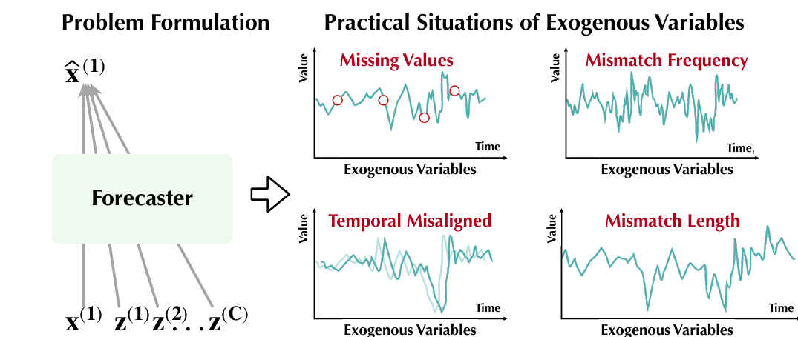
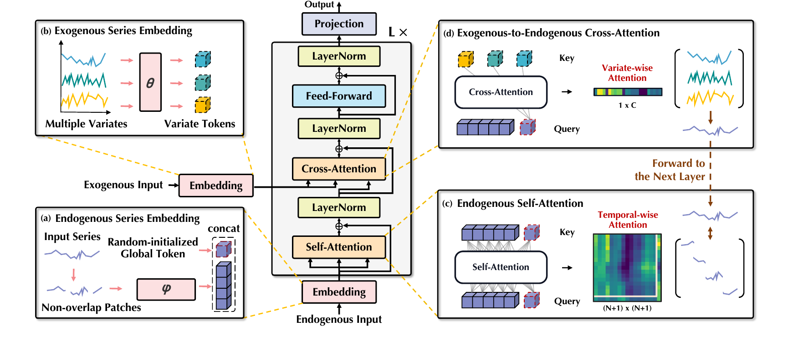

# TimeXer: 외생 변수를 품은 시계열 예측 Transformer

*NeurIPS 2024, Tsinghua University — "TimeXer: Empowering Transformers for Time Series Forecasting with Exogenous Variables"*

## 1. 들어가며: 왜 외생 변수(Exogenous Variables)인가

전력 가격을 예측한다고 생각해보자. 과거 전력 가격의 흐름만 보고 미래를 예측하는 건 근본적으로 한계가 있다. 실제 전력 가격은 수요와 공급, 즉 외부 요인에 의해 결정되기 때문이다. 이렇게 예측 대상 자체(**endogenous 변수**)만으로는 부족하고, 외부에서 영향을 주는 요인들(**exogenous 변수**)을 함께 고려해야 하는 상황이 현실의 시계열 예측 문제에서는 오히려 일반적이다.

TimeXer는 이 문제를 정면으로 다룬다. 기존 Transformer 구조를 전혀 바꾸지 않으면서도, endogenous 변수와 exogenous 변수를 서로 다른 방식으로 임베딩하고 결합해 두 정보를 효과적으로 통합하는 것이 핵심 아이디어다.

논문은 이 문제 상황을 다음 그림으로 요약한다.

왼쪽의 "Problem Formulation"은 forecaster가 예측 대상 x⁽¹⁾(endogenous)와 다수의 외부 변수 z⁽¹⁾, z⁽²⁾, ..., z^(C)(exogenous)를 함께 입력받아 미래값 x̂⁽¹⁾을 예측한다는 문제 설정을 보여준다. 오른쪽 4개의 그래프는 실전에서 exogenous 데이터가 겪는 대표적인 불규칙성을 보여준다.

- **Missing Values**: 중간중간 값이 누락된 경우
- **Mismatch Frequency**: exogenous 변수의 샘플링 주기가 endogenous와 다른 경우
- **Temporal Misaligned**: 두 시계열의 시간축이 정확히 맞지 않는 경우
- **Mismatch Length**: 두 시계열이 커버하는 과거 기간의 길이 자체가 다른 경우

이 네 가지 문제는 뒤에서 살펴볼 TimeXer의 exogenous 임베딩 설계를 이해하는 데 중요한 배경이 된다.

### 1) 문제 정의

논문은 이를 수식으로 다음과 같이 정리한다.

$$\hat{x}_{T+1:T+S} = F_\theta(x_{1:T},\ z_{1:T_{ex}})$$

여기서 $x_{1:T}$는 길이 $T$의 endogenous look-back 시리즈, $z_{1:T_{ex}}$는 길이 $T_{ex}$의 $C$개 exogenous 시리즈 집합이다. 주목할 점은 $T_{ex} \neq T$를 명시적으로 허용한다는 것 — 즉 두 시계열의 look-back 길이가 굳이 같을 필요가 없다는 걸 문제 정의 단계에서부터 전제하고 있다. 모델 $F_\theta$는 이 둘을 입력받아 미래 $S$개 시점 $\hat{x}_{T+1:T+S}$를 예측한다.

## 2. 기존 접근법은 왜 부족했나

Transformer 기반 시계열 예측 모델은 attention을 어느 단위에 적용하느냐에 따라 크게 두 갈래로 나뉜다.

- **Patch 지향 모델 (PatchTST 등)**: 시계열을 겹치지 않는 구간(patch)으로 쪼개고, 그 patch들 사이에 self-attention을 적용해 시간적 패턴을 학습한다. 한 변수 내부의 시간적 의존성은 잘 잡아내지만, 변수 간 상관관계는 다루지 못한다(channel independence).
- **Variate 지향 모델 (iTransformer 등)**: 각 변수 전체를 하나의 토큰으로 취급하고, 변수 토큰들 사이에 attention을 적용해 변수 간 상관관계를 학습한다. 그러나 시계열 전체를 하나의 선형 투영으로 뭉뚱그리기 때문에 내부의 세밀한 시간적 변동을 놓친다.

문제는 이 두 계열 모두 "exogenous 변수는 예측할 필요가 없다"는 특수성을 반영하지 못한다는 점이다. exogenous 변수를 endogenous와 동일하게 취급하면 불필요한 연산 비용이 늘고, 오히려 노이즈가 섞여 예측 성능이 떨어질 수 있다.

## 3. TimeXer의 핵심 아이디어: 서로 다른 해상도로 임베딩하기

TimeXer는 endogenous와 exogenous 변수의 역할이 근본적으로 다르다는 점에 착안해, 이 둘을 **서로 다른 granularity(해상도)** 로 임베딩한다. 전체 구조는 다음 그림 한 장으로 요약된다.

그림을 읽는 순서는 이렇다. (a)는 endogenous 시리즈를 patch token들과 global token으로 만드는 임베딩 과정, (b)는 exogenous 시리즈들을 각각 하나의 variate token으로 만드는 임베딩 과정이다. 이렇게 만들어진 토큰들이 가운데 회색 박스(하나의 TimeXer block, L번 반복)로 들어가서 (c) self-attention과 (d) cross-attention을 차례로 거친 뒤, 맨 위 Projection에서 최종 예측값을 뽑아낸다. 아래에서 각 구성 요소를 순서대로 뜯어본다.

### 1) Endogenous Embedding: Patch + Global Token

endogenous 변수(예측 대상)는 정밀한 시간적 변동을 포착해야 하므로, 겹치지 않는 patch 단위로 분할한 뒤 각 patch를 학습 가능한 선형 투영을 통해 토큰으로 변환한다. 여기에 더해 **학습 가능한 global token** 하나를 추가로 둔다(Figure 2의 (a)). 이 global token은 ViT의 CLS 토큰과 비슷한 역할로, 전체 시리즈를 대표하는 거시적(macroscopic) 표현이자 exogenous 변수와 상호작용하는 다리 역할을 한다.

$$\{s_1, s_2, ..., s_N\} = \text{Patchify}(x)$$

$$P_{en} = \text{PatchEmbed}(s_1, s_2, ..., s_N)$$

$$G_{en} = \text{Learnable}(x)$$

첫 번째 식은 endogenous 시리즈 $x$를 길이 $P$의 patch $N$개로 쪼개는 과정이고, 두 번째 식은 각 patch를 (position embedding을 더한 뒤) 학습 가능한 선형 투영으로 $D$차원 벡터로 만드는 과정이다. 세 번째 식이 바로 그 global token $G_{en}$ — 입력과 무관하게 고정된 학습 파라미터에서 출발해, 이후 attention 층을 거치며 실제 데이터 내용을 흡수해가는 토큰이다. 결과적으로 patch-level 토큰 $N$개와 global token 1개, 총 $N+1$개의 토큰이 Transformer encoder에 입력된다.

주의할 점은, patch 단위 임베딩이 patch 내부의 시점별 정보를 attention으로 정밀하게 처리하는 건 아니라는 것이다. 각 patch는 하나의 벡터로 압축되며, 그 국소적 형태(추세, 변동 패턴)는 선형 투영의 학습된 가중치를 통해 임베딩 값 자체에 녹아든다.

### 2) Exogenous Embedding: 시리즈 전체를 하나의 토큰으로

반면 exogenous 변수는 예측할 필요가 없는 보조 정보이기 때문에, patch 단위로 세분화할 필요가 없다. TimeXer는 각 exogenous 시리즈 전체를 선형 투영 하나로 압축해 **하나의 variate-level 토큰**으로 만든다(Figure 2의 (b)).

$$V_{ex,i} = \text{VariateEmbed}(z^{(i)}),\quad i \in \{1, ..., C\}$$

여기서 VariateEmbed$: \mathbb{R}^{T_{ex}} \to \mathbb{R}^D$는 학습 가능한 선형 투영으로, exogenous 시리즈 길이 $T_{ex}$가 얼마든 상관없이 통째로 하나의 $D$차원 벡터로 압축한다. $C$개의 exogenous 변수가 있다면 $V_{ex} = \{V_{ex,i}\}_{i=1}^{C}$, 즉 $C$개의 variate token이 만들어진다.

이렇게 설계한 이유는 크게 세 가지다.

1. **역할의 차이**: exogenous는 예측 대상이 아니므로 patch 수준의 정밀도가 필요 없다.
2. **효율성**: patch 단위로 잘게 쪼개면 불필요한 연산 복잡도와 노이즈가 늘어난다.
3. **불규칙성에 대한 유연함**: 시리즈 전체를 하나의 벡터로 압축하기 때문에 앞서 Figure 1에서 본 결측치, 시간 정렬 불일치, 샘플링 주파수 차이, look-back 길이 차이($T_{ex} \neq T$) 같은 실전 문제에 구애받지 않는다. 시점 단위 정렬이 애초에 필요 없기 때문이다.

실제로 논문은 이 유연함을 여러 실험으로 입증한다. endogenous와 exogenous의 look-back 길이를 독립적으로 늘려가며 실험했을 때(길이를 {96, 192, 336, 512, 720} 범위에서 조절) 둘의 길이가 달라도 안정적으로 작동했고, 대규모 기상 데이터 실험에서는 endogenous(시간 단위 관측)와 exogenous(3시간 단위 관측)의 샘플링 주파수가 다른 상황에서도 문제없이 작동함을 보였다.

## 4. Self-Attention과 Cross-Attention의 역할 분리

TimeXer는 두 종류의 attention을 명확히 다른 목적으로 사용한다(Figure 2의 (c), (d)).

### 1) Endogenous Self-Attention: 같은 변수 내부의 시간적 의존성

patch 토큰들과 global token을 이어붙여 self-attention을 수행한다. global token은 비대칭적인 역할을 하는데, (1) Global-to-Patch: 각 patch 토큰이 global token을 참조해 시리즈 전체의 맥락을 받아오고, (2) Patch-to-Global: global token이 모든 patch를 참조해 시리즈 전체의 정보를 집약한다.

$$\hat{P}_{en}^{l,1} = \text{LayerNorm}\big(P_{en}^l + \text{SelfAttention}(P_{en}^l)\big) \quad \text{(Patch-to-Patch)}$$

$$\hat{P}_{en}^{l,2} = \text{LayerNorm}\big(P_{en}^l + \text{CrossAttention}(P_{en}^l, G_{en}^l)\big) \quad \text{(Global-to-Patch)}$$

$$\hat{G}_{en}^l = \text{LayerNorm}\big(G_{en}^l + \text{CrossAttention}(G_{en}^l, P_{en}^l)\big) \quad \text{(Patch-to-Global)}$$

이 세 과정은 실제 구현에서는 하나의 self-attention으로 간단히 합쳐진다.

$$\hat{P}_{en}^l, \hat{G}_{en}^l = \text{LayerNorm}\Big(\big[P_{en}^l, G_{en}^l\big] + \text{SelfAttention}\big(\big[P_{en}^l, G_{en}^l\big]\big)\Big)$$

즉 patch 토큰들과 global token을 그냥 이어붙인 뒤 $(N+1) \times (N+1)$ 크기의 attention을 한 번 계산하는 것으로, 위 세 관계(patch-to-patch, global-to-patch, patch-to-global)가 한꺼번에 처리된다. 이것이 **같은 endogenous 시리즈 내부에서, 서로 다른 시간 구간(patch)들 간의 의존성**을 잡아내는 과정이다. 예를 들어 일주일 전 patch와 지금 patch가 유사한 패턴(주기성)을 보인다면, 이 self-attention이 그 관계를 학습한다.

여기서 흥미로운 지점은, 이 attention이 **인과관계를 모델링하는 것이 아니라 유사도 기반의 연관성을 학습하는 것**이라는 점이다. Query-Key 유사도에 따라 가중합을 계산하는 attention의 본질상, "이 patch가 저 patch를 causally 발생시켰다"를 판단하는 게 아니라 "얼마나 비슷한 국소적 패턴·문맥을 공유하는가"를 기반으로 서로의 표현을 보강해주는 것이다.

### 2) 양방향 attention은 인과성 위반이 아닌가?

이 지점에서 자연스럽게 드는 의문이 있다. RNN은 시간 순서대로(과거→현재) 정보를 계산하는데, TimeXer의 양방향(bidirectional) self-attention은 미래 patch가 과거 patch에 영향을 주는 것 아닌가?

답은 "아니다"이다. RNN의 순차적 계산은 실시간 스트리밍 상황(t 시점까지만 데이터를 아는 상태)을 가정한 구조적 선택이지, 물리적 인과성 그 자체를 지키기 위한 장치가 아니다. TimeXer는 추론 시점에 look-back window $x_{1:T}$ 전체가 이미 동시에 주어져 있는 구조다. 즉 patch #150이 patch #10에 영향을 주는 게 아니라, 둘 다 이미 관측이 끝난 데이터를 가지고 서로의 표현을 정교화하는 것뿐이다. 이는 Kalman smoother가 미래 관측치까지 활용해 과거 은닉 상태 추정치를 개선하거나, BiLSTM이 순방향·역방향 양쪽으로 시퀀스를 읽어 표현을 만드는 것과 같은 원리다.

진짜로 지켜야 할 경계는 딱 하나, "예측 대상인 미래($x_{T+1:T+S}$)가 인코딩 과정에 절대 입력으로 들어가면 안 된다"는 것이며, TimeXer는 이 경계를 명확히 지킨다. 또한 예측 자체도 한 스텝씩 순차 생성하는 autoregressive 방식이 아니라, 마지막 layer의 표현에 linear projection을 한 번 적용해 미래 구간 전체를 한 번에 뽑아내는 direct multi-step 방식이다.

$$\text{Loss} = \sum_{i=1}^{S} \big\| x_i - \hat{x}_i \big\|_2^2, \qquad \hat{x} = \text{Projection}\big(\big[P_{en}^L, G_{en}^L\big]\big)$$

즉 $L$개의 TimeXer block을 다 거친 뒤, 최종 patch 토큰들과 global token을 이어붙여 단 한 번의 선형 projection으로 미래 $S$개 시점을 동시에 뽑아내고, 정답과의 L2 거리(MSE)로 학습한다. 생성이 반복되지 않으니, 애초에 causal masking을 걸 이유가 없는 구조다.

### 3) Exogenous-to-Endogenous Cross-Attention

exogenous 변수의 영향을 endogenous에 반영하는 과정은 cross-attention이 담당한다(Figure 2의 (d)). endogenous의 global token이 Query, exogenous variate token들이 Key/Value가 되어, global token이 exogenous 정보를 선택적으로 흡수한다.

$$\hat{G}_{en}^l = \text{LayerNorm}\big(\hat{G}_{en}^l + \text{CrossAttention}(\hat{G}_{en}^l,\ V_{ex})\big)$$

이 식이 TimeXer에서 exogenous 정보가 endogenous로 흘러들어가는 유일한 통로다. global token 하나가 $C$개의 exogenous variate token 전체를 훑어보고, 그림 (d)의 "Variate-wise Attention" 막대그래프처럼 각 exogenous 변수에 얼마나 주목할지 가중치를 학습해 반영한다.

이 구조는 원래의 encoder-decoder Transformer(기계번역 등)의 cross-attention과 개념적으로 닮아 있다 — "타겟 쪽이 외부 컨텍스트를 참조해 자기 표현을 보강한다"는 원리는 동일하다. 다만 구조적으로는 중요한 차이가 있다.

- 별도의 encoder-decoder 두 스택이 아니라, endogenous를 처리하는 **하나의 encoder 스택 안에서 self-attention과 cross-attention이 매 layer마다 함께 일어난다.**
- 원래 encoder-decoder는 인코더가 여러 층을 거쳐 깊게 문맥화된 뒤 디코더에 전달되지만, TimeXer의 exogenous variate token은 **임베딩 단계에서 한 번만 계산되고, 이후 모든 layer에서 정적으로(static) 재사용**된다. exogenous 토큰끼리 서로 attention을 주고받으며 깊어지는 과정이 없다.
- decoder처럼 토큰을 하나씩 순차 생성하며 매 스텝 cross-attention을 반복하는 게 아니라, 최종 layer에서 한 번의 linear projection으로 미래 전체를 예측한다.

## 5. exogenous 변수들 사이의 상관관계는 어떻게 되는가

한 가지 자연스러운 질문이 남는다. exogenous 변수들 자체가 서로 연관되어 있고, 그 상호작용이 endogenous에 영향을 준다면, exogenous들도 서로 self-attention을 거치게 하는 게(일종의 encoder처럼) 더 낫지 않을까?

TimeXer 논문은 실제로 이 설계를 부록에서 실험했다("Concatenate" ablation). endogenous 토큰과 exogenous 토큰을 모두 이어붙여 하나의 self-attention을 통째로 수행하는 방식인데, 결과는 데이터셋에 따라 갈렸다. Traffic 데이터셋에서는 이 방식이 TimeXer의 기본 설계보다 오히려 더 좋은 성능을 보였지만, ETTh1과 ETTm1에서는 더 나빴다. 논문은 "exogenous 변수들 사이의 상호작용도 유용한 외부 정보로 작용할 수 있지만, 이런 상관관계가 모든 경우에 유효한 것은 아니다"라고 결론짓는다. 게다가 exogenous 변수 개수 $C$에 대해 cross-attention은 $O(C)$ 복잡도인 반면, 이렇게 exogenous끼리 self-attention을 붙이면 $O(C^2)$로 늘어나는 비용 문제도 있다. 즉 이는 정답이 정해진 문제가 아니라 데이터 특성에 따라 갈리는 설계 트레이드오프로 남아 있다.

## 6. 다변량 예측으로의 일반화: Channel Independence

TimeXer는 원래 "하나의 endogenous + 여러 exogenous" 구도를 위해 설계됐지만, 이를 **channel independence** 메커니즘으로 확장해 일반적인 다변량 예측에도 적용한다. 핵심 발견은 다변량 예측을 "각 변수를 endogenous로 두고, 나머지 변수 전체를 exogenous로 취급하는 문제"로 재정의할 수 있다는 것이다.

이때 $C$개의 변수가 있다면, 하나의 다변량 샘플에서 "이 변수를 endogenous로, 나머지를 exogenous로" 하는 조합을 $C$가지 만들어 병렬로 처리한다. 이 $C$개의 병렬 처리는 **완전히 동일한 가중치**(patch embedding 투영, global token 파라미터, variate embedding 투영, self-attention·cross-attention의 Q/K/V 행렬, feed-forward, 출력 projection 전부)를 공유한다. 즉 역할(endogenous/exogenous)에 따라 다른 파라미터를 쓰는 게 아니라, 입력 데이터만 바뀌고 이를 처리하는 함수는 항상 동일하다.

이 방식은 변수 개수가 늘어도 파라미터 수가 늘지 않고, 한 변수에서 학습한 시간적 패턴을 다른 변수에도 재사용할 수 있다는 장점이 있다. 다만 이는 근본적인 한계도 동반한다. **embedding 함수 자체는 "이게 어떤 변수인지"를 전혀 모른다.** 서로 다른 두 변수의 patch가 우연히 같은 값 패턴을 가지면 동일한 임베딩으로 매핑되며, 온도와 주가처럼 형태는 비슷해도 의미가 완전히 다른 변수를 구분할 명시적 장치가 없다. 다행히 TimeXer가 실험한 벤치마크들은 대부분 하나의 데이터셋 안에서 서로 관련된 변수들끼리 묶여 있어 이 문제가 크게 부각되지 않았고, 각 변수가 endogenous일 때 나머지 변수 구성이 서로 달라지는 점(자기 자신을 제외한 세트)이 부분적인 완충 장치 역할을 한다. 하지만 진짜로 이질적인 도메인을 하나의 공유 가중치 모델로 묶는 최근의 시계열 foundation model류 연구에서는 이 문제가 훨씬 중요해지며, 이를 겨냥해 명시적인 변수 식별 임베딩(variable/channel identity embedding)을 추가하는 후속 연구들이 등장하고 있다(CrossLinear, Cross-Variate Patch Embedding, IndexNet 등).

## 7. 실험 결과: 일관된 SOTA

TimeXer는 두 갈래의 벤치마크에서 검증됐다: 단기 전력가격 예측(EPF)과 장기 다변량 예측(ECL, Weather, ETT, Traffic 등 7개 벤치마크)이다. 그중 exogenous 변수의 효과가 가장 직접적으로 드러나는 EPF 결과를 살펴보자. NP, PJM, BE, FR, DE 5개 실제 전력시장 데이터셋에서 과거 168시점을 보고 미래 24시점(전력가격)을 예측하는 과제다.

| 데이터셋 (MSE) | **TimeXer** | iTransformer | PatchTST | Crossformer | TiDE | DLinear |
|---|---|---|---|---|---|---|
| NP | **0.236** | 0.265 | 0.267 | 0.240 | 0.335 | 0.309 |
| PJM | **0.093** | 0.097 | 0.106 | 0.101 | 0.124 | 0.108 |
| BE | **0.379** | 0.394 | 0.400 | 0.420 | 0.523 | 0.463 |
| FR | **0.385** | 0.439 | 0.411 | 0.434 | 0.510 | 0.429 |
| DE | **0.440** | 0.479 | 0.461 | 0.574 | 0.568 | 0.520 |
| **AVG** | **0.307** | 0.335 | 0.330 | 0.354 | 0.412 | 0.366 |

*(값이 낮을수록 좋은 성능. TiDE는 exogenous 변수를 위해 특별히 설계된 모델임에도 TimeXer가 5개 데이터셋 전부에서 앞선다.)*

TimeXer는 5개 데이터셋 **전부**에서 최고 성능을 기록했다. 특히 눈여겨볼 대목은 TiDE와의 비교다. TiDE는 애초에 exogenous 변수를 다루기 위해 설계된 모델인데도 TimeXer에 명확히 뒤처지는데, 이는 "exogenous를 다룰 수 있다"는 것과 "exogenous를 patch-level 시간 정보와 잘 결합한다"는 것이 다른 차원의 문제임을 보여준다. 장기 다변량 예측 7개 벤치마크에서도 TimeXer는 대부분 최고 또는 최상위권 성능을 유지했다.

### 1) Ablation: 설계 선택의 타당성 검증

주요 ablation(Table 4)은 endogenous의 patch+global token 조합과 exogenous의 cross-attention 조합("Ours")이 다른 대안 설계(exogenous를 patch로 대체, global token 제거, cross-attention을 단순 덧셈으로 대체, concatenate 후 self-attention)보다 전반적으로 우수함을 보였다.

### 2) 실전 강건성

- **결측치 강건성**: 흥미롭게도 exogenous 시리즈를 0이나 랜덤값으로 완전히 훼손해도 성능 저하가 크지 않았던 반면, endogenous 시리즈를 똑같이 훼손하면 성능이 급격히 나빠졌다. 이는 모델의 예측이 근본적으로 endogenous 자체의 시간적 패턴에 크게 의존하고, exogenous는 보조적으로 작동한다는 걸 보여준다.
- **확장성**: 3,850개 기상관측소, 36개 exogenous 변수를 사용한 대규모 실험에서도 다른 baseline보다 우수한 성능과 효율을 보였다.
- **효율성**: exogenous 변수 개수가 많아질수록(예: 320개 exogenous 변수를 쓴 ECL 실험) TimeXer는 cross-attention의 $O(C)$ 복잡도 덕분에 iTransformer($O(C^2)$)보다 메모리 사용량이 크게 낮았다.

### 3) 해석 가능성

Weather 데이터셋에서 CO2 농도(endogenous)를 예측할 때, 학습된 attention이 Air Density(공기 밀도)에는 높은 가중치를, Maximum Wind Velocity(최대 풍속)에는 낮은 가중치를 부여했는데, 이는 실제 기상학적으로 타당한 관계와 일치한다. 모델이 임의로 가중치를 배분하는 게 아니라 물리적으로 의미 있는 연관성을 학습한다는 정성적 근거다.

## 8. 마무리

TimeXer는 "기존 Transformer 구조를 전혀 바꾸지 않고도, 임베딩 전략만으로 endogenous와 exogenous 정보를 동시에 다룰 수 있다"는 걸 보여준 논문이다. patch 단위의 정밀한 시간 표현과 variate 단위의 유연한 외부 정보 표현을 global token이라는 다리로 연결한 설계가 핵심이며, 이를 통해 단기·장기, 단변량·다변량을 아우르는 일관된 성능과 실전 데이터의 불규칙성(결측, 정렬 불일치, 주파수 차이)에 대한 강건함을 동시에 확보했다.

다만 channel independence 기반의 가중치 공유 방식은 변수의 "정체성"을 모델이 알지 못한다는 근본적 한계를 안고 있으며, 이는 이질적인 도메인을 아우르는 차세대 시계열 모델들이 풀어야 할 숙제로 남아 있다.

---

**참고**
- 논문: Wang, Y., Wu, H., Dong, J., Qin, G., Zhang, H., Liu, Y., Qiu, Y., Wang, J., & Long, M. (2024). *TimeXer: Empowering Transformers for Time Series Forecasting with Exogenous Variables*. NeurIPS 2024.
- 코드: [github.com/thuml/TimeXer](https://github.com/thuml/TimeXer)
