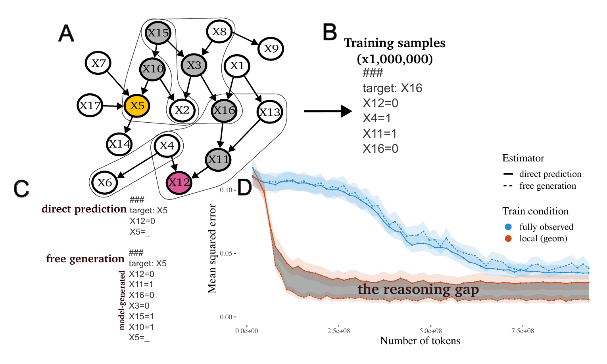
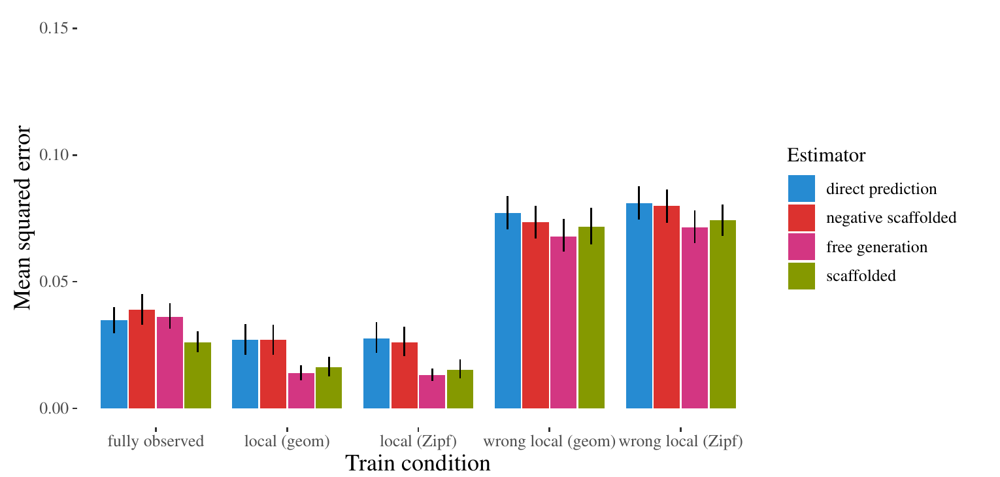

# 왜 AI는 단계적으로 생각할 때 더 잘 풀까?

## 인공 베이지안 네트워크로 살펴본 Chain-of-Thought의 작동 원리

> **대상 논문**  
> Ben Prystawski, Michael Y. Li, Noah D. Goodman, *Why think step by step? Reasoning emerges from the locality of experience*, NeurIPS 2023.

“정답만 바로 말하지 말고, 단계적으로 생각해 봐.”

생성형 AI를 사용해 본 사람이라면 한 번쯤 입력해 봤을 법한 문장이다. 실제로 대규모 언어모델에게 중간 사고 단계를 생성하게 하면, 수학 문제나 논리 문제에서 곧바로 답을 요구할 때보다 더 정확한 결과가 나오는 경우가 많다.

그런데 여기에는 한 가지 이상한 점이 있다. 단계적으로 생각한다고 해서 AI가 외부에서 새로운 정보를 얻는 것은 아니다. 질문도 같고, 모델이 가지고 있는 학습 지식도 같다. 그럼에도 중간 단계를 거치면 왜 답이 더 정확해지는 것일까?

이 논문은 그 이유를 **학습 경험의 국소성(locality)**에서 찾는다. 언어모델은 세상의 모든 개념을 한꺼번에 관찰하는 것이 아니라, 서로 밀접하게 관련된 정보들을 작은 묶음으로 학습한다. 단계적 추론은 이렇게 학습한 작은 관계들을 이어 붙여, 직접 함께 본 적이 없는 개념 사이의 관계를 추정하게 해 준다는 것이다.

이 글에서는 논문의 핵심 주장뿐 아니라, 실험에 사용된 **인공 베이지안 네트워크가 정확히 무엇인지**, 그 네트워크에서 어떻게 Transformer 학습 데이터를 만들었는지, 그리고 그 결과를 실제 LLM에 어디까지 일반화할 수 있는지를 순서대로 살펴본다.

---

## 1. 연구가 던지는 질문: 생각은 새 정보를 주지 않는데 왜 도움이 될까?

### 1) Chain-of-Thought의 역설

사람은 복잡한 문제를 한 번에 풀지 못할 때 중간 단계를 적어가며 해결한다. 언어모델도 마찬가지로, 답을 바로 출력하게 하는 것보다 중간 추론 단계를 생성하게 할 때 성능이 좋아지는 경우가 있다.

하지만 중간 단계를 적는다고 해서 세상에서 새로운 데이터가 들어오는 것은 아니다. 모델이 이미 가지고 있던 정보를 다시 출력할 뿐이다. 논문의 출발점은 바로 이 역설이다.

> **왜 아무런 외부 정보가 추가되지 않았는데도, 중간 단계를 거치면 추론이 더 정확해질 수 있는가?**

저자들의 답은 다음과 같다.

> 직접 연결하기 어려운 두 개념도, 학습 중 자주 관찰한 여러 개의 국소적 관계를 중간 단계로 이어 붙이면 더 정확하게 연결할 수 있다.

### 2) 프랑스 수도의 기후를 묻는 예

예를 들어 모델이 다음 두 관계를 잘 학습했다고 하자.

- 프랑스의 수도는 파리다.
- 파리는 서안 해양성 기후에 속한다.

그러나 학습 문서에서 ‘프랑스’와 ‘수도의 기후’가 직접 함께 언급된 적은 많지 않을 수 있다. 이때 모델이 다음 질문을 받는다.

> 프랑스 수도의 기후는 무엇인가?

바로 답하려면 ‘프랑스’와 ‘기후’ 사이의 관계를 직접 학습했어야 한다. 반면 중간 단계를 생성하면 다음처럼 문제를 연결할 수 있다.

```text
프랑스의 수도는 파리다.
파리는 서안 해양성 기후에 속한다.
```

즉,

```text
프랑스 → 파리 → 파리의 기후
```

라는 경로를 이용하는 것이다.

논문은 Chain-of-Thought가 이처럼 학습 데이터에서 자주 접한 국소적 관계를 이어 붙이는 역할을 할 수 있다고 본다. 단계적 추론은 완전히 새로운 지식을 만들어 내는 것이 아니라, **이미 배운 작은 관계들을 조합하는 과정**이라는 해석이다.

---

## 2. 인공 베이지안 네트워크란 무엇인가?

### 1) 베이지안 네트워크는 Transformer가 아니다

이 논문에서 가장 먼저 구분해야 할 것은 **인공 베이지안 네트워크와 Transformer의 역할**이다.

- **인공 베이지안 네트워크**: 변수 관계와 정답 확률이 존재하는 가상의 세계
- **학습 데이터 생성 과정**: 그 가상 세계에서 일부 관측값을 뽑아 문자열로 만드는 과정
- **Transformer**: 생성된 문자열을 학습하고, 보지 못한 변수 관계를 추론하는 모델

관계를 그림처럼 표현하면 다음과 같다.

```text
인공 베이지안 네트워크
        ↓ 가상 세계의 값 생성
부분적으로 관찰된 문자열 샘플
        ↓ 100만 개 학습
자기회귀 Transformer
        ↓
조건부확률 예측
```

베이지안 네트워크는 시험문제와 정답을 만드는 출제자이고, Transformer는 그 문제를 학습하고 푸는 학생에 가깝다.

### 2) 노드, 화살표, 조건부확률표

베이지안 네트워크는 여러 확률변수 사이의 관계를 **방향이 있는 그래프**로 표현한 확률모형이다.

간단한 예를 보자.

```text
X1 → X2 → X3
```

각 변수는 0 또는 1의 값을 가진다고 가정한다.

$$
X_1,X_2,X_3\in\{0,1\}
$$

- 원 또는 변수 이름은 **노드(node)**다.
- 화살표는 직접적인 확률 의존관계를 나타낸다.
- 화살표가 출발하는 변수는 부모, 들어가는 변수는 자식이다.
- 각 변수에는 부모의 값에 따라 자신이 0 또는 1이 될 확률을 정한 **조건부확률표(CPT)**가 있다.

예를 들어 다음처럼 설정할 수 있다.

$$
P(X_1=1)=0.5
$$

$$
P(X_2=1\mid X_1=1)=0.9,\qquad
P(X_2=1\mid X_1=0)=0.1
$$

$$
P(X_3=1\mid X_2=1)=0.8,\qquad
P(X_3=1\mid X_2=0)=0.2
$$

이 설정에서는 $X_1=1$이면 $X_2=1$일 가능성이 높고, $X_2=1$이면 다시 $X_3=1$일 가능성이 높다.

### 3) 결합확률을 작은 조건부확률로 분해한다

베이지안 네트워크의 핵심은 복잡한 결합확률을 여러 개의 작은 조건부확률로 나누는 것이다.

$$
P(X_1,\ldots,X_n)
=
\prod_{i=1}^{n}P\bigl(X_i\mid \operatorname{Pa}(X_i)\bigr)
$$

여기서 $\operatorname{Pa}(X_i)$는 $X_i$의 부모 변수 집합이다.

앞의 연쇄 구조에서는 다음과 같이 분해된다.

$$
P(X_1,X_2,X_3)
=
P(X_1)P(X_2\mid X_1)P(X_3\mid X_2)
$$

이 식이 중요한 이유는 모든 변수의 관계를 한꺼번에 외우지 않아도 된다는 데 있다. 각 변수는 자신의 부모와의 국소적 관계만 정의하면 되고, 전체 세계의 확률은 이 작은 관계들을 곱해 구성된다.

### 4) 화살표가 없다고 관계가 없는 것은 아니다

다음 구조에서 $X_1$과 $X_3$ 사이에는 직접 화살표가 없다.

```text
X1 → X2 → X3
```

그렇다고 둘이 독립인 것은 아니다. $X_1$은 $X_2$를 거쳐 $X_3$에 간접적인 정보를 준다.

다만 $X_2$의 값을 알고 나면 상황이 달라진다.

$$
X_1\perp X_3\mid X_2
$$

이는 “$X_2$가 주어졌을 때 $X_1$과 $X_3$은 조건부 독립”이라는 뜻이다. $X_1$이 $X_3$에 전달하는 정보가 모두 $X_2$를 통과하므로, 이미 $X_2$를 알고 있다면 $X_1$을 추가로 알아도 $X_3$에 관한 새로운 정보가 거의 없다.

이처럼 어떤 변수를 관찰했을 때 두 변수 사이의 정보 경로가 차단되는지를 판단하는 개념이 **d-separation**이다. 논문에서 유용한 중간 변수, 즉 scaffold는 관찰 변수와 목표 변수를 d-separate하는 변수 집합으로 정의된다.

### 5) 중간 변수를 모르면 가능한 값을 모두 고려한다

$X_2$의 값을 직접 관찰하지 못했지만 $P(X_3\mid X_1)$을 알고 싶다고 하자. 이때 $X_2$가 0인 경우와 1인 경우를 모두 고려해 합산한다.

$$
P(X_3\mid X_1)
=
\sum_{x_2}
P(X_3\mid X_2=x_2)
P(X_2=x_2\mid X_1)
$$

설명용 확률값을 넣으면 다음과 같다.

$$
\begin{aligned}
P(X_3=1\mid X_1=1)
=&P(X_3=1\mid X_2=1)P(X_2=1\mid X_1=1)\\
&+P(X_3=1\mid X_2=0)P(X_2=0\mid X_1=1)\\
=&(0.8\times0.9)+(0.2\times0.1)\\
=&0.74
\end{aligned}
$$

$X_1$과 $X_3$의 관계를 직접 정의하지 않았는데도, 중간 변수 $X_2$를 거쳐 계산할 수 있다. 바로 이 구조가 논문의 단계적 추론 아이디어와 연결된다.

---

## 3. 논문은 인공 베이지안 네트워크를 어떻게 만들었나?

### 1) 변수 100개와 무작위 간선 100개

저자들은 하나의 베이지안 네트워크마다 변수 100개를 생성했다.

$$
X0,X1,\ldots,X99
$$

그다음 변수 사이에 방향성 간선 100개를 점진적으로 추가해 무작위 네트워크 구조를 만들었다. 이러한 후보 네트워크를 총 100개 생성했다.

변수 이름에는 현실적인 의미가 없다. `X42=1`은 어떤 구체적인 문장이 참이라는 뜻이 아니라, 가상 확률세계의 42번째 변수가 두 상태 중 하나를 갖는다는 의미다. 중요한 것은 0과 1 자체가 아니라 변수 사이의 확률적 관계다.

### 2) 강한 의존관계를 만들기 위한 확률 설정

각 변수의 부모값 조합에 대해 그 변수가 1일 확률을 설정했다.

$$
P\bigl(X_i=1\mid \operatorname{Pa}(X_i)\bigr)
$$

이 확률은 다음 베타분포에서 무작위로 뽑았다.

$$
\operatorname{Beta}\left(\frac15,\frac15\right)
$$

이 분포는 0.5 부근보다 0이나 1에 가까운 값을 상대적으로 자주 만든다. 그 결과 다음과 같이 부모의 값에 따라 자식 변수의 확률이 크게 달라지는 관계가 만들어지기 쉽다.

```text
P(X2=1 | X1=0) = 0.06
P(X2=1 | X1=1) = 0.94
```

저자들이 강한 의존관계를 의도적으로 만든 이유는 명확하다. 관계가 너무 약하면 서로 멀리 떨어진 변수의 조건부확률과 단순한 주변확률이 거의 같아진다. 그러면 모델이 관계를 제대로 학습하지 않아도 그럴듯한 값을 내놓을 수 있어, 단계적 추론의 효과를 측정하기 어려워진다.

### 3) 직접 연결되지 않았지만 관련성이 높은 변수쌍

다음 구조를 다시 생각해 보자.

```text
X1 → X2 → X3
```

$X_1$과 $X_3$은 직접 연결되지 않았지만, $X_2$를 통해 강하게 관련될 수 있다.

논문은 이런 변수쌍을 찾기 위해 **상호정보량(mutual information)**을 계산했다. 상호정보량은 한 변수의 값을 알았을 때 다른 변수에 대해 얼마나 많은 정보를 얻을 수 있는지를 나타낸다.

실제 절차는 다음과 같다.

1. 각 네트워크에서 모든 변수쌍의 상호정보량을 계산한다.
2. 직접 인접하지 않은 변수쌍 중 상호정보량이 높은 50개를 고른다.
3. 그중 25개를 무작위로 선택해 학습 데이터에서 숨길 **held-out pair**로 지정한다.
4. 후보 100개 중 held-out pair들의 평균 상호정보량이 높은 10개 네트워크를 최종 선택한다.

즉, 모델이 풀어야 할 관계가 너무 약하지 않으면서도, 학습 중에는 두 변수를 직접 함께 볼 수 없도록 설계한 것이다.

---

## 4. 베이지안 네트워크에서 Transformer 학습 데이터를 만드는 과정

### 1) 세계의 규칙과 관찰의 규칙을 분리한다

논문은 두 개의 분포를 구분한다.

- $p_d$: 베이지안 네트워크가 정의하는 **데이터분포**. 변수들이 어떤 관계를 가지며 어떤 값을 갖는지를 결정한다.
- $p_{\text{obs}}$: 한 번의 학습 샘플에서 **어떤 변수들을 관찰할지** 결정하는 관찰분포다.

간단히 표현하면 다음과 같다.

$$
p_d=\text{가상 세계가 실제로 어떤 상태인가}
$$

$$
p_{\text{obs}}=\text{그 세계 중 이번 샘플에서 무엇을 보았는가}
$$

베이지안 네트워크에는 변수 100개가 모두 존재하지만, Transformer가 한 번의 학습 샘플에서 보는 것은 그중 일부뿐이다.

### 2) 중심 변수 주변의 국소 영역을 선택한다

각 샘플을 만들 때 먼저 중심 변수 하나를 무작위로 선택한다. 그다음 그래프 거리 $k$를 뽑고, 중심 변수에서 거리 $k$ 이내에 있는 변수들을 관찰 후보로 삼는다.

예를 들어 전체 구조가 다음과 같다고 하자.

```text
X1 → X2 → X3 → X4
       ↓
       X5
```

중심 변수가 $X_2$, 반경이 $k=1$이라면 후보 집합은 다음과 같다.

$$
\{X_1,X_2,X_3,X_5\}
$$

$X_4$는 $X_2$에서 두 단계 떨어져 있으므로 포함되지 않는다.

논문에서는 $k$를 기하분포 또는 Zipf 분포에서 뽑았다. 따라서 작은 국소 영역이 자주 선택되고, 가끔 더 넓은 영역이 선택된다. 이는 한 문서나 한 번의 인간 경험이 세상의 모든 정보를 담는 것이 아니라, 특정 주제 주변의 몇 가지 관련 정보만 담는다는 직관을 반영한다.

### 3) Variable dropout으로 일부 관찰을 제거한다

국소 영역이 정해졌다고 해서 그 안의 모든 변수를 보여주지는 않는다. 논문은 각 변수를 20%의 확률로 제거하는 **variable dropout**을 적용했다.

예를 들어 후보 집합이

$$
\{X_1,X_2,X_3,X_5\}
$$

이고 $X_5$가 제거되면,

$$
\{X_1,X_2,X_3\}
$$

만 남는다.

이는 가까운 상황을 경험하더라도 모든 요소를 빠짐없이 관찰하지는 못한다는 현실을 흉내 낸다. 동시에 더 다양한 변수 조합을 학습 데이터에 만들어 일반화를 돕는 역할도 할 수 있다.

### 4) Held-out pair는 절대로 함께 보여주지 않는다

$X_1$과 $X_3$이 held-out pair라고 하자.

학습 데이터에는 다음 샘플이 나올 수 있다.

```text
X1=1
X2=1
```

또는

```text
X2=1
X3=1
```

하지만 다음 샘플은 나올 수 없다.

```text
X1=1
X3=1
```

세 변수가 모두 함께 나오는 것도 금지된다.

```text
X1=1
X2=1
X3=1
```

국소 영역과 dropout을 적용한 뒤에도 held-out pair가 함께 남아 있다면, 논문은 두 변수 중 하나를 무작위로 제거한다. 따라서 모델은 $X_1$과 $X_3$의 관계를 직접 암기할 수 없지만, 다음 두 국소관계는 충분히 학습할 수 있다.

$$
X_1\leftrightarrow X_2,
\qquad
X_2\leftrightarrow X_3
$$

### 5) 변수값을 생성하고 문자열로 바꾼다

최종적으로 보여줄 변수 집합이 정해지면, 베이지안 네트워크의 확률규칙에 따라 각 변수의 0·1 값을 생성한다.

그다음 선택된 변수들을 무작위 순서로 배치하고, 마지막 변수의 이름을 문자열 처음에 `target`으로 표시한다.

예를 들어 최종 값이 $X_1=1$, $X_2=1$이고 순서가 $X_2,X_1$로 정해지면 다음과 같은 학습 샘플이 만들어진다.

```text
###
target: X1
X2=1
X1=1
```

- `###`: 새로운 샘플의 시작
- `target: X1`: 마지막 예측 대상이 $X_1$임을 표시
- `X2=1`: 앞에서 제공된 관찰
- `X1=1`: 학습해야 할 실제 목표값

저자들은 최종 선택된 베이지안 네트워크마다 이러한 문자열 샘플을 **100만 개씩** 생성했다.

### 6) 전체 과정을 하나의 예로 연결하면

가상의 세계가 다음과 같다고 하자.

```text
X1 → X2 → X3
```

그리고 $(X_1,X_3)$이 held-out pair다.

모델은 다음 샘플들을 반복해서 볼 수 있다.

```text
X1=1, X2=1
```

```text
X2=1, X3=1
```

하지만 다음 조합은 단 한 번도 보지 못한다.

```text
X1=1, X3=1
```

평가 시 모델은 다음 질문을 받는다.

```text
###
target: X3
X1=1
X3=
```

직접 예측에서는 $X_1$과 $X_3$을 함께 본 적이 없어 어려울 수 있다. 반면 모델이 $X_2$를 중간 단계로 생성하면 다음처럼 바뀐다.

```text
###
target: X3
X1=1
X2=1
X3=
```

이제 모델은 학습 중 충분히 본 두 관계를 이용할 수 있다.

```text
X1=1 → X2=1
X2=1 → X3=1
```

결국 이 데이터 생성 방식은 **모델이 답을 직접 암기하지 못하게 하면서도, 답에 도달하는 데 필요한 작은 관계들은 학습할 수 있도록 설계한 것**이다.

---

## 5. 직접 예측과 단계적 추론은 어떻게 비교했나?



*그림 1. 논문 Figure 1을 발췌한 것이다. A는 베이지안 네트워크와 국소 관찰영역, B는 문자열 학습 샘플, C는 직접 예측과 free generation의 프롬프트 차이, D는 학습량에 따른 reasoning gap을 보여준다.*

### 1) Direct prediction

직접 예측은 중간 단계 없이 목표변수의 확률을 바로 출력하는 기준선이다.

$$
\hat q_D(Y_i=y_i\mid Y_j=y_j)
=
q(Y_i=y_i\mid Y_j=y_j)
$$

예를 들어 다음처럼 곧바로 $X_3$을 예측한다.

```text
###
target: X3
X1=1
X3=
```

문제는 $X_1$과 $X_3$이 held-out pair라면 모델이 두 변수를 함께 본 적이 없다는 점이다.

### 2) Scaffolded generation

Scaffolded generation에서는 연구자가 베이지안 네트워크 구조를 알고 있다고 가정하고, 관찰 변수와 목표변수 사이를 연결하는 유용한 중간 변수들을 미리 지정한다.

중간 변수 집합을 $S$라고 하면, 모델은 중간 변수의 값들을 여러 번 샘플링한 뒤 목표확률을 평균한다.

$$
\hat q_S(Y_i=y_i\mid Y_j=y_j)
=
\frac{1}{M}
\sum_{k=1}^{M}
q\left(
Y_i=y_i
\mid
\{Y_s=y_s^{(k)}\}_{s\in S},
Y_j=y_j
\right)
$$

여기서 $M$은 Monte Carlo 샘플 수다. 논문에서는 10회 샘플링했다.

이 방식은 중간 변수의 실제 값을 안다는 뜻이 아니다. 모델이 각 중간 변수의 가능한 값을 확률적으로 생성하고, 여러 추론 경로에서 얻은 목표확률을 평균해 중간 변수들을 주변화하는 것이다.

### 3) Free generation

Free generation은 모델이 중간 변수의 값뿐 아니라 **어떤 변수를 중간 단계로 사용할지까지 스스로 선택**한다.

예를 들어 처음에는 다음과 같이 시작한다.

```text
###
target: X3
X1=1
```

모델은 목표변수 이름을 출력할 때까지 중간 변수와 값을 계속 생성한다.

```text
###
target: X3
X1=1
X2=1
X3=
```

이 조건에서 성능이 좋아진다면, 모델이 국소적으로 학습한 관계들을 이용해 스스로 유용한 추론 경로를 만들었다고 볼 수 있다.

### 4) Negative scaffolded generation

연구자들은 “중간 토큰을 더 많이 생성하기만 해도 성능이 좋아지는 것 아닌가?”라는 대안을 통제하기 위해 관련 없는 중간 변수를 넣는 negative scaffolded generation도 비교했다.

유용한 scaffold와 같은 수의 변수를 사용하되, 실제 경로에 포함되지 않은 변수들을 무작위로 선택한다. 이 방식이 개선되지 않는다면 성능 향상은 단순히 답변이 길어졌기 때문이 아니라, **관련 있는 중간 관계를 사용했기 때문**이라고 해석할 수 있다.

---

## 6. Reasoning gap: 왜 중간 단계를 거치면 편향이 줄어드는가?

### 1) 이론적 설정

논문의 이론 분석에서는 단순한 연쇄형 구조를 사용한다.

```text
Y1 → Y2 → Y3 → ... → YN
```

학습 데이터에는 인접한 변수쌍만 등장한다. 즉, 모델은 $Y_1$과 $Y_2$, $Y_2$와 $Y_3$의 관계는 배우지만, $Y_1$과 $Y_3$은 직접 함께 보지 못한다.

이 조건에서 저자들은 중간 변수들을 거친 추정의 편향이 직접 예측의 편향보다 작아지는 **reasoning gap**이 존재함을 보인다.

$$
\left|
\mathbb E\left[
\hat q_S(Y_i=y_i\mid Y_j=y_j)
\right]
-
p_d(Y_i=y_i\mid Y_j=y_j)
\right|^2
<
\left|
\hat q_D(Y_i=y_i\mid Y_j=y_j)
-
p_d(Y_i=y_i\mid Y_j=y_j)
\right|^2
$$

왼쪽은 중간 변수들을 거친 scaffolded 추정의 제곱편향이고, 오른쪽은 직접 예측의 제곱편향이다.

### 2) 직관적인 설명

모델이 학습 중 자주 본 관계는 비교적 정확하게 학습할 수 있다.

```text
Y1 ↔ Y2
Y2 ↔ Y3
```

하지만 함께 본 적 없는 관계에는 학습 손실이 직접적인 정답 신호를 주지 않는다.

```text
Y1 ↔ Y3
```

그래서 직접 예측은 실제 조건부확률 대신 단순한 주변확률이나 균등한 값에 가까워질 수 있다. 반면 중간 변수를 거치면, 학습 데이터에 실제로 존재했던 인접 관계들을 순서대로 연결할 수 있다.

> 직접 예측이 보지 못한 관계를 한 번에 추측한다면, 단계적 추론은 학습한 작은 관계들을 한 단계씩 이어 붙인다.

논문이 말하는 reasoning gap은 바로 이 차이다.

---

## 7. Transformer 실험은 어떻게 구성됐나?

### 1) 실제 학습 모델

학습 데이터는 베이지안 네트워크에서 만들었지만, 이를 학습한 모델은 실제 자기회귀 Transformer였다.

기본 모델은 작은 GPT-2 계열 구조로 구성됐다.

- 임베딩 차원: 512
- Transformer 층: 10개
- 어텐션 헤드: 8개
- 파라미터: 약 3,257만 개
- 네트워크당 학습 샘플: 100만 개
- 총 학습 토큰: 약 9억 2,160만 개
- 학습 스텝: 30만 회

저자들은 더 작은 모델, 더 큰 모델, 임베딩이 넓은 모델 등 다른 Transformer 구조에서도 비슷한 현상이 나타나는지 확인했다. 실제 분포를 제대로 학습하지 못할 정도로 작은 tiny 모델을 제외하면 결과는 대체로 유지됐다.

### 2) 다섯 가지 학습 조건

핵심 비교는 학습 데이터의 관찰구조를 바꾸는 방식으로 이루어졌다.

- **fully observed**: 거의 모든 변수가 한 샘플에 등장
- **local (geom)**: 실제 의존관계에 따라 기하분포 크기의 국소 영역을 관찰
- **local (Zipf)**: 실제 의존관계에 따라 Zipf 분포 크기의 국소 영역을 관찰
- **wrong local (geom)**: 다른 베이지안 네트워크의 구조를 기준으로 잘못된 국소 영역을 만듦
- **wrong local (Zipf)**: 잘못된 구조와 Zipf 크기를 사용

`wrong local` 조건에도 국소적인 공동출현은 존재한다. 다만 자주 함께 등장하는 변수들이 실제로 서로 강하게 의존하는 변수들은 아니다. 따라서 “작은 묶음으로 학습했다는 사실”만 중요한지, 아니면 그 묶음이 실제 의존관계를 반영해야 하는지를 구분할 수 있다.

---

## 8. 주요 결과: 언제 단계적 추론이 도움이 됐나?



*그림 2. 논문 Figure 2. 세로축은 held-out pair의 실제 조건부확률과 모델 추정치 사이의 평균제곱오차(MSE)다. 낮을수록 정확하다. 올바른 local 조건에서 free generation과 scaffolded generation이 직접 예측보다 낮은 오차를 보인다.*

### 1) 올바른 국소 구조에서는 단계적 추론이 유리했다

학습 데이터가 실제 변수 의존관계에 따라 국소적으로 구성된 경우, scaffolded generation과 free generation이 직접 예측보다 유의하게 정확했다.

특히 free generation의 성공은 중요하다. 연구자가 올바른 중간 변수를 알려주지 않아도, 국소적 데이터로 학습한 Transformer가 스스로 도움이 되는 중간 변수를 생성할 수 있었기 때문이다.

관련 없는 중간 변수를 사용한 negative scaffolded generation은 같은 개선을 보이지 않았다. 따라서 단순히 출력 토큰이 늘었기 때문이 아니라, **목표와 관련된 중간 변수들이 실제로 예측에 기여했다**고 볼 수 있다.

### 2) 직접 함께 본 변수에는 단계적 추론이 필요하지 않았다

다음 표는 held-out이 아니어서 학습 데이터에서 함께 등장할 수 있었던 고상호정보량 변수쌍에 대해, 직접 예측값이 실제 조건부확률과 주변확률 중 어느 쪽에 가까운지를 보여준다.

| 비교 대상 | Fully observed | Local (geom) | Local (Zipf) | Wrong local (geom) | Wrong local (Zipf) |
|---|---:|---:|---:|---:|---:|
| 실제 조건부확률과의 MSE | .013 [.010, .016] | .004 [.003, .005] | **.003 [.003, .004]** | .052 [.045, .059] | .056 [.049, .063] |
| 주변확률과의 MSE | .080 [.073, .086] | .114 [.106, .121] | .112 [.104, .121] | .047 [.041, .052] | **.033 [.029, .038]** |

*표 1. 논문 Table 1을 재구성했다. MSE가 낮을수록 해당 비교 대상에 더 가깝다. 올바른 local 조건의 직접 예측은 실제 조건부확률에 매우 가깝고, wrong local 조건의 예측은 주변확률에 더 가까운 경향을 보인다.*

이 결과는 모델이 관찰 변수와 목표변수를 학습 데이터에서 자주 함께 보았다면, 둘 사이의 조건부확률을 직접 학습할 수 있음을 보여준다. 이 경우에는 단계적 추론을 거치지 않아도 된다.

즉, 논문의 결론은 “항상 길게 생각할수록 좋다”가 아니다.

> 직접적인 관계를 충분히 학습했다면 바로 답해도 된다. 단계적 추론은 직접 연결이 부족하지만 신뢰할 수 있는 중간 연결은 존재할 때 유용하다.

### 3) 잘못된 국소 구조에서는 추론도 실패했다

자주 함께 등장하는 변수들이 실제로는 서로 거의 영향을 주지 않는다면, 모델은 이어 붙일 만한 정확한 국소관계를 학습하지 못한다.

이때 모델의 예측은 실제 조건부확률보다 목표변수의 단순한 주변확률에 가까워졌다. 신뢰할 수 있는 ‘한 단계’가 없으므로 여러 단계를 이어도 좋은 추론이 만들어지지 않는 것이다.

### 4) 국소 데이터와 추론의 조합은 데이터 효율적이었다

국소적으로 구성된 데이터를 학습한 모델은 free generation을 사용할 경우 약 **1억 2천만 토큰** 이후 실제 조건부확률에 매우 가까운 성능을 보였다.

반면 거의 모든 변수가 포함된 데이터를 학습하고 직접 예측하는 모델은 같은 수준의 성능에 도달하기 위해 **3배가 넘는 학습량**이 필요했다. 후자의 경우에는 평가할 변수쌍을 학습 데이터에서 직접 보았는데도 더 많은 학습이 필요했다.

이는 모든 정보를 한꺼번에 제공하는 것이 반드시 가장 효율적인 학습방식은 아닐 수 있음을 시사한다. 서로 강하게 관련된 정보들을 작은 묶음으로 충분히 학습시키고, 추론 시점에 그 관계를 연결하게 하는 방식이 오히려 더 효율적일 수 있다.

### 5) 추론 단계가 길다고 더 나쁘지는 않았지만, 재표집이 중요했다

Free generation에서는 모델이 목표변수를 출력할 때까지 중간 변수들을 계속 생성하므로 추론 길이가 다양했다. 긴 추론이 모델을 방해할 것처럼 보일 수 있지만, 같은 학습 조건 안에서는 추론 길이와 정확성 사이에 강한 관계가 나타나지 않았다.

다만 중간 변수들을 한 번만 샘플링하면 분산이 커질 수 있었다. 논문 부록에서는 free generation과 scaffolded generation 모두 한두 번만 샘플링할 때는 오히려 직접 예측보다 오차가 클 수 있지만, 3회가 넘는 표본을 평균하면 더 낮은 MSE에 도달했다고 보고한다. 이는 여러 Chain-of-Thought를 다시 생성해 다수결이나 평균을 취하는 self-consistency와 연결되는 결과다.

---

## 9. 이 결과를 실제 LLM에 일반화해도 될까?

### 1) 제한적으로는 가능하다

이 연구의 결과는 단순히 베이지안 네트워크의 계산 규칙만 확인한 것이 아니다. 베이지안 네트워크는 데이터를 만드는 세계였고, 그 데이터를 실제로 학습하고 중간 변수를 생성한 모델은 Transformer였다.

따라서 다음과 같은 수준의 일반화는 비교적 타당하다.

> 충분한 용량을 가진 자기회귀 Transformer는 학습 데이터에서 자주 관찰한 국소적 관계들을 중간 생성 과정을 통해 연결함으로써, 직접 함께 관찰하지 못한 관계를 더 정확하게 추정할 수 있다.

이것은 현대 LLM에서도 나타날 수 있는 하나의 추론 메커니즘이다.

### 2) 그러나 실제 LLM 전체를 설명하지는 못한다

인공 베이지안 네트워크의 세계는 매우 단순하다.

- 각 변수는 0 또는 1만 가진다.
- 관계구조와 실제 확률을 연구자가 정확히 안다.
- 어떤 중간 변수가 유용한지 그래프를 통해 판단할 수 있다.
- 평가 정답이 명확한 조건부확률로 존재한다.

반면 실제 언어에서는 하나의 개념이 여러 의미를 갖고, 관계가 역사적·사회적·규범적일 수 있으며, 상관관계와 인과관계도 뒤섞인다. 자연어 Chain-of-Thought에서는 모델이 잘못된 중간 전제를 그럴듯하게 생성할 수도 있다.

현대의 대규모 LLM은 이 실험의 약 3천만 파라미터 모델보다 훨씬 크며, 인터넷 규모의 자연어·코드·수학 데이터를 학습한다. 변수 관계를 직접 암기하거나, 추상적인 규칙을 학습하거나, 중간 출력을 외부 메모리처럼 사용하는 등 다른 메커니즘도 작동할 수 있다.

따라서 이 논문만으로 다음과 같이 말할 수는 없다.

- 실제 LLM의 모든 Chain-of-Thought 효과는 국소성 때문에 발생한다.
- 언어모델의 중간 출력은 항상 진정한 내부 추론을 반영한다.
- 인공 베이지안 네트워크의 결과가 자연어 추론에 그대로 적용된다.
- 이 실험이 LLM의 인과추론 능력을 증명한다.

### 3) 가장 적절한 해석

이 연구를 다음과 같이 해석하면 과도한 일반화를 피할 수 있다.

> 이 논문은 현대 LLM의 추론 능력이 모두 국소적 학습 경험에서 발생한다고 입증한 것이 아니다. 다만 자기회귀 Transformer가 학습 데이터에서 자주 관찰한 국소적 의존관계들을 중간 토큰을 통해 연결함으로써, 직접 학습하지 못한 관계를 추정할 수 있음을 통제된 환경에서 보여준다.

즉, 외적 타당도가 높은 현실 재현 연구라기보다, 단계적 추론이 왜 도움이 될 수 있는지를 보여주는 **기제 수준의 연구**로 보는 것이 정확하다.

---

## 10. 이 논문이 남기는 시사점

### 1) 중요한 것은 길이가 아니라 연결의 질이다

이 논문은 “생각을 길게 하면 무조건 좋아진다”고 주장하지 않는다.

학습 데이터에서 직접 관계가 충분히 관찰됐다면 바로 답하는 것이 가능하다. 잘못된 관계를 중간 단계로 길게 생성하면 오히려 그럴듯한 오류만 늘어날 수 있다.

결국 중요한 것은 다음이다.

> 얼마나 많은 단계를 생성했는가가 아니라, 어떤 관계를 어떤 순서로 연결했는가.

### 2) Chain-of-Thought는 지식을 만드는 것이 아니라 재조합할 수 있다

이 논문의 관점에서 Chain-of-Thought는 모델에게 없던 정보를 새로 주는 장치가 아니다. 이미 학습한 여러 개의 국소적 지식을 적절한 순서로 다시 불러내고 연결하게 하는 장치다.

직접 보지 못한

```text
A → C
```

관계를 곧바로 추측하는 대신,

```text
A → B → C
```

처럼 학습 중 자주 본 관계를 이어 붙인다.

### 3) 학습 데이터 구성에도 시사점이 있다

모든 정보를 한 문서에 완전하게 넣는 것만이 좋은 데이터 설계는 아닐 수 있다. 서로 강하게 관련된 개념들을 국소적인 묶음으로 충분히 관찰하게 하되, 이러한 묶음들이 중첩되면서 전체 개념 공간을 연결하도록 구성하면 추론 능력과 데이터 효율성을 높일 가능성이 있다.

다만 이 결론은 인공 확률세계에서 얻은 기제적 시사점이다. 실제 자연어 데이터 큐레이션에 적용하려면 개념의 중의성, 추상화, 잘못된 상관관계, 사실성 검증을 포함한 추가 연구가 필요하다.

---

## 맺으며

인공 베이지안 네트워크는 처음 보면 현실과 동떨어진 단순한 실험도구처럼 느껴질 수 있다. 하지만 바로 그 단순성 덕분에 연구자는 모델이 무엇을 보았고, 무엇을 보지 못했으며, 어떤 중간 관계가 실제로 정답에 도움이 되는지를 정확하게 통제할 수 있다.

이 연구가 보여준 것은 AI가 인간처럼 의식적으로 사고한다는 사실이 아니다. 대신 다음과 같은 가능성을 보여준다.

> 언어모델의 단계적 추론은 학습 과정에서 얻은 작은 지식 조각들을 출력된 중간 토큰을 통해 연결하는 계산 과정일 수 있다.

모델이 직접 보지 못한 관계도, 이미 알고 있는 관계들 사이에 적절한 다리를 놓으면 추정할 수 있다.

어쩌면 ‘생각한다’는 행위의 중요한 기능 중 하나도 완전히 새로운 지식을 만들어 내는 것이 아니라, 지금까지 경험한 여러 개의 작은 지식을 올바른 순서로 연결하는 데 있는지도 모른다.

---

## 참고문헌

Prystawski, B., Li, M. Y., & Goodman, N. D. (2023). *Why think step by step? Reasoning emerges from the locality of experience*. Advances in Neural Information Processing Systems 36 (NeurIPS 2023).

> 이 글의 그림은 논문 Figure 1과 Figure 2를 블로그용으로 발췌·크롭했으며, 수치표는 논문 Table 1의 값을 재구성했다.
